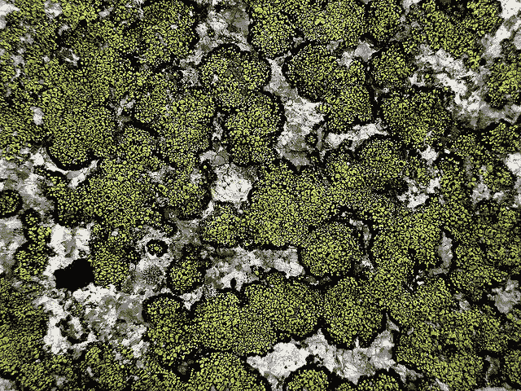

# 探索特征工程，如何设计特征以及如何获得它

> 译文： [https://machinelearningmastery.com/discover-feature-engineering-how-to-engineer-features-and-how-to-get-good-at-it/](https://machinelearningmastery.com/discover-feature-engineering-how-to-engineer-features-and-how-to-get-good-at-it/)

特征工程是一个非正式的主题，但绝对众所周知并且同意成为应用机器学习成功的关键。

在创建本指南的过程中，我进行了广泛深入的研究，并综合了所有可能的材料。

您将发现什么是特征工程，它解决了什么问题，重要的原因，如何设计功能，谁做得好以及您可以去哪里学习更多并擅长它。

如果您阅读一篇关于特征工程的文章，我希望它是这一篇。

> 特征工程是另一个主题，似乎不值得任何评论论文或书籍，甚至书籍章节，但它对 ML 的成功绝对至关重要。 [...]机器学习的大部分成功实际上是学习器可以理解的工程特征的成功。

- Scott Locklin，“[被忽视的机器学习思路](https://scottlocklin.wordpress.com/2014/07/22/neglected-machine-learning-ideas/)”

## 特征工程解决的问题

特征工程很难。
摄影： [Vik Nanda](https://www.flickr.com/photos/viknanda/371160360) ，保留一些权利

当您的目标是从预测模型中获得最佳结果时，您需要从所拥有的内容中获得最大收益。

这包括从您使用的算法中获得最佳结果。它还涉及充分利用您的算法使用的数据。

**如何充分利用数据做出预测性建模？**

这是特征工程的过程和实践解决的问题。

> 实际上，所有机器学习算法的成功取决于您呈现数据的方式。

- Mohammad Pezeshki，回答“[每个数据科学家应该知道的关于特征选择和工程的一些一般技巧是什么？](http://www.quora.com/What-are-some-general-tips-on-feature-selection-and-engineering-that-every-data-scientist-should-know) “

## 特征工程的重要性

数据中的功能将直接影响您使用的预测模型以及您可以实现的结果。

您可以这样说：您准备和选择的功能越多，您获得的结果就越好。这是事实，但也有误导性。

您获得的结果是您选择的模型，您可用的数据和您准备的功能的一个因素。即使你对问题的框架和你用来估计准确率的客观措施起了作用。您的结果取决于许多相互依赖的属性。

您需要很好的功能来描述数据中固有的结构。

**更好的功能意味着灵活性**。

您可以选择“错误的模型”（低于最佳模型）并仍然可以获得良好的结果。大多数模型可以在数据中获得良好的结构。良好功能的灵活性允许您使用运行速度更快，更易于理解且更易于维护的不太复杂的模型。这是非常理想的。

**更好的功能意味着更简单的模型**。

凭借精心设计的功能，您可以选择“错误的参数”（低于最佳值）并仍然获得良好的结果，原因大致相同。您不需要努力选择正确的模型和最优化的参数。

通过良好的功能，您可以更接近底层问题，并可以表示您可用的所有数据，并可用于最好地表征潜在问题。

**更好的功能意味着更好的结果**。

> 我们使用的算法对于 Kagglers 来说非常标准。 [...]我们将大部分精力投入到功能工程中。

- Xavier Conort，在“ [Q＆amp; A 与 Xavier Conort](http://blog.kaggle.com/2013/04/10/qa-with-xavier-conort/) ”上赢得了对 Kaggle 的 Flight Quest 挑战

## 什么是特色工程？

以下是我定义特征工程的方法：

> 特征工程是将原始数据转换为更能代表预测模型的基础问题的特征的过程，从而提高了对看不见的数据的模型准确率。

您可以在此定义中查看依赖项：

*   您选择的绩效指标（RMSE？AUC？）
*   问题的框架（分类？回归？）
*   你正在使用的预测模型（SVM？）
*   您选择和准备的原始数据（样本？格式化？清洁？）

> 特征工程是手动设计输入 x 应该是什么

- Tomasz Malisiewicz，回答“[什么是特征工程？](http://www.quora.com/What-is-feature-engineering) “

### 特征工程是一个表示问题

机器学习算法从样本数据中学习问题的解决方案。

在此上下文中，特征工程要求：学习问题解决方案的样本数据的最佳表示是什么？

它太深了。在机器学习方面做得很好，即使在人工智能方面，也可以回到表示问题。知道要使用的最佳表示，_ 先验 _，这可能是不可知的（或者至多是难以处理的）。

> 你必须把你的输入变成算法可以理解的东西

- Shayne Miel，回答“[机器学习中特征工程的直观解释是什么？](http://www.quora.com/What-is-the-intuitive-explanation-of-feature-engineering-in-machine-learning) “

### 特色工程是一门艺术

这是一门艺术，就像工程学是一门艺术，就像编程是一门艺术，就像医学是一门艺术。

有明确定义的程序是有条理的，可证明的和理解的。

数据是变量，每次都不同。通过练习，您可以擅长决定使用哪些程序以及何时使用。通过实证学徒制。就像工程学一样，像编程一样，就像医学，就像机器学习一般。

对特征工程的掌握伴随着实践，并且研究其他正在做得好的人正在练习。

> ......一些机器学习项目成功，有些失败。有什么区别？很容易，最重要的因素是使用的功能。

- Pedro Domingos，“[关于机器学习的一些有用的事情](http://homes.cs.washington.edu/~pedrod/papers/cacm12.pdf)”（PDF）

## 特征工程的子问题

将特征工程视为一件事是很常见的。

例如，对我来说很长一段时间，特征工程是特征构造。

我想我自己“_ 我现在正在进行特征工程 _”并且我会追问“_ 我如何分解或聚合原始数据以更好地描述潜在问题？_ “目标是正确的，但这种做法是其中之一。

在本节中，我们将介绍这些方法以及它们要解决的具体子问题。每个都可以是他们自己的深度文章，因为它们是实践和研究的重要和重要领域。

### 功能：对建模任务有用的属性

让我们从数据开始，[什么是特征](http://en.wikipedia.org/wiki/Feature_(machine_learning))。

表格数据是根据观察或由变量或属性（列）组成的实例（行）来描述的。属性可以是一个功能。

与属性分离的特征的概念在问题的上下文中更有意义。功能是对您的问题有用或有意义的属性。它是了解正在建模的问题结构的观察的重要部分。

我使用“_ 有意义的 _”来区分属性和属性。有些人可能没有。我认为没有一个没有意义的功能。如果某个功能对问题没有影响，则不是问题的一部分。

在计算机视觉中，图像是观察，但是特征可以是图像中的线。在自然语言处理中，文档或推文可以是观察，并且短语或单词计数可以是特征。在语音识别中，话语可以是观察，但是特征可以是单个单词或音素。

### 特征重要性：对特征有用性的估计

您可以客观地估计要素的有用性。

这可以作为选择要素的前提。功能分配分数，然后可以按其分数进行排名。可以选择具有最高分数的那些特征以包括在训练数据集中，而可以忽略那些剩余的特征。

功能重要性分数还可以为您提供可用于提取或构建新功能的信息，这些功能与估计有用的功能类似但不同。

如果特征与因变量（被预测的事物）高度相关，则该特征可能是重要的。相关系数和其他单变量（每个属性被独立考虑）方法是常用方法。

更复杂的预测性建模算法在构建模型时在内部执行特征重要性和选择。一些例子包括 MARS， [Random Forest](http://en.wikipedia.org/wiki/Random_forest#Variable_importance) 和 Gradient Boosted Machines。这些模型还可以报告在模型准备过程中确定的变量重要性。

### 特征提取：从原始数据自动构建新特征

一些观察结果在其原始状态下过于庞大，无法直接通过预测性建模算法进行建模。

常见的例子包括图像，音频和文本数据，但可以很容易地包含具有数百万属性的表格数据。

[特征提取](http://en.wikipedia.org/wiki/Feature_extraction)是一个将这些类型的观察的维度自动降低为可以建模的更小集合的过程。

对于表格数据，这可能包括主成分分析和无监督聚类方法等投影方法。对于图像数据，这可能包括线或边缘检测。根据域，图像，视频和音频观察结果适用于许多相同类型的 DSP 方法。

特征提取的关键是方法是自动的（尽管可能需要用更简单的方法设计和构造）并解决难以管理的高维数据的问题，最常用于以数字格式存储的模拟观测。

### 功能选择：从许多功能到一些有用的功能

并非所有功能都是平等的。

需要删除与问题无关的那些属性。对于模型的准确率，将会有一些功能比其他功能更重要。在其他功能的上下文中还将存在多余的功能。

[功能选择](http://en.wikipedia.org/wiki/Feature_selection)通过自动选择对问题最有用的子集来解决这些问题。

特征选择算法可以使用评分方法来排序和选择特征，例如相关性或其他特征重要性方法。

更高级的方法可以通过反复试验来搜索特征子集，自动创建和评估模型以追求客观上最具预测性的子特征组。

还有一些方法可以烘焙特征选择或将其作为模型的副作用。逐步回归是一种算法的示例，该算法自动执行特征选择，作为模型构建过程的一部分。

像 LASSO 和岭回归这样的正则化方法也可以被认为是具有特征选择的算法，因为它们积极地寻求去除或折扣特征的贡献作为模型构建过程的一部分。

在帖子中阅读更多内容：[功能选择简介](http://machinelearningmastery.com/an-introduction-to-feature-selection/ "An Introduction to Feature Selection")。

### 特征构造：从原始数据手动构建新特征

最好的结果归结于你，从业者，制作功能。

功能重要性和选择可以告诉您功能的客观效用，但这些功能必须来自某个地方。

您需要手动创建它们。这需要花费大量时间来处理实际样本数据（而不是聚合），并考虑问题的基本形式，数据结构以及如何最好地将它们暴露给预测性建模算法。

对于表格数据，它通常意味着聚合或组合功能以创建新功能，分解或拆分功能以创建新功能。

对于文本数据，它通常意味着设计与问题相关的文档或上下文特定指标。对于图像数据，它通常意味着大量的时间规定自动过滤器来挑选相关结构。

这是特征工程的一部分，经常被作为一种艺术形式进行讨论，这一部分归功于重要性，并标志着它是机器学习竞赛的差异化因素。

它是手动的，它很慢，它需要大量的人脑力量，它会产生很大的不同。

> 特征工程和特征选择不是互斥的。它们都很有用。我会说功能工程更重要，特别是因为你不能真正自动化它。

- 罗伯特·诺伊豪斯，回答“[你认为哪些能提高准确率，功能选择还是特征工程？](http://www.quora.com/How-valuable-do-you-think-feature-selection-is-in-machine-learning-Which-do-you-think-improves-accuracy-more-feature-selection-or-feature-engineering) “

### 特征学习：自动识别和使用原始数据中的特征

我们是否可以避免手动加载规定如何从原始数据构造或提取特征？

表示学习或[特征学习](http://en.wikipedia.org/wiki/Feature_learning)是朝着这个目标努力的方向。

现代深度学习方法在该领域取得了一些成功，例如自编码器和受限制的玻尔兹曼机器。它们已经被证明是自动的，并且以无监督或半监督的方式，学习特征的抽象表示（压缩形式），这反过来又支持了诸如语音识别，图像分类等领域的最新结果。物体识别和其他领域。

我们没有自动特征提取或构造，但我们可能永远不会有自动特征工程。

抽象表示是自动准备的，但除了以黑盒方式之外，您无法理解和利用所学知识。他们不能（但是，或者很容易）告知您和过程如何创建更多相似和不同的功能，例如那些表现良好，未来某个特定问题或类似问题的功能。获得的技能被困。

然而，它是令人着迷，令人兴奋的，也是功能工程的一个重要而现代的部分。

## 特征工程过程

在更广泛的应用机器学习过程中最好地理解特征工程。

你需要这个背景。

### 机器学习的过程

应用机器学习的过程（缺乏更好的名称）在广泛的刷子意​​义上涉及许多活动。前面是问题定义，接下来是数据选择和准备，中间是模型准备，评估和调整，最后是结果的呈现。

像[数据挖掘和 KDD](http://machinelearningmastery.com/what-is-data-mining-and-kdd/ "What is Data Mining and KDD") 这样的过程描述有助于更好地理解任务和子任务。您可以按照自己喜欢的方式挑选和选择流程。 [在](http://machinelearningmastery.com/process-for-working-through-machine-learning-problems/ "Process for working through Machine Learning Problems")之前我已经谈了很多这个。

与我们关于特征工程的讨论相关的图片是此过程的前端。它可能类似于以下内容：

1.  （此前的任务......）
2.  **选择数据**：整合数据，将其去标准化为数据集，一起收集。
3.  **预处理数据**：对其进行格式化，清理，对其进行采样，以便您可以使用它。
4.  **转换数据**：_ 特征工程师在这里发生 _。
5.  **模型数据**：创建模型，评估它们并调整它们。
6.  （此后的任务......）

将“_ 转换数据 _”从原始状态转换为适合建模的状态的传统观念是特征工程适用的地方。转换数据和特征工程实际上可能是同义词。

这张照片在某些方面有所帮助。

您可以看到，在特征工程之前，我们正在将数据转换为我们甚至可以查看的格式，就在此之前，我们正在将数据从数据库整理和非规范化为某种中心图像。

当我们确定数据的新观点时，我们可以而且应该回过头来完成这些步骤。

例如，我们可能有一个属性，即聚合字段，如总和。我们可能决定创建特征来描述按时间间隔（例如季节）的数量，而不是一笔总和。我们需要通过预处理，甚至选择数据来向后退一步，以获取对“真实原始数据”的访问并创建此功能。

我们可以看到特征工程之后是建模。

它暗示了与建模的强烈互动，提醒我们设计功能的相互作用，并根据我们的测试工具和最终表现测量的表面进行测试。

这也表明我们可能需要以适合所选建模算法的形式保留数据，例如将特征标准化或标准化作为最后一步。这听起来像是一个预处理步骤，它可能是，但它有助于我们在有效建模之前考虑数据需要哪些类型的最后润色。

### 特征工程的迭代过程

了解特征工程在应用机器学习过程的上下文中的位置突出表明它不是独立的。

这是一个迭代过程，一次又一次地与数据选择和模型评估相互作用，直到我们的问题耗尽时间。

该过程可能如下所示：

1.  **头脑风暴功能**：真正深入研究问题，查看大量数据，研究其他问题的特征工程，看看你能偷什么。
2.  **设计功能**：取决于您的问题，但您可以使用自动特征提取，手动功能构建和两者的混合。
3.  **选择功能**：使用不同的功能重要性评分和功能选择方法为模型准备一个或多个“视图”以进行操作。
4.  **评估模型**：使用所选特征估算未见数据的模型准确率。

您需要一个明确定义的问题，以便您知道何时停止此过程并继续尝试其他模型，其他模型配置，模型集合等。一旦你对想法或准确度增加达到稳定水平，那么后来在管道中就会有所收获。

您需要经过深思熟虑和设计的测试工具，以客观地估计看不见的数据的模型技能。这将是您对功能工程流程的唯一衡量标准，您必须相信它不要浪费您的时间。

## 特征工程的一般例子

让我们使特征工程的概念更具体。

在本节中，我们将考虑您可能在 Excel 电子表格中使用的表格数据。我们将看一些您可能想要考虑自己的问题的手动功能构建示例。

当我听到“_ 特征工程至关重要 _”时，这就是我想到的特征工程类型。这是我熟悉和实践的最常见的形式。

哪个最好？你事前无法知道。您必须尝试它们并评估结果以实现您的算法和表现测量。

### 分解分类属性

想象一下你有一个分类属性，比如“`Item_Color`”可以是`Red`，`Blue`或`Unknown`。

_ 未知 _ 可能很特别，但对于模型来说，它看起来只是另一种颜色选择。更好地公开这些信息可能是有益的。

您可以创建一个名为“`Has_Color`”的新二进制功能，并在项目有颜色时为其分配值“`1`”，当“`0`”时颜色未知。

更进一步，您可以为`Item_Color`具有的每个值创建二进制功能。这将是三个二进制属性：`Is_Red`，`Is_Blue`和`Is_Unknown`。

可以使用这些附加功能代替`Item_Color`功能（如果您想尝试更简单的线性模型）或者除此之外（如果您想从决策树中获得更多功能）。

### 分解日期时间

日期时间包含很多信息，模型很难利用它的原生形式，例如 [ISO 8601](http://en.wikipedia.org/wiki/ISO_8601) （即 2014-09-20T20：45：40Z）。

如果您怀疑时间与其他属性之间存在关系，则可以将日期时间分解为可能允许模型发现和利用这些关系的组成部分。

例如，您可能怀疑时间与其他属性之间存在关系。

您可以创建一个名为`Hour_of_Day`的新数字特征，该小时可能有助于回归模型。

您可以使用 4 个值`Morning`，`Midday`，`Afternoon`，`Night`创建名为`Part_Of_Day`的新序数功能你认为相关的小时边界。这可能对决策树有用。

您可以使用类似的方法来选择一周中的时间关系，一个月的时间关系以及一年中各种季节性结构。

日期时间结构丰富，如果您怀疑数据存在时间依赖性，请花点时间将其取出。

### 重构数值量

您的数据很可能包含数量，可以重新定义以更好地暴露相关结构。这可以是转换为新单元或将速率分解为时间和数量的组件。

您可能拥有重量，距离或时间等数量。线性变换对于回归和其他依赖于尺度的方法可能是有用的。

例如，您可以以克为单位`Item_Weight`，其值为 6289.您可以创建一个新的要素，其中此数量（公斤）为 6.289 或舍入公斤（如 6）。如果域名是运输数据，可能是公斤`Item_Weight`的精度足够或更有用（噪音更小）。

`Item_Weight`可以分为两个特征：`Item_Weight_Kilograms`和`Item_Weight_Remainder_Grams`，示例值分别为 6 和 289。

可能存在领域知识，即权重大于 4 的项目会产生更高的税率。该魔术域号可用于创建新的二进制特征`Item_Above_4kg`，其值为“`1`”，我们的示例为 6289 克。

您还可以将数量存储为间隔的费率或总数量。例如，`Num_Customer_Purchases`汇总了一年。

在这种情况下，您可能希望返回数据收集步骤并创建除此聚合之外的新功能，并尝试在购买中公开更多时间结构，例如季节性。例如，可以创建以下新的二进制特征：`Purchases_Summer`，`Purchases_Fall`，`Purchases_Winter`和`Purchases_Spring`。

## 特征工程的具体例子

研究特征工程示例的一个好地方是机器学习竞赛的结果。

比赛通常使用来自现实世界问题领域的数据。在比赛结束时需要记录方法和方法。这些文章为有效的现实世界机器学习过程和方法提供了宝贵的见解。

在本节中，我们将介绍几个关注特征工程的有趣且值得注意的赛后写作示例。

### 预测 2010 年 KDD 杯的学生考试成绩

[KDD 杯](http://www.sigkdd.org/kddcup/index.php)是每年为知识发现和数据挖掘会议的 ACM 特别兴趣小组的与会者举办的机器学习竞赛。

2010 年，比赛的重点是对学生的学习方式进行建模。提供了一个关于代数问题的学生语料库，用于预测学生未来的表现。

比赛的获胜者是国立台湾大学的一群学生和学者。他们的方法在论文“[特征工程和 KDD 杯 2010 分类器集合](http://pslcdatashop.org/KDDCup/workshop/papers/kdd2010ntu.pdf)”中有所描述。

本文将特色工程作为获胜的关键方法。特征工程以创建数百万个二进制特征为代价简化了问题的结构。简单的结构使团队能够使用高表现但非常简单的线性方法来实现获胜的预测模型。

本文详细介绍了问题结构中特定的时间和其他非线性如何简化为简单的复合二元指标。

这是简单属性分解可能实现的极端和有益的例子。

### 预测遗产健康奖的患者准入

[遗产健康奖](https://www.heritagehealthprize.com/c/hhp)获得了 300 万美元的奖金，该奖项可以最好地预测哪些患者将在明年入院。

该奖项每年都会获得里程碑奖，其中顶级团队将获得奖项，其流程和方法将公开。

我记得读过三个里程碑中的第一个发布的论文，并对所涉及的特征工程的数量印象深刻。

具体来说，菲尔·布里尔利，大卫沃格尔和兰迪阿克塞尔罗德的论文“[第 1 轮里程碑奖：我们如何做到 - 团队市场创造者](https://kaggle2.blob.core.windows.net/wiki-files/327/e4cd1d25-eca9-49ca-9593-b254a773fe03/Market%20Makers%20-%20Milestone%201%20Description%20V2%201.pdf)”。大多数竞赛都涉及大量的特征工程，但令我印象深刻的是这篇论文的重点。

本文提供了构造属性所需的属性和 SQL 表。

本文通过简单分解给出了一些很好的现实世界的特征工程实例。有很多计数，分钟，最大值，大量二进制属性和离散化的数字属性。非常简单的方法用于很好的效果。

## 更多关于特征工程的资源

我们在本文中介绍了很多内容，并希望您对功能工程是什么，它适合哪些以及如何实现这一功能有了更多的了解。

这真的是你旅程的开始。您需要练习特征工程，并且需要学习优秀的特征工程从业者。

本节提供了一些可能对您的旅程有所帮助的资源。

### 图书

我找不到关于这个主题的任何书籍或书籍章节。

然而，有一些关于特征提取的好书。如果您正在使用模拟观察的数字表示，如图像，视频，声音或文本，您可能希望深入了解一些特征提取文献。

*   [特征提取，构造和选择：数据挖掘视角](http://www.amazon.com/dp/0792381963?tag=inspiredalgor-20)
*   [特征提取：基础和应用](http://www.amazon.com/dp/3540354875?tag=inspiredalgor-20)（我喜欢这本书）
*   [特征提取＆amp;计算机视觉图像处理，第三版](http://www.amazon.com/dp/0123965497?tag=inspiredalgor-20)

还有很多关于特色选择的书籍。如果您正在努力通过删除冗余或不相关的功能来减少功能，请深入了解功能选择。

*   [知识发现和数据挖掘的特征选择](http://www.amazon.com/dp/079238198X?tag=inspiredalgor-20)
*   [特征选择的计算方法](http://www.amazon.com/dp/1584888784?tag=inspiredalgor-20)

### 论文和幻灯片

找到论文是一个难题。

同样，有很多关于特征提取和特征选择书籍章节的论文，但功能工程并不多。特征工程也具有软件工程的意义，与我们的讨论无关。

以下是一些普遍相关的论文：

*   [关于变量和特征选择的 JMLR 特刊](http://jmlr.org/papers/special/feature03.html)

以下是一些通常相关且有趣的幻灯片：

*   [特色工程](http://kti.tugraz.at/staff/denis/courses/kddm1/featureengineering.pdf)（PDF），知识发现和数据挖掘 1，作者：Roman Kern，[知识技术研究所](http://kti.tugraz.at/staff/denis/courses/kddm1/)
*   [特色工程与选择](http://www.cs.berkeley.edu/~jordan/courses/294-fall09/lectures/feature/slides.pdf)（PDF），CS 294：[实用机器学习](http://www.cs.berkeley.edu/~jordan/courses/294-fall09/lectures/feature/)，伯克利
*   [特色工程工作室](http://www.columbia.edu/~rsb2162/FES2013/materials.html)，课程讲座幻灯片和材料，哥伦比亚
*   [特色工程](http://www.cs.princeton.edu/courses/archive/spring10/cos424/slides/18-feat.pdf)（PDF），Leon Bottou，Princeton

### 链接

有博客帖子到处都有。最有用的链接是解决问题的教程，并清楚地表达了有意的特征工程。

以下是一些有趣的链接：

*   [特色工程：如何在泰坦尼克号竞赛](http://trevorstephens.com/post/73461351896/titanic-getting-started-with-r-part-4-feature)（Kaggle 的入门竞赛）上进行特色工程。有比特征工程更多的数据，但它仍然具有指导意义。
*   ~~[IPython 笔记本](http://nbviewer.ipython.org/url/trust.sce.ntu.edu.sg/~gguo1/blogs/Features.ipynb)由 [Guibing Guo](http://trust.sce.ntu.edu.sg/~gguo1/) ，致力于解释特征工程。有点乱，但值得一撇~~。 （链接看起来很糟糕，对不起。）

### 影片

关于特征工程的主题有几个视频。迄今为止最好的是由 Ryan Baker 命名为“[特征工程](https://www.youtube.com/watch?v=drUToKxEAUA)”。它很短（大约 9 分钟），我建议观看一些很好的实用技巧。

&lt;iframe allow="autoplay; encrypted-media" allowfullscreen="" frameborder="0" height="281" src="https://www.youtube.com/embed/drUToKxEAUA?feature=oembed" width="500"&gt;&lt;/iframe&gt;

如果您认为我错过了一个关键概念或资源，请发表评论。

**更新 2015** ：我注意到现在有一​​篇关于特色工程的[维基百科文章，它复制了这篇文章的大部分内容。那好吧。](https://en.wikipedia.org/wiki/Feature_engineering)