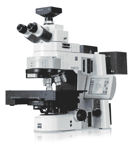
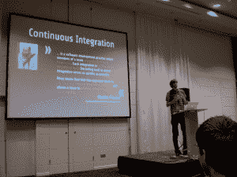

# 默认情况下可重现的机器学习结果

> 原文： [https://machinelearningmastery.com/reproducible-machine-learning-results-by-default/](https://machinelearningmastery.com/reproducible-machine-learning-results-by-default/)

在软件项目中获得可重现的结果是一种很好的做法。它现在甚至可能是标准做法，我希望它是。

您可以将任何开发人员从街上带走，他们应该能够按照您的流程检查修订控制的代码库，并构建可随时使用的软件。如果您有设置环境和将软件发布到用户/操作环境的过程，那就更好了。

它是工具和过程使结果可重复。在这篇文章中，您将了解到，使机器学习项目的结果具有可重复性并且机器学习领域的从业者和学者都在努力解决这一问题同样重要。

作为一名程序员和开发人员，如果您有这门学科，那么您已经拥有了向前发展的工具和流程。

可重复的计算研究
照片来源[蔡司显微镜](http://www.flickr.com/photos/zeissmicro/10307015376/sizes/l/)，保留一些权利

## 计算科学成果的再现性

实验的再现性是科学方法的主要原则之一。你写下你所做的，但其他科学家不必接受你的话，他们遵循相同的过程，并期望得到相同的结果。

计算科学的工作涉及代码，在读取和写入数据的计算机上运行。报告未明确指定任何这些元素的结果的实验​​很可能不易重现。如果实验无法再现，那么工作的价值是什么。

这是计算科学中的一个开放性问题，并且随着越来越多的领域依赖于实验的计算结果而变得越来越令人担忧。在本节中，我们将通过查看一些考虑该问题的论文来回顾这个未解决的问题。

### 可重复计算研究的十个简单规则

这是 2013 年由 Geir Kjetil Sandve，Anton Nekrutenko，James Taylor 和 Eivind Hovig 撰写的 PLoS 计算生物学文章。在论文中，作者列出了简单的 10 条规则，如果遵循这些规则，预计将导致更容易获得（可重复的！？）计算研究。规则总结如下。

*   **规则 1** ：对于每个结果，跟踪它是如何产生的
*   **规则 2** ：避免手动数据操作步骤
*   **规则 3** ：归档所有使用的外部程序的精确版本
*   **规则 4** ：版本控制所有自定义脚本
*   **规则 5** ：在标准化格式中记录所有中间结果
*   **规则 6** ：对于包含随机性的分析，请注意基础随机种子
*   **规则 7** ：始终将原始数据存储在地块之后
*   **规则 8** ：生成分层分析输出，允许检查增加细节的层
*   **规则 9** ：将文本陈述连接到基础结果
*   **规则 10** ：提供对脚本，运行和结果的公共访问

作者正在评论计算生物学领域。不过，我认为规则还远远不够。我发现它们具有描述性，而且我会更具说明性。

例如，通过规则 2“避免手动数据操作步骤”，我认为所有数据操作都是自动化的。对于规则 4“版本控制所有自定义脚本”，我认为创建工作产品的整个自动化过程都在版本控制中。

如果您是熟悉专业流程的开发人员，那么您应该充分考虑依赖关系管理，构建系统，可以执行嵌入式代码的文档的标记系统以及持续集成工具如何真正带来一些严谨性。

### 可访问的可重复研究

Jill Mesirov 在 2010 年发表在“科学”杂志上的一篇文章。在这篇简短的文章中，作者介绍了一系列促进科学家可重复计算研究的系统术语，特别是：

*   可重复研究系统（RRS）：由可重复的研究环境和可重复的研究出版商组成。
*   可重复研究环境（RRE）：计算工具，数据管理，分析和结果以及将它们打包在一起以进行再分配的能力。
*   可重复研究出版社（RRP）：文件准备系统，链接到可重复研究环境，并提供嵌入分析和结果的能力。

描述了一种原型系统，该系统是为基因表达分析实验开发的，称为 GenePattern-Word RRS。

再次，通过软件开发和可用工具的眼睛，RRE 听起来像修订控制加上具有依赖关系管理和持续集成服务器的构建系统。 RRP 听起来像一个带有链接和构建过程的标记系统。

### 邀请可重复的计算研究

这是 David Donoho 在 2010 年生物统计学中撰写的一篇论文。这篇论文很精彩，我非常同意它的观点。例如：

> “计算重现性不是事后的想法 - 它必须从一开始就被设计到一个项目中。”

我自己也无法清楚地表达出来。在本文中，作者列出了在计算研究中建立可重复性的好处。研究人员的好处是：

*   改善工作和工作习惯。
*   改善团队精神
*   影响更大。 （减少无意的竞争和更多的确认）
*   更大的连续性和累积影响。

作者为纳入研究经费的纳税人列出的好处是：

*   公共物品的管理。
*   公共获取公共物品。

我向袖口的同事们提出了一些相同的论点，能够指出这篇论文能够更好地制作案例是非常棒的。

### 使科学计算可重复

发表于“科学与计算”杂志工程，2000 年由 Matthias Schwab，Martin Karrenbach 和 Jon Claerbout 撰写。本文的开头句很棒：

> “通常涉及科学计算的研究在原则上是可重复的，但在实践中却不是。已发表的文件仅仅是奖学金的广告，而计算机程序，输入数据，参数值等则体现了奖学金本身。因此，作者通常在几个月或几年后无法复制自己的作品。“

本文通过采用 GNU make，标准项目结构以及在 Web 上分发实验项目文件来描述计算实验的标准化。这些实践在斯坦福勘探项目（SEP）中标准化。

采用所解决的激励问题是，当研究生因为无法复制和建立实验而离开小组时，编程工作就会丢失。

标准项目结构和构建系统的想法对开发人员来说似乎很自然。

## 机器学习中的默认重现性

我想要做的关键是不要忽视在机器学习领域开始时在软件开发中建立标准的优秀实践。使用它们并以它们为基础。

我有一个用于机器学习项目的蓝图，并且随着我完成的每个项目的改进。我希望将来能分享它。关注此空间。在此之前，以下是重用软件工具的一些技巧，使重现性成为应用机器学习和机器学习项目的默认设置：

*   使用构建系统并使构建目标自动生成所有结果。如果它不是自动化的，它不是项目的一部分，即有想法进行图表或分析？自动化它的生成。
*   自动执行所有数据选择，预处理和转换。在进行机器学习竞赛时，我甚至将 wget 用于累积数据文件。我想在新工作站和快速服务器上从零开始运行。
*   使用修订控制和标记里程碑。
*   强烈考虑检查依赖关系或至少链接。
*   避免编写代码。编写瘦脚本并使用标准工具并使用标准的 unix 命令将事物链接在一起。编写重型代码是分析过程中的最后手段或操作前的最后一步。
*   使用标记为分析和演示输出产品创建报告。我喜欢批量思考很多有趣的东西并实现它们，让我的构建系统在下次运行时创建它们。这使我能够在以后没有处于想法模式时对观察结果进行深入评估和思考。

### 专家提示

使用 Continuous Integration 服务器经常（每天或每小时）运行测试工具。

持续整合
照片来源 [regocasasnovas](http://www.flickr.com/photos/regocasasnovas/2941953416/sizes/l/) ，保留一些权利

我的测试工具中有条件检查输出产品是否存在，如果缺少则创建它们。这意味着每次运行线束时，只会计算已更改的内容或缺少的结果。这意味着我可以让我的想象力疯狂，并继续向线束添加算法，数据转换和各种疯狂的想法，某些服务器将在下一次运行中计算缺失的输出以供我评估。

我在想法生成和结果评估之间的这种脱节实际上加快了项目的进度。

我发现我的线束中有一个错误，我删除了结果并在下一个循环中重新重建它们。

## 摘要

在这篇文章中，您了解到机器学习的实践是项目工作，包括源数据，代码，具有中间工作产品和输出工作产品的计算。中间也可能存在各种各样的事情。

如果您像软件项目一样管理机器学习项目，并默认获得可重复性的好处。您还将获得速度和信心的额外好处，从而获得更好的结果。

## 资源

如果您想进一步阅读这些问题，我已在下面列出了本文研究中使用的资源。

*   [再现性](http://en.wikipedia.org/wiki/Reproducibility)维基百科页面
*   [可重复计算研究的十个简单规则](http://scholar.google.com/scholar?q=Ten+Simple+Rules+for+Reproducible+Computational+Research)，Geir Kjetil Sandve，Anton Nekrutenko，James Taylor 和 Eivind Hovig，2013
*   [无障碍可重复研究](http://scholar.google.com/scholar?q=Accessible+Reproducible+Research)，Jill Mesirov，2010 年
*   [邀请可重复的计算研究](http://scholar.google.com/scholar?q=An+invitation+to+reproducible+computational+research)，David Donoho，2010
*   [科学计算可重复](http://scholar.google.com/scholar?q=Making+scientific+computations+reproducible)，Matthias Schwab，Martin Karrenbach 和 Jon Claerbout，2000
*   [R 和 RStudio 的重复研究](http://www.amazon.com/dp/1466572841?tag=inspiredalgor-20)（网站链接）由 Christopher Gandrud 撰写，是一本关于这个主题的书使用 R.我在撰写本书时没有读过这本书，但这是我的阅读清单。

您是否遇到过可重复的机器学习项目的挑战？您是否知道其他软件开发工具可以帮助实现这一目标？发表评论并分享您的经验。