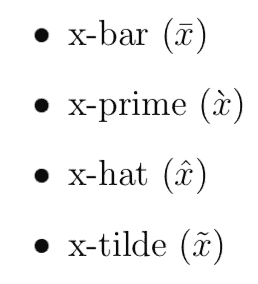

# 机器学习中数学符号的基础知识

> 原文： [https://machinelearningmastery.com/basics-mathematical-notation-machine-learning/](https://machinelearningmastery.com/basics-mathematical-notation-machine-learning/)

在阅读机器学习方法的描述时，你无法避免数学符号。

通常，所需要的只是一个术语中的一个术语或一个符号片段，以完全破坏您对整个过程的理解。这可能会非常令人沮丧，特别是对于来自开发世界的机器学习初学者。

如果您了解数学符号的一些基本领域以及在论文和书籍中完成机器学习方法描述的一些技巧，那么您可以取得很大的进步。

在本教程中，您将了解在阅读机器学习技术描述时可能遇到的数学符号的基础知识。

完成本教程后，您将了解：

*   算术表示法，包括乘法，指数，根和对数的变化。
*   序列和集合的表示法，包括索引，求和和集合成员资格。
*   5 如果您正在努力学习数学符号，可以使用技巧来获得帮助。

让我们开始吧。

*   **更新 May / 2018** ：为某些符号添加了图像以使解释更清晰。


机器学习数学符号的基础知识
[Christian Collins](https://www.flickr.com/photos/collins_family/33746908612/) 的照片，保留一些权利。

## 教程概述

本教程分为 7 个部分;他们是：

1.  数学符号的挫败感
2.  算术符号
3.  希腊字母表
4.  序列表示法
5.  设置表示法
6.  其他表示法
7.  获得更多帮助

您认为我错过了机器学习所需的其他基本数学符号区域吗？
请在下面的评论中告诉我。

## 数学符号的挫败感

在阅读有关机器学习算法时，您会遇到数学符号。

例如，符号可用于：

*   描述一种算法。
*   描述数据准备。
*   描述结果。
*   描述一个测试工具。
*   描述含义。

这些描述可能出现在研究论文，教科书，博客文章和其他地方。

通常这些术语定义明确，但也有一些您可能不熟悉的数学符号规范。

所需要的只是您不理解的一个术语或一个等式，您对整个方法的理解将会丢失。我自己多次遭遇这个问题，令人非常沮丧！

在本教程中，我们将回顾一些基本的数学符号，这些符号在阅读机器学习方法的描述时将对您有所帮助。

## 算术符号

在本节中，我们将介绍一些不太明显的基本算术符号以及自学校以来可能忘记的一些概念。

### 简单的算术

基本算术的表示法就像你写的那样。例如：

*   增加：1 + 1 = 2
*   减法：2 - 1 = 1
*   乘法：2 x 2 = 4
*   分部：2/2 = 1

大多数数学运算都有一个执行逆运算的姐妹运算;例如，减法是加法的倒数，除法是乘法的倒数。

### 代数

我们经常希望抽象地描述操作，以将它们与特定数据或特定实现分开。

出于这个原因，我们看到代数的大量使用：这是用大写和/或小写字母或单词来表示数学符号中的术语或概念。使用希腊字母表中的字母也很常见。

数学的每个子字段都可以有保留字母：即始终表示相同内容的术语或字母。然而，代数术语应该被定义为描述的一部分，如果不是，它可能只是一个糟糕的描述，而不是你的错。

### 乘法符号

乘法是一种常见的符号，并且有一些简短的指针。

通常使用一点“x”或星号“*”来表示乘法：

```
c = a x b
c = a * b
```

您可能会看到使用点符号;例如：

```
c = a . b
```

这与以下相同：

```
c = a * b
```

或者，您可能会看到之前定义的术语之间没有操作且没有空格分隔;例如：

```
c = ab
```

这也是一回事。

### 指数和平方根

指数是一个提升到幂的数字。

符号被写为原始数字或基数，第二个数字或指数，显示为上标;例如：

```
2^3
```

这将被计算为 2 乘以其自身 3 次或立方：

```
2 x 2 x 2 = 8
```

一个被提升到 2 的力量据说是它的正方形。

```
2^2 = 2 x 2 = 4
```

可以通过计算平方根来反转数字的平方。这是使用数字的符号和上面的勾号显示的，为简单起见，我将在这里使用“sqrt（）”函数。

```
sqrt(4) = 2
```


在这里，我们知道结果和指数，我们希望找到基数。

实际上，根操作可用于反转任何指数，只是发生默认平方根假定指数为 2，由平方根刻度前面的下标 2 表示。

例如，我们可以通过取立方根来反转数字的立方（注意，3 这里不是乘法，它是根符号的刻度之前的符号）：

```
2^3 = 8
3 sqrt(8) = 2
```

### 

### 对数和 e

当我们将 10 提高到整数指数时，我们通常将其称为一个数量级。

```
10^2 = 10 x 10 or 100
```

反转此操作的另一种方法是通过计算结果 100 的对数，假设基数为 10;在表示法中，这写为 log10（）。

```
log10(100) = 2
```

在这里，我们知道结果和基数，并希望找到指数。

这使我们可以非常轻松地上下移动数量级。考虑到使用计算机中使用的二进制算法，假设基数为 2 的对数也是常用的。例如：

```
2^6 = 64
log2(64) = 6
```

另一个流行的对数是假设称为 e 的自然基数。 e 是保留的，是一个特殊数字或常量，称为欧拉数（发音为“ _oy-ler_ ”），它指的是具有几乎无限精度的值。

```
e = 2.71828...
```

将 e 提升为幂称为自然指数函数：

```
e^2 = 7.38905...
```

它可以使用自然对数反转，表示为 ln（）：

```
ln(7.38905...) = 2
```

在不详细描述的情况下，自然指数和自然对数在整个数学中证明是有用的，以抽象地描述某些系统的连续增长，例如：系数呈指数增长，如复利。

## 希腊字母表

希腊字母在数学符号中用于变量，常量，函数等。

例如，在统计中，我们使用小写的希腊字母 mu 和标准差作为小写的希腊字母 sigma 来讨论平均值。在线性回归中，我们将系数称为小写字母 beta。等等。

知道所有大写和小写希腊字母以及如何发音都很有用。

当我还是一名研究生时，我打印了希腊字母并将其粘贴在我的电脑显示器上，以便记住它。一个有用的技巧！

以下是完整的希腊字母。


希腊字母，[取自维基百科](https://en.wikipedia.org/wiki/Greek_letters_used_in_mathematics,_science,_and_engineering)

维基百科页面标题为“[希腊字母，用于数学，科学和工程](https://en.wikipedia.org/wiki/Greek_letters_used_in_mathematics,_science,_and_engineering)”也是一个有用的指南，因为它列出了在数学和科学的不同子领域中每个希腊字母的常见用法。

## 序列表示法

机器学习符号通常描述对序列的操作。

序列可以是数据数组或术语列表。

### 索引

读取序列符号的关键是序列中索引元素的表示法。

通常，符号将指定序列的开始和结束，例如 1 到 n，其中 n 将是序列的范围或长度。

序列中的项目由诸如 i，j，k 之类的变量作为下标索引。这就像数组符号。

例如，a_i 是序列 a 的第 i 个元素。

如果序列是二维的，则可以使用两个索引;例如：

b_ {i，j}是序列 b 的第 i，第 j 个元素。

### 顺序操作

可以在序列上执行数学运算。

对序列执行两个操作，因此它们有自己的简写：总和和乘法。

#### 序列求和

序列的总和表示为大写的希腊字母 sigma。它用 sigma（例如 i = 1）下的序列求和的变量和开始以及 sigma（例如 n）之上的求和结束的索引来指定。

```
Sigma i = 1, n a_i
```


这是从元素 1 到元素 n 的序列 a 的总和。

#### 序列乘法

序列上的乘法表示为大写希腊字母 pi。它的分秘籍式与分别在字母下方和上方的操作开始和结束的顺序求和相同。

```
Pi i = 1, n a_i
```


这是从元素 1 到元素 n 的序列 a 的乘积。

## 设置表示法

集合是一组唯一的项目。

我们可能会看到在机器学习中定义术语时使用的集合符号。

### 一组数字

您可能看到的一个常见集合是一组数字，例如定义为整数集合或实数集合的术语。

您可能会看到的一些常见数字包括：

*   所有自然数的集合：N
*   所有整数集：Z
*   所有实数的集合：R

还有其他套装;请参阅维基百科上的[特别集。](https://en.wikipedia.org/wiki/Set_(mathematics)#Special_sets)

在定义术语而不是浮点值时，我们经常谈论实际值或实数，浮点值实际上是计算机操作的离散创造。

## 设置会员资格

在术语定义中看到集合成员资格是很常见的。

设置成员资格表示为看起来像大写“E”的符号。

```
a E R
```


这意味着 a 被定义为集合 R 的成员或实数集合。

还有许多固定的操作;两个常见的集合操作包括：

*   联盟或聚合：A U B.
*   交点或重叠：A ^ B.

在 Wikipedia 上了解有关[集的更多信息。](https://en.wikipedia.org/wiki/Set_(mathematics))

## 其他表示法

您可能会遇到其他符号。

我试着在本节中介绍一些。

通常在摘要中定义一个方法，然后再将其定义为具有单独表示法的特定实现。

例如，如果我们估计变量 x，我们可以使用修改 x 的表示法来表示它;例如：



相同的符号在不同的上下文中可以具有不同的含义，例如在不同对象或数学子场上的使用。例如，一个常见的混淆点是| x |，根据上下文，它可能意味着：

*   | x |：x 的绝对值或正值。
*   | x |：向量 x 的长度。
*   | x |：集合 x 的基数。

本教程仅介绍了数学符号的基础知识。有一些数学子领域与机器学习更相关，应该进行更详细的审查。他们是：

*   线性代数。
*   统计。
*   可能性。
*   结石。

也许还有一点多变量分析和信息理论。

您认为这篇文章中是否缺少数学符号区域？
请在下面的评论中告诉我。

## 获得数学符号帮助的 5 个技巧

本节列出了在机器学习中使用数学符号时可以使用的一些技巧。

### 想想作者

人们写了你正在阅读的论文或书。

那些可能会犯错误，疏忽，甚至让事情变得混乱的人，因为他们并不完全理解他们所写的内容。

放松您正在阅读的符号的限制，并考虑作者的意图。他们想要碰到什么？

也许您甚至可以通过电子邮件，Twitter，Facebook，LinkedIn 等联系作者，并寻求澄清。请记住，学者希望其他人理解和使用他们的工作（主要是）。

### 检查维基百科

维基百科有一些符号列表，可以帮助缩小您正在阅读的符号的含义或意图。

我建议你开始的两个地方是：

*   [维基百科](https://en.wikipedia.org/wiki/List_of_mathematical_symbols)上的数学符号列表
*   [维基百科上的数学，科学和工程中使用的希腊字母](https://en.wikipedia.org/wiki/Greek_letters_used_in_mathematics,_science,_and_engineering)

### 代码中的草图

数学运算只是数据的函数。

使用变量，for 循环等将您正在阅读的所有内容映射到伪代码。

您可能希望使用脚本语言，以及小型人为数据甚至是 Excel 电子表格。

随着您对该技术的阅读和理解的提高，您的技术代码草图将更有意义，最后您将拥有一个迷你原型。

直到我在一些 matlab 中用一些人为的数据看到一篇非常复杂的论文的学术草图之前，我从未习惯于采用这种方法。它打破了我的袜子因为我认为系统必须完全编码并使用“真实”数据集运行，唯一的选择是获取原始代码和数据。我错了。另外，回头看，这家伙很有天赋。

我现在一直使用这种方法并在 Python 中使用草图技术。

### 寻求替代方案

当我试图理解一种新技术时，我会使用一种技巧。

我找到并阅读了所有引用我正在阅读的论文的论文。

阅读其他学者对该技术的解释和重新解释通常可以澄清我在原始描述中的误解。

但并非总是如此。有时它会使水混浊并引入误导性的解释或新的符号。但通常情况下，它会有所帮助。在回到原始论文并重新阅读之后，我经常可以找到后续论文实际上对原始方法产生错误和误解的情况。

### 发表一个问题

在网上有人喜欢向别人解释数学的地方。认真！

考虑截取您正在努力的符号，写出完整的参考或链接到它，并将其和您的误解区域发布到问答网站。

两个很好的起点是：

*   [数学 StackExchange](https://math.stackexchange.com/)
*   [交叉验证](https://stats.stackexchange.com/)

通过数学符号你的技巧是什么？
请在下面的评论中告诉我？

## 进一步阅读

如果您希望深入了解，本节将提供有关该主题的更多资源。

*   第 0.1 节。 [阅读数学](http://www.math.cornell.edu/~hubbard/readingmath.pdf) [PDF]，向量微积分，[线性代数和微分形式](http://amzn.to/2qarp8L)，2009。
*   [数学的语言和语法](http://assets.press.princeton.edu/chapters/gowers/gowers_I_2.pdf) [PDF]，Timothy Gowers
*   [了解数学，指南](https://math.stackexchange.com/)，Peter Alfeld。

## 摘要

在本教程中，您发现了在阅读机器学习技术描述时可能遇到的数学符号的基础知识。

具体来说，你学到了：

*   算术表示法，包括乘法，指数，根和对数的变化。
*   序列和集合的表示法，包括索引，求和和集合成员资格。
*   5 如果您正在努力学习数学符号，可以使用技巧来获得帮助。

你在用数学符号挣扎吗？

这篇文章中的任何符号或提示有帮助吗？
请在下面的评论中告诉我。