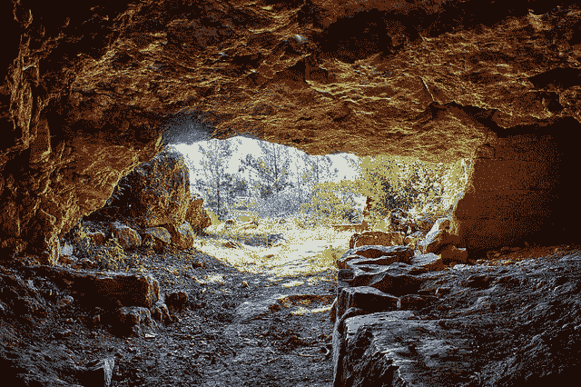

# CNN长短期记忆网络

> 原文： [https://machinelearningmastery.com/cnn-long-short-term-memory-networks/](https://machinelearningmastery.com/cnn-long-short-term-memory-networks/)

### 使用示例Python代码轻松介绍CNN LSTM循环神经网络
。

具有空间结构的输入（如图像）无法使用标准Vanilla LSTM轻松建模。

CNN长短期记忆网络或简称CNN LSTM是一种LSTM架构，专门用于具有空间输入的序列预测问题，如图像或视频。

在这篇文章中，您将发现用于序列预测的CNN LSTM架构。

完成这篇文章后，你会知道：

*   关于用于序列预测的CNN LSTM模型架构的开发。
*   CNN LSTM模型适合的问题类型的示例。
*   如何使用Keras在Python中实现CNN LSTM架构。

让我们开始吧。



卷积神经网络长短期记忆网络
摄影： [Yair Aronshtam](https://www.flickr.com/photos/yairar/34484734116/) ，保留了一些权利。

## CNN LSTM架构

CNN LSTM架构涉及使用卷积神经网络（CNN）层对输入数据进行特征提取以及LSTM以支持序列预测。

CNN LSTM是针对视觉时间序列预测问题以及从图像序列（例如视频）生成文本描述的应用而开发的。具体来说，问题是：

*   **活动识别**：生成在一系列图像中演示的活动的文本描述。
*   **图像说明**：生成单个图像的文本描述。
*   **视频说明**：生成图像序列的文本描述。

> [CNN LSTM]是一类在空间和时间上都很深的模型，并且可以灵活地应用于涉及顺序输入和输出的各种视觉任务

- [用于视觉识别和描述的长期循环卷积网络](https://arxiv.org/abs/1411.4389)，2015。

这种架构最初被称为长期循环卷积网络或LRCN模型，尽管我们将使用更通用的名称“CNN LSTM”来指代在本课程中使用CNN作为前端的LSTM。

该架构用于生成图像的文本描述的任务。关键是使用在具有挑战性的图像分类任务上预先训练的CNN，该任务被重新用作字幕生成问题的特征提取器。

> ...使用CNN作为图像“编码器”是很自然的，首先将其预训练用于图像分类任务，并使用最后隐藏层作为生成句子的RNN解码器的输入

- [Show and Tell：神经图像标题生成器](https://arxiv.org/abs/1411.4555)，2015。

该架构还用于语音识别和自然语言处理问题，其中CNN用作音频和文本输入数据上的LSTM的特征提取器。

此架构适用于以下问题：

*   在其输入中具有空间结构，例如2D结构或图像中的像素或句子，段落或文档中的单词的一维结构。
*   在其输入中具有时间结构，诸如视频中的图像的顺序或文本中的单词，或者需要生成具有时间结构的输出，诸如文本描述中的单词。


卷积神经网络长短期记忆网络架构

## 在Keras实现CNN LSTM

我们可以定义一个在Keras联合训练的CNN LSTM模型。

可以通过在前端添加CNN层，然后在输出上添加具有Dense层的LSTM层来定义CNN LSTM。

将此架构视为定义两个子模型是有帮助的：用于特征提取的CNN模型和用于跨时间步骤解释特征的LSTM模型。

让我们在一系列2D输入的背景下看一下这两个子模型，我们假设它们是图像。

### CNN模型

作为复习，我们可以定义一个2D卷积网络，它由Conv2D和MaxPooling2D层组成，这些层被排列成所需深度的栈。

Conv2D将解释图像的快照（例如小方块），并且轮询层将合并或抽象解释。

例如，下面的片段期望读入具有1个通道（例如，黑色和白色）的10×10像素图像。 Conv2D将以2×2快照读取图像，并输出一个新的10×10图像解释。 MaxPooling2D将解释汇集为2×2块，将输出减少到5×5合并。 Flatten层将采用单个5×5贴图并将其转换为25个元素的向量，准备用于处理其他层，例如用于输出预测的Dense。

```py
cnn = Sequential()
cnn.add(Conv2D(1, (2,2), activation='relu', padding='same', input_shape=(10,10,1)))
cnn.add(MaxPooling2D(pool_size=(2, 2)))
cnn.add(Flatten())
```

这对于图像分类和其他计算机视觉任务是有意义的。

### LSTM模型

上面的CNN模型仅能够处理单个图像，将其从输入像素变换为内部矩阵或向量表示。

我们需要跨多个图像重复此操作，并允许LSTM在输入图像的内部向量表示序列中使用BPTT建立内部状态和更新权重。

在使用现有的预训练模型（如VGG）从图像中提取特征的情况下，可以固定CNN。 CNN可能未经过训练，我们可能希望通过将来自LSTM的错误反向传播到多个输入图像到CNN模型来训练它。

在这两种情况下，概念上存在单个CNN模型和一系列LSTM模型，每个时间步长一个。我们希望将CNN模型应用于每个输入图像，并将每个输入图像的输出作为单个时间步骤传递给LSTM。

我们可以通过在TimeDistributed层中包装整个CNN输入模型（一层或多层）来实现这一点。该层实现了多次应用相同层的期望结果。在这种情况下，将其多次应用于多个输入时间步骤，并依次向LSTM模型提供一系列“图像解释”或“图像特征”以进行处理。

```py
model.add(TimeDistributed(...))
model.add(LSTM(...))
model.add(Dense(...))
```

我们现在有模型的两个元素;让我们把它们放在一起。

### CNN LSTM模型

我们可以在Keras中定义CNN LSTM模型，首先定义一个或多个CNN层，将它们包装在TimeDistributed层中，然后定义LSTM和输出层。

我们有两种方法可以定义相同的模型，只是在品味上有所不同。

您可以首先定义CNN模型，然后通过将整个CNN层序列包装在TimeDistributed层中将其添加到LSTM模型，如下所示：

```py
# define CNN model
cnn = Sequential()
cnn.add(Conv2D(...))
cnn.add(MaxPooling2D(...))
cnn.add(Flatten())
# define LSTM model
model = Sequential()
model.add(TimeDistributed(cnn, ...))
model.add(LSTM(..))
model.add(Dense(...))
```

另一种也许更容易阅读的方法是在将CNN模型中的每个层添加到主模型时，将其包装在TimeDistributed层中。

```py
model = Sequential()
# define CNN model
model.add(TimeDistributed(Conv2D(...))
model.add(TimeDistributed(MaxPooling2D(...)))
model.add(TimeDistributed(Flatten()))
# define LSTM model
model.add(LSTM(...))
model.add(Dense(...))
```

第二种方法的好处是所有层都出现在模型摘要中，因此现在是首选。

您可以选择您喜欢的方法。

## 进一步阅读

如果您要深入了解，本节将提供有关该主题的更多资源。

### CNN LSTM论文

*   [用于视觉识别和描述的长期循环卷积网络](https://arxiv.org/abs/1411.4389)，2015。
*   [Show and Tell：神经图像标题生成器](https://arxiv.org/abs/1411.4555)，2015。
*   [卷积，长短期记忆，完全连接的深度神经网络](https://static.googleusercontent.com/media/research.google.com/en//pubs/archive/43455.pdf)，2015。
*   [字符意识神经语言模型](https://arxiv.org/abs/1508.06615)，2015。
*   [卷积LSTM网络：用于降水预报的机器学习方法](https://arxiv.org/abs/1506.04214)，2015。

### Keras API

*   [Conv2D Keras API](https://keras.io/layers/convolutional/#conv2d) 。
*   [MaxPooling2D Keras API](https://keras.io/layers/pooling/#maxpooling2d) 。
*   [Flatten Keras API](https://keras.io/layers/core/#flatten) 。
*   [TimeDistributed Keras API](https://keras.io/layers/wrappers/#timedistributed) 。

### 帖子

*   [用于机器学习的卷积神经网络的速成课程](http://machinelearningmastery.com/crash-course-convolutional-neural-networks/)
*   [用Keras](http://machinelearningmastery.com/sequence-classification-lstm-recurrent-neural-networks-python-keras/) 在Python中用LSTM循环神经网络进行序列分类

## 摘要

在这篇文章中，您发现了CNN LSTM模型架构。

具体来说，你学到了：

*   关于用于序列预测的CNN LSTM模型架构的开发。
*   CNN LSTM模型适合的问题类型的示例。
*   如何使用Keras在Python中实现CNN LSTM架构。

你有任何问题吗？
在下面的评论中提出您的问题，我会尽力回答。