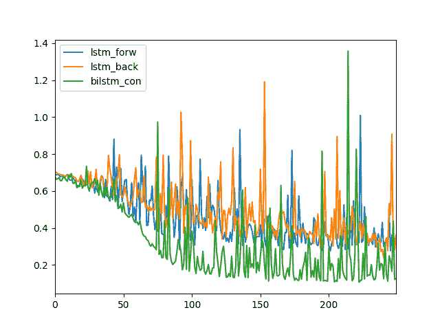
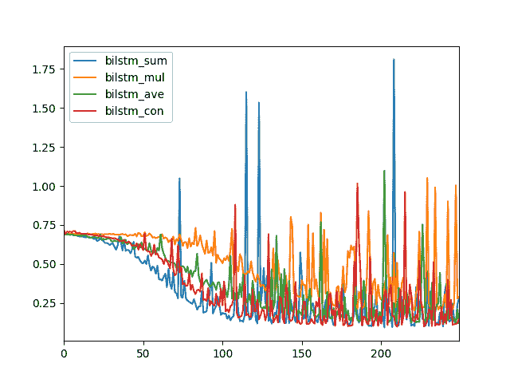

# 如何用Keras开发用于Python序列分类的双向LSTM

> 原文： [https://machinelearningmastery.com/develop-bidirectional-lstm-sequence-classification-python-keras/](https://machinelearningmastery.com/develop-bidirectional-lstm-sequence-classification-python-keras/)

双向LSTM是传统LSTM的扩展，可以提高序列分类问题的模型表现。

在输入序列的所有时间步长都可用的问题中，双向LSTM在输入序列上训练两个而不是一个LSTM。输入序列中的第一个是原样，第二个是输入序列的反向副本。这可以为网络提供额外的上下文，从而更快，更全面地学习问题。

在本教程中，您将了解如何使用Keras深度学习库在Python中开发用于序列分类的双向LSTM。

完成本教程后，您将了解：

*   如何开发一个小的人为和可配置的序列分类问题。
*   如何开发LSTM和双向LSTM用于序列分类。
*   如何比较双向LSTM中使用的合并模式的表现。

让我们开始吧。


如何使用Keras开发用于Python序列分类的双向LSTM
照片由 [Cristiano Medeiros Dalbem](https://www.flickr.com/photos/helloninja/15333087540/) ，保留一些权利。

## 概观

本教程分为6个部分;他们是：

1.  双向LSTM
2.  序列分类问题
3.  LSTM用于序列分类
4.  用于序列分类的双向LSTM
5.  将LSTM与双向LSTM进行比较
6.  比较双向LSTM合并模式

### 环境

本教程假定您已安装Python SciPy环境。您可以在此示例中使用Python 2或3。

本教程假设您使用TensorFlow（v1.1.0 +）或Theano（v0.9 +）后端安装了Keras（v2.0.4 +）。

本教程还假设您安装了scikit-learn，Pandas，NumPy和Matplotlib。

如果您在设置Python环境时需要帮助，请参阅以下帖子：

*   [如何使用Anaconda设置用于机器学习和深度学习的Python环境](http://machinelearningmastery.com/setup-python-environment-machine-learning-deep-learning-anaconda/)

## 双向LSTM

双向循环神经网络（RNN）的想法很简单。

它涉及复制网络中的第一个复现层，以便现在有两个并排的层，然后按原样提供输入序列作为第一层的输入，并将输入序列的反向副本提供给第二层。

> 为了克服常规RNN的局限性，我们提出了一种双向循环神经网络（BRNN），可以在特定时间范围的过去和未来使用所有可用的输入信息进行训练。
> 
> ...
> 
> 这个想法是将常规RNN的状态神经元分成负责正时间方向的部分（前向状态）和负时间方向的部分（后向状态）。

- Mike Schuster和Kuldip K. Paliwal，[双向循环神经网络](https://maxwell.ict.griffith.edu.au/spl/publications/papers/ieeesp97_schuster.pdf)，1997

这种方法已被用于长期短期记忆（LSTM）循环神经网络的巨大效果。

最初在语音识别领域中使用双向提供序列是合理的，因为有证据表明整个话语的语境用于解释所说的内容而不是线性解释。

> ...依赖于对未来的了解似乎乍一看违反了因果关系。我们怎样才能将我们所听到的东西的理解基于尚未说过的东西？然而，人类听众正是这样做的。根据未来的背景，听起来，单词甚至整个句子最初都意味着没有任何意义。我们必须记住的是真正在线的任务之间的区别 - 在每次输入后需要输出 - 以及仅在某些输入段结束时需要输出的任务。

- Alex Graves和Jurgen Schmidhuber，[具有双向LSTM和其他神经网络架构的Framewise音素分类](ftp://ftp.idsia.ch/pub/juergen/nn_2005.pdf)，2005

双向LSTM的使用对于所有序列预测问题可能没有意义，但是对于那些适当的域，可以提供更好的结果。

> 我们发现双向网络比单向网络明显更有效......

— Alex Graves and Jurgen Schmidhuber, [Framewise Phoneme Classification with Bidirectional LSTM and Other Neural Network Architectures](ftp://ftp.idsia.ch/pub/juergen/nn_2005.pdf), 2005

需要说明的是，输入序列中的时间步长仍然是一次处理一次，只是网络同时在两个方向上逐步通过输入序列。

### Keras中的双向LSTM

Keras通过[双向](https://keras.io/layers/wrappers/#bidirectional)层包装器支持双向LSTM。

该包装器将循环层（例如第一个LSTM层）作为参数。

它还允许您指定合并模式，即在传递到下一层之前应如何组合前向和后向输出。选项是：

*   '`sum`'：输出加在一起。
*   '`mul`'：输出相乘。
*   '`concat`'：输出连接在一起（默认值），为下一层提供两倍的输出。
*   '`ave`'：输出的平均值。

默认模式是连接，这是双向LSTM研究中经常使用的方法。

## 序列分类问题

我们将定义一个简单的序列分类问题来探索双向LSTM。

该问题被定义为0和1之间的随机值序列。该序列被作为问题的输入，每个时间步提供一个数字。

二进制标签（0或1）与每个输入相关联。输出值均为0.一旦序列中输入值的累积和超过阈值，则输出值从0翻转为1。

使用序列长度的1/4的阈值。

例如，下面是10个输入时间步长（X）的序列：

```py
0.63144003 0.29414551 0.91587952 0.95189228 0.32195638 0.60742236 0.83895793 0.18023048 0.84762691 0.29165514
```

相应的分类输出（y）将是：

```py
0 0 0 1 1 1 1 1 1 1
```

我们可以用Python实现它。

第一步是生成一系列随机值。我们可以使用随机模块中的 [random（）函数](https://docs.python.org/3/library/random.html)。

```py
# create a sequence of random numbers in [0,1]
X = array([random() for _ in range(10)])
```

我们可以将阈值定义为输入序列长度的四分之一。

```py
# calculate cut-off value to change class values
limit = 10/4.0
```

可以使用 [cumsum（）NumPy函数](https://docs.scipy.org/doc/numpy/reference/generated/numpy.cumsum.html)计算输入序列的累积和。此函数返回一系列累积和值，例如：

```py
pos1, pos1+pos2, pos1+pos2+pos3, ...
```

然后我们可以计算输出序列，确定每个累积和值是否超过阈值。

```py
# determine the class outcome for each item in cumulative sequence
y = array([0 if x < limit else 1 for x in cumsum(X)])
```

下面的函数名为get_sequence（），将所有这些一起绘制，将序列的长度作为输入，并返回新问题案例的X和y分量。

```py
from random import random
from numpy import array
from numpy import cumsum

# create a sequence classification instance
def get_sequence(n_timesteps):
	# create a sequence of random numbers in [0,1]
	X = array([random() for _ in range(n_timesteps)])
	# calculate cut-off value to change class values
	limit = n_timesteps/4.0
	# determine the class outcome for each item in cumulative sequence
	y = array([0 if x < limit else 1 for x in cumsum(X)])
	return X, y
```

我们可以使用新的10个步骤序列测试此函数，如下所示：

```py
X, y = get_sequence(10)
print(X)
print(y)
```

首先运行该示例打印生成的输入序列，然后输出匹配的输出序列。

```py
[ 0.22228819 0.26882207 0.069623 0.91477783 0.02095862 0.71322527
0.90159654 0.65000306 0.88845226 0.4037031 ]
[0 0 0 0 0 0 1 1 1 1]
```

## LSTM用于序列分类

我们可以从为序列分类问题开发传统的LSTM开始。

首先，我们必须更新get_sequence（）函数以将输入和输出序列重新整形为3维以满足LSTM的期望。预期结构具有尺寸[样本，时间步长，特征]。分类问题具有1个样本（例如，一个序列），可配置的时间步长，以及每个时间步长一个特征。

分类问题具有1个样本（例如，一个序列），可配置的时间步长，以及每个时间步长一个特征。

因此，我们可以如下重塑序列。

```py
# reshape input and output data to be suitable for LSTMs
X = X.reshape(1, n_timesteps, 1)
y = y.reshape(1, n_timesteps, 1)
```

更新后的get_sequence（）函数如下所示。

```py
# create a sequence classification instance
def get_sequence(n_timesteps):
	# create a sequence of random numbers in [0,1]
	X = array([random() for _ in range(n_timesteps)])
	# calculate cut-off value to change class values
	limit = n_timesteps/4.0
	# determine the class outcome for each item in cumulative sequence
	y = array([0 if x < limit else 1 for x in cumsum(X)])
	# reshape input and output data to be suitable for LSTMs
	X = X.reshape(1, n_timesteps, 1)
	y = y.reshape(1, n_timesteps, 1)
	return X, y
```

我们将序列定义为具有10个时间步长。

接下来，我们可以为问题定义LSTM。输入层将有10个时间步长，1个特征是一个片段，input_shape =（10,1）。

第一个隐藏层将具有20个存储器单元，输出层将是完全连接的层，每个时间步输出一个值。在输出上使用sigmoid激活函数来预测二进制值。

在输出层周围使用TimeDistributed包装层，以便在给定作为输入提供的完整序列的情况下，可以预测每个时间步长一个值。这要求LSTM隐藏层返回一系列值（每个时间步长一个）而不是整个输入序列的单个值。

最后，因为这是二分类问题，所以使用二进制日志丢失（Keras中的binary_crossentropy）。使用有效的ADAM优化算法来找到权重，并且计算每个时期的精度度量并报告。

```py
# define LSTM
model = Sequential()
model.add(LSTM(20, input_shape=(10, 1), return_sequences=True))
model.add(TimeDistributed(Dense(1, activation='sigmoid')))
model.compile(loss='binary_crossentropy', optimizer='adam', metrics=['acc'])
```

LSTM将接受1000个时期的训练。将在每个时期生成新的随机输入序列以使网络适合。这可以确保模型不记忆单个序列，而是可以推广解决方案以解决此问题的所有可能的随机输入序列。

```py
# train LSTM
for epoch in range(1000):
	# generate new random sequence
	X,y = get_sequence(n_timesteps)
	# fit model for one epoch on this sequence
	model.fit(X, y, epochs=1, batch_size=1, verbose=2)
```

一旦经过训练，网络将在另一个随机序列上进行评估。然后将预测与预期输出序列进行比较，以提供系统技能的具体示例。

```py
# evaluate LSTM
X,y = get_sequence(n_timesteps)
yhat = model.predict_classes(X, verbose=0)
for i in range(n_timesteps):
	print('Expected:', y[0, i], 'Predicted', yhat[0, i])
```

下面列出了完整的示例。

```py
from random import random
from numpy import array
from numpy import cumsum
from keras.models import Sequential
from keras.layers import LSTM
from keras.layers import Dense
from keras.layers import TimeDistributed

# create a sequence classification instance
def get_sequence(n_timesteps):
	# create a sequence of random numbers in [0,1]
	X = array([random() for _ in range(n_timesteps)])
	# calculate cut-off value to change class values
	limit = n_timesteps/4.0
	# determine the class outcome for each item in cumulative sequence
	y = array([0 if x < limit else 1 for x in cumsum(X)])
	# reshape input and output data to be suitable for LSTMs
	X = X.reshape(1, n_timesteps, 1)
	y = y.reshape(1, n_timesteps, 1)
	return X, y

# define problem properties
n_timesteps = 10
# define LSTM
model = Sequential()
model.add(LSTM(20, input_shape=(n_timesteps, 1), return_sequences=True))
model.add(TimeDistributed(Dense(1, activation='sigmoid')))
model.compile(loss='binary_crossentropy', optimizer='adam', metrics=['acc'])
# train LSTM
for epoch in range(1000):
	# generate new random sequence
	X,y = get_sequence(n_timesteps)
	# fit model for one epoch on this sequence
	model.fit(X, y, epochs=1, batch_size=1, verbose=2)
# evaluate LSTM
X,y = get_sequence(n_timesteps)
yhat = model.predict_classes(X, verbose=0)
for i in range(n_timesteps):
	print('Expected:', y[0, i], 'Predicted', yhat[0, i])
```

运行该示例在每个时期的随机序列上打印日志丢失和分类准确率。

这清楚地表明了模型对序列分类问题的解决方案的概括性。

我们可以看到该模型表现良好，达到最终准确度，徘徊在90％左右，准确率达到100％。不完美，但对我们的目的有好处。

将新随机序列的预测与预期值进行比较，显示出具有单个错误的大多数正确结果。

```py
...
Epoch 1/1
0s - loss: 0.2039 - acc: 0.9000
Epoch 1/1
0s - loss: 0.2985 - acc: 0.9000
Epoch 1/1
0s - loss: 0.1219 - acc: 1.0000
Epoch 1/1
0s - loss: 0.2031 - acc: 0.9000
Epoch 1/1
0s - loss: 0.1698 - acc: 0.9000
Expected: [0] Predicted [0]
Expected: [0] Predicted [0]
Expected: [0] Predicted [0]
Expected: [0] Predicted [0]
Expected: [0] Predicted [0]
Expected: [0] Predicted [1]
Expected: [1] Predicted [1]
Expected: [1] Predicted [1]
Expected: [1] Predicted [1]
Expected: [1] Predicted [1]
```

## 用于序列分类的双向LSTM

现在我们知道如何为序列分类问题开发LSTM，我们可以扩展该示例来演示双向LSTM。

我们可以通过使用双向层包装LSTM隐藏层来完成此操作，如下所示：

```py
model.add(Bidirectional(LSTM(20, return_sequences=True), input_shape=(n_timesteps, 1)))
```

这将创建隐藏层的两个副本，一个适合输入序列，一个适合输入序列的反向副本。默认情况下，将连接这些LSTM的输出值。

这意味着，而不是TimeDistributed层接收10个时间段的20个输出，它现在将接收10个时间段的40（20个单位+ 20个单位）输出。

The complete example is listed below.

```py
from random import random
from numpy import array
from numpy import cumsum
from keras.models import Sequential
from keras.layers import LSTM
from keras.layers import Dense
from keras.layers import TimeDistributed
from keras.layers import Bidirectional

# create a sequence classification instance
def get_sequence(n_timesteps):
	# create a sequence of random numbers in [0,1]
	X = array([random() for _ in range(n_timesteps)])
	# calculate cut-off value to change class values
	limit = n_timesteps/4.0
	# determine the class outcome for each item in cumulative sequence
	y = array([0 if x < limit else 1 for x in cumsum(X)])
	# reshape input and output data to be suitable for LSTMs
	X = X.reshape(1, n_timesteps, 1)
	y = y.reshape(1, n_timesteps, 1)
	return X, y

# define problem properties
n_timesteps = 10
# define LSTM
model = Sequential()
model.add(Bidirectional(LSTM(20, return_sequences=True), input_shape=(n_timesteps, 1)))
model.add(TimeDistributed(Dense(1, activation='sigmoid')))
model.compile(loss='binary_crossentropy', optimizer='adam', metrics=['acc'])
# train LSTM
for epoch in range(1000):
	# generate new random sequence
	X,y = get_sequence(n_timesteps)
	# fit model for one epoch on this sequence
	model.fit(X, y, epochs=1, batch_size=1, verbose=2)
# evaluate LSTM
X,y = get_sequence(n_timesteps)
yhat = model.predict_classes(X, verbose=0)
for i in range(n_timesteps):
	print('Expected:', y[0, i], 'Predicted', yhat[0, i])
```

运行该示例，我们看到与前一个示例中类似的输出。

双向LSTM的使用具有允许LSTM更快地学习问题的效果。

通过在运行结束时查看模型的技能，而不是模型的技能，这一点并不明显。

```py
...
Epoch 1/1
0s - loss: 0.0967 - acc: 0.9000
Epoch 1/1
0s - loss: 0.0865 - acc: 1.0000
Epoch 1/1
0s - loss: 0.0905 - acc: 0.9000
Epoch 1/1
0s - loss: 0.2460 - acc: 0.9000
Epoch 1/1
0s - loss: 0.1458 - acc: 0.9000
Expected: [0] Predicted [0]
Expected: [0] Predicted [0]
Expected: [0] Predicted [0]
Expected: [0] Predicted [0]
Expected: [0] Predicted [0]
Expected: [1] Predicted [1]
Expected: [1] Predicted [1]
Expected: [1] Predicted [1]
Expected: [1] Predicted [1]
Expected: [1] Predicted [1]
```

## 将LSTM与双向LSTM进行比较

在此示例中，我们将在模型正在训练期间比较传统LSTM与双向LSTM的表现。

我们将调整实验，以便模型仅训练250个时期。这样我们就可以清楚地了解每个模型的学习方式以及学习行为与双向LSTM的不同之处。

我们将比较三种不同的模型;特别：

1.  LSTM（原样）
2.  具有反向输入序列的LSTM（例如，您可以通过将LSTM层的“go_backwards”参数设置为“True”来执行此操作）
3.  双向LSTM

这种比较将有助于表明双向LSTM实际上可以添加的东西不仅仅是简单地反转输入序列。

我们将定义一个函数来创建和返回带有前向或后向输入序列的LSTM，如下所示：

```py
def get_lstm_model(n_timesteps, backwards):
	model = Sequential()
	model.add(LSTM(20, input_shape=(n_timesteps, 1), return_sequences=True, go_backwards=backwards))
	model.add(TimeDistributed(Dense(1, activation='sigmoid')))
	model.compile(loss='binary_crossentropy', optimizer='adam')
	return model
```

我们可以为双向LSTM开发类似的函数，其中可以将合并模式指定为参数。可以通过将合并模式设置为值'concat'来指定串联的默认值。

```py
def get_bi_lstm_model(n_timesteps, mode):
	model = Sequential()
	model.add(Bidirectional(LSTM(20, return_sequences=True), input_shape=(n_timesteps, 1), merge_mode=mode))
	model.add(TimeDistributed(Dense(1, activation='sigmoid')))
	model.compile(loss='binary_crossentropy', optimizer='adam')
	return model
```

最后，我们定义一个函数来拟合模型并检索和存储每个训练时期的损失，然后在模型拟合后返回收集的损失值的列表。这样我们就可以绘制每个模型配置的日志丢失图并进行比较。

```py
def train_model(model, n_timesteps):
	loss = list()
	for _ in range(250):
		# generate new random sequence
		X,y = get_sequence(n_timesteps)
		# fit model for one epoch on this sequence
		hist = model.fit(X, y, epochs=1, batch_size=1, verbose=0)
		loss.append(hist.history['loss'][0])
	return loss
```

综合这些，下面列出了完整的例子。

首先，创建并拟合传统的LSTM并绘制对数损失值。使用具有反向输入序列的LSTM重复此操作，最后使用具有级联合并的LSTM重复此操作。

```py
from random import random
from numpy import array
from numpy import cumsum
from matplotlib import pyplot
from pandas import DataFrame
from keras.models import Sequential
from keras.layers import LSTM
from keras.layers import Dense
from keras.layers import TimeDistributed
from keras.layers import Bidirectional

# create a sequence classification instance
def get_sequence(n_timesteps):
	# create a sequence of random numbers in [0,1]
	X = array([random() for _ in range(n_timesteps)])
	# calculate cut-off value to change class values
	limit = n_timesteps/4.0
	# determine the class outcome for each item in cumulative sequence
	y = array([0 if x < limit else 1 for x in cumsum(X)])
	# reshape input and output data to be suitable for LSTMs
	X = X.reshape(1, n_timesteps, 1)
	y = y.reshape(1, n_timesteps, 1)
	return X, y

def get_lstm_model(n_timesteps, backwards):
	model = Sequential()
	model.add(LSTM(20, input_shape=(n_timesteps, 1), return_sequences=True, go_backwards=backwards))
	model.add(TimeDistributed(Dense(1, activation='sigmoid')))
	model.compile(loss='binary_crossentropy', optimizer='adam')
	return model

def get_bi_lstm_model(n_timesteps, mode):
	model = Sequential()
	model.add(Bidirectional(LSTM(20, return_sequences=True), input_shape=(n_timesteps, 1), merge_mode=mode))
	model.add(TimeDistributed(Dense(1, activation='sigmoid')))
	model.compile(loss='binary_crossentropy', optimizer='adam')
	return model

def train_model(model, n_timesteps):
	loss = list()
	for _ in range(250):
		# generate new random sequence
		X,y = get_sequence(n_timesteps)
		# fit model for one epoch on this sequence
		hist = model.fit(X, y, epochs=1, batch_size=1, verbose=0)
		loss.append(hist.history['loss'][0])
	return loss

n_timesteps = 10
results = DataFrame()
# lstm forwards
model = get_lstm_model(n_timesteps, False)
results['lstm_forw'] = train_model(model, n_timesteps)
# lstm backwards
model = get_lstm_model(n_timesteps, True)
results['lstm_back'] = train_model(model, n_timesteps)
# bidirectional concat
model = get_bi_lstm_model(n_timesteps, 'concat')
results['bilstm_con'] = train_model(model, n_timesteps)
# line plot of results
results.plot()
pyplot.show()
```

运行该示例会创建一个线图。

您的具体情节可能会有所不同，但会显示相同的趋势。

我们可以看到LSTM前向（蓝色）和LSTM后向（橙色）在250个训练时期内显示出类似的对数丢失。

我们可以看到双向LSTM日志丢失是不同的（绿色），更快地下降到更低的值并且通常保持低于其他两个配置。



LSTM，反向LSTM和双向LSTM的对数损失线图

## 比较双向LSTM合并模式

有4种不同的合并模式可用于组合双向LSTM层的结果。

它们是串联（默认），乘法，平均和总和。

我们可以通过更新上一节中的示例来比较不同合并模式的行为，如下所示：

```py
n_timesteps = 10
results = DataFrame()
# sum merge
model = get_bi_lstm_model(n_timesteps, 'sum')
results['bilstm_sum'] = train_model(model, n_timesteps)
# mul merge
model = get_bi_lstm_model(n_timesteps, 'mul')
results['bilstm_mul'] = train_model(model, n_timesteps)
# avg merge
model = get_bi_lstm_model(n_timesteps, 'ave')
results['bilstm_ave'] = train_model(model, n_timesteps)
# concat merge
model = get_bi_lstm_model(n_timesteps, 'concat')
results['bilstm_con'] = train_model(model, n_timesteps)
# line plot of results
results.plot()
pyplot.show()
```

运行该示例将创建比较每个合并模式的日志丢失的线图。

您的具体情节可能有所不同，但会显示相同的行为趋势。

不同的合并模式会导致不同的模型表现，这将根据您的特定序列预测问题而变化。

在这种情况下，我们可以看到，总和（蓝色）和串联（红色）合并模式可能会带来更好的表现，或至少更低的日志丢失。



线图用于比较双向LSTM的合并模式

## 摘要

在本教程中，您了解了如何使用Keras在Python中开发用于序列分类的双向LSTM。

具体来说，你学到了：

*   如何开发一个人为的序列分类问题。
*   如何开发LSTM和双向LSTM用于序列分类。
*   如何比较双向LSTM的合并模式以进行序列分类。

你有任何问题吗？
在下面的评论中提出您的问题，我会尽力回答。