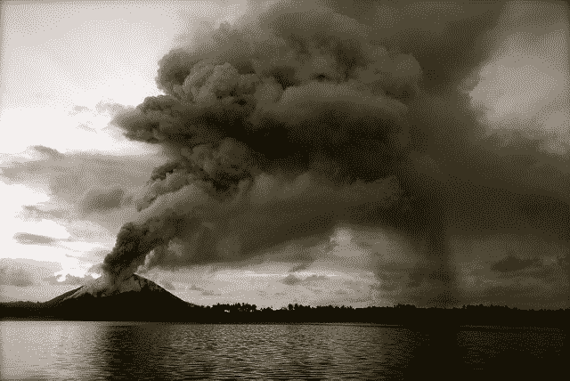

# 神经网络中爆炸梯度的温和介绍

> 原文： [https://machinelearningmastery.com/exploding-gradients-in-neural-networks/](https://machinelearningmastery.com/exploding-gradients-in-neural-networks/)

爆炸梯度是一个问题，其中大的误差梯度累积并导致在训练期间对神经网络模型权重的非常大的更新。

这会导致您的模型不稳定，无法从您的训练数据中学习。

在这篇文章中，您将发现深层人工神经网络爆炸梯度的问题。

完成这篇文章后，你会知道：

*   爆炸的梯度是什么以及它们在训练过程中引起的问题。
*   如何知道您的网络模型是否有爆炸梯度。
*   如何解决网络中的爆炸梯度问题。

让我们开始吧。

*   **更新Oct / 2018** ：删除了ReLU作为解决方案的提及。

回顾神经网络中爆炸梯度的温和介绍
[Taro Taylor](https://www.flickr.com/photos/tjt195/2417533162/) 的照片，保留一些权利。

## 什么是爆炸梯度？

误差梯度是在训练神经网络期间计算的方向和幅度，该神经网络用于以正确的方向和正确的量更新网络权重。

在深度网络或循环神经网络中，误差梯度可能在更新期间累积并导致非常大的梯度。这反过来又导致网络权重的大量更新，进而导致网络不稳定。在极端情况下，权重值可能会变得很大，以至于溢出并导致NaN值。

通过重复地将梯度乘以具有大于1.0的值的网络层，爆炸通过指数增长发生。

## 爆炸梯度有什么问题？

在深层多层Perceptron网络中，爆炸梯度可能导致网络不稳定，最多无法从训练数据中学习，最坏的情况是导致无法再更新的NaN权重值。

> 爆炸性的梯度会使学习变得不稳定。

- 第282页，[深度学习](http://amzn.to/2fwdoKR)，2016年。

在循环神经网络中，爆炸性梯度可能导致不稳定的网络无法从训练数据中学习，并且最多是无法通过长输入数据序列学习的网络。

> ......爆炸梯度问题是指训练期间梯度范数的大幅增加。这些事件是由于长期成分的爆炸造成的

- [关于训练复发神经网络的难度](http://proceedings.mlr.press/v28/pascanu13.pdf)，2013。

## 你怎么知道你是否有爆炸的梯度？

有一些微妙的迹象表明您在网络训练期间可能会受到爆炸性梯度的影响，例如：

*   该模型无法获得您的训练数据（例如损失不佳）。
*   该模型不稳定，导致从更新到更新的损失发生很大变化。
*   在训练期间模型损失归NaN所有。

如果你有这些类型的问题，你可以深入挖掘，看看你是否有爆炸梯度的问题。

有一些不太微妙的迹象可以用来确认你有爆炸的梯度。

*   在训练期间，模型权重很快变得非常大。
*   模型权重在训练期间达到NaN值。
*   在训练期间，每个节点和层的误差梯度值始终高于1.0。

## 如何修复爆炸梯度？

解决爆炸梯度的方法很多;本节列出了一些您可以使用的最佳实践方法。

### 1.重新设计网络模型

在深度神经网络中，可以通过重新设计网络以减少层数来解决爆炸梯度问题。

在训练网络时使用较小的批量大小也可能有一些好处。

在循环神经网络中，在训练期间通过较少的先前时间步骤进行更新，称为[通过时间截断反向传播](https://machinelearningmastery.com/gentle-introduction-backpropagation-time/)，可以减少爆炸梯度问题。

### 2.使用长短期内存网络

在循环神经网络中，考虑到这种类型网络的训练中固有的不稳定性，例如，可以发生梯度爆炸。通过反向传播到时间，基本上将循环网络转换为深层多层感知器神经网络。

通过使用[长短期记忆（LSTM）](https://machinelearningmastery.com/gentle-introduction-long-short-term-memory-networks-experts/)记忆单元和可能相关的门控型神经元结构，可以减少爆炸梯度。

采用LSTM存储器单元是用于序列预测的循环神经网络的新的最佳实践。

### 3.使用梯度剪辑

在具有大批量大小和具有非常长输入序列长度的LSTM的非常深的多层感知器网络中仍然可能发生爆炸梯度。

如果仍然出现爆炸梯度，您可以在网络训练期间检查并限制梯度的大小。

这称为梯度剪裁。

> 处理爆炸梯度有一个简单但非常有效的解决方案：如果它们的范数超过给定阈值，则剪切梯度。

- 第5.2.4节，消失和爆炸梯度，[自然语言处理中的神经网络方法](http://amzn.to/2fwTPCn)，2017。

具体地，如果误差梯度超过阈值，则针对阈值检查误差梯度的值并将其剪切或设置为该阈值。

> 在某种程度上，可以通过梯度限幅（在执行梯度下降步骤之前对梯度的值进行阈值处理）来减轻爆炸梯度问题。

- 第294页，[深度学习](http://amzn.to/2fwdoKR)，2016年。

在Keras深度学习库中，您可以通过在训练之前在优化器上设置`clipnorm`或`clipvalue`参数来使用梯度剪辑。

好的默认值是 _clipnorm = 1.0_ 和 _clipvalue = 0.5_ 。

*   [Keras API](https://keras.io/optimizers/) 中优化器的使用

### 4.使用重量正规化

另一种方法，如果仍然出现爆炸梯度，则检查网络权重的大小，并对网络损失函数应用较大权重值的惩罚。

这被称为权重正则化，并且通常可以使用L1（绝对权重）或L2（平方权重）惩罚。

> 对复发权重使用L1或L2惩罚可以帮助爆炸梯度

— [On the difficulty of training recurrent neural networks](http://proceedings.mlr.press/v28/pascanu13.pdf), 2013.

在Keras深度学习库中，您可以通过在层上设置`kernel_regularizer`参数并使用`L1`或`L2`正则化器来使用权重正则化。

*   [Keras API](https://keras.io/regularizers/) 中正则化器的使用

## 进一步阅读

如果您希望深入了解，本节将提供有关该主题的更多资源。

### 图书

*   [深度学习](http://amzn.to/2fwdoKR)，2016年。
*   [自然语言处理中的神经网络方法](http://amzn.to/2fwTPCn)，2017。

### 文件

*   [关于训练复发神经网络的难度](http://proceedings.mlr.press/v28/pascanu13.pdf)，2013。
*   [学习与梯度下降的长期依赖关系很困难](http://www.dsi.unifi.it/~paolo/ps/tnn-94-gradient.pdf)，1994。
*   [了解爆炸梯度问题](https://pdfs.semanticscholar.org/728d/814b92a9d2c6118159bb7d9a4b3dc5eeaaeb.pdf)，2012。

### 用品

*   [为什么在神经网络（特别是在RNN中）爆炸梯度是一个问题？](https://www.quora.com/Why-is-it-a-problem-to-have-exploding-gradients-in-a-neural-net-especially-in-an-RNN)
*   [LSTM如何帮助防止循环神经网络中的消失（和爆炸）梯度问题？](https://www.quora.com/How-does-LSTM-help-prevent-the-vanishing-and-exploding-gradient-problem-in-a-recurrent-neural-network)
*   [整流器（神经网络）](https://en.wikipedia.org/wiki/Rectifier_(neural_networks))

### Keras API

*   [Keras API](https://keras.io/optimizers/) 中优化器的使用
*   [Keras API](https://keras.io/regularizers/) 中正则化器的使用

## 摘要

在这篇文章中，您发现了在训练深度神经网络模型时爆炸梯度的问题。

具体来说，你学到了：

*   爆炸的梯度是什么以及它们在训练过程中引起的问题。
*   如何知道您的网络模型是否有爆炸梯度。
*   如何解决网络中的爆炸梯度问题。

你有任何问题吗？
在下面的评论中提出您的问题，我会尽力回答。