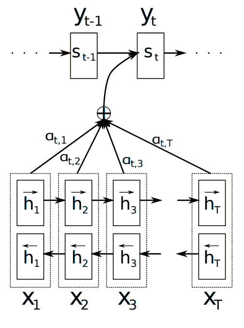
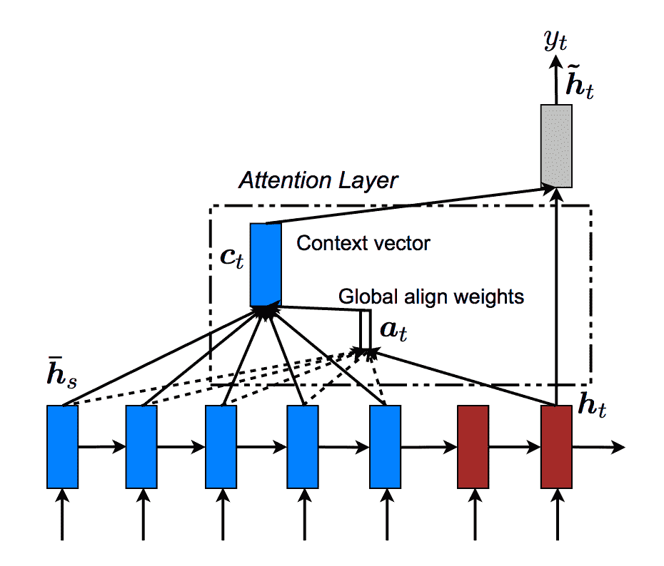

# 编辑器 - 解码器循环神经网络全局注意的温和介绍

> 原文： [https://machinelearningmastery.com/global-attention-for-encoder-decoder-recurrent-neural-networks/](https://machinelearningmastery.com/global-attention-for-encoder-decoder-recurrent-neural-networks/)

编码器 - 解码器模型提供了使用循环神经网络来解决具有挑战性的序列到序列预测问题（例如机器翻译）的模式。

注意力是编码器 - 解码器模型的扩展，其改进了较长序列的方法的表现。全球关注是一种简化的注意力，可能更容易在像Keras这样的声明式深度学习库中实现，并且可能比传统的注意机制获得更好的结果。

在这篇文章中，您将发现编码器 - 解码器循环神经网络模型的全局关注机制。

阅读这篇文章后，你会知道：

*   用于序列到序列预测问题的编码器 - 解码器模型，例如机器翻译。
*   提高编码器 - 解码器模型在长序列上的表现的注意机制。
*   全球关注机制简化了注意机制，可以取得更好的效果。

让我们开始吧。

编辑器 - 解码器循环神经网络全球注意力的温和介绍
[Kathleen Tyler Conklin](https://www.flickr.com/photos/ktylerconk/2400630645/) 的照片，保留一些权利。

## 概观

本教程分为4个部分;他们是：

1.  编码器 - 解码器模型
2.  注意
3.  全球关注
4.  全球关注更多细节

## 编码器 - 解码器模型

编码器 - 解码器模型是组织循环神经网络以解决序列到序列预测问题的一种方式，其中输入和输出时间步骤的数量不同。

该模型是针对机器翻译问题而开发的，例如将法语翻译成英语。

该模型涉及两个子模型，如下：

*   **编码器**：一种RNN模型，它将整个源序列读取为固定长度编码。
*   **解码器**：使用编码输入序列并对其进行解码以输出目标序列的RNN模型。

下图显示了编码器和解码器模型之间的关系。

编码器 - 解码网络
的示例，取自“使用神经网络的序列到序列学习”，2014。

长短期记忆复现神经网络通常用于编码器和解码器。描述源序列的编码器输出用于开始解码过程，以到目前为止已经作为输出生成的字为条件。具体地，用于输入的最后时间步长的编码器的隐藏状态用于初始化解码器的状态。

> LSTM通过首先获得由LSTM的最后隐藏状态给出的输入序列（x1，...，xT）的固定维度表示v，然后计算y1，...，yT'的概率来计算该条件概率。标准LSTM-LM公式，其初始隐藏状态设置为x1，...，xT的表示v

- [用神经网络进行序列学习的序列](https://arxiv.org/abs/1409.3215)，2014。

下图显示了源序列对上下文向量c的显式编码，该上下文向量c与目前生成的字一起使用以输出目标序列中的下一个字。

将源序列编码到随后被解码的上下文向量
取自“使用RNN编码器 - 解码器进行统计机器翻译的学习短语表示”，2014。

> 但是，yt和h（t）也都以yt-1和输入序列的汇总c为条件。

- [使用RNN编码器 - 解码器进行统计机器翻译的学习短语表示](https://arxiv.org/abs/1406.1078)，2014。

## 注意

编码器 - 解码器模型被证明是端到端模型，其在有挑战性的序列到序列预测问题（例如机器翻译）上表现良好。

该模型似乎限于很长的序列。其原因被认为是源序列的固定长度编码。

> 这种编码器 - 解码器方法的潜在问题是神经网络需要能够将源句子的所有必要信息压缩成固定长度的向量。这可能使神经网络难以处理长句，特别是那些比训练语料库中的句子长的句子。

- [通过联合学习对齐和翻译的神经机器翻译](https://arxiv.org/abs/1409.0473)，2015。

在2015年题为“_神经机器翻译通过联合学习对齐和翻译_”的论文中，“Bahdanau，et al。描述了解决这个问题的注意机制。

注意力是一种机制，其提供源序列的更丰富的编码，从该源序列构造可由解码器使用的上下文向量。

注意允许模型了解源序列中的哪些编码单词要注意以及在预测目标序列中的每个单词期间的程度。

具有注意力的编码器 - 解码器模型示例
取自“通过联合学习对齐和翻译的神经机器翻译”，2015。

从编码器收集每个输入时间步的隐藏状态，而不是源序列的最后时间步的隐藏状态。

为目标序列中的每个输出字专门构建上下文向量。首先，使用神经网络对来自编码器的每个隐藏状态进行评分，然后归一化为编码器隐藏状态的概率。最后，概率用于计算编码器隐藏状态的加权和，以提供要在解码器中使用的上下文向量。

有关Bahdanau注意力如何与工作示例一起使用的更全面解释，请参阅帖子：

*   [编码器 - 解码器循环神经网络中的注意事项如何工作](https://machinelearningmastery.com/how-does-attention-work-in-encoder-decoder-recurrent-neural-networks/)

## 全球关注

在他们的论文“[基于注意力的神经机器翻译的有效途径](https://arxiv.org/abs/1508.04025)”，“斯坦福NLP研究人员 [Minh-Thang Luong](https://nlp.stanford.edu/~lmthang/) ，等。提出了一种用于机器翻译的编码器 - 解码器模型的注意机制，称为“全球关注”。

它被提议作为Bahdanau等人提出的注意机制的简化。在他们的论文“[通过联合学习对齐和翻译神经机器翻译](https://arxiv.org/abs/1409.0473)。”在Bahdanau注意，注意力计算需要从前一时间步骤输出解码器。

另一方面，全局注意力仅使用编码器和解码器的输出用于当前时间步长。这使得在诸如Keras的向量化库中实现它具有吸引力。

> ......我们的计算路径更简单;我们从ht - ＆gt; at - ＆gt; ct - ＆gt; 〜然后做出预测[...]另一方面，在任何时间t，Bahdanau等人。 （2015）从先前的隐藏状态构建ht-1 - ＆gt; at - ＆gt; ct - ＆gt; ht，反过来，在做出预测之前，会经历深度输出和最大值。

- [基于注意力的神经机器翻译的有效方法](https://arxiv.org/abs/1508.04025)，2015。

该模型在Luong等人的评估中进行了评估。论文与Bahdanau等人提出的论文不同。 （例如，反向输入序列而不是双向输入，LSTM而不是GRU元素和使用丢失），然而，具有全局关注的模型的结果在标准机器翻译任务上获得了更好的结果。

> ......全球关注方法显着提升了+2.8 BLEU，使我们的模型略好于Bahdanau等人的基础注意系统。

— [Effective Approaches to Attention-based Neural Machine Translation](https://arxiv.org/abs/1508.04025), 2015.

接下来，让我们仔细看看如何计算全球关注度。

## 全球关注更多细节

全球关注是循环神经网络的注意编码器 - 解码器模型的扩展。

虽然是为机器翻译而开发的，但它与其他语言生成任务相关，例如字幕生成和文本摘要，甚至是序列预测任务。

我们可以将全局关注的计算划分为以下计算步骤，用于编码器 - 解码器网络，其预测给定输入序列的一个时间步长。请参阅论文了解相关方程式。

*   **问题**。输入序列作为编码器（X）的输入提供。
*   **编码**。编码器RNN对输入序列进行编码并输出相同长度（hs）的序列。
*   **解码**。解码器解释编码并输出目标解码（ht）。
*   **对齐**。使用目标解码对每个编码的时间步进行评分，然后使用softmax函数对得分进行归一化。提出了四种不同的评分函数：
    *   **dot** ：目标解码和源编码之间的点积。
    *   **general** ：目标解码和加权源编码之间的点积。
    *   **concat** ：一种神经网络处理的级联源编码和目标解码。
    *   **位置**：加权目标解码的softmax。
*   **上下文向量**。通过计算加权和来将对齐权重应用于源编码，以得到上下文向量。
*   **最终解码**。使用tanh函数连接，加权和传送上下文向量和目标解码。

最终解码通过softmax传递，以预测输出词汇表中序列中下一个词的概率。

下图提供了计算全局关注时数据流的高级概念。

编码器 - 解码器循环神经网络中全局关注的描述。
取自“基于注意力的神经机器翻译的有效方法”。

作者评估了所有评分函数，并发现简单的点评分函数似乎表现良好。

> 值得注意的是，dot对全球的关注效果很好......

— [Effective Approaches to Attention-based Neural Machine Translation](https://arxiv.org/abs/1508.04025), 2015.

由于更简单和更多的数据流，全局关注可能是在声明性深度学习库中实现的良好候选者，例如TensorFlow，Theano和像Keras这样的包装器。

## 进一步阅读

如果您希望深入了解，本节将提供有关该主题的更多资源。

### 编码器 - 解码器

*   [用神经网络进行序列学习的序列](https://arxiv.org/abs/1409.3215)，2014。
*   [使用RNN编码器 - 解码器进行统计机器翻译的学习短语表示](https://arxiv.org/abs/1406.1078)，2014。
*   [编码器 - 解码器长短期存储器网络](https://machinelearningmastery.com/encoder-decoder-long-short-term-memory-networks/)

### 注意

*   [通过联合学习对齐和翻译的神经机器翻译](https://arxiv.org/abs/1409.0473)，2014。
*   [编码器 - 解码器循环神经网络中的注意事项如何工作](https://machinelearningmastery.com/how-does-attention-work-in-encoder-decoder-recurrent-neural-networks/)

### 全球关注

*   [基于注意力的神经机器翻译的有效方法](https://arxiv.org/abs/1508.04025)，2015。

## 摘要

在这篇文章中，您发现了编码器 - 解码器循环神经网络模型的全局关注机制。

具体来说，你学到了：

*   用于序列到序列预测问题的编码器 - 解码器模型，例如机器翻译。
*   提高编码器 - 解码器模型在长序列上的表现的注意机制。
*   全球关注机制简化了注意机制，可以取得更好的效果。

你有任何问题吗？
在下面的评论中提出您的问题，我会尽力回答。