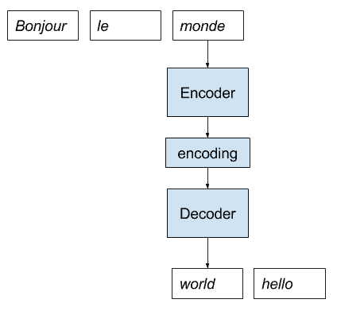
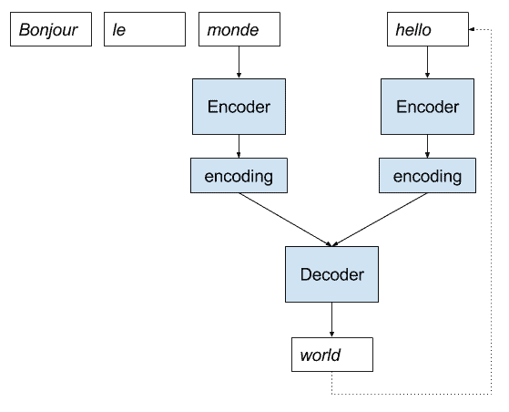
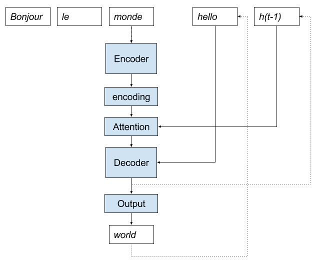

# 带有注意力的编解码器 RNN 架构的实现模式

> 原文： [https://machinelearningmastery.com/implementation-patterns-encoder-decoder-rnn-architecture-attention/](https://machinelearningmastery.com/implementation-patterns-encoder-decoder-rnn-architecture-attention/)

用于循环神经网络的编解码器架构被证明在自然语言处理领域中的一系列序列到序列预测问题上是强大的。

注意力是一种解决编解码器架构在长序列上的限制的机制，并且通常加速学习并提高模型在序列到序列预测问题上的技能。

在这篇文章中，您将发现用于实现编解码器模型的模式，无论是否受到关注。

阅读这篇文章后，你会知道：

*   编解码器循环神经网络的直接与递归实现模式。
*   注意力如何适合编解码器模型的直接实现模式。
*   如何使用编解码器模型的递归实现模式来实现关注。

让我们开始吧。

具有注意力的编解码器 RNN 架构的实现模式
照片由 [Philip McErlean](https://www.flickr.com/photos/64320477@N05/34172852904/) ，保留一些权利。

## 注意编解码器

用于循环神经网络的编解码器模型是用于序列到序列预测问题的架构，其中输入序列的长度不同于输出序列的长度。

它由两个子模型组成，顾名思义：

*   **编码器**：编码器负责逐步执行输入时间步长并将整个序列编码为称为上下文向量的固定长度向量。
*   **解码器**：解码器负责在从上下文向量读取时逐步执行输出时间步长。

该架构的问题在于长输入或输出序列的表现差。原因被认为是由于编码器使用的固定大小的内部表示。

注意是解决此限制的架构的扩展。它的工作原理是首先提供从编码器到解码器的更丰富的上下文和学习机制，其中解码器可以在预测输出序列中的每个时间步长时学习在更丰富的编码中注意的位置。

有关编解码器架构的更多信息，请参阅帖子：

*   [编解码器长短期记忆网络](https://machinelearningmastery.com/encoder-decoder-long-short-term-memory-networks/)

## 直接编解码器实现

有多种方法可以将编解码器架构实现为系统。

一种方法是在给定编码器输入的情况下从解码器整体产生输出。这就是模型经常被描述的方式。

> ...我们提出了一种新颖的神经网络架构，它学习将可变长度序列编码成固定长度的向量表示，并将给定的固定长度向量表示解码回可变长度序列。

- [使用 RNN 编解码器进行统计机器翻译的学习短语表示](https://arxiv.org/abs/1406.1078)，2014。

我们将此模型称为直接编解码器实现，因为缺少更好的名称。

为了清楚起见，让我们通过一个法国到英语神经机器翻译的小插图。

1.  法语的句子作为输入提供给模型。
2.  编码器一次一个字地读取该句子，并将该序列编码为固定长度的向量。
3.  解码器读取编码输入并以英语输出每个单词。

以下是此实现的描述。

神经机器翻译的直接编解码器模型实现

## 递归编解码器实现

另一种实现是对模型进行帧化，使得它仅生成一个字，并且递归地调用模型以生成整个输出序列。

我们将这称为递归实现（缺少更好的名称），以区别于上面的描述。

在他们关于标题为“_ 将图像放入图像标题 _
_ 发生器 _”的标题生成模型的论文中，“Marc Tanti，et al。将直接方法称为“_ 连续视图 _”：

> 传统上，神经语言模型被描述为字符串被认为是连续生成的。在每个时间步之后生成一个新单词，RNN 的状态与最后生成的单词组合以生成下一个单词。我们将此称为“连续视图”。

- [将图像放在图像标题生成器](https://arxiv.org/abs/1703.09137)中的位置，2017 年。

他们将递归实现称为“_ 不连续视图 _”：

> 我们建议根据一系列随时间的不连续快照来考虑 RNN，每个字都是从前一个字的整个前缀生成的，并且每次都重新初始化 RNN 的状态。我们将此称为“不连续视图”

— [Where to put the Image in an Image Caption Generator](https://arxiv.org/abs/1703.09137), 2017.

我们可以使用递归实现逐步完成相同的法语 - 英语神经机器翻译示例。

1.  法语的句子作为输入提供给模型。
2.  编码器一次一个字地读取该句子，并将该序列编码为固定长度的向量。
3.  解码器读取编码输入并输出一个英文单词。
4.  输出与编码的法语句子一起作为输入，转到步骤 3。

Below is a depiction of this implementation.

神经机器翻译的递归编解码器模型实现

为了开始该过程，可能需要向模型提供“_ 序列开始 _”令牌作为到目前为止生成的输出序列的输入。

到目前为止生成的整个输出序列可以被重放作为具有或不具有编码输入序列的解码器的输入，以允许解码器在预测下一个字之前到达相同的内部状态，如果模型生成整个模型那么输出序列一次，如上一节所述。

## 合并编解码器实现

递归实现可以模仿输出整个序列，如在第一个模型中那样。

递归实现还允许您改变模型并寻求更简单或更熟练的模型。

一个示例是还对输入序列进行编码并使用解码器模型来学习如何最佳地组合到目前为止生成的编码输入序列和输出序列。 Marc Tanti，et al。在他们的论文中“_ 循环神经网络（RNN）在图像标题生成器中的作用是什么？_ “称之为”合并模式。“

> ...在给定的时间步长，合并架构通过将到目前为止生成的字符串的 RNNencoded 前缀（生成过程的“过去”）与非语言信息（生成过程的指南）组合来预测下一步生成什么。

- [循环神经网络（RNN）在图像标题生成器中的作用是什么？](https://arxiv.org/abs/1708.02043) ，2017

该模型仍然是递归调用的，只有模型的内部结构是变化的。我们可以用一个描述清楚地说明这一点。

用于神经机器翻译的合并编解码器模型实现

## 具有注意实现的直接编解码器

我们现在可以在编解码器循环神经网络架构的这些不同实现的上下文中考虑注意机制。

正如 Bahdanau 等人所描述的那样。在他们的论文“[通过联合学习对齐和翻译](https://arxiv.org/abs/1409.0473)的神经机器翻译”，涉及以下几个要素：

*   **更丰富的编码**。编码器的输出被扩展，以提供输入序列中所有字的信息，而不仅仅是序列中最后一个字的最终输出。
*   **对齐模型**。新的小神经网络模型用于使用来自前一时间步骤的解码器的有人参与输出来对齐或关联扩展编码。
*   **加权编码**。对齐的加权，可用作编码输入序列上的概率分布。
*   **加权上下文向量**。应用于编码输入序列的加权然后可用于解码下一个字。

注意，在所有这些编解码器模型中，模型的输出（下一个预测字）和解码器的输出（内部表示）之间存在差异。解码器不直接输出字;通常，完全连接的层连接到解码器，该解码器输出单词词汇表上的概率分布，然后使用诸如集束搜索的启发式进一步搜索。

有关如何计算编解码器模型中的注意力的更多详细信息，请参阅帖子：

*   [编解码器循环神经网络中的注意事项如何工作](https://machinelearningmastery.com/how-does-attention-work-in-encoder-decoder-recurrent-neural-networks/)

我们可以关注直接编解码器模型的动画，如下所示。

基于注意模型的直接编解码器在神经机器翻译中的应用

在直接编解码器模型中实现注意力可能具有挑战性。这是因为具有向量化方程的有效神经网络库需要在计算之前获得所有信息。

对于每个预测，模型需要从解码器访问有人参与的输出，从而中断了这种需要。

## 具有注意实现的递归编解码器

注意力有助于递归描述和实现。

注意力的递归实现要求除了使得到目前为止生成的输出序列可用于解码器之外，还可以将从前一时间步骤生成的解码器的输出提供给用于预测下一个字的注意机制。

我们可以用卡通更清楚。

基于注意模型实现神经机器人翻译的递归编解码器

递归方法还为尝试新设计带来了额外的灵活性。

例如，Luong 等人。在他们的论文“ [_ 基于注意力的神经机器翻译的有效方法 _](https://arxiv.org/abs/1508.04025) ”更进一步，并提出从前一时间步骤（h（t-1）解码器的输出））也可以作为输入馈送到解码器，而不是用于注意力计算。他们称之为“投入喂养”模式。

> 拥有这种联系的效果是双重的：（a）我们希望使模型充分了解先前的对齐选择，并且（b）我们创建一个跨越水平和垂直的非常深的网络

- [基于注意力的神经机器翻译的有效方法](https://arxiv.org/abs/1508.04025)，2015。

有趣的是，这种输入馈送加上他们的本地关注导致了标准机器翻译任务的最新表现（在他们写作时）。

输入馈送方法与合并模型有关。合并模型不是仅提供来自上一时间步的解码输出，而是提供所有先前生成的时间步的编码。

人们可以想象在解码器中注意利用这种编码来帮助解码编码的输入序列，或者可能在两种编码上都使用注意力。

## 进一步阅读

如果您希望深入了解，本节将提供有关该主题的更多资源。

### 帖子

*   [编解码器长短期记忆网络](https://machinelearningmastery.com/encoder-decoder-long-short-term-memory-networks/)
*   [长期短期记忆循环神经网络](https://machinelearningmastery.com/attention-long-short-term-memory-recurrent-neural-networks/)的注意事项
*   [编解码器循环神经网络中的注意事项如何工作](https://machinelearningmastery.com/how-does-attention-work-in-encoder-decoder-recurrent-neural-networks/)

### 文件

*   [使用 RNN 编解码器进行统计机器翻译的学习短语表示](https://arxiv.org/abs/1406.1078)，2014。
*   [通过共同学习对齐和翻译的神经机器翻译](https://arxiv.org/abs/1409.0473)，2015。
*   [将图像放在图像标题生成器](https://arxiv.org/abs/1703.09137)中的位置，2017。
*   [循环神经网络（RNN）在图像标题生成器中的作用是什么？](https://arxiv.org/abs/1708.02043) ，2017
*   [基于注意力的神经机器翻译的有效方法](https://arxiv.org/abs/1508.04025)，2015。

## 摘要

在这篇文章中，您发现了用于实现编解码器模型的模式，无论是否受到关注。

具体来说，你学到了：

*   编解码器循环神经网络的直接与递归实现模式。
*   注意力如何适合编解码器模型的直接实现模式。
*   如何使用编解码器模型的递归实现模式来实现关注。

你有任何问题吗？
在下面的评论中提出您的问题，我会尽力回答。