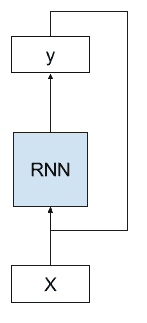
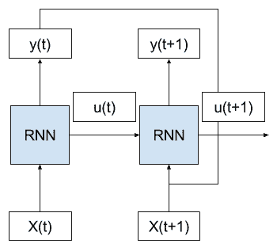
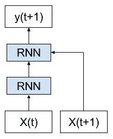

# RNN展开的温和介绍

> 原文： [https://machinelearningmastery.com/rnn-unrolling/](https://machinelearningmastery.com/rnn-unrolling/)

循环神经网络是一种神经网络，其中来自先前时间步长的输出作为输入馈送到当前时间步长。

这会创建一个带有周期的网络图或电路图，这使得很难理解信息如何通过网络传输。

在这篇文章中，您将发现展开或展开循环神经网络的概念。

阅读这篇文章后，你会知道：

*   具有循环连接的循环神经网络的标准概念。
*   在为每个输入时间步骤复制网络时展开正向传递的概念。
*   在训练期间展开用于更新网络权重的反向传递的概念。

让我们开始吧。

## 展开循环神经网络

循环神经网络是一种神经网络，其中来自先前时间步长的输出被当作当前时间步长的输入。

我们可以用图片来证明这一点。

下面我们可以看到网络将前一时间步的网络输出作为输入，并使用前一时间步的内部状态作为当前时间步的起点。

具有循环的RNN的示例

RNN适合并在许多时间步骤上做出预测。我们可以通过在输入序列上展开或展开RNN图来简化模型。

> 可视化RNN的有用方法是考虑通过沿输入序列“展开”网络形成的更新图。

- [带循环神经网络的监督序列标记](http://amzn.to/2upsSJ9)，2008。

## 展开远期通行证

考虑我们有多个输入时间步长（X（t），X（t + 1），...），内部状态的多个时间步长（u（t），u（t + 1），...）的情况，以及输出的多个时间步长（y（t），y（t + 1），......）。

我们可以将上述网络示意图展开成没有任何周期的图形。

正向通过时展开的RNN示例

我们可以看到循环被移除，并且来自前一时间步的输出（y（t））和内部状态（u（t））作为输入传递到网络以处理下一个时间步。

这种概念化的关键是网络（RNN）在展开的时间步骤之间不会改变。具体而言，每个时间步长使用相同的权重，只有输出和内部状态不同。

这样，就好像输入序列中的每个时间步都复制了整个网络（拓扑和权重）。

此外，网络的每个副本可以被认为是相同前馈神经网络的附加层。

展开的RNN示例，每个网络副本作为一个层

> 一旦及时展开，RNN可被视为非常深的前馈网络，其中所有层共享相同的权重。

- [深度学习，自然](https://www.nature.com/articles/nature14539.epdf)，2015

这是一个有用的概念工具和可视化，有助于了解正向传递过程中网络中发生的情况。它可能也可能不是深度学习库实现网络的方式。

## 展开后退通行证

网络展开的想法在向后传递实现循环神经网络的方式中起着更大的作用。

> 正如[反向传播到时间]的标准，网络随着时间的推移展开，因此到达层的连接被视为来自前一个时间步。

- [具有双向LSTM和其他神经网络架构的逐帧音素分类](ftp://ftp.idsia.ch/pub/juergen/nn_2005.pdf)，2005

重要的是，给定时间步长的误差反向传播取决于先前时间步骤的网络激活。

通过这种方式，后向传递需要展开网络的概念化。

将错误传播回序列的第一个输入时间步骤，以便可以计算误差梯度并且可以更新网络的权重。

> 与标准反向传播一样，[反向传播时间]包括重复应用链规则。细微之处在于，对于循环网络，损失函数不仅取决于隐藏层的激活，还取决于其对输出层的影响，还取决于其在下一个时间步长对隐藏层的影响。

- [带循环神经网络的监督序列标记](http://amzn.to/2upsSJ9)，2008

展开循环网络图也引入了其他问题。每个时间步都需要一个新的网络副本，这反过来占用内存，特别是对于具有数千或数百万权重的大型网络。随着时间步数攀升到数百个，大型循环网络的内存需求可能会迅速增加。

> ...需要按输入序列的长度展开RNN。通过展开RNN N次，网络内的每个神经元的激活被复制N次，这消耗了大量的存储器，尤其是当序列非常长时。这阻碍了在线学习或改编的小型实施。此外，这种“完全展开”使得多个序列的并行训练在共享存储器模型（例如图形处理单元（GPU））上效率低下

- [具有连接主义时间分类的循环神经网络的在线序列训练](https://arxiv.org/abs/1511.06841)，2015

## 进一步阅读

如果您要深入了解，本节将提供有关该主题的更多资源。

### 文件

*   [具有连接主义时间分类的循环神经网络的在线序列训练](https://arxiv.org/abs/1511.06841)，2015
*   [具有双向LSTM和其他神经网络架构的帧式音素分类](ftp://ftp.idsia.ch/pub/juergen/nn_2005.pdf)，2005
*   [带循环神经网络的监督序列标记](http://amzn.to/2upsSJ9)，2008
*   [深度学习，自然](https://www.nature.com/articles/nature14539.epdf)，2015

### 用品

*   [沿时间反向传播的温和介绍](http://machinelearningmastery.com/gentle-introduction-backpropagation-time/)
*   [了解LSTM网络](http://colah.github.io/posts/2015-08-Understanding-LSTMs/)，2015年
*   [滚动和展开RNN](https://shapeofdata.wordpress.com/2016/04/27/rolling-and-unrolling-rnns/) ，2016年
*   [展开的RNN](http://suriyadeepan.github.io/2017-01-07-unfolding-rnn/) ，2017年

## 摘要

在本教程中，您发现了展开循环神经网络的可视化和概念工具。

具体来说，你学到了：

*   具有循环连接的循环神经网络的标准概念。
*   在为每个输入时间步骤复制网络时展开正向传递的概念。
*   在训练期间展开用于更新网络权重的反向传递的概念。

你有任何问题吗？
在下面的评论中提出您的问题，我会尽力回答。