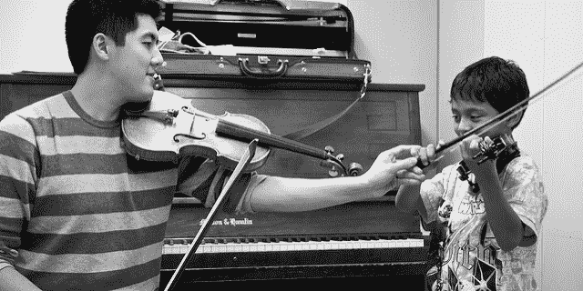

# 什么是循环神经网络的教师强制？

> 原文： [https://machinelearningmastery.com/teacher-forcing-for-recurrent-neural-networks/](https://machinelearningmastery.com/teacher-forcing-for-recurrent-neural-networks/)

教师强制是一种快速有效地训练循环神经网络模型的方法，该模型使用来自先前时间步长的输出作为输入。

它是一种网络训练方法，对于开发用于机器翻译，文本摘要和图像字幕的深度学习语言模型以及许多其他应用程序至关重要。

在这篇文章中，您将发现教师强迫作为训练复现神经网络的方法。

阅读这篇文章后，你会知道：

*   训练循环神经网络的问题是使用先前时间步长的输出作为输入。
*   在训练这些类型的循环网络时，教师强制解决缓慢收敛和不稳定的方法。
*   教师强迫的扩展允许训练有素的模型更好地处理这种类型网络的开环应用。

让我们开始吧。



什么是教师强制循环神经网络？
[Nathan Russell](https://www.flickr.com/photos/nathanrussell/2976465113/) 的照片，保留一些权利。

## 在序列预测中使用输出作为输入

存在序列预测模型，其使用来自上一时间步骤 y（t-1）的输出作为当前时间步骤 X（t）处的模型的输入。

这种类型的模型在语言模型中很常见，它一次输出一个单词并使用输出单词作为输入来生成序列中的下一个单词。

例如，这种类型的语言模型用于编解码器循环神经网络架构中，用于序列到序列生成问题，例如：

*   机器翻译
*   标题生成
*   文本摘要

在训练模型之后，可以使用“序列开始”标记来启动过程，并且输出序列中生成的单词在后续时间步骤中用作输入，可能与其他输入一样，如图像或源文本。

在训练模型时可以使用相同的递归输出输入过程，但它可能导致以下问题：

*   收敛缓慢。
*   模型不稳定。
*   技能差。

在训练这些类型的模型时，教师强制是一种提高模型技能和稳定性的方法。

## 什么是教师强迫？

教师强制是一种训练循环神经网络的策略，它使用先前时间步长的模型输出作为输入。

> 从输出返回到模型中的经常连接的模型可以通过教师强制进行训练。

- 第 372 页，[深度学习](http://amzn.to/2wHImcR)，2016 年。

最初描述和开发该方法作为[反向传播的替代技术](https://machinelearningmastery.com/gentle-introduction-backpropagation-time/)用于训练复发神经网络。

> 在动态监督学习任务中经常使用的一种有趣的技术是，在存在这样的值时，在随后的网络行为计算中用教师信号 d（t）替换单元的实际输出 y（t）。我们称这种技术教师为强迫。

- [连续运行全循环神经网络的学习算法](http://ieeexplore.ieee.org/document/6795228/)，1989。

教师强制通过在当前时间步骤 y（t）使用来自训练数据集的实际或预期输出作为下一时间步骤 X（t + 1）中的输入而不是由网络生成的输出来工作。

> 教师强迫是一种程序，其中在训练期间，模型在时间 t + 1 接收地面实况输出 y（t）作为输入。

— Page 372, [Deep Learning](http://amzn.to/2wHImcR), 2016.

## 工作示例

让我们通过一个简短的例子让教师强制具体化。

给定以下输入序列：

```py
Mary had a little lamb whose fleece was white as snow
```

想象一下，我们想要训练一个模型，在给定前一个单词序列的情况下生成序列中的下一个单词。

首先，我们必须添加一个标记来表示序列的开始，另一个标记来表示序列的结束。我们将分别使用“ _[START]_ ”和“ _[END]_ ”。

```py
[START] Mary had a little lamb whose fleece was white as snow [END]
```

接下来，我们输入模型“ _[START]_ ”并让模型生成下一个单词。

想象一下，该模型生成单词“`a`”，但当然，我们期望“`Mary`”。

```py
X,						yhat
[START],				a
```

朴素地，我们可以输入“`a`”作为输入的一部分，以生成序列中的后续单词。

```py
X,						yhat
[START], a,				?
```

您可以看到模型偏离轨道，并且会因为它生成的每个后续单词而受到惩罚。这使学习速度变慢，模型不稳定。

相反，我们可以使用教师强制。

在第一个例子中，当模型生成“`a`”作为输出时，我们可以在计算错误后丢弃此输出并输入“`Mary`”作为后续时间步的输入的一部分。

```py
X,						yhat
[START], Mary,			?
```

然后，我们可以为每个输入 - 输出字对重复此过程。

```py
X,						yhat
[START], 				?
[START], Mary,			?
[START], Mary, had,		?
[START], Mary, had, a,	?
...
```

该模型将快速学习正确的序列，或更正序列的统计属性。

## 教师强迫的延伸

教师强制是一种快速有效的方法，用于训练循环神经网络，该网络使用先前时间步长的输出作为模型的输入。

但是，当生成的序列与训练期间模型所看到的不同时，该方法还可能导致在实践中使用时可能脆弱或受限的模型。

这在这种类型的模型的大多数应用中是常见的，因为输出本质上是概率性的。这种类型的模型应用通常称为开环。

> 不幸的是，该过程可能导致在调节环境中作为小预测误差化合物的生成问题。这会导致预测表现较差，因为 RNN 的调节环境（先前生成的样本的序列）与训练期间看到的序列不同。

- [教授强迫：一种新的训练递归网络算法](https://arxiv.org/abs/1610.09038)，2016。

有许多方法可以解决这个限制，例如：

### 搜索候选输出序列

通常用于预测离散值输出（例如单词）的模型的一种方法是对每个单词的预测概率执行搜索以生成多个可能的候选输出序列。

此方法用于机器翻译等问题，以优化翻译的输出序列。

该事后操作的常见搜索过程是[集束搜索](https://en.wikipedia.org/wiki/Beam_search)。

> 通过使用保持若干生成的目标序列的集束搜索启发式可以减轻这种差异

- [用于循环神经网络的序列预测的预定采样](https://arxiv.org/abs/1506.03099)，2015。

### 课程学习

集束搜索方法仅适用于具有离散输出值的预测问题，不能用于实值输出。

强迫学习的一种变化是在训练期间引入先前时间步骤产生的输出，以鼓励模型学习如何纠正自己的错误。

> 我们建议改变训练过程，以逐步强迫模型处理自己的错误，就像在推理过程中一样。

— [Scheduled Sampling for Sequence Prediction with Recurrent Neural Networks](https://arxiv.org/abs/1506.03099), 2015.

该方法称为课程学习，涉及随机选择使用地面实况输出或前一时间步的生成输出作为当前时间步的输入。

课程在所谓的预定采样中随时间而变化，其中程序从强制学习开始，并且慢慢降低在训练时期内强制输入的概率。

还有其他教师强制的扩展和变体，如果您有兴趣，我鼓励您探索它们。

## 进一步阅读

如果您要深入了解，本节将提供有关该主题的更多资源。

### 文件

*   [一种连续运行全循环神经网络的学习算法](http://ieeexplore.ieee.org/document/6795228/)，1989。
*   [用循环神经网络进行序列预测的预定采样](https://arxiv.org/abs/1506.03099)，2015。
*   [教授强迫：一种新的训练递归网络算法](https://arxiv.org/abs/1610.09038)，2016。

### 图书

*   第 10.2.1 节，教师强制和输出复发网络，[深度学习](http://amzn.to/2wHImcR)，2016 年。

## 摘要

在这篇文章中，您发现教师强制作为训练循环神经网络的方法，该神经网络使用前一时间步的输出作为输入。

具体来说，你学到了：

*   训练循环神经网络的问题是使用先前时间步长的输出作为输入。
*   在训练这些类型的循环网络时，教师强制解决缓慢收敛和不稳定的方法。
*   教师强迫的扩展允许训练有素的模型更好地处理这种类型网络的开环应用。

你有任何问题吗？
在下面的评论中提出您的问题，我会尽力回答。