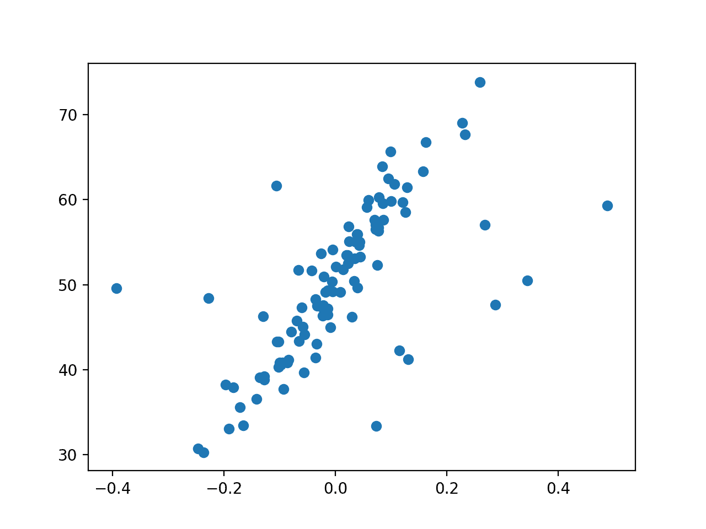
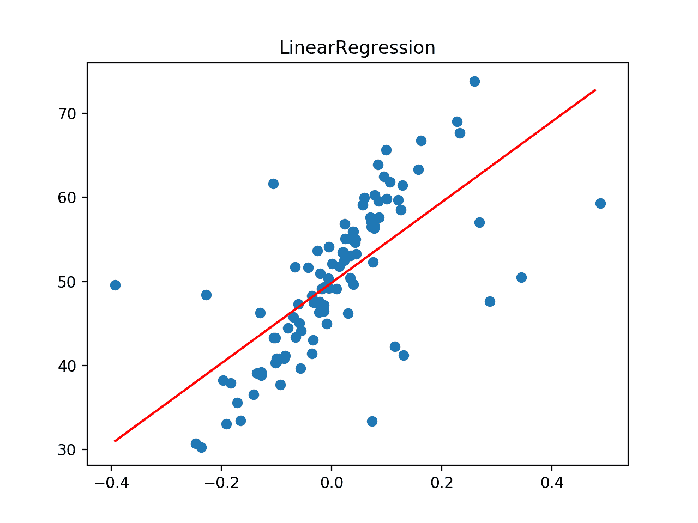
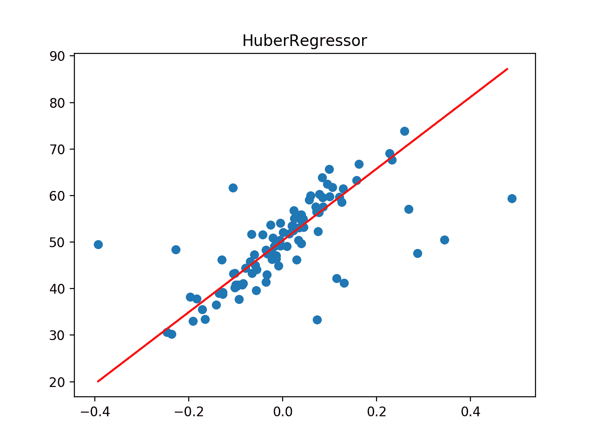
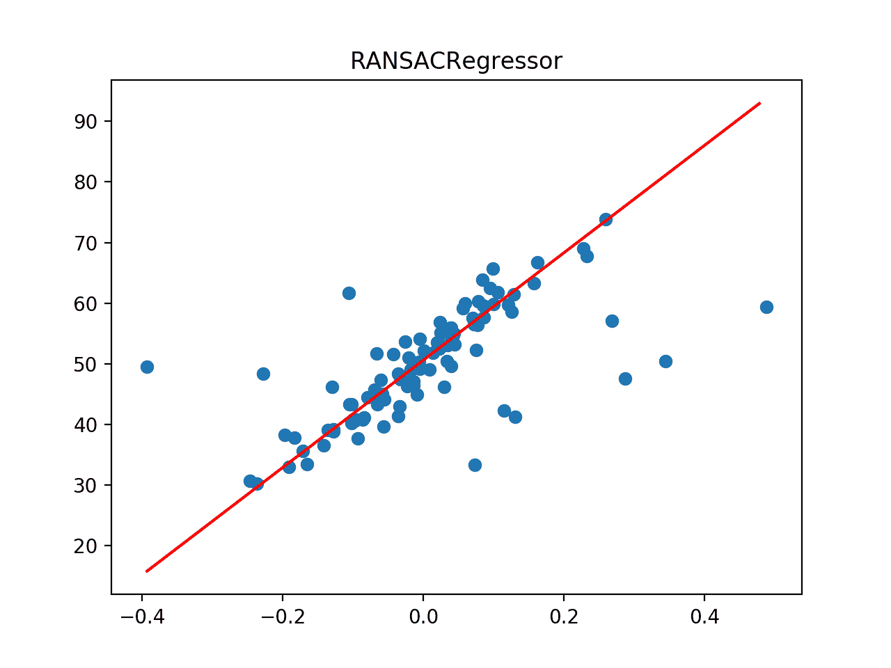
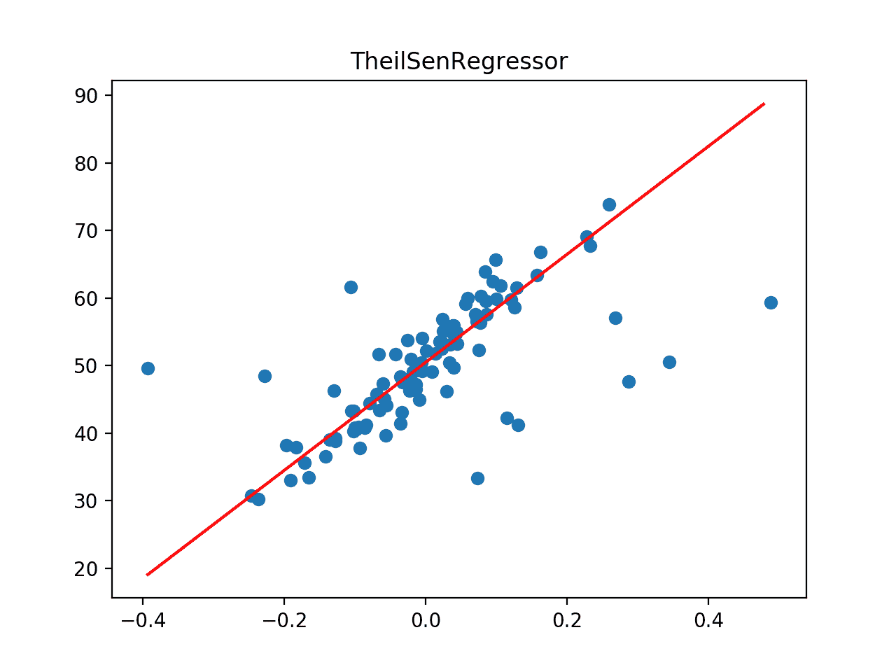
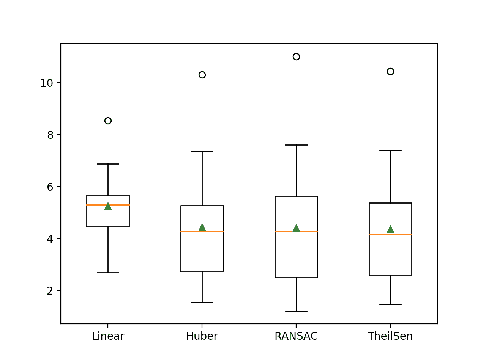
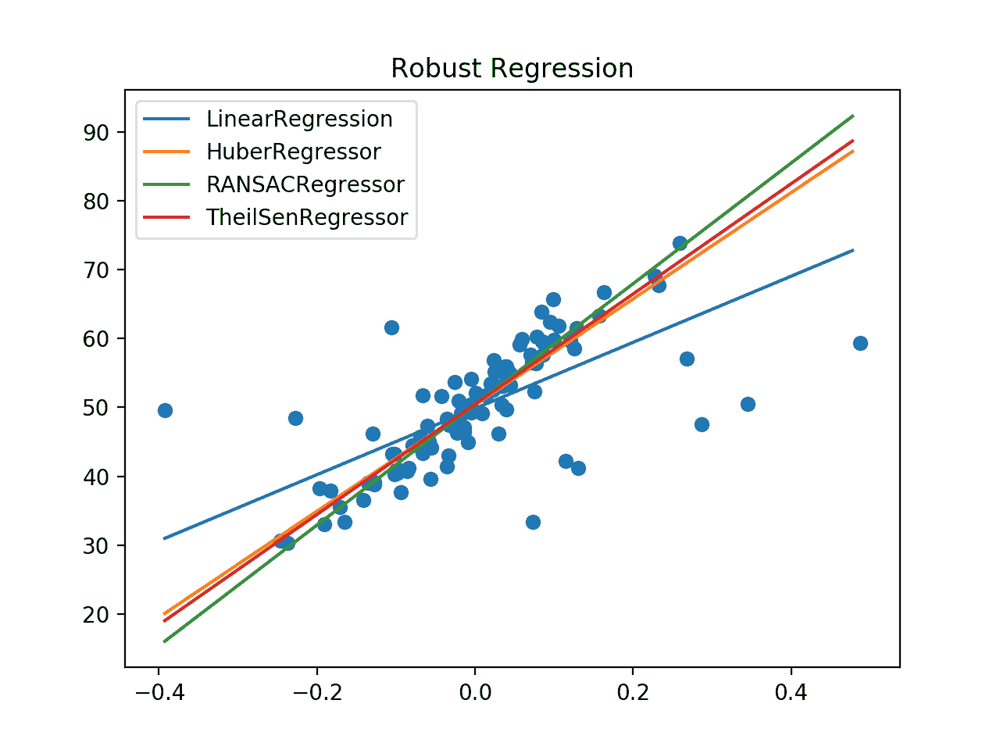

# Python 中机器学习的稳健回归

> 原文：<https://machinelearningmastery.com/robust-regression-for-machine-learning-in-python/>

回归是一项建模任务，包括预测给定输入的数值。

用于回归任务的算法也被称为“*回归*”算法，其中最广为人知且可能最成功的是线性回归。

线性回归适合最能描述输入和目标数值之间线性关系的直线或超平面。如果数据包含异常值，该线可能会出现偏差，从而导致更差的预测表现。**稳健回归**是指在训练数据中存在异常值时稳健的一套算法。

在本教程中，您将发现用于机器学习的稳健回归算法。

完成本教程后，您将知道:

*   稳健回归算法可用于输入值或目标值中有异常值的数据。
*   如何评估回归预测建模任务的稳健回归算法？
*   如何使用数据集上的最佳拟合线比较稳健回归算法？

我们开始吧。


Python 中机器学习的稳健回归
图片由 [Lenny K 摄影](https://flickr.com/photos/lennykphotography/25192383151/)提供，保留部分权利。

## 教程概述

本教程分为四个部分；它们是:

1.  异常值回归
2.  具有异常值的回归数据集
3.  稳健回归算法
4.  比较稳健回归算法

## 异常值回归

回归预测建模包括预测给定一些输入的数值变量，通常是数值输入。

用于回归预测建模任务的机器学习算法也称为“*回归*”或“*回归算法*”最常用的方法是[线性回归](https://machinelearningmastery.com/solve-linear-regression-using-linear-algebra/)。

许多回归算法是线性的，因为它们假设输入变量和目标变量之间的关系是线性的，例如二维的直线、三维的平面和高维的超平面。对于许多预测任务来说，这是一个合理的假设。

线性回归假设每个变量的概率分布表现良好，如具有高斯分布。数据集中某个特征的概率分布表现越差，线性回归找到良好拟合的可能性就越小。

使用线性回归时变量概率分布的一个具体问题是[异常值](https://machinelearningmastery.com/how-to-use-statistics-to-identify-outliers-in-data/)。这些观测值远远超出了预期分布。例如，如果一个变量具有[高斯分布](https://machinelearningmastery.com/continuous-probability-distributions-for-machine-learning/)，那么与平均值有 3 或 4(或更多)个标准差的观测值被认为是异常值。

数据集可能在输入变量或目标变量上有异常值，这两者都会给线性回归算法带来问题。

数据集中的异常值会扭曲为变量计算的[汇总统计数据](https://machinelearningmastery.com/a-gentle-introduction-to-calculating-normal-summary-statistics/)，例如平均值和标准偏差，这反过来会使模型偏离观测值的中心。这导致模型试图平衡在异常值和正常数据上表现良好，而在整体上表现较差。

相反，解决方案是使用线性回归的修改版本，专门解决数据集中异常值的预期。这些方法被称为[稳健回归算法](https://en.wikipedia.org/wiki/Robust_regression)。

## 具有异常值的回归数据集

我们可以使用[make _ revolution()函数](https://Sklearn.org/stable/modules/generated/sklearn.datasets.make_regression.html)定义一个合成回归数据集。

在这种情况下，我们需要一个易于绘制和理解的数据集。这可以通过使用单个输入变量和单个输出变量来实现。我们不希望任务太容易，所以我们会添加大量的统计噪声。

```py
...
X, y = make_regression(n_samples=100, n_features=1, tail_strength=0.9, effective_rank=1, n_informative=1, noise=3, bias=50, random_state=1)
```

一旦我们有了数据集，我们就可以通过增加异常值来扩充它。具体来说，我们将向输入变量添加异常值。

这可以通过改变一些输入变量的值来实现，该值是偏离平均值的标准偏差数的因子，例如 2 到 4。我们将向数据集中添加 10 个异常值。

```py
# add some artificial outliers
seed(1)
for i in range(10):
	factor = randint(2, 4)
	if random() > 0.5:
		X[i] += factor * X.std()
	else:
		X[i] -= factor * X.std()
```

我们可以将它绑定到一个准备数据集的函数中。然后可以调用这个函数，我们可以用 x 轴上的输入值和 y 轴上的目标或结果绘制数据集。

下面列出了准备和绘制数据集的完整示例。

```py
# create a regression dataset with outliers
from random import random
from random import randint
from random import seed
from sklearn.datasets import make_regression
from matplotlib import pyplot

# prepare the dataset
def get_dataset():
	X, y = make_regression(n_samples=100, n_features=1, tail_strength=0.9, effective_rank=1, n_informative=1, noise=3, bias=50, random_state=1)
	# add some artificial outliers
	seed(1)
	for i in range(10):
		factor = randint(2, 4)
		if random() > 0.5:
			X[i] += factor * X.std()
		else:
			X[i] -= factor * X.std()
	return X, y

# load dataset
X, y = get_dataset()
# summarize shape
print(X.shape, y.shape)
# scatter plot of input vs output
pyplot.scatter(X, y)
pyplot.show()
```

运行该示例会创建合成回归数据集并添加异常值。

然后绘制数据集，我们可以清楚地看到数据中的线性关系，带有统计噪声，少量异常值作为远离主要数据的点。



具有异常值的回归数据集的散点图

现在我们有了数据集，让我们在上面拟合不同的回归模型。

## 稳健回归算法

在本节中，我们将考虑数据集的不同稳健回归算法。

### 线性回归(不稳健)

在深入研究稳健回归算法之前，让我们从线性回归开始。

我们可以在有异常值的回归数据集上使用[重复 k 倍交叉验证](https://machinelearningmastery.com/k-fold-cross-validation/)来评估线性回归。我们将测量平均绝对误差，这将提供一个模型表现的下限，在这个任务中，我们可能会期望一些稳健的回归算法表现出色。

```py
# evaluate a model
def evaluate_model(X, y, model):
	# define model evaluation method
	cv = RepeatedKFold(n_splits=10, n_repeats=3, random_state=1)
	# evaluate model
	scores = cross_val_score(model, X, y, scoring='neg_mean_absolute_error', cv=cv, n_jobs=-1)
	# force scores to be positive
	return absolute(scores)
```

我们还可以在数据集上绘制模型的最佳拟合线。为此，我们首先在整个训练数据集上拟合模型，然后创建一个跨整个输入域的网格输入数据集，对每个输入域进行预测，然后为输入和预测输出绘制一条线。

该图显示了模型“*”如何看待*”问题，特别是输入和输出变量之间的关系。这个想法是，当使用线性回归时，线会被异常值扭曲。

```py
# plot the dataset and the model's line of best fit
def plot_best_fit(X, y, model):
	# fut the model on all data
	model.fit(X, y)
	# plot the dataset
	pyplot.scatter(X, y)
	# plot the line of best fit
	xaxis = arange(X.min(), X.max(), 0.01)
	yaxis = model.predict(xaxis.reshape((len(xaxis), 1)))
	pyplot.plot(xaxis, yaxis, color='r')
	# show the plot
	pyplot.title(type(model).__name__)
	pyplot.show()
```

将这些联系在一起，下面列出了线性回归的完整示例。

```py
# linear regression on a dataset with outliers
from random import random
from random import randint
from random import seed
from numpy import arange
from numpy import mean
from numpy import std
from numpy import absolute
from sklearn.datasets import make_regression
from sklearn.linear_model import LinearRegression
from sklearn.model_selection import cross_val_score
from sklearn.model_selection import RepeatedKFold
from matplotlib import pyplot

# prepare the dataset
def get_dataset():
	X, y = make_regression(n_samples=100, n_features=1, tail_strength=0.9, effective_rank=1, n_informative=1, noise=3, bias=50, random_state=1)
	# add some artificial outliers
	seed(1)
	for i in range(10):
		factor = randint(2, 4)
		if random() > 0.5:
			X[i] += factor * X.std()
		else:
			X[i] -= factor * X.std()
	return X, y

# evaluate a model
def evaluate_model(X, y, model):
	# define model evaluation method
	cv = RepeatedKFold(n_splits=10, n_repeats=3, random_state=1)
	# evaluate model
	scores = cross_val_score(model, X, y, scoring='neg_mean_absolute_error', cv=cv, n_jobs=-1)
	# force scores to be positive
	return absolute(scores)

# plot the dataset and the model's line of best fit
def plot_best_fit(X, y, model):
	# fut the model on all data
	model.fit(X, y)
	# plot the dataset
	pyplot.scatter(X, y)
	# plot the line of best fit
	xaxis = arange(X.min(), X.max(), 0.01)
	yaxis = model.predict(xaxis.reshape((len(xaxis), 1)))
	pyplot.plot(xaxis, yaxis, color='r')
	# show the plot
	pyplot.title(type(model).__name__)
	pyplot.show()

# load dataset
X, y = get_dataset()
# define the model
model = LinearRegression()
# evaluate model
results = evaluate_model(X, y, model)
print('Mean MAE: %.3f (%.3f)' % (mean(results), std(results)))
# plot the line of best fit
plot_best_fit(X, y, model)
```

运行该示例首先报告数据集上模型的平均 MAE。

我们可以看到，线性回归在这个数据集上实现了大约 5.2 的 MAE，提供了误差的上限。

```py
Mean MAE: 5.260 (1.149)
```

接下来，数据集被绘制为显示异常值的散点图，并用线性回归算法的最佳拟合线覆盖。

在这种情况下，我们可以看到最佳拟合线没有与数据对齐，并且被异常值扭曲。反过来，我们预计这将导致模型在数据集上的表现比预期的要差。



异常数据集中线性回归的最佳拟合线

### 胡伯回归

[Huber 回归](https://en.wikipedia.org/wiki/M-estimator)是一种稳健回归，它知道数据集中出现异常值的可能性，并赋予它们比数据集中其他示例更小的权重。

我们可以通过 Sklearn 中的【Huber 回归器类使用 Huber 回归。“*ε*参数控制什么被认为是异常值，其中较小的值考虑更多的数据异常值，反过来，使模型对异常值更加稳健。默认值为 1.35。

下面的示例评估具有异常值的回归数据集上的 Huber 回归，首先使用重复交叉验证评估模型，然后绘制最佳拟合线。

```py
# huber regression on a dataset with outliers
from random import random
from random import randint
from random import seed
from numpy import arange
from numpy import mean
from numpy import std
from numpy import absolute
from sklearn.datasets import make_regression
from sklearn.linear_model import HuberRegressor
from sklearn.model_selection import cross_val_score
from sklearn.model_selection import RepeatedKFold
from matplotlib import pyplot

# prepare the dataset
def get_dataset():
	X, y = make_regression(n_samples=100, n_features=1, tail_strength=0.9, effective_rank=1, n_informative=1, noise=3, bias=50, random_state=1)
	# add some artificial outliers
	seed(1)
	for i in range(10):
		factor = randint(2, 4)
		if random() > 0.5:
			X[i] += factor * X.std()
		else:
			X[i] -= factor * X.std()
	return X, y

# evaluate a model
def evaluate_model(X, y, model):
	# define model evaluation method
	cv = RepeatedKFold(n_splits=10, n_repeats=3, random_state=1)
	# evaluate model
	scores = cross_val_score(model, X, y, scoring='neg_mean_absolute_error', cv=cv, n_jobs=-1)
	# force scores to be positive
	return absolute(scores)

# plot the dataset and the model's line of best fit
def plot_best_fit(X, y, model):
	# fut the model on all data
	model.fit(X, y)
	# plot the dataset
	pyplot.scatter(X, y)
	# plot the line of best fit
	xaxis = arange(X.min(), X.max(), 0.01)
	yaxis = model.predict(xaxis.reshape((len(xaxis), 1)))
	pyplot.plot(xaxis, yaxis, color='r')
	# show the plot
	pyplot.title(type(model).__name__)
	pyplot.show()

# load dataset
X, y = get_dataset()
# define the model
model = HuberRegressor()
# evaluate model
results = evaluate_model(X, y, model)
print('Mean MAE: %.3f (%.3f)' % (mean(results), std(results)))
# plot the line of best fit
plot_best_fit(X, y, model)
```

运行该示例首先报告数据集上模型的平均 MAE。

我们可以看到 Huber 回归在这个数据集上实现了大约 4.435 的 MAE，优于上一节中的线性回归模型。

```py
Mean MAE: 4.435 (1.868)
```

接下来，数据集被绘制为显示异常值的散点图，并覆盖算法的最佳拟合线。

在这种情况下，我们可以看到最佳拟合线更好地与数据的主体对齐，并且似乎不受存在的异常值的明显影响。



异常数据集上 Huber 回归的最佳拟合线

### RANSAC 回归

[随机样本一致性](https://en.wikipedia.org/wiki/Random_sample_consensus)，简称 RANSAC，是另一种稳健的回归算法。

RANSAC 试图将数据分为离群值和内联值，并在内联值上拟合模型。

Sklearn 库通过[transacruler](https://Sklearn.org/stable/modules/generated/sklearn.linear_model.RANSACRegressor.html)类提供了一个实现。

下面的示例在具有异常值的回归数据集上评估 RANSAC 回归，首先通过重复交叉验证评估模型，然后绘制最佳拟合线。

```py
# ransac regression on a dataset with outliers
from random import random
from random import randint
from random import seed
from numpy import arange
from numpy import mean
from numpy import std
from numpy import absolute
from sklearn.datasets import make_regression
from sklearn.linear_model import RANSACRegressor
from sklearn.model_selection import cross_val_score
from sklearn.model_selection import RepeatedKFold
from matplotlib import pyplot

# prepare the dataset
def get_dataset():
	X, y = make_regression(n_samples=100, n_features=1, tail_strength=0.9, effective_rank=1, n_informative=1, noise=3, bias=50, random_state=1)
	# add some artificial outliers
	seed(1)
	for i in range(10):
		factor = randint(2, 4)
		if random() > 0.5:
			X[i] += factor * X.std()
		else:
			X[i] -= factor * X.std()
	return X, y

# evaluate a model
def evaluate_model(X, y, model):
	# define model evaluation method
	cv = RepeatedKFold(n_splits=10, n_repeats=3, random_state=1)
	# evaluate model
	scores = cross_val_score(model, X, y, scoring='neg_mean_absolute_error', cv=cv, n_jobs=-1)
	# force scores to be positive
	return absolute(scores)

# plot the dataset and the model's line of best fit
def plot_best_fit(X, y, model):
	# fut the model on all data
	model.fit(X, y)
	# plot the dataset
	pyplot.scatter(X, y)
	# plot the line of best fit
	xaxis = arange(X.min(), X.max(), 0.01)
	yaxis = model.predict(xaxis.reshape((len(xaxis), 1)))
	pyplot.plot(xaxis, yaxis, color='r')
	# show the plot
	pyplot.title(type(model).__name__)
	pyplot.show()

# load dataset
X, y = get_dataset()
# define the model
model = RANSACRegressor()
# evaluate model
results = evaluate_model(X, y, model)
print('Mean MAE: %.3f (%.3f)' % (mean(results), std(results)))
# plot the line of best fit
plot_best_fit(X, y, model)
```

运行该示例首先报告数据集上模型的平均 MAE。

我们可以看到，RANSAC 回归在这个数据集上实现了大约 4.454 的 MAE，优于线性回归模型，但可能不是 Huber 回归。

```py
Mean MAE: 4.454 (2.165)
```

接下来，数据集被绘制为显示异常值的散点图，并覆盖算法的最佳拟合线。

在这种情况下，我们可以看到最佳拟合线与数据主体对齐，甚至可能比 Huber 回归的图更好。



异常数据集上 RANSAC 回归的最佳拟合线

### 泰尔森回归

[泰尔森回归](https://en.wikipedia.org/wiki/Theil%E2%80%93Sen_estimator)包括在训练数据的子集上拟合多个回归模型，最后将系数组合在一起。

Sklearn 通过[类提供了一个实现。](https://Sklearn.org/stable/modules/generated/sklearn.linear_model.TheilSenRegressor.html)

下面的示例在具有异常值的回归数据集上评估泰尔森回归，首先通过重复交叉验证评估模型，然后绘制最佳拟合线。

```py
# theilsen regression on a dataset with outliers
from random import random
from random import randint
from random import seed
from numpy import arange
from numpy import mean
from numpy import std
from numpy import absolute
from sklearn.datasets import make_regression
from sklearn.linear_model import TheilSenRegressor
from sklearn.model_selection import cross_val_score
from sklearn.model_selection import RepeatedKFold
from matplotlib import pyplot

# prepare the dataset
def get_dataset():
	X, y = make_regression(n_samples=100, n_features=1, tail_strength=0.9, effective_rank=1, n_informative=1, noise=3, bias=50, random_state=1)
	# add some artificial outliers
	seed(1)
	for i in range(10):
		factor = randint(2, 4)
		if random() > 0.5:
			X[i] += factor * X.std()
		else:
			X[i] -= factor * X.std()
	return X, y

# evaluate a model
def evaluate_model(X, y, model):
	# define model evaluation method
	cv = RepeatedKFold(n_splits=10, n_repeats=3, random_state=1)
	# evaluate model
	scores = cross_val_score(model, X, y, scoring='neg_mean_absolute_error', cv=cv, n_jobs=-1)
	# force scores to be positive
	return absolute(scores)

# plot the dataset and the model's line of best fit
def plot_best_fit(X, y, model):
	# fut the model on all data
	model.fit(X, y)
	# plot the dataset
	pyplot.scatter(X, y)
	# plot the line of best fit
	xaxis = arange(X.min(), X.max(), 0.01)
	yaxis = model.predict(xaxis.reshape((len(xaxis), 1)))
	pyplot.plot(xaxis, yaxis, color='r')
	# show the plot
	pyplot.title(type(model).__name__)
	pyplot.show()

# load dataset
X, y = get_dataset()
# define the model
model = TheilSenRegressor()
# evaluate model
results = evaluate_model(X, y, model)
print('Mean MAE: %.3f (%.3f)' % (mean(results), std(results)))
# plot the line of best fit
plot_best_fit(X, y, model)
```

运行该示例首先报告数据集上模型的平均 MAE。

我们可以看到，泰尔森回归在这个数据集上实现了大约 4.371 的 MAE，优于线性回归模型以及 RANSAC 和 Huber 回归。

```py
Mean MAE: 4.371 (1.961)
```

接下来，数据集被绘制为显示异常值的散点图，并覆盖算法的最佳拟合线。

在这种情况下，我们可以看到最佳拟合线与数据主体对齐。



异常数据集上泰尔森回归的最佳拟合线

## 比较稳健回归算法

现在我们已经熟悉了一些流行的稳健回归算法以及如何使用它们，我们可以看看如何直接比较它们。

运行一个实验来直接比较同一数据集上的稳健回归算法可能是有用的。我们可以比较每种方法的平均表现，更有用的是，使用像方框图和触须图这样的工具来比较重复交叉验证折叠中的分数分布。

下面列出了完整的示例。

```py
# compare robust regression algorithms on a regression dataset with outliers
from random import random
from random import randint
from random import seed
from numpy import mean
from numpy import std
from numpy import absolute
from sklearn.datasets import make_regression
from sklearn.model_selection import cross_val_score
from sklearn.model_selection import RepeatedKFold
from sklearn.linear_model import LinearRegression
from sklearn.linear_model import HuberRegressor
from sklearn.linear_model import RANSACRegressor
from sklearn.linear_model import TheilSenRegressor
from matplotlib import pyplot

# prepare the dataset
def get_dataset():
	X, y = make_regression(n_samples=100, n_features=1, tail_strength=0.9, effective_rank=1, n_informative=1, noise=3, bias=50, random_state=1)
	# add some artificial outliers
	seed(1)
	for i in range(10):
		factor = randint(2, 4)
		if random() > 0.5:
			X[i] += factor * X.std()
		else:
			X[i] -= factor * X.std()
	return X, y

# dictionary of model names and model objects
def get_models():
	models = dict()
	models['Linear'] = LinearRegression()
	models['Huber'] = HuberRegressor()
	models['RANSAC'] = RANSACRegressor()
	models['TheilSen'] = TheilSenRegressor()
	return models

# evaluate a model
def evalute_model(X, y, model, name):
	# define model evaluation method
	cv = RepeatedKFold(n_splits=10, n_repeats=3, random_state=1)
	# evaluate model
	scores = cross_val_score(model, X, y, scoring='neg_mean_absolute_error', cv=cv, n_jobs=-1)
	# force scores to be positive
	scores = absolute(scores)
	return scores

# load the dataset
X, y = get_dataset()
# retrieve models
models = get_models()
results = dict()
for name, model in models.items():
	# evaluate the model
	results[name] = evalute_model(X, y, model, name)
	# summarize progress
	print('>%s %.3f (%.3f)' % (name, mean(results[name]), std(results[name])))
# plot model performance for comparison
pyplot.boxplot(results.values(), labels=results.keys(), showmeans=True)
pyplot.show()
```

运行该示例依次评估每个模型，报告平均和标准偏差 MAE 分数。

注意:鉴于学习算法和评估程序的随机性，您的具体结果会有所不同。试着运行这个例子几次。

我们可以看到这些分数与上一节中报告的分数之间的一些微小差异，尽管这些差异可能具有统计学意义，也可能不具有统计学意义。稳健回归方法比线性回归表现更好的一般模式成立，lSen 比其他方法获得更好的表现。

```py
>Linear 5.260 (1.149)
>Huber 4.435 (1.868)
>RANSAC 4.405 (2.206)
>TheilSen 4.371 (1.961)
```

创建了一个图表，显示了一个方框和触须图，总结了每个评估算法的结果分布。

我们可以清楚地看到稳健回归算法的分布低于线性回归算法。



稳健回归算法 MAE 分数的盒须图

比较基于最佳拟合线的稳健回归算法可能也很有趣。

下面的示例适合每种稳健回归算法，并在整个训练数据集散点图的上下文中，在同一图上绘制它们的最佳拟合线。

```py
# plot line of best for multiple robust regression algorithms
from random import random
from random import randint
from random import seed
from numpy import arange
from sklearn.datasets import make_regression
from sklearn.linear_model import LinearRegression
from sklearn.linear_model import HuberRegressor
from sklearn.linear_model import RANSACRegressor
from sklearn.linear_model import TheilSenRegressor
from matplotlib import pyplot

# prepare the dataset
def get_dataset():
	X, y = make_regression(n_samples=100, n_features=1, tail_strength=0.9, effective_rank=1, n_informative=1, noise=3, bias=50, random_state=1)
	# add some artificial outliers
	seed(1)
	for i in range(10):
		factor = randint(2, 4)
		if random() > 0.5:
			X[i] += factor * X.std()
		else:
			X[i] -= factor * X.std()
	return X, y

# dictionary of model names and model objects
def get_models():
	models = list()
	models.append(LinearRegression())
	models.append(HuberRegressor())
	models.append(RANSACRegressor())
	models.append(TheilSenRegressor())
	return models

# plot the dataset and the model's line of best fit
def plot_best_fit(X, y, xaxis, model):
	# fit the model on all data
	model.fit(X, y)
	# calculate outputs for grid across the domain
	yaxis = model.predict(xaxis.reshape((len(xaxis), 1)))
	# plot the line of best fit
	pyplot.plot(xaxis, yaxis, label=type(model).__name__)

# load the dataset
X, y = get_dataset()
# define a uniform grid across the input domain
xaxis = arange(X.min(), X.max(), 0.01)
for model in get_models():
	# plot the line of best fit
	plot_best_fit(X, y, xaxis, model)
# plot the dataset
pyplot.scatter(X, y)
# show the plot
pyplot.title('Robust Regression')
pyplot.legend()
pyplot.show()
```

运行该示例会创建一个图，将数据集显示为散点图以及每种算法的最佳拟合线。

我们可以清楚地看到线性回归算法的离轴线，以及遵循数据主体的稳健回归算法的更好的线。



最佳拟合线稳健回归算法的比较

## 进一步阅读

如果您想更深入地了解这个主题，本节将提供更多资源。

### 蜜蜂

*   [线性模型，sci kit-学习](https://Sklearn.org/stable/modules/linear_model.html)。
*   [sklearn . datasets . make _ revolution API](https://Sklearn.org/stable/modules/generated/sklearn.datasets.make_regression.html)。
*   [硬化. linear_model .线性回归 API](https://Sklearn.org/stable/modules/generated/sklearn.linear_model.LinearRegression.html) 。
*   [sklearn.linear_model。hubergressor API](https://Sklearn.org/stable/modules/generated/sklearn.linear_model.HuberRegressor.html)。
*   [sklearn.linear_model。ransacrecruler API](https://Sklearn.org/stable/modules/generated/sklearn.linear_model.RANSACRegressor.html)。
*   [sklearn.linear_model。lSenRegressor API](https://Sklearn.org/stable/modules/generated/sklearn.linear_model.TheilSenRegressor.html) 。

### 文章

*   [稳健回归，维基百科](https://en.wikipedia.org/wiki/Robust_regression)。
*   [M-估计量，维基百科](https://en.wikipedia.org/wiki/M-estimator)。
*   [随机样本共识，维基百科](https://en.wikipedia.org/wiki/Random_sample_consensus)。
*   [泰尔-森估计器，维基百科](https://en.wikipedia.org/wiki/Theil%E2%80%93Sen_estimator)。

## 摘要

在本教程中，您发现了机器学习的稳健回归算法。

具体来说，您了解到:

*   稳健回归算法可用于输入值或目标值中有异常值的数据。
*   如何评估回归预测建模任务的稳健回归算法？
*   如何使用数据集上的最佳拟合线比较稳健回归算法？

**你有什么问题吗？**
在下面的评论中提问，我会尽力回答。