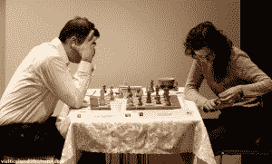

# 如何在机器学习中取得更好的成绩

> 原文： [https://machinelearningmastery.com/how-to-get-better-at-machine-learning/](https://machinelearningmastery.com/how-to-get-better-at-machine-learning/)

[来自 Metacademy 的科罗拉多里德](http://obphio.us/)最近写了一篇很棒的文章，名为“ [_ 升级你的机器学习 _](http://metacademy.org/roadmaps/cjrd/level-up-your-ml) ”来回答他经常收到的问题：

> 如果我想在机器学习上“更好”，我该怎么办，但我不知道我想学什么？

在这篇文章中，您将发现科罗拉多州建议的摘要和他的路线图的细分。

升级您的机器学习
照片由[HelgiHalldórsson](https://www.flickr.com/photos/8058853@N06/4393957264)，保留一些权利

## 在机器学习方面做得更好的策略

科罗拉多州是伯克利大学的博士生，也是 [Metacademy](http://www.metacademy.org/) 的创始人。 Metacademy 是一个开源平台，专家合作构建维基文章。目前，文章侧重于机器学习和人工智能。这是一个很棒的网站。

科罗拉多州在机器学习方面做得更好的建议是通过教科书不断努力。他评论说，阅读教科书的过程就是与教科书合而为一的过程。

这个策略并不令人意外，因为博士候选人可能会在当天推荐同样的东西。这是好的建议，但是，我不认为这对每个人都是正确的建议。如果您是一名程序员，通过实现它们来让想法渗透，那么当您希望在给定方法上采取下一步时，教科书列表可能是有用的参考。

## 机器学习路线图

他的机器学习路线图又分为 5 个级别，每个级别都指向要掌握的特定教科书。五个级别是：

*   **0 级（_ 新手 _）**：阅读[数据智能：利用数据科学将信息转化为洞察](http://www.amazon.com/dp/111866146X?tag=inspiredalgor-20)。假设您了解 excel 的方式，并最终了解一些算法的存在和可能的高级数据流。
*   **1 级（_ 学徒 _）**：用 R 读取[机器学习。了解何时应用不同的机器学习算法，并使用 R 来执行此操作。假设可能有一点编程，代数，微积分和概率，但只是一点点。](http://www.amazon.com/dp/1782162143?tag=inspiredalgor-20)
*   **2 级（_ 熟练工 _）**：读取[模式识别和机器学习](http://www.amazon.com/dp/0387310738?tag=inspiredalgor-20)。从数学角度了解机器学习算法的工作原理。解释和调试机器学习方法的输出，并掌握更深入的机器学习概念。假设有算法的工作知识，良好的线性代数，一些向量微积分，一些算法实现经验。
*   **3 级（`Master`）**：读取[概率图形模型：原理和技术](http://www.amazon.com/dp/0262013193?tag=inspiredalgor-20)。深入研究凸优化，组合优化，概率论，微分几何和其他数学等高级主题。熟悉概率图形模型，何时使用它们以及如何解释它们的结果。
*   **等级 4（_ 大师 _）**：随心所欲。回馈社区。

这是一个很好的细分，科罗拉多为每个级别提供了特定的章节建议以及建议的顶点项目。

科罗拉多重新发布了这个路线图作为[博客文章](http://www.tenleaves.com/paths/machine-learning-level-up)，稍作修改。他放弃了最后一级并更名为：_ 好奇 _，_ 新手 _，_ 学徒 _，_ 熟练工 _ 和 _ 大师 _ 。他还评论说，0 级好奇机器学习器不应该阅读教科书，而是应该浏览和查看一些顶级机器学习视频。

## 机器学习中忽视的主题

[斯科特·洛克林](http://scottlocklin.wordpress.com/about/)也阅读了这篇文章并受到启发，撰写了他自己的回复题为“ [_ 被忽视的机器学习思路 _](https://scottlocklin.wordpress.com/2014/07/22/neglected-machine-learning-ideas/) ”（与 [Boris Artzybasheff 的酷艺术](http://en.wikipedia.org/wiki/Boris_Artzybasheff)）。

斯科特评论说，这些建议表明了科罗拉多州的偏好，并没有给出更全面的机器学习领域。斯科特还评论说很少有书可以很好地概述这个领域，尽管他确实喜欢这本书[机器学习：理解数据的算法的艺术和科学](http://www.amazon.com/dp/1107422221?tag=inspiredalgor-20)，因为它也触及了一些不起眼的技术。

然后，斯科特继续列出一些“在书中被忽视”的领域。总之，这些领域是：

*   **在线学习**：流媒体数据和大数据的关键，向 [Vowpal Wabbit](http://hunch.net/~vw/) 致敬。
*   **强化学习**：在机器人技术的背景下进行了讨论，但很少将其与常见的 ML 联系起来。
*   **“_ 压缩 _”序列预测技术**：在发现学习模式时进行压缩。致 [CompLearn](http://www.complearn.org/) 。
*   **一般的时间序列导向技术**
*   **共形预测**：在线学习的模型准确率估计。
*   **ML 存在大量噪声**：NLP 和 CV 是一般情况示例。
*   **特征工程**：对于成功的机器学习至关重要。
*   **一般无监督和半监督学习**

这是一个很好的列表，指出一些确实没有得到足够或足够关注的领域。

我会注意到我有自己的[路线图，用于入门和掌握机器学习](http://machinelearningmastery.com/machine-learning-roadmap-your-self-study-guide-to-machine-learning/ "Machine Learning Roadmap: Your Self-Study Guide to Machine Learning")。像科罗拉多州一样，我的路线图仅限于分类/回归类型的监督机器学习，但建立在促进调查和采用任何和所有感兴趣主题的过程中。而不是“_ 阅读这些教科书 _”，而是“_ 遵循这些过程 _”的方法。