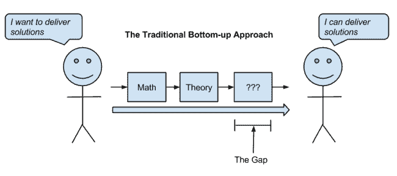
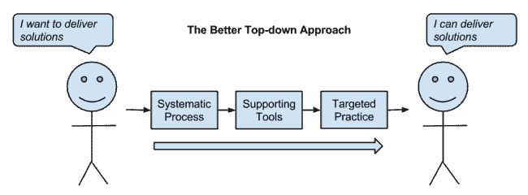
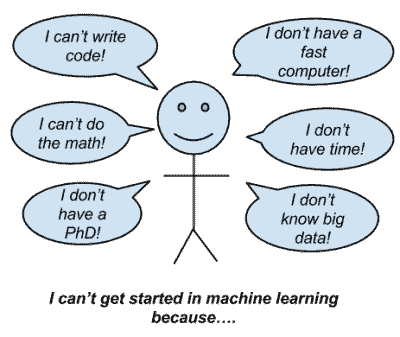
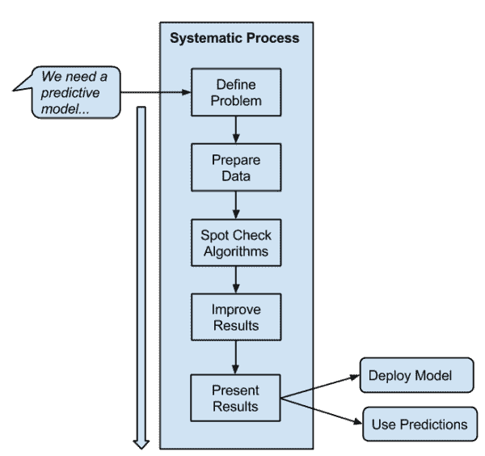

# 掌握机器学习的方法

> 原文： [https://machinelearningmastery.com/machine-learning-mastery-method/](https://machinelearningmastery.com/machine-learning-mastery-method/)

### 5 个步骤开始并擅长机器学习

我教授一个 5 步骤的过程，您可以使用它来开始应用机器学习。

这是非常规的。

教授机器学习的传统方式是自下而上。

从理论和数学开始，然后算法实现，然后发送给您，找出如何开始解决实际问题。

开始进行机器学习的传统方法在从业者的道路上存在差距。

机器学习掌握方法翻转了这一点，并从最有价值的结果开始。

**它针对企业想要支付的结果：**
**如何交付结果。**

结果是一组可以可靠地做出预测的预测或模型。

**这是一种自上而下的结果优先方法。**

从实现市场中最理想的结果的目标开始，将您，实践者带到该结果的最短途径是什么？

我们可以通过以下 5 个步骤总结这条路径：

*   **第 1 步：调整心态**（_ 相信！_）。
*   **第 2 步：选择一个过程**（如何获得结果）。
*   **第 3 步：选择工具**（实现）。
*   **第 4 步：实践数据集**（_ 投入工作 _）。
*   **第 5 步：建立投资组合**（_ 展示你的技能 _）。

而已。

这是[所有电子书训练背后的哲学](http://machinelearningmastery.com/products/)。

这就是我创建这个网站的原因。我知道一种更简单的方法，只需分享它。

下面是一个动画片来说明这个过程，为简洁起见，省略了第 1 步（在思维模式上）和第 2 步（在展示你的工作上）。

学习机器学习的更好方法，从端到端的工作机器学习问题开始。

让我们仔细看看每一步。

## 第 0 步：地标

在我们开始之前，您必须了解机器学习的标志。

我经常假设这一点，但除非你知道一些真正的基础知识，否则你无法继续。

例如：

*   您应该知道机器学习是什么，并能够向同事解释。
    *   [什么是机器学习？](http://machinelearningmastery.com/what-is-machine-learning/)
*   你应该知道一些机器学习问题的例子
    *   [实用机器学习问题](http://machinelearningmastery.com/practical-machine-learning-problems/)
*   您应该知道机器学习是解决一些复杂问题的唯一方法。
    *   [机器学习事项](http://machinelearningmastery.com/machine-learning-matters/)
*   您应该知道预测性建模是应用机器学习中最有用的部分。
    *   [预测性建模的温和介绍](http://machinelearningmastery.com/gentle-introduction-to-predictive-modeling/)
*   您应该知道机器学习在人工智能和数据科学方面的适用范围
    *   [机器学习适合哪里？](http://machinelearningmastery.com/where-does-machine-learning-fit-in/)
*   您应该知道可用的机器学习算法的类型。
    *   [机器学习算法之旅](http://machinelearningmastery.com/a-tour-of-machine-learning-algorithms/)
*   您应该了解一些基本的机器学习术语
    *   [如何谈论机器学习中的数据](http://machinelearningmastery.com/data-terminology-in-machine-learning/)

## 第 1 步：心态

机器学习不仅适用于教授。

它不仅适用于天才或学者。

### 你必须相信

您可以学习该主题并将其应用于解决问题。

没有理由不这样做。

*   您不需要编写代码。
*   你不需要知道或擅长数学。
*   你不需要更高的学位。
*   您不需要大数据。
*   您不需要访问超级计算机。
*   你不需要很多时间。

很容易找到借口不开始机器学习。

真的，只有一件事可以阻止你开始并擅长机器学习。

是你。

*   也许你只是找不到动力。
*   也许你认为你必须从零开始实现一切。
*   也许你继续选择高级问题而不是初学者问题。
*   也许您没有系统化的流程来提供结果。
*   也许你没有使用好的工具和库。

明确阻止您入门的限制性信念。

这篇文章可能有所帮助

*   [什么阻碍了你的机器学习目标？](http://machinelearningmastery.com/what-is-holding-you-back-from-your-machine-learning-goals/)

你可以遇到很多减速带。

识别它们，解决它们并继续前进。

### 机器学习为什么？

一旦你知道你可以做机器学习，就明白为什么。

*   也许您有兴趣了解有关机器学习算法的更多信息。
*   也许你对创建预测感兴趣。
*   也许你对解决复杂问题很感兴趣。
*   也许你对创建更智能的软件感兴趣。
*   也许你甚至有兴趣成为一名数据科学家。

仔细思考这个话题并试着找出你的“_ 为什么 _”。

This post might help:

*   [为什么要进入机器学习？](http://machinelearningmastery.com/why-get-into-machine-learning/)

一旦你有了“_ 为什么 _”，找到你的部落。

哪一组机器学习从业者你最亲密？

*   也许你是一个普遍感兴趣的商人。
*   也许你是一个提供项目的经理。
*   也许你是一个机器学习的学生。
*   也许你是一名机器学习研究员。
*   也许你是一个有棘手问题的研究员。
*   也许你想实现算法
*   也许你需要一次性的预测。
*   也许您需要一个可以部署的模型。
*   也许你是一名数据科学家。
*   也许你是一名数据分析师。

每个部落都有不同的兴趣，并将从不同的方向接近机器学习领域。

并非所有书籍和材料都适合您，找到您的部落，然后找到与您说话的材料。

This post might help:

*   [找到你的机器学习部落](http://machinelearningmastery.com/machine-learning-tribe/)

## 第 2 步：选择一个流程

您是否希望在出现问题后可靠地获得高于平均水平的结果？

你需要遵循一个系统的过程。

*   流程允许您利用和重用最佳实践。
*   这意味着你不必依赖记忆或直觉。
*   它引导您完成项目的端到端。
*   这意味着你总是知道下一步该做什么。
*   它可以根据您的特定问题类型和工具进行定制。

一个系统的过程就是过山车的好坏结果与高于平均水平的差异，另一方面是永远改善的结果。

我会选择高于平均值并且每次都会永远改善结果。

我推荐的流程模板如下：

*   **第 1 步**：定义您的问题。
*   **第 2 步**：准备数据。
*   **第 3 步**：抽查算法。
*   **第 4 步**：改善结果。
*   **步骤 5** ：显示结果。

下面是一个很好的漫画，总结了这个系统的过程：

选择一个系统且可重复的流程，您可以使用该流程始终如一地提供结果。

您可以在帖子中了解有关此过程的更多信息：

*   [应用机器学习过程](http://machinelearningmastery.com/process-for-working-through-machine-learning-problems/)

您不必使用此过程，但确实需要一个系统的过程来处理预测性建模问题。

## 第 3 步：选择一个工具

选择最佳工具，您可以使用它来提供机器学习结果。

将您的流程映射到该工具，并了解如何最有效地使用它。

我最推荐的工具有三种：

*   **Weka 机器学习工作台**（_ 适合初学者 _）。 Weka 提供 GUI 界面，无需代码。我用它来快速一次性建模问题。
    *   [Weka 机器学习迷你课程](http://machinelearningmastery.com/applied-machine-learning-weka-mini-course/)
*   **Python 生态系统**（_ 适用于中间体 _）。特别是大熊猫和 scikit-在 SciPy 平台上学习。您可以在开发中使用相同的代码和模型，它们足够可靠，可以在运行中运行。
    *   [Python 机器学习迷你课程](http://machinelearningmastery.com/python-machine-learning-mini-course/)
*   **R 平台**（_ 适用于高级 _）。 R 是为统计计算而设计的，虽然语言是神秘的，而且有些软件包的文档很少，但它提供了大多数方法以及最先进的技术。
    *   [R 机器学习迷你课程](http://machinelearningmastery.com/r-machine-learning-mini-course/)

我也有专业领域的建议：

*   **深度学习的 Keras** 。它使用 Python 意味着您可以利用整个 Python 生态系统，从而节省大量时间。界面非常干净，同时也支持 Theano 和 Keras 后端的强大功能。
    *   [深度学习迷你课程](http://machinelearningmastery.com/applied-deep-learning-in-python-mini-course/)
*   **XGBoost 用于梯度增强**。它是该技术的最快实现。它还支持 R 和 Python，允许您在项目中利用任一平台。
    *   [XGBoost 迷你课程](http://machinelearningmastery.com/xgboost-python-mini-course/)

这些只是我的个人建议，我有很多帖子，每个都有更详细的训练。

了解如何使用您选择的工具。研究它。成为它的专家。

### 什么编程语言？

编程语言并不重要。

即使您使用的工具也无关紧要。

您通过问题学习的技能将轻松地从平台转移到平台。

不过，这里有一些关于机器学习中最流行语言的调查结果：

*   [机器学习的最佳编程语言](http://machinelearningmastery.com/best-programming-language-for-machine-learning/)

## 第 4 步：实践数据集

一旦有了流程和工具，就​​需要练习。

你需要练习很多。

练习标准机器学习数据集。

*   使用从实际问题域（而不是人为）收集的真实数据集。
*   使用适合内存或 excel 电子表格的小型数据集。
*   使用易于理解的数据集，以便了解所期望的结果类型。

练习不同类型的数据集。练习让您感到不舒服的问题，因为您必须提高技能才能获得解决方案。在数据问题中寻找不同的特征，例如：

*   不同类型的监督学习，如分类和回归。
*   来自数十，数百，数千和数百万个实例的不同大小的数据集。
*   来自少于十个，几十个，几百个和几千个属性的不同数量的属性。
*   来自实数，整数，分类，序数和混合的不同属性类型。
*   不同的域名会迫使您快速了解和描述您之前没有经验的新问题。

### 使用 UCI 机器学习库

这些是最常用和最易理解的数据集，也是最佳起点。

在帖子中了解更多信息：

*   [使用来自 UCI 机器学习库的小型内存数据集练习机器学习](http://machinelearningmastery.com/practice-machine-learning-with-small-in-memory-datasets-from-the-uci-machine-learning-repository/)

### 使用机器学习比赛，例如 Kaggle

这些数据集通常较大，需要更多准备才能很好地建模。

有关您可以练习的最流行数据集的列表，请参阅帖子：

*   [真实世界机器学习问题之旅](http://machinelearningmastery.com/tour-of-real-world-machine-learning-problems/)

### 关于你自己设计问题的实践

收集有关您重要的机器学习问题的数据。

你会发现问题和你设计的解决方案更有价值。

有关更多信息，请参阅帖子：

*   [研究对您来说很重要的机器学习问题](http://machinelearningmastery.com/work-on-machine-learning-problems-that-matter-to-you/)

## 第 5 步：构建投资组合

您将构建已完成项目的集合。

好好利用它们。

当您处理数据集并变得更好时，创建半正式输出，总结您的发现。

*   也许上传你的代码并在自述文件中进行总结。
*   也许你在博文中写下你的结果。
*   也许你制作一个幻灯片。
*   也许你在 youtube 上创建了一个小视频。

这些已完成的项目中的每一个都代表了您不断增长的投资组合

就像画家一样，您可以构建一系列已完成的作品，以展示您通过机器学习提供成果的不断增长的技能。

您可以在帖子中了解有关此方法的更多信息：

*   [建立机器学习组合](http://machinelearningmastery.com/build-a-machine-learning-portfolio/)

您可以自己使用此产品组合，将先前结果中的代码和知识用于更大，更雄心勃勃的项目。

一旦您的投资组合成熟，您甚至可以选择将其用于更多的工作责任或新的机器学习重点角色。

有关详细信息，请参阅帖子：

*   [获得付费申请机器学习](http://machinelearningmastery.com/ladder-approach-to-becoming-a-machine-learning-consultant/)

## 技巧和窍门

以下是使用此过程时可能会考虑的一些实用技巧和窍门。

*   从一个简单的过程开始（_ 如上 _）和一个简单的工具（_ 如 Weka_ ），然后一旦你有信心就前进。
*   从最简单和最常用的数据集开始（_ 鸢尾花 _ 和 _ 皮马糖尿病 _）。
*   每次您应用此过程时，都要寻找改进它的方法和使用方法。
*   如果您发现新方法，请找出将它们集成到流程中的最佳方法。
*   研究算法，但只有尽可能多的方式可以帮助您在流程中获得更好的结果。
*   学习并向专家学习，了解您可以窃取哪些方法并添加到您的流程中。
*   研究您的工具就像您做预测性建模问题并充分利用它。
*   处理更难和更难的问题，留下容易的问题，因为你不会从中学到很多东西。
*   专注于清晰呈现结果，您做得越好，您的投资组合的影响就越大。
*   在论坛和 Q＆amp; A 网站上参与社区，都可以提问和回答问题。

## 摘要

在这篇文章中，您发现了一个简单的 5 步骤过程，您可以使用它来开始并在应用的机器学习中取得进展。

尽管布局简单，但这种方法确实需要付出艰苦的努力，但它确实会带来回报。

我的许多学生都在完成这个过程，并成为机器学习工程师和数据科学家。

如果您正在深入了解此过程和相关想法，请参阅帖子：

*   [程序员机器学习](http://machinelearningmastery.com/machine-learning-for-programmers/)

**你有什么问题吗？**
_ 在下面的评论中提问，我会尽力回答。_