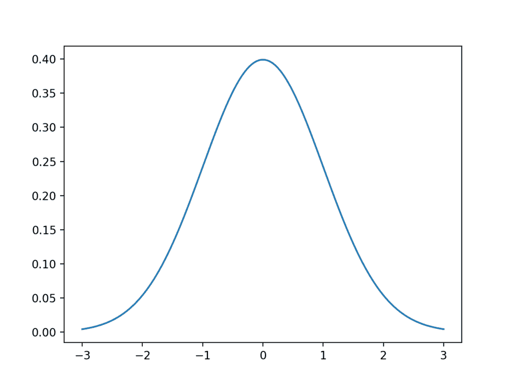
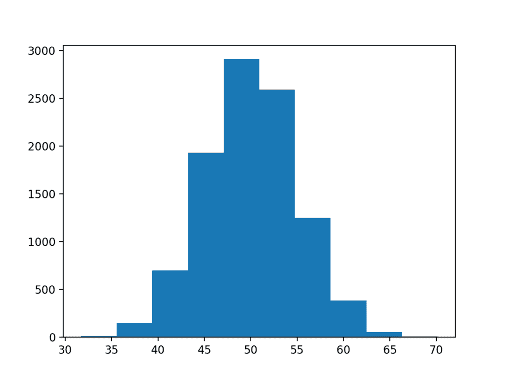
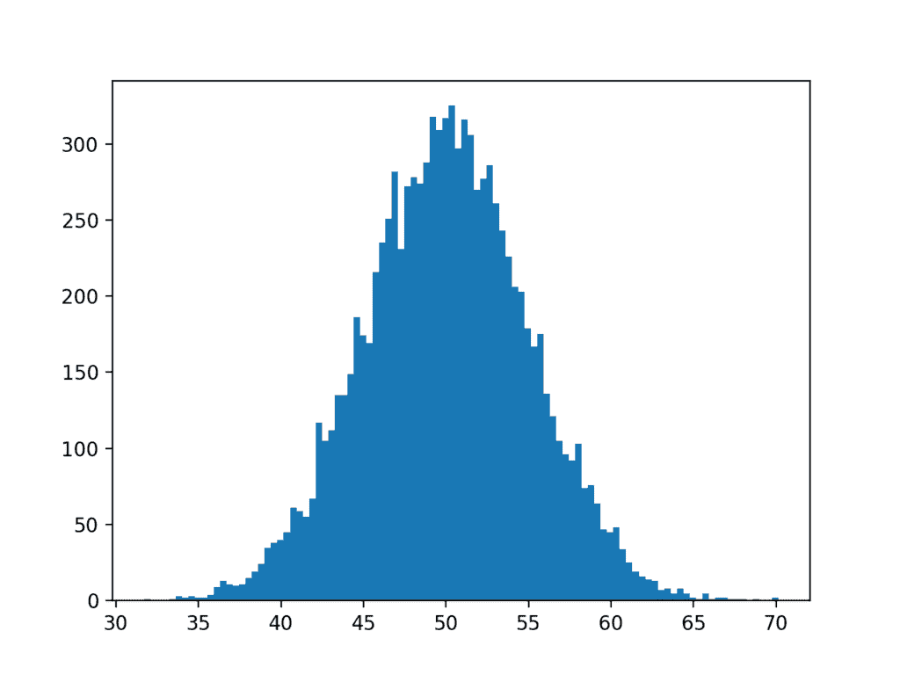
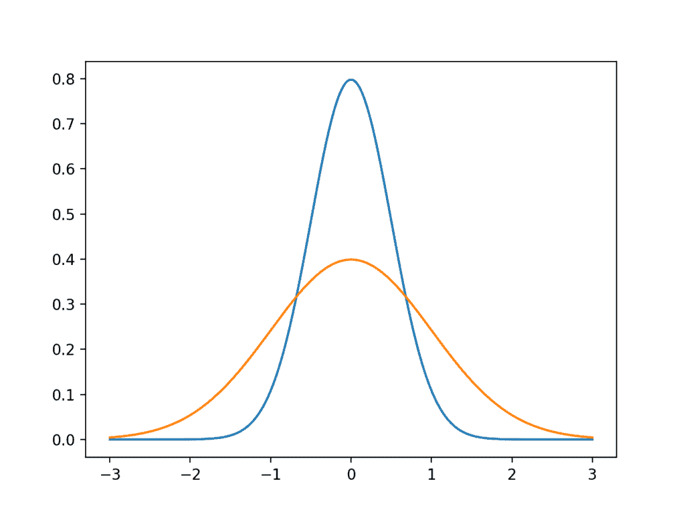

# 浅谈计算正态汇总统计量

> 原文： [https://machinelearningmastery.com/a-gentle-introduction-to-calculating-normal-summary-statistics/](https://machinelearningmastery.com/a-gentle-introduction-to-calculating-normal-summary-statistics/)

数据样本是来自更广泛人群的快照，可以从域中获取或由过程生成。

有趣的是，许多观察结果符合称为正态分布的常见模式或分布，或者更正式地说，符合高斯分布。关于高斯分布的知识很多，因此，存在可以与高斯数据一起使用的统计和统计方法的整个子场。

在本教程中，您将发现高斯分布，如何识别它，以及如何计算从此分布中提取的数据的关键摘要统计量。

完成本教程后，您将了解：

*   高斯分布描述了许多观察，包括在应用机器学习期间看到的许多观察。
*   分布的中心趋势是最可能的观察，并且可以从数据样本估计为平均值或中值。
*   方差是与分布中的平均值的平均偏差，并且可以从数据样本估计为方差和标准偏差。

让我们开始吧。


计算正态汇总统计的温和介绍
[John](https://www.flickr.com/photos/14733994@N02/3070769316/) 的照片，保留一些权利。

## 教程概述

本教程分为6个部分;他们是：

1.  高斯分布
2.  样本与人口
3.  测试数据集
4.  中心倾向
5.  方差
6.  描述高斯

## 高斯分布

数据分布是指绘制图形时的形状，例如直方图。

最常见且因此众所周知的连续值分布是钟形曲线。它被称为“_正常_”分布，因为它是许多数据所属的分布。它也被称为高斯分布，更正式地命名为Carl Friedrich Gauss。

因此，您将看到对正常分布或高斯的数据的引用，这些引用是可互换的，两者都指向同一事物：数据看起来像高斯分布。

具有高斯分布的观测的一些示例包括：

*   人的高度。
*   智商分数。
*   体温。

我们来看看正态分布。下面是一些生成和绘制理想化高斯分布的代码。

```py
# generate and plot an idealized gaussian
from numpy import arange
from matplotlib import pyplot
from scipy.stats import norm
# x-axis for the plot
x_axis = arange(-3, 3, 0.001)
# y-axis as the gaussian
y_axis = norm.pdf(x_axis, 0, 1)
# plot data
pyplot.plot(x_axis, y_axis)
pyplot.show()
```

运行该示例生成理想化高斯分布的图。

x轴是观察值，y轴是每次观察的频率。在这种情况下，大约0.0的观测值是最常见的，-3.0和3.0附近的观测值很少或不太可能。



高斯分布的线图

当数据是高斯数据或我们假设用于计算统计量的高斯分布时，它是有用的。这是因为非常好理解高斯分布。因此，统计领域的大部分内容专门用于此分发的方法。

值得庆幸的是，我们在机器学习中使用的许多数据通常符合高斯分布，例如我们可用于拟合模型的输入数据，以及对不同训练数据样本的模型的重复评估。

并非所有数据都是高斯数据，有时候通过查看数据的直方图或使用统计检验来检查是非常重要的。一些不符合高斯分布的观测实例包括：

*   人民的收入。
*   城市人口。
*   销售书籍。

## 样本与人口

我们可以想到由某个未知过程生成的数据。

我们收集的数据称为数据样本，而可以收集的所有可能数据称为总体。

*   **数据样本**：来自一组的观察的子集。
*   **数据人口**：来自一组的所有可能观察结果。

这是一个重要的区别，因为不同的统计方法用于样本与群体，在应用机器学习中，我们经常处理数据样本。如果您在谈论机器学习中的数据时阅读或使用“_群体_”这个词，那么它很可能意味着在统计方法方面的样本。

您将在机器学习中遇到的两个数据样本示例包括：

*   训练和测试数据集。
*   模型的表现分数。

使用统计方法时，我们通常只想使用样本中的观察结果来对群体进行声明。

两个明显的例子包括：

*   训练样本必须代表观察人口，以便我们能够拟合一个有用的模型。
*   测试样本必须代表观察人口，以便我们能够对模型技能进行无偏见的评估。

因为我们正在处理样本并对人口提出索赔，这意味着总有一些不确定性，理解和报告这种不确定性很重要。

## 测试数据集

在我们探索具有高斯分布的数据的一些重要汇总统计量之前，让我们首先生成一个我们可以使用的数据样本。

我们可以使用`randn()`NumPy函数生成从高斯分布中提取的随机数样本。

有两个关键参数定义任何高斯分布;它们是均值和标准差。稍后我们将更多地介绍这些参数，因为它们也是估计何时从未知高斯分布中获取数据的关键统计量。

_randn（）_函数将生成从高斯分布中绘制的指定数量的随机数（例如10,000），其均值为零，标准差为1.然后我们可以将这些数字缩放为高斯分布我们通过重缩放数字来选择。

通过添加所需的平均值（例如50）并将该值乘以标准偏差（5），可以使这一点保持一致。

```py
data = 5 * randn(10000) + 50
```

然后，我们可以使用直方图绘制数据集，并查找绘制数据的预期形状。

下面列出了完整的示例。

```py
# generate a sample of random gaussians
from numpy.random import seed
from numpy.random import randn
from matplotlib import pyplot
# seed the random number generator
seed(1)
# generate univariate observations
data = 5 * randn(10000) + 50
# histogram of generated data
pyplot.hist(data)
pyplot.show()
```

运行该示例将生成数据集并将其绘制为直方图。

我们几乎可以看到数据的高斯形状，但它是块状的。这突出了一个重点。

有时，数据不会是完美的高斯分布，但它会有类似高斯分布的分布。它几乎是高斯的，如果以不同的方式绘制，以某种方式缩放，或者如果收集更多数据，它可能会更高斯。

通常，在处理类似高斯的数据时，我们可以将其视为高斯数据并使用所有相同的统计工具并获得可靠的结果。



高斯数据集的直方图

在这个数据集的情况下，我们确实有足够的数据，并且绘图是块状的，因为绘图功能选择任意大小的桶来分割数据。我们可以选择一种不同的，更精细的方式来分割数据并更好地揭示基础高斯分布。

下面列出了更精确的绘图的更新示例。

```py
# generate a sample of random gaussians
from numpy.random import seed
from numpy.random import randn
from matplotlib import pyplot
# seed the random number generator
seed(1)
# generate univariate observations
data = 5 * randn(10000) + 50
# histogram of generated data
pyplot.hist(data, bins=100)
pyplot.show()
```

运行该示例，我们可以看到，选择100个数据分割可以更好地创建一个清晰显示数据高斯分布的图。

数据集是从完美高斯生成的，但数字是随机选择的，我们只选择10,000个观察样本。您可以看到，即使使用此受控设置，数据样本中也会出现明显的噪音。

这突出了另一个重点：我们应该总是期望我们的数据样本中存在一些噪音或限制。与纯底层分布相比，数据样本将始终包含错误。



具有更多区间的高斯数据集的直方图

## 集中趋势

分布的中心趋势是指分布中的中间或典型值。最常见或最可能的价值。

在高斯分布中，集中趋势称为均值，或者更正式地称为算术平均值，并且是定义任何高斯分布的两个主要参数之一。

样本的平均值计算为观察值之和除以样本中观察值的总数。

```py
mean = sum(data) / length(data)
```

它也以更紧凑的形式写成：

```py
mean = 1 / length(data) * sum(data)
```

我们可以通过在数组上使用`mean()`NumPy函数来计算样本的平均值。

```py
result = mean(data)
```

下面的示例在上一节中开发的测试数据集上演示了这一点。

```py
# calculate the mean of a sample
from numpy.random import seed
from numpy.random import randn
from numpy import mean
# seed the random number generator
seed(1)
# generate univariate observations
data = 5 * randn(10000) + 50
# calculate mean
result = mean(data)
print('Mean: %.3f' % result)
```

运行该示例计算并打印样本的平均值。

该样本的算术平均值的计算是对从中抽取样本的群体的基础高斯分布的参数的估计。作为估计，它将包含错误。

因为我们知道基础分布的真实均值为50，所以我们可以看到10,000个观测样本的估计值是合理准确的。

```py
Mean: 50.049
```

平均值很容易受到异常值的影响，即远离平均值的罕见值。这些可能是分布边缘或错误的合法罕见的观察。

此外，平均值可能会产生误导。计算另一个分布上的均值，例如均匀分布或功率分布，可能没有多大意义，因为尽管可以计算该值，但它将指代看似任意的预期值而不是分布的真正集中趋势。

在异常值或非高斯分布的情况下，计算的替代和常用的集中趋势是中值。

通过首先对所有数据进行排序然后在样本中定位中间值来计算中值。如果存在奇数个观测值，则这很简单。如果存在偶数个观测值，则将中值计算为中间两个观测值的平均值。

我们可以通过调用`median()`NumPy函数来计算数组样本的中位数。

```py
result = median(data)
```

下面的示例在测试数据集上演示了这一点。

```py
# calculate the median of a sample
from numpy.random import seed
from numpy.random import randn
from numpy import median
# seed the random number generator
seed(1)
# generate univariate observations
data = 5 * randn(10000) + 50
# calculate median
result = median(data)
print('Median: %.3f' % result)
```

运行该示例，我们可以看到中值是从样本计算并打印出来的。

结果与平均值没有太大差别，因为样本具有高斯分布。如果数据具有不同的（非高斯）分布，则中值可能与均值非常不同，并且可能更好地反映潜在人口的集中趋势。

```py
Median: 50.042
```

## 方差

分布的方差指的是观察结果与平均值变化或不同的平均值。

将方差视为衡量分布扩散的指标是有用的。低方差将具有围绕均值分组的值（例如，窄钟形），而高方差将具有从均值分布的值（例如，宽钟形）。

我们可以通过一个例子，通过绘制具有低和高方差的理想高斯来证明这一点。下面列出了完整的示例。

```py
# generate and plot gaussians with different variance
from numpy import arange
from matplotlib import pyplot
from scipy.stats import norm
# x-axis for the plot
x_axis = arange(-3, 3, 0.001)
# plot low variance
pyplot.plot(x_axis, norm.pdf(x_axis, 0, 0.5))
# plot high variance
pyplot.plot(x_axis, norm.pdf(x_axis, 0, 1))
pyplot.show()
```

运行该示例绘制了两个理想化的高斯分布：蓝色具有围绕均值分组的低方差，而橙色具有更高的方差和更多的分布。



具有低和高方差的高斯分布的线图

从高斯分布中提取的数据样本的方差计算为样本均值中样本中每个观察值的平均平方差：

```py
variance = 1 / (length(data) - 1) * sum(data[i] - mean(data))^2
```

方差通常表示为 _s ^ 2_ ，清楚地显示度量的平方单位。您可以从观察数量中看到没有（ - 1）的等式，这是对总体而不是样本的方差的计算。

我们可以使用 _var（）_函数计算NumPy中数据样本的方差。

下面的示例演示了计算测试问题的方差。

```py
# calculate the variance of a sample
from numpy.random import seed
from numpy.random import randn
from numpy import var
# seed the random number generator
seed(1)
# generate univariate observations
data = 5 * randn(10000) + 50
# calculate variance
result = var(data)
print('Variance: %.3f' % result)
```

运行该示例计算并打印方差。

```py
Variance: 24.939
```

很难解释方差，因为单位是观测值的平方单位。我们可以通过取结果的平方根将单位返回到观测的原始单位。

例如，24.939的平方根约为4.9。

通常，当总结高斯分布的扩展时，使用方差的平方根来描述。这称为标准偏差。标准偏差和均值是指定任何高斯分布所需的两个关键参数。

我们可以看到4.9的值非常接近于为测试问题创建样本时指定的标准偏差的值5。

我们可以将方差计算包装在平方根中以直接计算标准偏差。

```py
standard deviation = sqrt(1 / (length(data) - 1) * sum(data[i] - mean(data))^2)
```

标准偏差通常写为s或希腊小写字母sigma。

可以通过 _std（）_函数直接在NumPy中计算标准偏差。

下面的示例演示了测试问题的标准偏差的计算。

```py
# calculate the standard deviation of a sample
from numpy.random import seed
from numpy.random import randn
from numpy import std
# seed the random number generator
seed(1)
# generate univariate observations
data = 5 * randn(10000) + 50
# calculate standard deviation
result = std(data)
print('Standard Deviation: %.3f' % result)
```

运行该示例计算并打印样本的标准偏差。该值与方差的平方根匹配，并且非常接近5.0，即问题定义中指定的值。

```py
Standard Deviation: 4.994
```

可以针对非高斯分布计算方差的度量，但是通常需要识别分布，以便可以计算特定于该分布的特定方差度量。

## 描述高斯

在应用机器学习中，您通常需要报告算法的结果。

也就是说，报告模型对样本外数据的估计技能。

这通常通过报告k折交叉验证或一些其他重复取样程序的平均表现来完成。

在报告模型技能时，您实际上总结了技能分数的分布，并且很可能从高斯分布中得出技能分数。

通常只报告模型的平均表现。这将隐藏模型技能分布的另外两个重要细节。

至少我建议报告模型分数的高斯分布和样本大小的两个参数。理想情况下，确认模型技能分数确实是高斯分数或看起来高斯足以防止报告高斯分布的参数也是一个好主意。

这很重要，因为技能分数的分布可以由读者重建，并且可能与未来相同问题的模型技能进行比较。

## 扩展

本节列出了一些扩展您可能希望探索的教程的想法。

*   开发自己的测试问题并计算集中趋势和方差测量。
*   开发一个函数来计算给定数据样本的摘要报告。
*   加载并汇总标准机器学习数据集的变量

如果你探索任何这些扩展，我很想知道。

## 进一步阅读

如果您希望深入了解，本节将提供有关该主题的更多资源。

### 蜜蜂

*   [scipy.stats.norm（）API](https://docs.scipy.org/doc/scipy/reference/generated/scipy.stats.norm.html)
*   [numpy.random.seed（）API](https://docs.scipy.org/doc/numpy/reference/generated/numpy.random.seed.html)
*   [numpy.random.randn（）API](https://docs.scipy.org/doc/numpy/reference/generated/numpy.random.randn.html)
*   [matplotlib.pyplot.hist（）API](https://matplotlib.org/api/_as_gen/matplotlib.pyplot.hist.html)
*   [numpy.mean（）API](https://docs.scipy.org/doc/numpy/reference/generated/numpy.mean.html)
*   [numpy.median（）API](https://docs.scipy.org/doc/numpy/reference/generated/numpy.median.html)
*   [numpy.var（）API](https://docs.scipy.org/doc/numpy/reference/generated/numpy.var.html)
*   [numpy.std（）API](https://docs.scipy.org/doc/numpy/reference/generated/numpy.std.html)

### 用品

*   [维基百科上的正态分布](https://en.wikipedia.org/wiki/Normal_distribution)
*   [维基百科上的中心趋势](https://en.wikipedia.org/wiki/Central_tendency)
*   [维基百科上的算术平均值](https://en.wikipedia.org/wiki/Arithmetic_mean)
*   [维基百科上的中位数](https://en.wikipedia.org/wiki/Median)
*   [维基百科上的差异](https://en.wikipedia.org/wiki/Variance)
*   [维基百科的标准偏差](https://en.wikipedia.org/wiki/Standard_deviation)

## 摘要

在本教程中，您发现了高斯分布，如何识别它，以及如何计算从此分布中提取的数据的关键摘要统计量。

具体来说，你学到了：

*   高斯分布描述了许多观察，包括在应用机器学习期间看到的许多观察。
*   分布的中心趋势是最可能的观察，并且可以从数据样本估计为平均值或中值。
*   方差是与分布中的平均值的平均偏差，并且可以从数据样本估计为方差和标准偏差。

你有任何问题吗？
在下面的评论中提出您的问题，我会尽力回答。