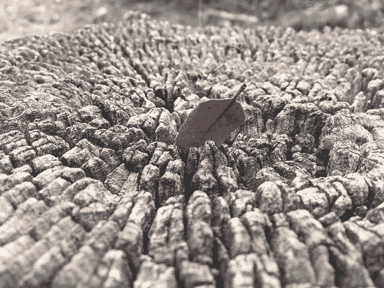
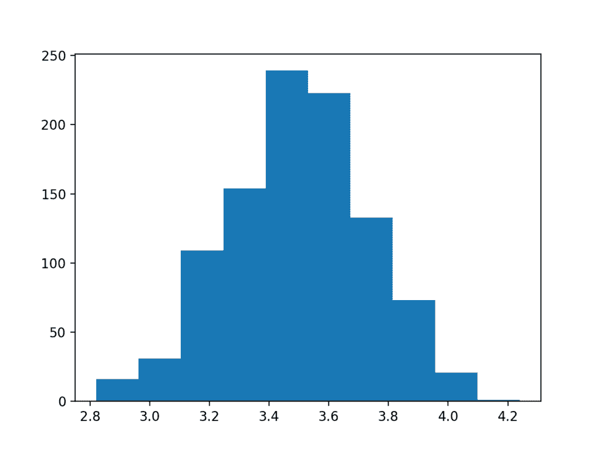

# 浅谈机器学习的中心极限定理

> 原文： [https://machinelearningmastery.com/a-gentle-introduction-to-the-central-limit-theorem-for-machine-learning/](https://machinelearningmastery.com/a-gentle-introduction-to-the-central-limit-theorem-for-machine-learning/)

中心极限定理是经常被引用但却被误解的统计和机器学习的支柱。

它经常与大数定律混淆。虽然这个定理对于初学者来说似乎有些深奥，但它对于我们如何以及为什么能够推断机器学习模型的技能有重要意义，例如一个模型在统计上是否优于另一个模型以及模型技能的置信区间。

在本教程中，您将发现中心极限定理以及统计和概率这一重要支柱对应用机器学习的影响。

完成本教程后，您将了解：

*   中心极限定理将样本均值分布的形状描述为高斯分布，这是统计数据所知的分布。
*   如何在Python中开发一个模拟骰子卷的例子来演示中心极限定理。
*   如何利用中心极限定理和高斯分布知识对应用机器学习中的模型表现进行推理。

让我们开始吧。



机器学习中心极限定理的温和介绍
[Alan Levine](https://www.flickr.com/photos/cogdog/36235522565/) 的照片，保留一些权利。

## 教程概述

本教程分为3个部分;他们是：

1.  中心极限定理
2.  用骰子工作的例子
3.  对机器学习的影响

## 中心极限定理

中心极限定理，简称CLT，是统计和概率领域的重要发现和支柱。

起初看起来有点深奥，所以请坚持下去。事实证明，这一发现对于在应用机器学习中做出推论至关重要。

该定理指出，随着样本的大小增加，多个样本的均值分布将接近高斯分布。

让我们打破这个。

我们可以想象进行试验并获得结果或观察。我们可以再次重复试验并获得一个新的独立观察。收集在一起，多个观察代表观察样本。

样本是来自更广泛人群的一组观察结果，这些观察结果可以通过试验进行。

*   **观察**：来自一次实验的试验结果。
*   **样本**：从单独的独立试验中收集的一组结果。
*   **人口**：从试验中可以看到的所有可能观察的空间。

如果我们计算样本的平均值，它将是人口分布均值的估计值。但是，像任何估计一样，这将是错误的并且将包含一些错误。如果我们绘制多个独立样本并计算其均值，则这些均值的分布将形成高斯分布。

重要的是，每次导致观察的试验都是独立的，并以相同的方式进行。这是为了确保样本来自相同的基础人口分布。更正式地说，这种期望被称为[独立且相同分布的](https://en.wikipedia.org/wiki/Independent_and_identically_distributed_random_variables)或iid。

首先，中心极限定理是令人印象深刻的，尤其是无论我们从中抽取样本的人口分布的形状如何都会出现这种情况。它表明，估计总体均值的误差分布符合统计领域非常了解的分布。

其次，随着从群体中抽取的样本的大小增加，这种高斯分布的估计将更准确。这意味着如果我们使用我们对高斯分布的一般知识来开始推断从群体中抽取样本的方法，那么随着我们增加样本量，这些推论将变得更有用。

中心限制中心极限定理的一个有趣含义是，一个非常聪明的科学家曾经提到过，你可以用它来生成高斯随机数。您可以生成一致的随机整数，将它们的组合在一起，并且总和的结果将是高斯的。请记住，均值只是样本的归一化总和。与其他方法（如Box-Muller方法）相比，它是一种生成随机高斯变量的较慢方法，但该定理的清晰（和巧妙）应用。

### 大数定律

中心极限定理经常与初学者的大数定律相混淆。

大数定律是另一种与统计学不同的定理。它更简单，因为它表明随着样本的大小增加，样本平均值的估计值将更准确。

中心极限定理没有说明单个样本均值的任何内容;相反，它更广泛，并说明了样本均值的形状或分布。

大数定律是直观的。这就是为什么我们认为收集更多数据将导致来自该领域的更具代表性的观测样本。该定理支持这种直觉。

中心极限定理不直观。相反，我们可以利用这一发现来对样本手段提出主张。

## 用骰子工作的例子

我们可以通过一个涉及模具轧制的实例来使中心极限定理具体化。

请记住，骰子是一个立方体，每边的数字不同，从1到6。每个号码都有一个六分之一的可能性。考虑到相同的可能性，从骰子卷开始的数字的分布是均匀的。

我们可以使用`randint()`NumPy函数来生成1到6之间的特定数量的随机骰子卷（例如50）。

```py
# generate a sample of die rolls
rolls = randint(1, 7, 50)
```

下面列出了完整的示例。

```py
# generate random dice rolls
from numpy.random import seed
from numpy.random import randint
from numpy import mean
# seed the random number generator
seed(1)
# generate a sample of die rolls
rolls = randint(1, 7, 50)
print(rolls)
print(mean(rolls))
```

运行该示例生成并打印50个模具卷的样本和样本的平均值。

我们知道分布的平均值是3.5，计算为（1 + 2 + 3 + 4 + 5 + 6）/ 6或21/6。

我们可以看到样本的平均值略有错误，这是预期的，因为它是对总体平均值的估计。

```py
[6 4 5 1 2 4 6 1 1 2 5 6 5 2 3 5 6 3 5 4 5 3 5 6 3 5 2 2 1 6 2 2 6 2 2 1 5
 2 1 1 6 4 3 2 1 4 6 2 2 4]
3.44
```

这是将模拟模具滚动50次的结果。

然后我们可以多次重复此过程，例如1,000。这将给我们1000个样本手段的结果。根据中心极限定理，这些样本均值的分布将是高斯分布。

下面的示例执行此实验并绘制样本均值的结果分布。

```py
# demonstration of the central limit theorem
from numpy.random import seed
from numpy.random import randint
from numpy import mean
from matplotlib import pyplot
# seed the random number generator
seed(1)
# calculate the mean of 50 dice rolls 1000 times
means = [mean(randint(1, 7, 50)) for _ in range(1000)]
# plot the distribution of sample means
pyplot.hist(means)
pyplot.show()
```

运行该示例将创建样本均值的直方图。

我们可以从分布的形状看出分布是高斯分布。值得注意的是，样本中的误差量意味着我们可以在50个骰子卷的1,000次试验中看到。

此外，中心极限定理还指出，随着每个样本的大小（在这种情况下为50）增加，则样本装置将接近高斯分布越好。



来自骰子卷的样本均值的直方图

## 对机器学习的影响

中心极限定理在应用机器学习中具有重要意义。

该定理确实为线性回归等线性算法提供了解决方案，但并未通过数值优化方法求解人工神经网络等奇异方法。相反，我们必须使用实验来观察和记录算法的行为，并使用统计方法来解释它们的结果。

我们来看两个重要的例子。

### 意义测试

为了推断模型的技能与另一个模型的技能相比，我们必须使用诸如统计显着性测试之类的工具。

这些工具估计模型技能分数的两个样本来自相同或不同的模型技能分数的未知基础分布的可能性。如果看起来样本是从相同的群体中抽取的，那么假设模型技能之间没有差异，并且任何实际差异都归因于统计噪声。

像这样做推理声明的能力是由于中心极限定理和我们对高斯分布的了解以及两个样本均值成为样本均值的相同高斯分布的一部分的可能性。

### 置信区间

一旦我们训练了最终模型，我们可能希望推断该模型在实践中的技巧程度。

这种不确定性的表示称为置信区间。

我们可以开发多个独立（或接近独立）的模型精度评估，以产生一组候选技能估计。这些技能估计的平均值将是对问题的模型技能的真实潜在估计的估计（有错误）。

由于知道样本均值将是中心极限定理的高斯分布的一部分，我们可以使用高斯分布的知识来估计基于样本大小的样本均值的可能性，并计算围绕该样本大小的所需置信区间。模特的技巧。

## 扩展

本节列出了一些扩展您可能希望探索的教程的想法。

*   在应用机器学习中建议两个额外区域，其中中心极限定理可能是相关的。
*   实现一个函数，用于生成随机高斯数，利用中心极限定理和从均匀分布中得出的数字。
*   更新骰子卷的演示以演示样本大小与样本均值的高斯分布的保真度之间的关系。

如果你探索任何这些扩展，我很想知道。

## 进一步阅读

如果您希望深入了解，本节将提供有关该主题的更多资源。

### API

*   [numpy.random.seed（）API](https://docs.scipy.org/doc/numpy/reference/generated/numpy.random.seed.html)
*   [numpy.random.randint（）API](https://docs.scipy.org/doc/numpy/reference/generated/numpy.random.randint.html)
*   [numpy.mean（）API](https://docs.scipy.org/doc/numpy/reference/generated/numpy.mean.html)

### 用品

*   [维基百科上的中心极限定理](https://en.wikipedia.org/wiki/Central_limit_theorem)
*   [维基百科上的中心极限定理图](https://en.wikipedia.org/wiki/Illustration_of_the_central_limit_theorem)
*   [维基百科上的大数定律](https://en.wikipedia.org/wiki/Law_of_large_numbers)

## 摘要

在本教程中，您发现了中心极限定理以及统计和概率这一重要支柱对应用机器学习的影响。

具体来说，你学到了：

*   中心极限定理将样本均值分布的形状描述为高斯分布，这是统计数据所知的分布。
*   如何在Python中开发一个模拟骰子卷的例子来演示中心极限定理。
*   如何利用中心极限定理和高斯分布知识对应用机器学习中的模型表现进行推理。

你有任何问题吗？
在下面的评论中提出您的问题，我会尽力回答。