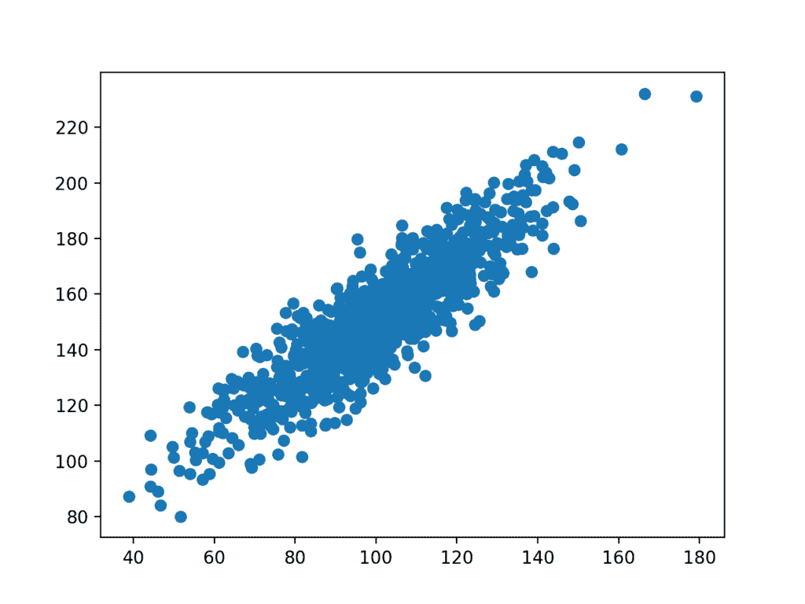

# 如何使用相关来理解变量之间的关系

> 原文： [https://machinelearningmastery.com/how-to-use-correlation-to-understand-the-relationship-between-variables/](https://machinelearningmastery.com/how-to-use-correlation-to-understand-the-relationship-between-variables/)

数据集中的变量之间可能存在复杂且未知的关系。

发现和量化数据集中变量相互依赖的程度非常重要。这些知识可以帮助您更好地准备数据，以满足机器学习算法的期望，例如线性回归，其表现会因这些相互依赖性而降低。

在本教程中，您将发现相关性是变量之间关系的统计汇总，以及如何为不同类型的变量和关系计算变量。

完成本教程后，您将了解：

*   如何计算协方差矩阵以总结两个或多个变量之间的线性关系。
*   如何计算Pearson相关系数来总结两个变量之间的线性关系。
*   如何计算Spearman的相关系数来总结两个变量之间的单调关系。

让我们开始吧。

*   **更新May / 2018** ：更新了协方差符号的描述（感谢 [Fulya](https://twitter.com/Fulyaku/status/990662656406237190) ）。


如何使用相关来理解变量之间的关系
照片由 [Fraser Mummery](https://www.flickr.com/photos/73014677@N05/6590298935/) ，保留一些权利。

## 教程概述

本教程分为5个部分;他们是：

1.  什么是相关性？
2.  测试数据集
3.  协方差
4.  皮尔逊的相关性
5.  斯皮尔曼的相关性

## 什么是相关性？

数据集中的变量可能由于许多原因而相关。

例如：

*   一个变量可能导致或依赖于另一个变量的值。
*   一个变量可以与另一个变量轻微关联。
*   两个变量可能取决于第三个未知变量。

它可用于数据分析和建模，以更好地理解变量之间的关系。两个变量之间的统计关系称为它们的相关性。

相关性可能是正的，意味着两个变量在相同的方向上移动，或者是负的，这意味着当一个变量的值增加时，其他变量的值会减少。相关也可以是神经的或零，意味着变量是不相关的。

*   **正相关**：两个变量在同一方向上变化。
*   **中性相关**：变量变化没有关系。
*   **负相关**：变量方向相反。

如果两个或多个变量紧密相关，某些算法的表现可能会恶化，称为多重共线性。一个例子是线性回归，其中应删除一个违规的相关变量，以提高模型的技能。

我们也可能对输入变量与输出变量之间的相关性感兴趣，以便深入了解哪些变量可能或可能不与开发模型的输入相关。

关系的结构可以是已知的，例如，它可能是线性的，或者我们可能不知道两个变量之间是否存在关系或它可能采取什么样的结构。根据关于变量的关系和分布的已知信息，可以计算不同的相关分数。

在本教程中，我们将查看具有高斯分布和线性关系的变量的一个分数，以及不假设分布的另一个分数，并将报告任何单调（增加或减少）关系。

## 测试数据集

在我们查看关联方法之前，让我们定义一个可用于测试方法的数据集。

我们将生成两个具有强正相关的两个变量的1,000个样本。第一个变量是从高斯分布中抽取的随机数，平均值为100，标准差为20.第二个变量是来自第一个变量的值，高斯噪声加上平均值为50，标准差为10 。

我们将使用 _randn（）_函数生成平均值为0且标准差为1的随机高斯值，然后将结果乘以我们自己的标准差并添加平均值以将值转换为首选范围。

伪随机数生成器被播种以确保每次运行代码时我们都得到相同的数字样本。

```py
# generate related variables
from numpy import mean
from numpy import std
from numpy.random import randn
from numpy.random import seed
from matplotlib import pyplot
# seed random number generator
seed(1)
# prepare data
data1 = 20 * randn(1000) + 100
data2 = data1 + (10 * randn(1000) + 50)
# summarize
print('data1: mean=%.3f stdv=%.3f' % (mean(data1), std(data1)))
print('data2: mean=%.3f stdv=%.3f' % (mean(data2), std(data2)))
# plot
pyplot.scatter(data1, data2)
pyplot.show()
```

首先运行该示例打印每个变量的均值和标准差。

```py
data1: mean=100.776 stdv=19.620
data2: mean=151.050 stdv=22.358
```

创建两个变量的散点图。因为我们设计了数据集，所以我们知道这两个变量之间存在关系。当我们检查生成的散点图时，我们可以看到增加的趋势。



测试相关数据集的散点图

在我们考虑计算一些相关性分数之前，我们首先要看一个重要的统计构建块，称为协方差。

## 协方差

变量可以通过线性关系相关联。这是一种在两个数据样本中始终相加的关系。

这种关系可以归结为两个变量，称为协方差。它被计算为每个样本的值之间的乘积平均值，其中值没有居中（减去它们的平均值）。

样本协方差的计算如下：

```py
cov(X, Y) = (sum (x - mean(X)) * (y - mean(Y))) * 1/(n-1)
```

在计算中使用均值表明每个数据样本需要具有高斯分布或类高斯分布。

协方差的符号可以解释为两个变量是在相同方向上变化（正）还是在不同方向上变化（负）。协方差的大小不容易解释。协方差值为零表示两个变量完全独立。

`cov()`NumPy函数可用于计算两个或更多个变量之间的协方差矩阵。

```py
covariance = cov(data1, data2)
```

矩阵的对角线包含每个变量与其自身之间的协方差。矩阵中的其他值表示两个变量之间的协方差;在这种情况下，剩下的两个值是相同的，因为我们只计算两个变量的协方差。

我们可以在测试问题中计算两个变量的协方差矩阵。

下面列出了完整的示例。

```py
# calculate the covariance between two variables
from numpy.random import randn
from numpy.random import seed
from numpy import cov
# seed random number generator
seed(1)
# prepare data
data1 = 20 * randn(1000) + 100
data2 = data1 + (10 * randn(1000) + 50)
# calculate covariance matrix
covariance = cov(data1, data2)
print(covariance)
```

协方差和协方差矩阵广泛用于统计和多变量分析，以表征两个或多个变量之间的关系。

运行该示例计算并打印协方差矩阵。

因为数据集是根据从高斯分布绘制的每个变量而设计的，并且变量是线性相关的，所以协方差是描述关系的合理方法。

两个变量之间的协方差为389.75。我们可以看到它是积极的，表明变量的变化方向与我们预期的相同。

```py
[[385.33297729 389.7545618 ]
 [389.7545618  500.38006058]]
```

作为统计工具的协方差问题在于解释具有挑战性。这导致我们接下来的Pearson相关系数。

## 皮尔逊的相关性

Pearson相关系数（以Karl Pearson命名）可用于总结两个数据样本之间的线性关系的强度。

Pearson相关系数计算为两个变量的协方差除以每个数据样本的标准差的乘积。这是两个变量之间协方差的归一化，以给出可解释的分数。

```py
Pearson's correlation coefficient = covariance(X, Y) / (stdv(X) * stdv(Y))
```

在计算中使用均值和标准偏差表明需要两个数据样本具有高斯分布或类高斯分布。

计算结果，相关系数可以解释为理解关系。

系数返回介于-1和1之间的值，表示从完全负相关到完全正相关的相关限制。值0表示没有相关性。必须解释该值，其中低于-0.5或高于0.5的值通常表示显着的相关性，低于这些值的值表明相关性较不显着。

`pearsonr()`SciPy函数可用于计算具有相同长度的两个数据样本之间的Pearson相关系数。

我们可以计算出测试问题中两个变量之间的相关性。

The complete example is listed below.

```py
# calculate the Pearson's correlation between two variables
from numpy.random import randn
from numpy.random import seed
from scipy.stats import pearsonr
# seed random number generator
seed(1)
# prepare data
data1 = 20 * randn(1000) + 100
data2 = data1 + (10 * randn(1000) + 50)
# calculate Pearson's correlation
corr, _ = pearsonr(data1, data2)
print('Pearsons correlation: %.3f' % corr)
```

运行该示例计算并打印Pearson的相关系数。

我们可以看到这两个变量是正相关的，相关系数是0.8。这表明高水平的相关性，例如值大于0.5且接近1.0。

```py
Pearsons correlation: 0.888
```

Pearson相关系数可用于评估两个以上变量之间的关系。

这可以通过计算数据集中每对变量之间的关系矩阵来完成。结果是一个称为相关矩阵的对称矩阵，沿对角线的值为1.0，因为每列总是与自身完全相关。

## 斯皮尔曼的相关性

两个变量可能通过非线性关系相关，使得变量分布中的关系更强或更弱。

此外，所考虑的两个变量可以具有非高斯分布。

在这种情况下，Spearman的相关系数（以Charles Spearman命名）可用于总结两个数据样本之间的强度。如果变量之间存在线性关系，也可以使用这种关系测试，但功率稍低（例如，可能导致系数得分较低）。

与Pearson相关系数一样，对于完全负相关的变量，得分在-1和1之间，并且分别完全正相关。

不是使用样本本身的协方差和标准偏差来计算系数，而是根据每个样本的值的相对等级计算这些统计数据。这是非参数统计中常用的方法，例如统计方法，我们不假设数据的分布，如高斯。

```py
Spearman's correlation coefficient = covariance(rank(X), rank(Y)) / (stdv(rank(X)) * stdv(rank(Y)))
```

尽管假设了单调关系，但不假设变量之间存在线性关系。这是两个变量之间增加或减少关系的数学名称。

如果您不确定两个变量之间的分布和可能的关系，Spearman相关系数是一个很好的工具。

`spearmanr()`SciPy函数可用于计算具有相同长度的两个数据样本之间的Spearman相关系数。

We can calculate the correlation between the two variables in our test problem.

The complete example is listed below.

```py
# calculate the spearmans's correlation between two variables
from numpy.random import randn
from numpy.random import seed
from scipy.stats import spearmanr
# seed random number generator
seed(1)
# prepare data
data1 = 20 * randn(1000) + 100
data2 = data1 + (10 * randn(1000) + 50)
# calculate spearman's correlation
corr, _ = spearmanr(data1, data2)
print('Spearmans correlation: %.3f' % corr)
```

运行该示例计算并打印Spearman的相关系数。

我们知道数据是高斯数，并且变量之间的关系是线性的。然而，非参数基于秩的方法显示0.8之间的强相关性。

```py
Spearmans correlation: 0.872
```

与Pearson相关系数一样，可以对数据集中的每个变量成对地计算系数，以给出用于查看的相关矩阵。

## 扩展

本节列出了一些扩展您可能希望探索的教程的想法。

*   生成具有正负关系的自己的数据集，并计算两个相关系数。
*   编写函数来计算所提供数据集的Pearson或Spearman相关矩阵。
*   加载标准机器学习数据集并计算所有实值变量对之间的相关系数。

如果你探索任何这些扩展，我很想知道。

## 进一步阅读

如果您希望深入了解，本节将提供有关该主题的更多资源。

### 帖子

*   [对NumPy](https://machinelearningmastery.com/introduction-to-expected-value-variance-and-covariance/) 的期望值，方差和协方差的温和介绍
*   [自相关和部分自相关的温和介绍](https://machinelearningmastery.com/gentle-introduction-autocorrelation-partial-autocorrelation/)

### API

*   [numpy.random.seed（）API](https://docs.scipy.org/doc/numpy/reference/generated/numpy.random.seed.html)
*   [numpy.random.randn（）API](https://docs.scipy.org/doc/numpy/reference/generated/numpy.random.randn.html)
*   [numpy.mean（）API](https://docs.scipy.org/doc/numpy/reference/generated/numpy.mean.html)
*   [numpy.std（）API](https://docs.scipy.org/doc/numpy/reference/generated/numpy.std.html)
*   [matplotlib.pyplot.scatter（）API](https://matplotlib.org/api/_as_gen/matplotlib.pyplot.scatter.html)
*   [numpy.cov（）API](https://docs.scipy.org/doc/numpy/reference/generated/numpy.cov.html)
*   [scipy.stats.pearsonr（）API](https://docs.scipy.org/doc/scipy/reference/generated/scipy.stats.pearsonr.html)
*   [scipy.stats.spearmanr（）API](https://docs.scipy.org/doc/scipy/reference/generated/scipy.stats.spearmanr.html)

### 用品

*   [维基百科的相关性和依赖性](https://en.wikipedia.org/wiki/Correlation_and_dependence)
*   [维基百科上的协方差](https://en.wikipedia.org/wiki/Covariance)
*   [维基百科的Pearson相关系数](https://en.wikipedia.org/wiki/Pearson_correlation_coefficient)
*   [Spearman在维基百科上的等级相关系数](https://en.wikipedia.org/wiki/Spearman%27s_rank_correlation_coefficient)
*   [维基百科排名](https://en.wikipedia.org/wiki/Ranking)

## 摘要

在本教程中，您发现相关性是变量之间关系的统计汇总，以及如何为不同类型的变量和关系计算变量。

具体来说，你学到了：

*   如何计算协方差矩阵以总结两个或多个变量之间的线性关系。
*   如何计算Pearson相关系数来总结两个变量之间的线性关系。
*   如何计算Spearman的相关系数来总结两个变量之间的单调关系。

你有任何问题吗？
在下面的评论中提出您的问题，我会尽力回答。