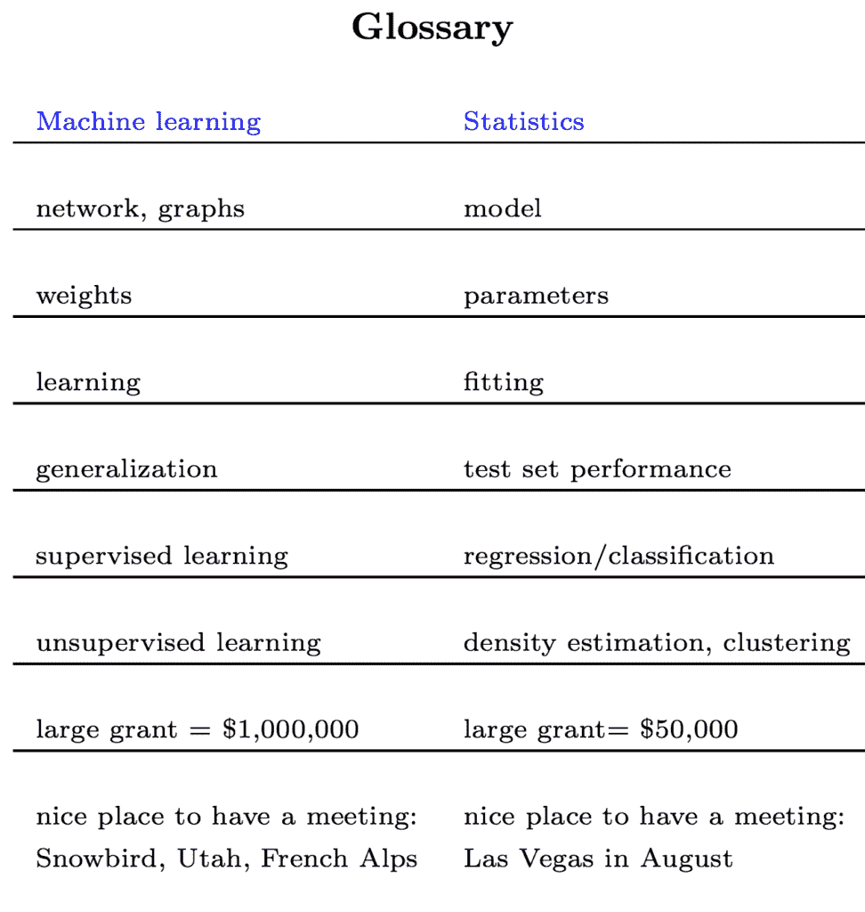

# 应用统计学与机器学习的密切关系

> 原文： [https://machinelearningmastery.com/relationship-between-applied-statistics-and-machine-learning/](https://machinelearningmastery.com/relationship-between-applied-statistics-and-machine-learning/)

机器学习从业者具有算法传统，并且注重结果和模型技能，而不是其他关注点，例如模型可解释性。

统计学家在应用统计和统计学习的名义下处理大致相同类型的建模问题。从数学背景来看，他们更关注模型的行为和预测的可解释性。

两种解决同一问题的方法之间的密切关系意味着两个领域都有很多可以相互学习的东西。统计学家需要考虑在经典的“_两种文化_”论文中提出的算法方法。机器学习从业者也必须注意，保持开放的心态，并从应用统计学中学习术语和相关方法。

在这篇文章中，您将发现机器学习和统计学习是两个密切相关但对同一问题的不同观点。

阅读这篇文章后，你会知道：

*   “_机器学习_”和“_预测性建模_”是关于建模数据的计算机科学观点，侧重于算法方法和模型技能。
*   “_统计_”和“_统计学习_”是建模数据的数学视角，侧重于数据模型和拟合优度。
*   机器学习从业者必须保持开放的思维并利用方法，并从应用统计和统计学习的密切相关领域中理解术语。

让我们开始吧。

应用统计与机器学习之间的密切关系
[James Loesch](https://www.flickr.com/photos/jal33/39234165402/) 的照片，保留一些权利。

## 机器学习

机器学习是人工智能的一个子领域，与更广泛的计算机科学领域有关。

在开发机器学习模型以做出预测时，重点关注算法，代码和结果。

机器学习比开发模型更广泛，以便做出预测，正如Tom Mitchell在1997年经典教科书中的定义所示。

> 机器学习领域涉及如何构建自动改进经验的计算机程序的问题。

- 第xv页，[机器学习](https://amzn.to/2pXYSA6)，1997年。

在这里，我们可以看到，从研究的角度来看，机器学习实际上是用计算机程序学习的研究。事实上，这些学习程序中的一些对于预测性建模问题很有用，而实际上有些已经从其他领域借用，例如统计学。

线性回归就是一个很好的例子。它是一种超过一个世纪的方法，来自（当时：新生）统计领域，用于将线或平面拟合到实值数据。从机器学习的角度来看，我们将其视为一个学习权重（系数）的系统，以响应来自域的示例。

在人工智能和机器学习领域已经开发了许多方法，有时由统计学家开发，这些方法对于预测性建模的任务非常有用。一个很好的例子是分类和回归树，它们与统计学中的经典方法没有相似之处。

## 预测性建模

从业者的机器学习的有用部分可以称为预测性建模。

这显然忽略了统计和机器学习之间的区别。它还消除了统计学（理解数据）和机器学习（理解软件学习）这些更广泛的目标，并且只顾其名称所暗示的问题，开发模型做出预测。

> 术语预测性建模可能会引起诸如机器学习，模式识别和数据挖掘之类的关联。实际上，这些关联是恰当的，这些术语所暗示的方法是预测性建模过程的一个组成部分。但预测性建模不仅仅包括用于揭示数据中模式的工具和技术。预测性建模的实践定义了开发模型的过程，我们可以通过这种方式理解和量化模型对未来未见数据的预测准确率。

- 第vii页， [Applied Predictive Modeling](https://amzn.to/2InAS0T) ，2013

预测性建模提供激光聚焦于开发模型，目的是在某些模型技能测量方面获得最佳结果。这种务实的方法通常意味着以最高技能或最小错误的形式获得的结果是以牺牲几乎所有其他方式为代价的。

我们称之为流程，机器学习或预测性建模并不重要。从某种意义上说，它是营销和群体识别。获得成果和提供价值更重要的是从业者。

## 统计学习

使用数据集和开发预测模型的过程也是统计学中的一项任务。

传统上统计学家可能将该活动称为应用统计。

统计学是数学的一个子领域，这种遗产提供了一个定义明确，精心挑选的方法的焦点。需要不仅要了解选择特定模型的原因，还要了解具体预测的方式和原因。

从这个角度来看，模型技能通常很重要，但不如模型的可解释性重要。

尽管如此，现代统计学家已将新视角作为应用统计学的子领域，称为“_统计学习_”。它可能是“_预测性建模_”的统计等效，其中模型技能很重要，但也许更加强调仔细选择和引入学习模型。

> 统计学习是指用于建模和理解复杂数据集的一组工具。它是最近开发的统计学领域，与计算机科学，特别是机器学习的并行发展相结合。

- 第7页， [2013年R中的应用统计学习导论](https://amzn.to/2Gvhkqz)。

我们可以看到统计量中的字段和子字段之间存在大量的想法。机器学习从业者必须了解机器学习和基于统计的问题方法。鉴于在两个领域中使用不同的术语，这一点尤为重要。

在他的统计学课程中， [Rob Tibshirani](http://statweb.stanford.edu/~tibs/) ，一位也参与机器学习的统计学家，提供[词汇表](http://statweb.stanford.edu/~tibs/stat315a/glossary.pdf)，将统计学中的术语映射到机器学习中的术语，转载如下。

词汇表将统计学中的术语映射到机器学习中的术语

这凸显了机器学习从业者更加需要专注于预测性建模，并对方法，思想和术语持开放态度，无论原点如何。这可能适用于生物信息学和计量经济学等现代领域，但更适用于紧密相关且历史悠久的统计领域。

## 两种文化

最近，现在或许还是现在，应用统计学家们看不起机器学习领域和任何成本预测模型的实践。

这两个领域都提供了巨大的价值，但也许与预测性建模相同的一般问题的微妙不同风格。

从机器学习的计算机科学角度（例如上面提到的决策树和人工神经网络，最近重新标记的深度学习）建立了真实和有价值的贡献，以命名两个众所周知的例子。

正如机器学习从业者必须密切关注应用统计学和统计学习一样，统计学家必须密切关注机器学习。

在 [Leo Breiman](https://en.wikipedia.org/wiki/Leo_Breiman) 的题为“[统计模型：两种文化](http://projecteuclid.org/euclid.ss/1009213726)”的2001年（也许是着名的）论文中清楚地表达了这一呼吁。

在其中，他将统计学家的“_数据建模文化_”与机器学习所属的所有其他领域的“_算法建模文化_”进行了对比。他强调这些文化是思考将输入映射到输出的相同问题的方法，其中统计方法是关注拟合优度测试，算法方法侧重于预测准确率。

他认为统计领域将因忽略算法方法而失去相关性和方法的脆弱性。他称之为“_数据模型_”的经典方法，“从业者选择并关注模型行为（例如逻辑回归）而不是可能的数据和过程的重点微妙但重要的转变”生成了它。

这可能被描述（可能不公平），因为专注于使数据适合模型，而不是选择或调整模型以适应数据。

> 统计界一直致力于几乎独家使用数据模型。这种承诺导致了无关紧要的理论，可疑的结论，并使统计人员无法处理大量有趣的当前问题。 [...]如果我们作为一个领域的目标是使用数据来解决问题，那么我们需要摆脱对数据模型的独占依赖，并采用更多样化的工具集。

这是一篇重要的论文，[仍然](http://brenocon.com/blog/2008/12/statistics-vs-machine-learning-fight/) [相关](https://stats.stackexchange.com/questions/6/the-two-cultures-statistics-vs-machine-learning)并且超过15年后阅读量很大。

统计学家的“_统计学习_”等子字段的出现表明正在取得进展。

## 进一步阅读

如果您希望深入了解，本节将提供有关该主题的更多资源。

*   [统计建模：两种文化](http://projecteuclid.org/euclid.ss/1009213726)，2001。
*   [统计与机器学习，战斗！](http://brenocon.com/blog/2008/12/statistics-vs-machine-learning-fight/) ，2008年。
*   [两种文化：统计与机器学习？在交叉验证](https://stats.stackexchange.com/questions/6/the-two-cultures-statistics-vs-machine-learning)
*   [术语表：机器学习与统计学](http://statweb.stanford.edu/~tibs/stat315a/glossary.pdf)，现代应用统计学：统计学习的要素。

## 摘要

在这篇文章中，您发现机器学习和统计学习是两个密切相关但对同一问题的不同观点。

具体来说，你学到了：

*   “_机器学习_”和“_预测性建模_”是关于建模数据的计算机科学观点，侧重于算法方法和模型技能。
*   “_统计_”和“_统计学习_”是建模数据的数学视角，侧重于数据模型和拟合优度。
*   机器学习从业者必须保持开放的思维并利用方法，并从应用统计和统计学习的密切相关领域中理解术语。

你有任何问题吗？
在下面的评论中提出您的问题，我会尽力回答。