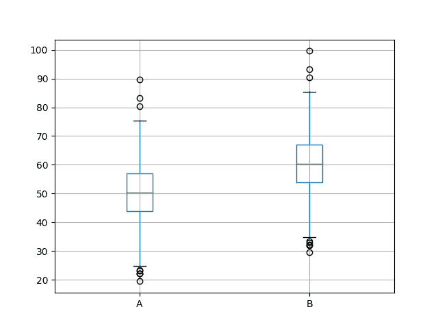
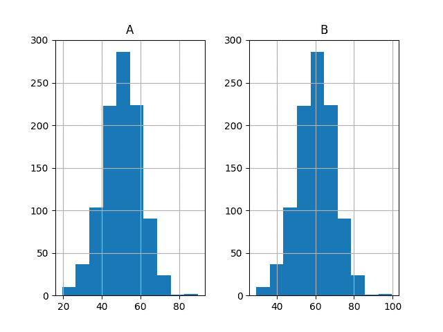
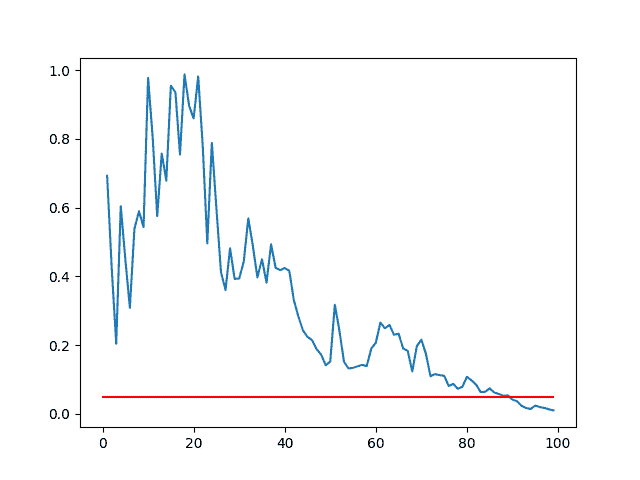

# 如何使用统计显着性检验来解释机器学习结果

> 原文： [https://machinelearningmastery.com/use-statistical-significance-tests-interpret-machine-learning-results/](https://machinelearningmastery.com/use-statistical-significance-tests-interpret-machine-learning-results/)

在比较两种不同的机器学习算法或将相同算法与不同配置进行比较时，最好收集一组结果。

考虑到大多数机器学习算法的随机性，重复每次实验运行30次或更多次会给出一组结果，您可以从中计算平均预期表现。

如果两种算法或配置的平均预期表现不同，您如何知道差异是显着的，有多重要？

统计显着性检验是帮助解释机器学习实验结果的重要工具。此外，这些工具的发现可以帮助您更好，更自信地呈现您的实验结果，并为您的预测性建模问题选择正确的算法和配置。

在本教程中，您将了解如何使用Python中的统计显着性检验来研究和解释机器学习实验结果。

完成本教程后，您将了解：

*   如何应用正态测试来确认您的数据是否（或不是）正态分布。
*   如何对正态分布结果应用参数统计显着性检验。
*   如何对更复杂的结果分布应用非参数统计显着性检验。

让我们开始吧。

*   **更新May / 2018** ：更新了与“拒绝”和“拒绝拒绝”H0相关的语言。


如何使用统计显着性检验来解释机器学习结果
照片来自 [oatsy40](https://www.flickr.com/photos/oatsy40/14477068362/) ，保留一些权利。

## 教程概述

本教程分为6个部分。他们是：

1.  生成样本数据
2.  摘要统计
3.  正常性测试
4.  比较高斯结果的均值
5.  比较具有不同方差的高斯结果的均值
6.  比较非高斯结果的均值

本教程假定Python 2或3以及具有NumPy，Pandas和Matplotlib的SciPy环境。

## 生成样本数据

情况是您从两个算法或同一算法的两个不同配置获得实验结果。

每个算法已在测试数据集上多次试验并且已收集技能分数。我们留下了两个技能分数。

我们可以通过生成两个以略微不同的方式分布的高斯随机数群来模拟这一点。

下面的代码生成第一个算法的结果。总共1000个结果存储在名为`results1.csv`的文件中。结果来自高斯分布，平均值为50，标准差为10。

```py
from numpy.random import seed
from numpy.random import normal
from numpy import savetxt
# define underlying distribution of results
mean = 50
stev = 10
# generate samples from ideal distribution
seed(1)
results = normal(mean, stev, 1000)
# save to ASCII file
savetxt('results1.csv', results)
```

下面是`results1.csv`的前5行数据片段。

```py
6.624345363663240960e+01
4.388243586349924641e+01
4.471828247736544171e+01
3.927031377843829318e+01
5.865407629324678851e+01
...
```

我们现在可以生成第二个算法的结果。我们将使用相同的方法，并从稍微不同的高斯分布绘制结果（具有相同标准偏差的平均值为60）。结果写入`results2.csv`。

```py
from numpy.random import seed
from numpy.random import normal
from numpy import savetxt
# define underlying distribution of results
mean = 60
stev = 10
# generate samples from ideal distribution
seed(1)
results = normal(mean, stev, 1000)
# save to ASCII file
savetxt('results2.csv', results)
```

以下是`results2.csv`的前5行样本。

```py
7.624345363663240960e+01
5.388243586349924641e+01
5.471828247736544171e+01
4.927031377843829318e+01
6.865407629324678851e+01
...
```

展望未来，我们将假装我们不知道任何一组结果的基本分布。

我每个实验任意选择1000个结果的人群。使用30或100个结果的群体来实现适当的良好估计（例如低标准误差）更为现实。

如果您的结果不是高斯结果，请不要担心;我们将看看这些方法如何分解非高斯数据以及使用哪种替代方法。

## 摘要统计

收集结果后的第一步是查看一些摘要统计量并了解有关数据分布的更多信息。

这包括查看摘要统计量和数据图。

下面是一个完整的代码清单，用于查看两组结果的一些摘要统计量。

```py
from pandas import DataFrame
from pandas import read_csv
from matplotlib import pyplot
# load results file
results = DataFrame()
results['A'] = read_csv('results1.csv', header=None).values[:, 0]
results['B'] = read_csv('results2.csv', header=None).values[:, 0]
# descriptive stats
print(results.describe())
# box and whisker plot
results.boxplot()
pyplot.show()
# histogram
results.hist()
pyplot.show()
```

该示例加载两组结果，并通过打印摘要统计量开始。`results1.csv`中的数据称为“A”，`results2.csv`中的数据称为“B”，为简洁起见。

我们假设数据代表测试数据集上的错误分数，并且最小化分数是目标。

我们可以看到平均A（50.388125）优于B（60.388125）。我们也可以在中位数（第50百分位数）看到相同的故事。查看标准差，我们还可以看到两个分布似乎都有相似（相同）的差异。

```py
                 A            B
count  1000.000000  1000.000000
mean     50.388125    60.388125
std       9.814950     9.814950
min      19.462356    29.462356
25%      43.998396    53.998396
50%      50.412926    60.412926
75%      57.039989    67.039989
max      89.586027    99.586027
```

接下来，创建比较两组结果的盒子和须状图。该框捕获中间50％的数据，异常值显示为点，绿线显示中位数。我们可以看到数据确实具有来自两个分布的类似差异，并且看起来围绕中值对称。

A的结果看起来比B好。



两组结果的盒子和晶须图

最后，绘制两组结果的直方图。

这些图强烈表明两组结果均来自高斯分布。



两组结果的直方图

## 正常性测试

从高斯分布中提取的数据可以更容易使用，因为有许多专门为此案例设计的工具和技术。

我们可以使用统计检验来确认从两个分布中得出的结果都是高斯分布（也称为正态分布）。

在SciPy中，这是 [normaltest（）](https://docs.scipy.org/doc/scipy/reference/generated/scipy.stats.normaltest.html)函数。

从文档中，测试描述为：

> 测试样本是否与正态分布不同。

测试的零假设（H0）或默认期望是统计描述正态分布。

如果p值大于0.05，我们就不能拒绝这个假设。如果p值&lt;= 0.05，我们拒绝这个假设。在这种情况下，我们相信分布不正常，95％的置信度。

下面的代码加载`results1.csv`并确定数据是否可能是高斯数据。

```py
from pandas import read_csv
from scipy.stats import normaltest
from matplotlib import pyplot
result1 = read_csv('results1.csv', header=None)
value, p = normaltest(result1.values[:,0])
print(value, p)
if p >= 0.05:
	print('It is likely that result1 is normal')
else:
	print('It is unlikely that result1 is normal')
```

运行该示例首先打印计算的统计量和从高斯分布计算统计量的p值。

我们可以看到`results1.csv`很可能是高斯分布。

```py
2.99013078116 0.224233941463
It is likely that result1 is normal
```

我们可以使用来自`results2.csv`的数据重复相同的测试。

完整的代码清单如下。

```py
from pandas import read_csv
from scipy.stats import normaltest
from matplotlib import pyplot
result2 = read_csv('results2.csv', header=None)
value, p = normaltest(result2.values[:,0])
print(value, p)
if p >= 0.05:
	print('It is likely that result2 is normal')
else:
	print('It is unlikely that result2 is normal')
```

运行该示例提供相同的统计p值和结果。

两组结果都是高斯分布。

```py
2.99013078116 0.224233941463
It is likely that result2 is normal
```

## 比较高斯结果的均值

两组结果都是高斯分布，具有相同的方差;这意味着我们可以使用Student t检验来查看两个分布均值之间的差异是否具有统计显着性。

在SciPy中，我们可以使用 [ttest_ind（）](https://docs.scipy.org/doc/scipy/reference/generated/scipy.stats.ttest_ind.html)函数。

该测试描述为：

> 计算两个独立分数样本均值的T检验。

测试的零假设（H0）或默认期望是两个样本都来自相同的群体。如果我们不能拒绝这个假设，那就意味着手段之间没有显着差异。

如果我们得到＆lt; = 0.05的p值，则意味着我们可以拒绝零假设，并且平均值显着不同，置信度为95％。这意味着对于100个中的95个类似样本，平均值将显着不同，并且在100个案例中的5个中并非如此。

除了高斯数据之外，该统计检验的一个重要假设是两个分布具有相同的方差。我们通过回顾上一步中的描述性统计量来了解这种情况。

The complete code listing is provided below.

```py
from pandas import read_csv
from scipy.stats import ttest_ind
from matplotlib import pyplot
# load results1
result1 = read_csv('results1.csv', header=None)
values1 = result1.values[:,0]
# load results2
result2 = read_csv('results2.csv', header=None)
values2 = result2.values[:,0]
# calculate the significance
value, pvalue = ttest_ind(values1, values2, equal_var=True)
print(value, pvalue)
if pvalue > 0.05:
	print('Samples are likely drawn from the same distributions (fail to reject H0)')
else:
	print('Samples are likely drawn from different distributions (reject H0)')
```

运行该示例将打印统计量和p值。我们可以看到p值远低于0.05。

事实上，它是如此之小，我们几乎可以确定手段之间的差异在统计上是显着的。

```py
-22.7822655028 2.5159901708e-102
Samples are likely drawn from different distributions (reject H0)
```

## 比较具有不同方差的高斯结果的均值

如果两组结果的均值相同，但方差不同，该怎么办？

我们无法按原样使用T检验。实际上，我们必须使用名为Welch t检验的测试的修改版本。

在SciPy中，这是相同的 [ttest_ind（）](https://docs.scipy.org/doc/scipy/reference/generated/scipy.stats.ttest_ind.html)函数，但我们必须将“`equal_var`”参数设置为“`False`”以指示差异不相等。

我们可以通过一个例子证明这一点，我们生成两组结果，其中非常相似（50对51）和非常不同的标准差（1对10）。我们将生成100个样本。

```py
from numpy.random import seed
from numpy.random import normal
from scipy.stats import ttest_ind
# generate results
seed(1)
n = 100
values1 = normal(50, 1, n)
values2 = normal(51, 10, n)
# calculate the significance
value, pvalue = ttest_ind(values1, values2, equal_var=False)
print(value, pvalue)
if pvalue > 0.05:
	print('Samples are likely drawn from the same distributions (fail to reject H0)')
else:
	print('Samples are likely drawn from different distributions (reject H0)')
```

运行该示例将打印测试统计量和p值。

我们可以看到，有很好的证据（接近99％）样本来自不同的分布，这些方法有显着差异。

```py
-2.62233137406 0.0100871483783
Samples are likely drawn from different distributions (reject H0)
```

分布越接近，将它们分开所需的样本越大。

我们可以通过计算每组结果的不同大小子样本的统计检验并绘制p值与样本大小来证明这一点。

我们希望随着样本量的增加，p值会变小。我们还可以绘制95％的水平线（0.05），并显示样本量足够大以表明这两个群体有显着差异。

```py
from numpy.random import seed
from numpy.random import normal
from scipy.stats import ttest_ind
from matplotlib import pyplot
# generate results
seed(1)
n = 100
values1 = normal(50, 1, n)
values2 = normal(51, 10, n)
# calculate p-values for different subsets of results
pvalues = list()
for i in range(1, n+1):
	value, p = ttest_ind(values1[0:i], values2[0:i], equal_var=False)
	pvalues.append(p)
# plot p-values vs number of results in sample
pyplot.plot(pvalues)
# draw line at 95%, below which we reject H0
pyplot.plot([0.05 for x in range(len(pvalues))], color='red')
pyplot.show()
```

运行该示例将创建p值与样本大小的折线图。

我们可以看到，对于这两组结果，样本大小必须大约为90才有95％的置信度，即平均值明显不同（蓝线与红线相交）。



p值与样本大小的线图

## 比较非高斯结果的均值

如果我们的数据不是高斯数据，我们不能使用T检验或韦尔奇t检验。

我们可以用于非高斯数据的替代统计显着性检验称为Kolmogorov-Smirnov检验。

在SciPy中，这称为 [ks_2samp（）](http://docs.scipy.org/doc/scipy/reference/generated/scipy.stats.ks_2samp.html)函数。

在文档中，此测试描述为：

> 这是零假设的双侧检验，即2个独立样本来自相同的连续分布。

该测试可用于高斯数据，但具有较低的统计功效并且可能需要大样本。

我们可以用非高斯分布证明两组结果的统计显着性的计算。我们可以生成两组具有重叠均匀分布的结果（50到60和55到65）。这些结果集将分别具有约55和60的不同平均值。

下面的代码生成两组100个结果，并使用Kolmogorov-Smirnov检验来证明总体均值之间的差异具有统计学意义。

```py
from numpy.random import seed
from numpy.random import randint
from scipy.stats import ks_2samp
# generate results
seed(1)
n = 100
values1 = randint(50, 60, n)
values2 = randint(55, 65, n)
# calculate the significance
value, pvalue = ks_2samp(values1, values2)
print(value, pvalue)
if pvalue > 0.05:
	print('Samples are likely drawn from the same distributions (fail to reject H0)')
else:
	print('Samples are likely drawn from different distributions (reject H0)')
```

运行该示例将打印统计量和p值。

p值非常小，表明两种群体之间的差异非常明显。

```py
0.47 2.16825856737e-10
Samples are likely drawn from different distributions (reject H0)
```

## 进一步阅读

本节列出了一些文章和资源，以深入探讨应用机器学习的统计显着性检验领域。

*   [维基百科的正常性测试](https://en.wikipedia.org/wiki/Normality_test)
*   [维基百科上的T检验](https://en.wikipedia.org/wiki/Student's_t-test)
*   [韦尔奇在维基百科上的t检验](https://en.wikipedia.org/wiki/Welch%27s_t-test)
*   维基百科上的 [Kolmogorov-Smirnov测试](https://en.wikipedia.org/wiki/Kolmogorov%E2%80%93Smirnov_test)

## 摘要

在本教程中，您了解了如何使用统计显着性检验来解释机器学习结果。

对于同一算法，您可以使用这些测试来帮助您自信地选择一个机器学习算法而不是另一个或一组配置参数。

你了解到：

*   如何使用正态测试来检查您的实验结果是否为高斯分析。
*   如何使用统计检验来检查平均结果之间的差异是否对具有相同和不同方差的高斯数据有意义。
*   如何使用统计检验来检查平均结果之间的差异是否对非高斯数据有意义。

您对此帖子或统计显着性检验有任何疑问吗？
在下面的评论中提出您的问题，我会尽力回答。