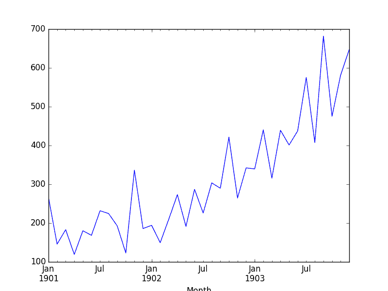
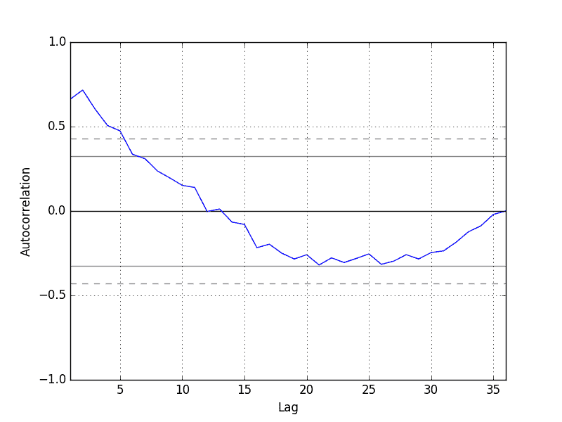
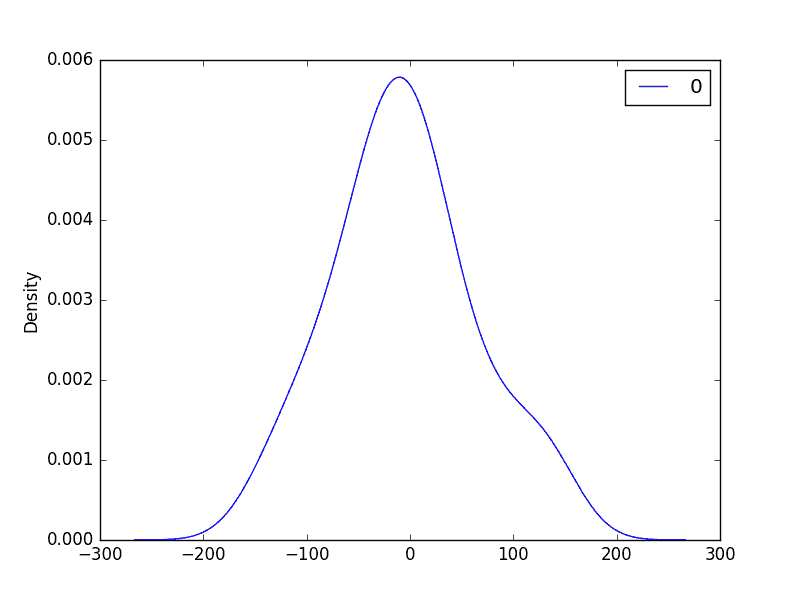
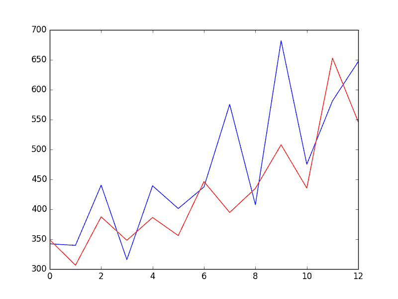

# 如何在 Python 中为时间序列预测创建 ARIMA 模型

> 原文： [https://machinelearningmastery.com/arima-for-time-series-forecasting-with-python/](https://machinelearningmastery.com/arima-for-time-series-forecasting-with-python/)

ARIMA 模型是一种流行且广泛使用的时间序列预测统计方法。

ARIMA 是 AutoRegressive Integrated Moving Average 的缩写。它是一类模型，它捕获时间序列数据中的一套不同的标准时间结构。

在本教程中，您将了解如何使用 Python 为时间序列数据开发 ARIMA 模型。

完成本教程后，您将了解：

*   关于 ARIMA 模型使用的参数和模型所做的假设。
*   如何使 ARIMA 模型适合数据并使用它来做出预测。
*   如何根据时间序列问题配置 ARIMA 模型。

让我们开始吧。

## 自回归整合移动平均模型

[ARIMA 模型](https://en.wikipedia.org/wiki/Autoregressive_integrated_moving_average)是一类用于分析和预测时间序列数据的统计模型。

它明确地迎合了时间序列数据中的一套标准结构，因此提供了一种简单而强大的方法来进行熟练的时间序列预测。

ARIMA 是 AutoRegressive Integrated Moving Average 的缩写。它是更简单的 AutoRegressive 移动平均线的推广，并添加了集成的概念。

这个首字母缩略词是描述​​性的，捕捉模型本身的关键方面。简而言之，它们是：

*   **AR** ：_ 自回归 _。使用观察与一些滞后观察之间的依赖关系的模型。
*   **I** ：_ 综合 _。使用差异原始观察（例如，从前一时间步骤的观察中减去观察值）以使时间序列静止。
*   **MA** ：_ 移动平均值 _。使用应用于滞后观察的移动平均模型中的观察和残差之间的依赖关系的模型。

这些组件中的每一个都在模型中明确指定为参数。标准符号用于 ARIMA（p，d，q），其中参数用整数值代替，以快速指示正在使用的特定 ARIMA 模型。

ARIMA 模型的参数定义如下：

*   **p** ：模型中包含的滞后观察数，也称为滞后顺序。
*   **d** ：原始观测值的差异次数，也称为差分程度。
*   **q** ：移动平均窗口的大小，也称为移动平均线的顺序。

构建包括指定数量和类型的项的线性回归模型，并且通过差分程度准备数据以使其静止，即去除对回归模型产生负面影响的趋势和季节结构。

值 0 可用于参数，表示不使用模型的该元素。这样，ARIMA 模型可以配置为执行 ARMA 模型的功能，甚至是简单的 AR，I 或 MA 模型。

对时间序列采用 ARIMA 模型假设生成观察结果的基础过程是 ARIMA 过程。这似乎是显而易见的，但有助于激发在原始观测中确认模型假设的必要性以及模型预测的残差。

接下来，我们来看看如何在 Python 中使用 ARIMA 模型。我们将从加载一个简单的单变量时间序列开始。

## 洗发水销售数据集

该数据集描述了 3 年期间每月洗发水的销售数量。

单位是销售计数，有 36 个观察。原始数据集归功于 Makridakis，Wheelwright 和 Hyndman（1998）。

[了解有关数据集的更多信息并从此处下载](https://datamarket.com/data/set/22r0/sales-of-shampoo-over-a-three-year-period)。

下载数据集并将其放在当前工作目录中，文件名为“ _shampoo-sales.csv_ ”。

下面是一个使用 Pandas 加载 Shampoo Sales 数据集并使用自定义函数解析日期时间字段的示例。数据集以任意年份为基线，在本例中为 1900。

```py
from pandas import read_csv
from pandas import datetime
from matplotlib import pyplot

def parser(x):
	return datetime.strptime('190'+x, '%Y-%m')

series = read_csv('shampoo-sales.csv', header=0, parse_dates=[0], index_col=0, squeeze=True, date_parser=parser)
print(series.head())
series.plot()
pyplot.show()
```

运行该示例将打印数据集的前 5 行。

```py
Month
1901-01-01 266.0
1901-02-01 145.9
1901-03-01 183.1
1901-04-01 119.3
1901-05-01 180.3
Name: Sales, dtype: float64
```

数据也绘制为时间序列，沿 x 轴的月份和 y 轴的销售数字。



洗发水销售数据集图

我们可以看到 Shampoo Sales 数据集具有明显的趋势。

这表明时间序列不是静止的并且需要差分以使其静止，至少差异为 1。

让我们快速浏览一下时间序列的自相关图。这也是熊猫内置的。下面的示例描绘了时间序列中大量滞后的自相关。

```py
from pandas import read_csv
from pandas import datetime
from matplotlib import pyplot
from pandas.tools.plotting import autocorrelation_plot

def parser(x):
	return datetime.strptime('190'+x, '%Y-%m')

series = read_csv('shampoo-sales.csv', header=0, parse_dates=[0], index_col=0, squeeze=True, date_parser=parser)
autocorrelation_plot(series)
pyplot.show()
```

运行这个例子，我们可以看到与前 10 个到 12 个滞后的正相关，这可能对前 5 个滞后很重要。

模型的 AR 参数的良好起点可以是 5。



洗发水销售数据的自相关图

## ARIMA 与 Python

statsmodels 库提供适合 ARIMA 模型的功能。

可以使用 statsmodels 库创建 ARIMA 模型，如下所示：

1.  通过调用 [ARIMA（）](http://statsmodels.sourceforge.net/devel/generated/statsmodels.tsa.arima_model.ARIMA.html)并传入`p`，`d`和`q`参数来定义模型。
2.  通过调用 [fit（）](http://statsmodels.sourceforge.net/devel/generated/statsmodels.tsa.arima_model.ARIMA.fit.html)函数，在训练数据上准备模型。
3.  可以通过调用 [predict（）](http://statsmodels.sourceforge.net/devel/generated/statsmodels.tsa.arima_model.ARIMA.predict.html)函数并指定要预测的时间或索引的时间来做出预测。

让我们从简单的事情开始吧。我们将 ARIMA 模型与整个 Shampoo Sales 数据集相匹配，并检查残差。

首先，我们拟合 ARIMA（5,1,0）模型。这将自动回归的滞后值设置为 5，使用差值顺序 1 使时间序列静止，并使用 0 的移动平均模型。

在拟合模型时，提供了许多关于线性回归模型拟合的调试信息。我们可以通过将`disp`参数设置为 0 来关闭它。

```py
from pandas import read_csv
from pandas import datetime
from pandas import DataFrame
from statsmodels.tsa.arima_model import ARIMA
from matplotlib import pyplot

def parser(x):
	return datetime.strptime('190'+x, '%Y-%m')

series = read_csv('shampoo-sales.csv', header=0, parse_dates=[0], index_col=0, squeeze=True, date_parser=parser)
# fit model
model = ARIMA(series, order=(5,1,0))
model_fit = model.fit(disp=0)
print(model_fit.summary())
# plot residual errors
residuals = DataFrame(model_fit.resid)
residuals.plot()
pyplot.show()
residuals.plot(kind='kde')
pyplot.show()
print(residuals.describe())
```

运行该示例将打印拟合模型的摘要。这总结了所使用的系数值以及样本内观察的拟合技巧。

```py
                             ARIMA Model Results
==============================================================================
Dep. Variable:                D.Sales   No. Observations:                   35
Model:                 ARIMA(5, 1, 0)   Log Likelihood                -196.170
Method:                       css-mle   S.D. of innovations             64.241
Date:                Mon, 12 Dec 2016   AIC                            406.340
Time:                        11:09:13   BIC                            417.227
Sample:                    02-01-1901   HQIC                           410.098
                         - 12-01-1903
=================================================================================
                    coef    std err          z      P>|z|      [95.0% Conf. Int.]
---------------------------------------------------------------------------------
const            12.0649      3.652      3.304      0.003         4.908    19.222
ar.L1.D.Sales    -1.1082      0.183     -6.063      0.000        -1.466    -0.750
ar.L2.D.Sales    -0.6203      0.282     -2.203      0.036        -1.172    -0.068
ar.L3.D.Sales    -0.3606      0.295     -1.222      0.231        -0.939     0.218
ar.L4.D.Sales    -0.1252      0.280     -0.447      0.658        -0.674     0.424
ar.L5.D.Sales     0.1289      0.191      0.673      0.506        -0.246     0.504
                                    Roots
=============================================================================
                 Real           Imaginary           Modulus         Frequency
-----------------------------------------------------------------------------
AR.1           -1.0617           -0.5064j            1.1763           -0.4292
AR.2           -1.0617           +0.5064j            1.1763            0.4292
AR.3            0.0816           -1.3804j            1.3828           -0.2406
AR.4            0.0816           +1.3804j            1.3828            0.2406
AR.5            2.9315           -0.0000j            2.9315           -0.0000
-----------------------------------------------------------------------------
```

首先，我们得到残差的线图，表明模型可能仍然存在一些趋势信息。


ARMA Fit 残差线图

接下来，我们得到残差误差值的密度图，表明误差是高斯误差，但可能不是以零为中心。



ARMA Fit 残差误差密度图

显示残差的分布。结果表明，预测中确实存在偏差（残差中的非零均值）。

```py
count   35.000000
mean    -5.495213
std     68.132882
min   -133.296597
25%    -42.477935
50%     -7.186584
75%     24.748357
max    133.237980
```

请注意，虽然上面我们使用整个数据集进行时间序列分析，但理想情况下，我们会在开发预测模型时仅对训练数据集执行此分析。

接下来，让我们看看如何使用 ARIMA 模型做出预测。

## 滚动预测 ARIMA 模型

ARIMA 模型可用于预测未来的时间步长。

我们可以使用 [ARIMAResults](http://statsmodels.sourceforge.net/devel/generated/statsmodels.tsa.arima_model.ARIMAResults.html) 对象上的 predict（）函数做出预测。它接受将预测作为参数的时间步长索引。这些索引与用于做出预测的训练数据集的起点相关。

如果我们在训练数据集中使用 100 个观测值来拟合模型，那么用于做出预测的下一个时间步骤的索引将被指定给预测函数，因为 _start = 101，end = 101_ 。这将返回一个包含预测的一个元素的数组。

如果我们在配置模型时执行任何差分（ _d&gt; 0_ ），我们还希望预测值处于原始比例。这可以通过将`typ`参数设置为值 _'水平'_： _typ ='水平'_ 来指定。

或者，我们可以通过使用 [forecast（）](http://statsmodels.sourceforge.net/devel/generated/statsmodels.tsa.arima_model.ARIMAResults.forecast.html)函数来避免所有这些规范，该函数使用模型执行一步预测。

我们可以将训练数据集拆分为训练集和测试集，使用训练集来拟合模型，并为测试集上的每个元素生成预测。

考虑到差异的先前时间步长和 AR 模型的观察依赖性，需要滚动预测。执行此滚动预测的一种粗略方法是在收到每个新观察后重新创建 ARIMA 模型。

我们手动跟踪名为历史的列表中的所有观察结果，该列表与训练数据一起播种，并且每次迭代都附加新的观察结果。

综上所述，下面是使用 Python 中的 ARIMA 模型进行滚动预测的示例。

```py
from pandas import read_csv
from pandas import datetime
from matplotlib import pyplot
from statsmodels.tsa.arima_model import ARIMA
from sklearn.metrics import mean_squared_error

def parser(x):
	return datetime.strptime('190'+x, '%Y-%m')

series = read_csv('shampoo-sales.csv', header=0, parse_dates=[0], index_col=0, squeeze=True, date_parser=parser)
X = series.values
size = int(len(X) * 0.66)
train, test = X[0:size], X[size:len(X)]
history = [x for x in train]
predictions = list()
for t in range(len(test)):
	model = ARIMA(history, order=(5,1,0))
	model_fit = model.fit(disp=0)
	output = model_fit.forecast()
	yhat = output[0]
	predictions.append(yhat)
	obs = test[t]
	history.append(obs)
	print('predicted=%f, expected=%f' % (yhat, obs))
error = mean_squared_error(test, predictions)
print('Test MSE: %.3f' % error)
# plot
pyplot.plot(test)
pyplot.plot(predictions, color='red')
pyplot.show()
```

运行该示例会在每次迭代时打印预测值和期望值。

我们还可以计算预测的最终均方误差分数（MSE），为其他 ARIMA 配置提供比较点。

```py
predicted=349.117688, expected=342.300000
predicted=306.512968, expected=339.700000
predicted=387.376422, expected=440.400000
predicted=348.154111, expected=315.900000
predicted=386.308808, expected=439.300000
predicted=356.081996, expected=401.300000
predicted=446.379501, expected=437.400000
predicted=394.737286, expected=575.500000
predicted=434.915566, expected=407.600000
predicted=507.923407, expected=682.000000
predicted=435.483082, expected=475.300000
predicted=652.743772, expected=581.300000
predicted=546.343485, expected=646.900000
Test MSE: 6958.325
```

创建一个线图，显示与滚动预测预测（红色）相比的预期值（蓝色）。我们可以看到这些值显示出一些趋势并且具有正确的比例。



ARIMA 滚动预测线图

该模型可以使用 p，d 甚至 q 参数的进一步调整。

## 配置 ARIMA 模型

拟合 ARIMA 模型的经典方法是遵循 [Box-Jenkins 方法](https://en.wikipedia.org/wiki/Box%E2%80%93Jenkins_method)。

这是一个使用时间序列分析和诊断来发现 ARIMA 模型的良好参数的过程。

总之，这个过程的步骤如下：

1.  **模型识别**。使用图和汇总统计量来识别趋势，季节性和自回归元素，以了解差异量和所需滞后的大小。
2.  **参数估计**。使用拟合程序查找回归模型的系数。
3.  **模型检查**。使用残差的图和统计检验来确定模型未捕获的时间结构的数量和类型。

重复该过程，直到在样品内或样品外观察（例如训练或测试数据集）上达到所需的拟合水平。

这个过程在经典的 1970 年教科书中描述，主题为[时间序列分析：预测与控制](http://www.amazon.com/dp/1118675029?tag=inspiredalgor-20)由 George Box 和 Gwilym Jenkins 撰写。如果您有兴趣深入了解这种类型的模型和方法，现在可以获得更新的第 5 版。

鉴于模型可以有效地适应中等大小的时间序列数据集，模型的网格搜索参数可能是一种有价值的方法。

## 摘要

在本教程中，您了解了如何为 Python 中的时间序列预测开发 ARIMA 模型。

具体来说，你学到了：

*   关于 ARIMA 模型，如何配置以及模型所做的假设。
*   如何使用 ARIMA 模型执行快速时间序列分析。
*   如何使用 ARIMA 模型预测样本预测。

您对 ARIMA 或本教程有任何疑问吗？
在下面的评论中提出您的问题，我会尽力回答。