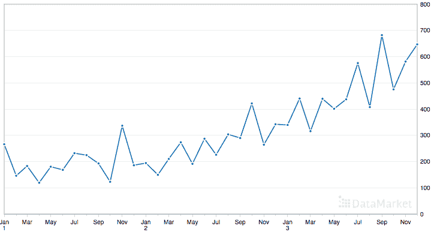
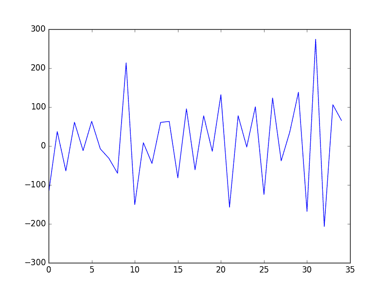
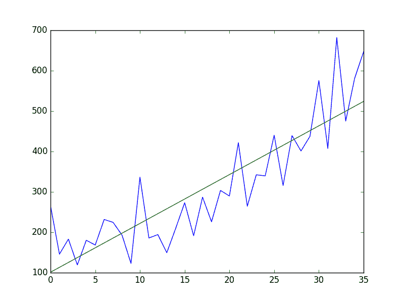
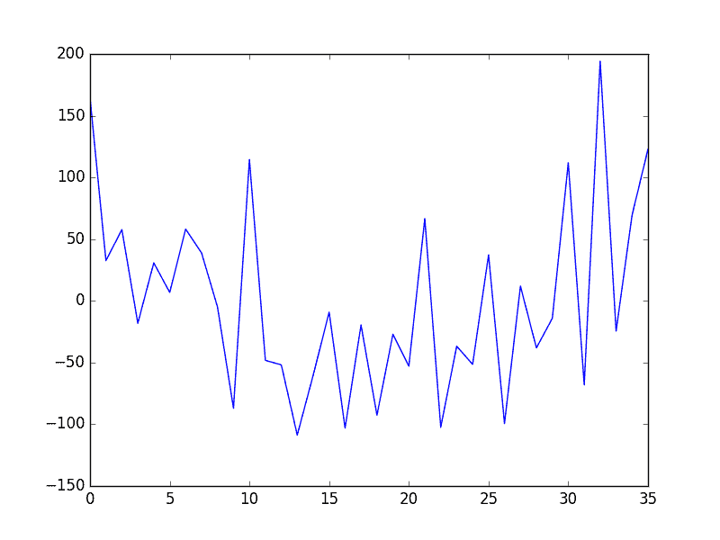

# 如何在 Python 中使用和删除时间序列数据中的趋势信息

> 原文： [https://machinelearningmastery.com/time-series-trends-in-python/](https://machinelearningmastery.com/time-series-trends-in-python/)

我们的时间序列数据集可能包含趋势。

随着时间的推移，趋势是系列的持续增加或减少。识别，建模甚至从时间序列数据集中删除趋势信息可能会有所帮助。

在本教程中，您将了解如何在 Python 中建模和删除时间序列数据中的趋势信息。

完成本教程后，您将了解：

*   时间序列中可能存在的趋势的重要性和类型以及如何识别它们。
*   如何使用简单的差分方法删除趋势。
*   如何建模线性趋势并将其从销售时间序列数据集中删除。

让我们开始吧。


如何在 Python 中使用和删除时间序列数据中的趋势信息
照片来自 [john78727](https://www.flickr.com/photos/john78727/16611452336/) ，保留一些权利。

## 时间序列的趋势

趋势是时间序列水平的长期增加或减少。

> 一般而言，时间序列中看似不是周期性的系统变化被称为趋势。

- 第 5 页， [R](http://www.amazon.com/dp/0387886974?tag=inspiredalgor-20) 入门时间序列

识别和理解趋势信息有助于提高模型表现;以下是几个原因：

*   **更快的建模**：也许趋势或缺乏趋势的知识可以提出方法并使模型选择和评估更有效率。
*   **更简单的问题**：也许我们可以纠正或消除趋势，以简化建模并提高模型表现。
*   **更多数据**：也许我们可以直接或作为摘要使用趋势信息，为模型提供额外信息并提高模型表现。

### 趋势类型

有各种趋势。

我们可以考虑的两个一般课程是：

*   **确定性趋势**：这些是持续增加或减少的趋势。
*   **随机趋势**：这些趋势不一致地增加和减少。

通常，确定性趋势更容易识别和删除，但本教程中讨论的方法仍然可用于随机趋势。

我们可以根据观察范围来考虑趋势。

*   **全球趋势**：这些趋势适用于整个时间序列。
*   **本地趋势**：这些趋势适用于时间序列的部分或子序列。

通常，全球趋势更容易识别和解决。

### 识别趋势

您可以绘制时间序列数据以查看趋势是否明显。

困难在于，在实践中，识别时间序列中的趋势可以是主观过程。因此，从时间序列中提取或移除它可以是主观的。

创建数据的线图并检查图表以获得明显的趋势。

在图中添加线性和非线性趋势线，看看趋势是否明显。

### 删除趋势

具有趋势的时间序列称为非平稳的。

可以对已识别的趋势建模。建模后，可以从时间序列数据集中删除它。这称为趋势时间序列。

如果数据集没有趋势或我们成功删除趋势，则数据集称为趋势静止。

### 在机器学习中使用时间序列趋势

从机器学习的角度来看，数据中的趋势代表了两个机会：

1.  **删除信息**：删除扭曲输入和输出变量之间关系的系统信息。
2.  **添加信息**：添加系统信息以改善输入和输出变量之间的关系。

具体而言，可以从时间序列数据（以及将来的数据）中删除趋势，作为数据准备和清理练习。这在使用统计方法进行时间序列预测时很常见，但在使用机器学习模型时并不总能改善结果。

或者，可以直接或作为摘要添加趋势，作为监督学习问题的新输入变量以预测输出变量。

一种或两种方法可能与您的时间序列预测问题相关，可能值得研究。

接下来，让我们看一下具有趋势的数据集。

## 洗发水销售数据集

该数据集描述了 3 年期间每月洗发水的销售数量。

单位是销售计数，有 36 个观察。原始数据集归功于 Makridakis，Wheelwright 和 Hyndman（1998）。

下面是前 5 行数据的示例，包括标题行。

```py
"Month","Sales"
"1-01",266.0
"1-02",145.9
"1-03",183.1
"1-04",119.3
"1-05",180.3
```

下面是从[数据市场](https://datamarket.com/data/set/22r0/sales-of-shampoo-over-a-three-year-period)中获取的整个数据集的图表，您可以在其中了解更多信息并下载数据集。

数据集显示出增长趋势。



洗发水销售数据集

## 加载 Shampoo Sales Dataset

下载数据集并将其放在当前工作目录中，文件名为“ _shampoo-sales.csv_ ”

可以使用自定义日期解析例程加载数据集，如下所示：

```py
from pandas import read_csv
from pandas import datetime
from matplotlib import pyplot

def parser(x):
	return datetime.strptime('190'+x, '%Y-%m')

series = read_csv('shampoo-sales.csv', header=0, parse_dates=[0], index_col=0, squeeze=True, date_parser=parser)
series.plot()
pyplot.show()
```

运行该示例将加载数据集并创建绘图。


洗发水销售数据集图

## 通过差异趋势

也许最简单的解决时间序列的方法是差分。

具体地，构建新系列，其中当前时间步长的值被计算为原始观察与前一时间步骤的观察之间的差异。

```py
value(t) = observation(t) - observation(t-1)
```

这具有从时间序列数据集中移除趋势的效果。

我们可以通过直接实现这一点在 Python 中创建一个新的差异数据集。可以创建新的观察列表。

下面是一个创建 Shampoo Sales 数据集的差异去趋势版本的示例。

```py
from pandas import read_csv
from pandas import datetime
from matplotlib import pyplot

def parser(x):
	return datetime.strptime('190'+x, '%Y-%m')

series = read_csv('shampoo-sales.csv', header=0, parse_dates=[0], index_col=0, squeeze=True, date_parser=parser)
X = series.values
diff = list()
for i in range(1, len(X)):
	value = X[i] - X[i - 1]
	diff.append(value)
pyplot.plot(diff)
pyplot.show()
```

运行该示例将创建新的去趋势数据集，然后绘制时间序列。

因为没有为第一次观察创建差异值（没有任何东西可以从中减去），所以新数据集包含少一个记录。我们可以看到，这种趋势似乎确实已被删除。



洗发水销售数据集差异趋势

这种方法适用于具有线性趋势的数据。如果趋势是二次的（趋势的变化也增加或减少），那么可以采用已经差异的数据集的差异，即第二级差分。如果需要，可以进一步重复该过程。

由于差分仅需要在前一时间步进行观察，因此可以轻松地将其应用于看不见的样本外数据，以进行预处理或为监督学习提供额外输入。

接下来，我们将研究拟合模型来描述趋势。

## 由模型拟合引起的趋势

趋势通常很容易通过观察结果显示为一条线。

线性趋势可以通过线性模型来概括，并且可以使用多项式或其他曲线拟合方法来最佳地总结非线性趋势。

由于识别趋势的主观性和特定领域性，这种方法可以帮助确定趋势是否存在。即使将线性模型拟合到明显超线性或指数的趋势也是有帮助的。

除了用作趋势识别工具之外，这些拟合模型还可用于消除时间序列。

例如，可以在时间索引上拟合线性模型以预测观察。该数据集如下所示：

```py
X,	y
1,	obs1
2,	obs2
3,	obs3
4,	obs4
5,	obs5
```

此模型的预测将形成一条直线，可以将其作为数据集的趋势线。也可以从原始时间序列中减去这些预测，以提供数据集的去趋势版本。

```py
value(t) = observation(t) - prediction(t)
```

来自模型拟合的残差是数据集的去趋势形式。也可以使用多项式曲线拟合和其他非线性模型。

我们可以通过在数据上训练 scikit-learn [LinearRegression](http://scikit-learn.org/stable/modules/generated/sklearn.linear_model.LinearRegression.html) 模型在 Python 中实现这一点。

```py
from pandas import read_csv
from pandas import datetime
from sklearn.linear_model import LinearRegression
from matplotlib import pyplot
import numpy

def parser(x):
	return datetime.strptime('190'+x, '%Y-%m')

series = read_csv('shampoo-sales.csv', header=0, parse_dates=[0], index_col=0, squeeze=True, date_parser=parser)
# fit linear model
X = [i for i in range(0, len(series))]
X = numpy.reshape(X, (len(X), 1))
y = series.values
model = LinearRegression()
model.fit(X, y)
# calculate trend
trend = model.predict(X)
# plot trend
pyplot.plot(y)
pyplot.plot(trend)
pyplot.show()
# detrend
detrended = [y[i]-trend[i] for i in range(0, len(series))]
# plot detrended
pyplot.plot(detrended)
pyplot.show()
```

首先运行示例将线性模型拟合到整数索引的观测值，并绘制原始数据集（蓝色）上的趋势线（绿色）。



洗发水销售数据集与趋势

接下来，从原始数据集中减去趋势，并绘制得到的去趋势数据集。



洗发水销售数据集模型趋势

同样，我们可以看到这种方法已经有效地去除了数据集。残差中可能存在抛物线，这表明也许多项式拟合可能做得更好。

由于趋势模型仅将观察的整数索引作为输入，因此可以将其用于新数据，以取消趋势或为模型提供新的输入变量。

## 进一步阅读

以下是有关趋势估计和时间序列去趋势的一些额外资源。

*   [维基百科上的线性趋势估计](https://en.wikipedia.org/wiki/Linear_trend_estimation)
*   [趋势说明](http://www.ltrr.arizona.edu/webhome/dmeko/notes_7.pdf)，GEOS 585A，应用时间序列分析[PDF]
    *   更新：[从此页面下载](http://www.ltrr.arizona.edu/webhome/dmeko/geos585a.html)。

## 摘要

在本教程中，您发现了时间序列数据的趋势以及如何使用 Python 删除它们。

具体来说，你学到了：

*   关于时间序列中趋势信息的重要性以及如何在机器学习中使用它。
*   如何使用差分从时间序列数据中删除趋势。
*   如何建模线性趋势并将其从时间序列数据中删除。

您对 detrending 或本教程有任何疑问吗？
在下面的评论中提出您的问题，我会尽力回答。