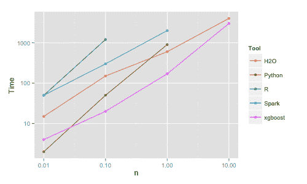

# 应用机器学习中 XGBoost 的温和介绍

> 原文：<https://machinelearningmastery.com/gentle-introduction-xgboost-applied-machine-learning/>

最后更新于 2021 年 2 月 17 日

XGBoost 是一种算法，最近在结构化或表格数据的应用机器学习和 Kaggle 竞赛中占据主导地位。

XGBoost 是梯度增强决策树的实现，旨在提高速度和表现。

在这篇文章中，你将发现 XGBoost，并得到一个温和的介绍，它是什么，它来自哪里，以及你如何可以了解更多。

看完这篇文章你会知道:

*   XGBoost 是什么，项目的目标是什么。
*   为什么 XGBoost 必须是你的机器学习工具包的一部分。
*   在下一个机器学习项目中，您可以了解更多关于开始使用 XGBoost 的信息。

**用我的新书 [XGBoost With Python](https://machinelearningmastery.com/xgboost-with-python/) 启动你的项目**，包括*分步教程*和所有示例的 *Python 源代码*文件。

我们开始吧。

*   **2021 年 2 月更新**:修复断链。


应用机器学习 XGBoost 简介
图片由[西格弗里德·伦德伯格](https://www.flickr.com/photos/sigfridlundberg/14945045482/)提供，版权所有。

## 什么是 XGBoost？

XGBoost 代表 e**X**treme**G**radient**B**oost。

> 然而，xgboost 这个名字实际上指的是工程目标，即提升树算法的计算资源极限。这也是很多人使用 xgboost 的原因。

—陈天琪在回答问题“[R GBM(梯度助推机)和 xgboost(极限梯度助推)有什么区别？](https://www.quora.com/What-is-the-difference-between-the-R-gbm-gradient-boosting-machine-and-xgboost-extreme-gradient-boosting)“在 Quora 上

是[陈天棋](https://homes.cs.washington.edu/~tqchen/)创造的梯度助推机的实现，现在有很多开发者贡献。它属于分布式机器学习社区或 [DMLC](https://github.com/dmlc) 旗下更广泛的工具集合，这些人也是流行的 [mxnet 深度学习库](https://github.com/dmlc/mxnet)的创建者。

陈天琪在帖子[中提供了一个关于 XGBoost 创作的简短有趣的背景故事，以及 XGBoost](https://sites.google.com/site/nttrungmtwiki/home/it/data-science---python/xgboost/story-and-lessons-behind-the-evolution-of-xgboost) 演变背后的故事和教训。

XGBoost 是一个软件库，你可以下载并安装在你的机器上，然后从各种界面访问。具体来说，XGBoost 支持以下主要接口:

*   命令行界面。
*   C++(编写库的语言)。
*   Python 接口以及 Sklearn 中的一个模型。
*   接口以及插入符号包中的模型。
*   朱莉娅。
*   像 Scala 这样的 Java 和 JVM 语言以及 Hadoop 这样的平台。

## XGBoost 功能

该库专注于计算速度和模型表现，因此几乎没有多余的东西。然而，它确实提供了许多高级功能。

### 模型特征

该模型的实现支持 Sklearn 和 R 实现的特性，并增加了正则化等新功能。支持三种主要形式的梯度增强:

*   **梯度提升**算法也叫梯度提升机包括学习率。
*   **随机梯度增强**，在行、列和列各级进行子采样。
*   **L1 和 L2 正则化的正则化梯度增强**。

### 系统功能

该库提供了一个在一系列计算环境中使用的系统，尤其是:

*   **并行化**在训练过程中使用你所有的 CPU 核心进行树的构建。
*   **分布式计算**使用一组机器训练非常大的模型。
*   **核外计算**用于不适合内存的非常大的数据集。
*   **数据结构和算法的缓存优化**以充分利用硬件。

### 算法特征

算法的实现是为了计算时间和内存资源的效率而设计的。设计目标是充分利用现有资源来训练模型。一些关键的算法实现特性包括:

*   **稀疏感知**实现，自动处理丢失的数据值。
*   **块结构**支持树构造的并行化。
*   **继续训练**，这样你就可以在新的数据上进一步提升已经拟合好的模型。

XGBoost 是自由开源软件，可在许可的 Apache-2 许可证下使用。

## 为什么要使用 XGBoost？

使用 XGBoost 的两个原因也是项目的两个目标:

1.  执行速度。
2.  模型表现。

### 1.XGBoost 执行速度

一般来说，XGBoost 速度很快。与其他梯度增强实现相比，速度非常快。

[Szilard Pafka](https://www.linkedin.com/in/szilard) 执行了一些客观的基准测试，将 XGBoost 的表现与梯度提升和袋装决策树的其他实现进行了比较。2015 年 5 月，他在名为“[基准随机森林实施](http://datascience.la/benchmarking-random-forest-implementations/)”的博客中写下了自己的结果。

他还在 GitHub 上提供了[所有的代码，以及一份更广泛的硬数字结果报告。](https://github.com/szilard/benchm-ml)



XGBoost 的基准表现，取自[基准随机森林实现](http://datascience.la/benchmarking-random-forest-implementations/)。

他的结果显示，XGBoost 几乎总是比来自 R、Python Spark 和 H2O 的其他基准实现更快。

从他的实验中，他评论道:

> 我还尝试了 xgboost，这是一个流行的增强库，它也能构建随机森林。它速度快，内存效率高，精确率高

— Szilard Pafka，[基准测试随机森林实现](http://datascience.la/benchmarking-random-forest-implementations/)。

### 2.XGBoost 模型表现

XGBoost 在分类和回归预测建模问题上主导结构化或表格数据集。

证据是，它是 Kaggle 竞争数据科学平台上竞争赢家的 go-to 算法。

例如，有一个不完整的第一名、第二名和第三名竞赛获胜者列表，使用了标题为: [XGBoost:机器学习挑战获胜解决方案](https://github.com/dmlc/xgboost/tree/master/demo#machine-learning-challenge-winning-solutions)。

为了使这一点更加具体，以下是来自卡格尔竞赛获胜者的一些有见地的名言:

> 作为越来越多 Kaggle 竞赛的获胜者，XGBoost 再次向我们展示了它是一个非常棒的全能算法，值得放在你的工具箱里。

——[达图获奖者面试:第一名，疯狂教授](http://blog.kaggle.com/2015/12/03/dato-winners-interview-1st-place-mad-professors/)

> 有疑问时，使用 xgboost。

——[阿维托冠军访谈:第一名，欧文·张](http://blog.kaggle.com/2015/08/26/avito-winners-interview-1st-place-owen-zhang/)

> 我喜欢表现出色的单曲，我最好的单曲是一首可以自己获得第十名的 XGBoost。

——[卡特彼勒获奖者面试:第一名](http://blog.kaggle.com/2015/09/22/caterpillar-winners-interview-1st-place-gilberto-josef-leustagos-mario/)

> 我只用了 XGBoost。

——[自由互助物业检查，优胜面试:第一名，王](http://blog.kaggle.com/2015/09/28/liberty-mutual-property-inspection-winners-interview-qingchen-wang/)

> 我使用的唯一一种监督学习方法是梯度增强，它是在优秀的 xgboost 包中实现的。

——[招募优惠券购买赢家面试:第二名，哈拉杨](http://blog.kaggle.com/2015/10/21/recruit-coupon-purchase-winners-interview-2nd-place-halla-yang/)

## XGBoost 使用什么算法？

XGBoost 库实现了[梯度提升决策树算法](https://en.wikipedia.org/wiki/Gradient_boosting)。

该算法有许多不同的名称，如梯度增强、多重加性回归树、随机梯度增强或梯度增强机器。

增强是一种集成技术，通过添加新模型来纠正现有模型产生的错误。模型按顺序添加，直到无法进一步改进。一个流行的例子是 [AdaBoost 算法](https://machinelearningmastery.com/boosting-and-adaboost-for-machine-learning/)，它对难以预测的数据点进行加权。

梯度增强是一种创建新模型的方法，新模型预测先前模型的残差或误差，然后加在一起进行最终预测。之所以称之为梯度提升，是因为它使用梯度下降算法，在添加新模型时将损失降至最低。

这种方法支持回归和分类预测建模问题。

关于增强和梯度增强的更多信息，请参见特雷弗·哈斯蒂在[梯度增强机器学习](https://www.youtube.com/watch?v=wPqtzj5VZus)上的演讲。

<iframe loading="lazy" title="Trevor Hastie - Gradient Boosting Machine Learning" width="500" height="281" src="about:blank" frameborder="0" allow="accelerometer; autoplay; clipboard-write; encrypted-media; gyroscope; picture-in-picture" allowfullscreen="" data-rocket-lazyload="fitvidscompatible" data-lazy-src="https://www.youtube.com/embed/wPqtzj5VZus?feature=oembed"><iframe title="Trevor Hastie - Gradient Boosting Machine Learning" width="500" height="281" src="https://www.youtube.com/embed/wPqtzj5VZus?feature=oembed" frameborder="0" allow="accelerometer; autoplay; clipboard-write; encrypted-media; gyroscope; picture-in-picture" allowfullscreen=""/></div> <p/> <h2>官方 XGBoost 资源</h2> <p>XGBoost 上最好的信息来源是项目的<a href="https://github.com/dmlc/xgboost">官方 GitHub 资源库。</a></p> <p>从那里您可以访问<a href="https://github.com/dmlc/xgboost/issues">问题跟踪器</a>和<a href="https://groups.google.com/forum/#!forum/xgboost-user/">用户组</a>，它们可用于提问和报告错误。</p> <p>示例代码和帮助的一个很好的链接来源是<a href="https://github.com/dmlc/xgboost/tree/master/demo">超赞的 XGBoost 页面</a>。</p> <p>还有一个<a href="https://xgboost.readthedocs.io/en/latest/">官方文档页面</a>，包括一系列不同语言的入门指南、教程、操作指南等。</p> <p>关于 XGBoost，有一些更正式的论文值得一读，了解更多关于图书馆的背景知识:</p> <ul> <li><a href="http://jmlr.org/proceedings/papers/v42/chen14.pdf">希格斯玻色子发现与助推树</a>，2014。</li> <li><a href="https://arxiv.org/abs/1603.02754"> XGBoost:一个可扩展的树木助推系统</a>，2016。</li> </ul> <h2>关于 XGBoost 的讨论</h2> <p>当开始使用像 XGBoost 这样的新工具时，在深入研究代码之前，回顾一些关于这个主题的讨论可能会有所帮助。</p> <h3>XGBoost:一个可扩展的树增强系统</h3> <p>2016 年 6 月，该库的创建者陈天琦在 LA 数据科学组做了一个题为“<a href="https://www.youtube.com/watch?v=Vly8xGnNiWs"> XGBoost:一个可扩展的树提升系统</a>”的演讲。</p> <p><span class="oxjLm3csmGtLYMueaTVM1TfANv098rsN1SJCFZnDPC5AridHhop7kQ0RJ5QluwIz"/></p> <div class="responsive-video"><iframe loading="lazy" title="XGBoost A Scalable Tree Boosting System June 02, 2016" width="500" height="281" src="about:blank" frameborder="0" allow="accelerometer; autoplay; clipboard-write; encrypted-media; gyroscope; picture-in-picture" allowfullscreen="" data-rocket-lazyload="fitvidscompatible" data-lazy-src="https://www.youtube.com/embed/Vly8xGnNiWs?feature=oembed"/><iframe title="XGBoost A Scalable Tree Boosting System June 02, 2016" width="500" height="281" src="https://www.youtube.com/embed/Vly8xGnNiWs?feature=oembed" frameborder="0" allow="accelerometer; autoplay; clipboard-write; encrypted-media; gyroscope; picture-in-picture" allowfullscreen=""/></div> <p/> <p>您可以在此查看他演讲中的幻灯片:</p> <p><span class="XOG1LQfhP4ateMCAUcJqSmn6jYy5oBlpgu3vbHRZszN2xVdkwWE70T"> <iframe loading="lazy" title="Tianqi Chen - XGBoost: Overview and Latest News - LA Meetup Talk" id="talk_frame_345261" src="about:blank" width="500" height="281" style="border:0; padding:0; margin:0; background:transparent;" frameborder="0" allowtransparency="true" allowfullscreen="allowfullscreen" mozallowfullscreen="true" webkitallowfullscreen="true" data-rocket-lazyload="fitvidscompatible" data-lazy-src="//speakerdeck.com/player/5c6dab45648344208185d2b1ab4fdc95"/> <iframe title="Tianqi Chen - XGBoost: Overview and Latest News - LA Meetup Talk" id="talk_frame_345261" src="//speakerdeck.com/player/5c6dab45648344208185d2b1ab4fdc95" width="500" height="281" style="border:0; padding:0; margin:0; background:transparent;" frameborder="0" allowtransparency="true" allowfullscreen="allowfullscreen" mozallowfullscreen="true" webkitallowfullscreen="true"/> </span></p> <p><a href="http://datascience.la/xgboost-workshop-and-meetup-talk-with-tianqi-chen/">数据科学 LA 博客</a>上有更多信息。</p> <h3>极限梯度增强</h3> <p>2015 年 12 月，XGBoost R 接口投稿人佟鹤在纽约数据科学学院做了一个演讲，题目是“<a href="https://www.youtube.com/watch?v=ufHo8vbk6g4">XGBoost:eXtreme Gradient Boosting</a>”。</p> <p><span class="0otMhAYytO6ImyrZijBW2vDZHieYsJAF5O023IeLg3x6EwPzch7axuNvgSTN1nCj"/></p> <div class="responsive-video"><iframe loading="lazy" title="Kaggle Winning Solution Xgboost Algorithm - Learn from Its Author, Tong He" width="500" height="281" src="about:blank" frameborder="0" allow="accelerometer; autoplay; clipboard-write; encrypted-media; gyroscope; picture-in-picture" allowfullscreen="" data-rocket-lazyload="fitvidscompatible" data-lazy-src="https://www.youtube.com/embed/ufHo8vbk6g4?feature=oembed"/><iframe title="Kaggle Winning Solution Xgboost Algorithm - Learn from Its Author, Tong He" width="500" height="281" src="https://www.youtube.com/embed/ufHo8vbk6g4?feature=oembed" frameborder="0" allow="accelerometer; autoplay; clipboard-write; encrypted-media; gyroscope; picture-in-picture" allowfullscreen=""/></div> <p/> <p>您可以在此查看他演讲中的幻灯片:</p> <p><span class="5Ex7hGdwrn4OBL6pmKvPZ0lH3Wz2Q9NIbfDAcyYjkSqXstCgJVUe1uFToaMiR"> <iframe loading="lazy" title="Xgboost" src="about:blank" width="427" height="356" frameborder="0" marginwidth="0" marginheight="0" scrolling="no" style="border:1px solid #CCC; border-width:1px; margin-bottom:5px; max-width: 100%;" allowfullscreen="" data-rocket-lazyload="fitvidscompatible" data-lazy-src="https://www.slideshare.net/slideshow/embed_code/key/lhcV8LfZ8RfrG"></iframe><iframe title="Xgboost" src="https://www.slideshare.net/slideshow/embed_code/key/lhcV8LfZ8RfrG" width="427" height="356" frameborder="0" marginwidth="0" marginheight="0" scrolling="no" style="border:1px solid #CCC; border-width:1px; margin-bottom:5px; max-width: 100%;" allowfullscreen=""></iframe>**[Xgboost](https://www.slideshare.net/ShangxuanZhang/xgboost-55872323 "Xgboost")** from **[Vivian S. Zhang](https://www.slideshare.net/ShangxuanZhang)**

在[纽约数据科学院博客](http://blog.nycdatascience.com/faculty/kaggle-winning-solution-xgboost-algorithm-let-us-learn-from-its-author-3/)上有更多关于这个演讲的信息。

## 安装 XGBoost

[xboost 文档网站](https://xgboost.readthedocs.io/en/latest/build.html)上有全面的安装指南。

它涵盖了 Linux、Mac OS X 和 Windows 的安装。

它还涵盖了在诸如 R 和 Python 等平台上的安装。

### R 中的 XGBoost

如果你是 R 用户，最好的入门网站是 xgboost 包的 [CRAN 页面。](https://cran.r-project.org/web/packages/xgboost/index.html)

从该页面，您可以访问 [R 晕映包【Xgboost】](https://cran.r-project.org/web/packages/xgboost/xgboost.pdf)【pdf】。

本页还链接了一些优秀的 R 教程，帮助您入门:

*   [发现自己的数据](https://cran.r-project.org/web/packages/xgboost/vignettes/discoverYourData.html)
*   [xboost 演示](https://cran.r-project.org/web/packages/xgboost/vignettes/xgboostPresentation.html)
*   [xboost:eXtreme Gradient Boosting](https://cran.r-project.org/web/packages/xgboost/vignettes/xgboost.pdf)【pdf】

还有官方的 [XGBoost R 教程](https://xgboost.readthedocs.io/en/latest/R-package/xgboostPresentation.html)和[用 XGBoost](https://xgboost.readthedocs.io/en/latest/R-package/discoverYourData.html) 了解你的数据集教程。

### Python 中的 XGBoost

安装说明可在 XGBoost 安装指南的 [Python 部分获得。](https://github.com/dmlc/xgboost/blob/master/doc/build.md#python-package-installation)

官方 [Python 包介绍](https://xgboost.readthedocs.io/en/latest/python/python_intro.html)是在 Python 中使用 XGBoost 时最好的入手点。

要快速开始，您可以键入:

```py
sudo pip install xgboost
```

在 [XGBoost Python 特性演练](https://github.com/tqchen/xgboost/tree/master/demo/guide-python)上也有一个 Python 示例源代码的优秀列表。

## 摘要

在这篇文章中，你发现了应用机器学习的 XGBoost 算法。

你学会了:

*   XGBoost 是一个用于开发快速和高表现梯度提升树模型的库。
*   XGBoost 在一系列困难的机器学习任务中取得了最佳表现。
*   你可以从命令行使用这个库，Python 和 R 以及如何开始。

你用过 XGBoost 吗？在下面的评论中分享你的经历。

你对 XGBoost 或者这个帖子有什么疑问吗？在下面的评论中提出你的问题，我会尽力回答。