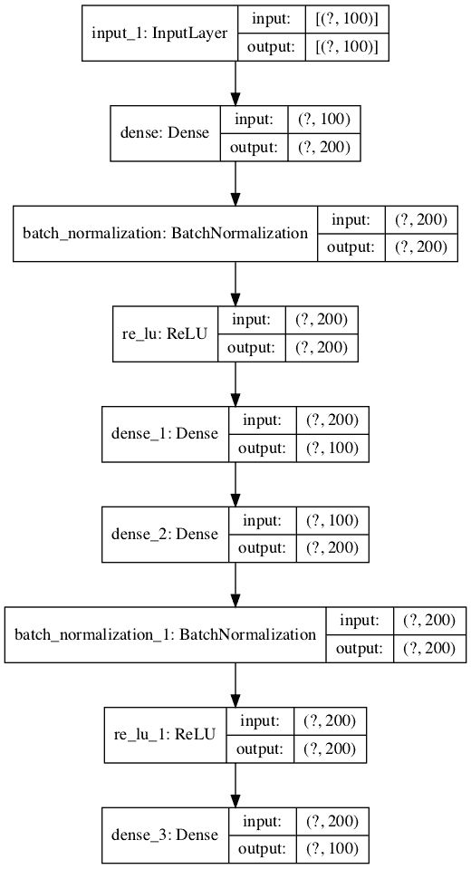
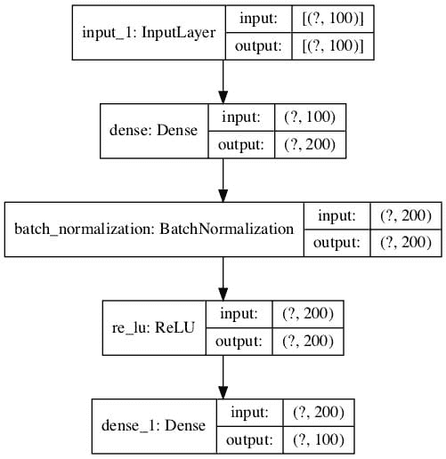
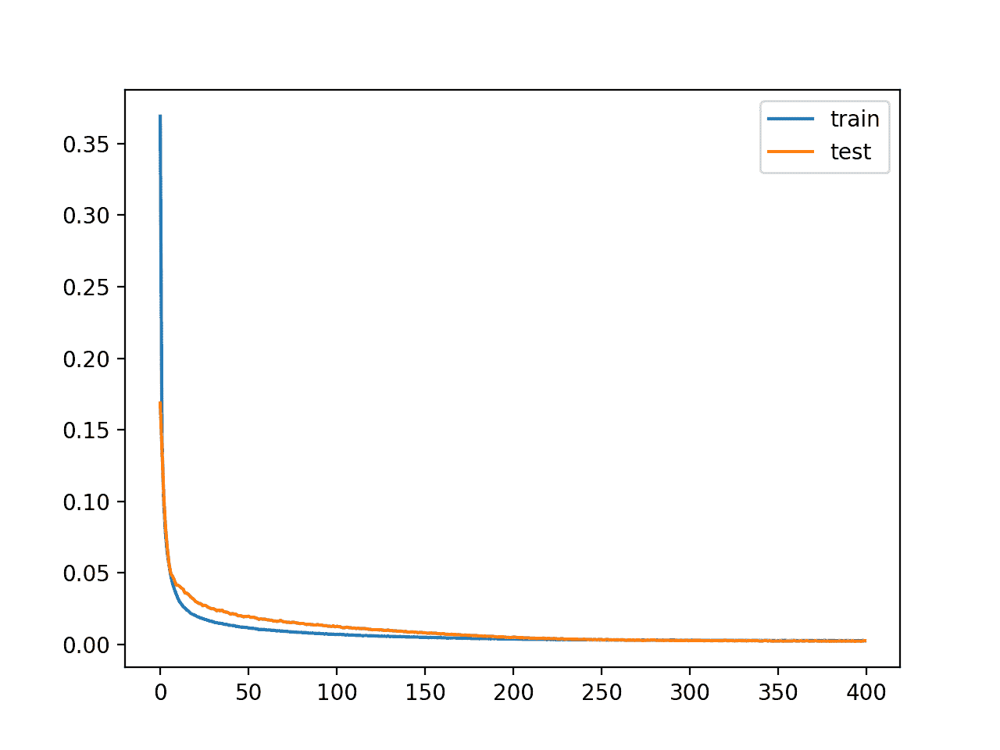

# 回归自动编码器特征提取

> 原文:[https://machinelearning master . com/auto encoder-for-revolution/](https://machinelearningmastery.com/autoencoder-for-regression/)

自动编码器是一种神经网络，可用于学习原始数据的压缩表示。

自动编码器由编码器和解码器子模型组成。编码器压缩输入，解码器尝试根据编码器提供的压缩版本重新创建输入。训练后，编码器模型被保存，解码器被丢弃。

然后，编码器可用作数据准备技术，对原始数据执行特征提取，该原始数据可用于训练不同的机器学习模型。

在本教程中，您将了解如何开发和评估用于回归预测的自动编码器

完成本教程后，您将知道:

*   自动编码器是一种神经网络模型，可用于学习原始数据的压缩表示。
*   如何在训练数据集上训练自动编码器模型，并只保存模型的编码器部分。
*   训练机器学习模型时如何将编码器作为数据准备步骤？

我们开始吧。


自动编码器特征提取回归
照片作者[西蒙·马津格](https://www.flickr.com/photos/simonmatzinger/16693660849/)，保留部分权利。

## 教程概述

本教程分为三个部分；它们是:

1.  用于特征提取的自动编码器
2.  回归自动编码器
3.  自动编码器作为数据准备

## 用于特征提取的自动编码器

自动编码器[是一种神经网络模型，旨在学习输入的压缩表示。](https://en.wikipedia.org/wiki/Autoencoder)

> 自动编码器是一个神经网络，它被训练成试图将其输入复制到其输出。

—第 502 页，[深度学习](https://amzn.to/3kV7gdV)，2016。

它们是一种无监督的学习方法，尽管从技术上来说，它们是使用有监督的学习方法训练的，称为自监督。它们通常被训练为试图重新创建输入的更广泛模型的一部分。

例如:

*   X =模型.预测(X)

自动编码器模型的设计有目的地将架构限制在模型中点的瓶颈上，从而使这一点具有挑战性，输入数据的重建就是从这个瓶颈开始的。

自动编码器有许多类型，它们的用途各不相同，但可能更常见的用途是作为一个学习或自动特征提取模型。

在这种情况下，一旦模型被拟合，模型的重建方面可以被丢弃，并且直到瓶颈点的模型可以被使用。瓶颈处的模型输出是一个固定长度的向量，它提供了输入数据的压缩表示。

> 通常，它们受到限制，只允许近似复制，并且只复制类似于训练数据的输入。因为模型被迫优先考虑应该复制输入的哪些方面，所以它经常学习数据的有用属性。

—第 502 页，[深度学习](https://amzn.to/3kV7gdV)，2016。

然后可以将来自域的输入数据提供给模型，并且瓶颈处的模型输出可以用作监督学习模型中的特征向量，用于可视化，或者更一般地用于降维。

接下来，让我们探索如何针对回归预测建模问题开发用于特征提取的自动编码器。

## 回归自动编码器

在本节中，我们将开发一个自动编码器来学习回归预测建模问题的输入特征的压缩表示。

首先，让我们定义一个回归预测建模问题。

我们将使用[make _ revolution()sci kit-learn 函数](https://scikit-learn.org/stable/modules/generated/sklearn.datasets.make_regression.html)定义一个包含 100 个输入特征(列)和 1000 个示例(行)的合成回归任务。重要的是，我们将以这样的方式定义问题，即大多数输入变量是冗余的(100%或 90%中的 90%)，允许自动编码器稍后学习有用的压缩表示。

下面的示例定义了数据集并总结了它的形状。

```py
# synthetic regression dataset
from sklearn.datasets import make_regression
# define dataset
X, y = make_regression(n_samples=1000, n_features=100, n_informative=10, noise=0.1, random_state=1)
# summarize the dataset
print(X.shape, y.shape)
```

运行该示例定义数据集并打印数组的形状，确认行数和列数。

```py
(1000, 100) (1000,)
```

接下来，我们将开发一个多层感知器(MLP)自动编码器模型。

该模型将采用所有输入列，然后输出相同的值。它将学会精确地重新创建输入模式。

自动编码器由两部分组成:编码器和解码器。编码器学习如何解释输入，并将其压缩为瓶颈层定义的内部表示。解码器获取编码器的输出(瓶颈层)，并尝试重新创建输入。

一旦自动编码器被训练，解码就被丢弃，我们只保留编码器，并使用它将输入的例子压缩成瓶颈层输出的向量。

在第一个自动编码器中，我们根本不会压缩输入，而是使用与输入大小相同的瓶颈层。这应该是一个简单的问题，模型将学习得近乎完美，并旨在确认我们的模型被正确实现。

我们将使用功能性应用编程接口来定义模型。如果您不熟悉，我推荐本教程:

*   [如何使用 Keras 函数 API 进行深度学习](https://machinelearningmastery.com/keras-functional-api-deep-learning/)

在定义和拟合模型之前，我们将把数据分成训练集和测试集，并通过将值归一化到 0-1 的范围来缩放输入数据，这是 MLPs 的一个很好的实践。

```py
...
# split into train test sets
X_train, X_test, y_train, y_test = train_test_split(X, y, test_size=0.33, random_state=1)
# scale data
t = MinMaxScaler()
t.fit(X_train)
X_train = t.transform(X_train)
X_test = t.transform(X_test)
```

我们将定义编码器有一个隐藏层，其节点数与输入数据中的节点数相同，具有批处理规范化和 [ReLU 激活](https://machinelearningmastery.com/rectified-linear-activation-function-for-deep-learning-neural-networks/)。

随后是瓶颈层，其节点数与输入数据中的列数相同，例如没有压缩。

```py
...
# define encoder
visible = Input(shape=(n_inputs,))
e = Dense(n_inputs*2)(visible)
e = BatchNormalization()(e)
e = ReLU()(e)
# define bottleneck
n_bottleneck = n_inputs
bottleneck = Dense(n_bottleneck)(e)
```

解码器将以相同的结构定义。

它将有一个带有批处理规范化和 ReLU 激活的隐藏层。输出层的节点数将与输入数据中的列数相同，并将使用线性激活函数输出数值。

```py
...
# define decoder
d = Dense(n_inputs*2)(bottleneck)
d = BatchNormalization()(d)
d = ReLU()(d)
# output layer
output = Dense(n_inputs, activation='linear')(d)
# define autoencoder model
model = Model(inputs=visible, outputs=output)
# compile autoencoder model
model.compile(optimizer='adam', loss='mse')
```

考虑到重建是一种多输出回归问题，模型将使用随机梯度下降的有效 Adam 版本进行拟合，并最小化均方误差。

```py
...
# compile autoencoder model
model.compile(optimizer='adam', loss='mse')
```

我们可以在自动编码器模型中绘制图层，以了解数据如何在模型中流动。

```py
...
# plot the autoencoder
plot_model(model, 'autoencoder.png', show_shapes=True)
```

下图显示了自动编码器的曲线图。



回归的自动编码器模型图

接下来，我们可以训练模型来重现输入，并跟踪模型在保持测试集上的性能。该模型针对 400 个时期和 16 个实例的批量进行训练。

```py
...
# fit the autoencoder model to reconstruct input
history = model.fit(X_train, X_train, epochs=400, batch_size=16, verbose=2, validation_data=(X_test,X_test))
```

训练后，我们可以为训练集和测试集绘制学习曲线，以确认模型很好地学习了重建问题。

```py
...
# plot loss
pyplot.plot(history.history['loss'], label='train')
pyplot.plot(history.history['val_loss'], label='test')
pyplot.legend()
pyplot.show()
```

最后，如果需要，我们可以保存编码器模型供以后使用。

```py
...
# define an encoder model (without the decoder)
encoder = Model(inputs=visible, outputs=bottleneck)
plot_model(encoder, 'encoder.png', show_shapes=True)
# save the encoder to file
encoder.save('encoder.h5')
```

作为保存编码器的一部分，我们还将绘制模型，以获得瓶颈层输出的形状感觉，例如 100 元素向量。

下面提供了该图的示例。



无压缩回归的编码器模型图

将所有这些结合在一起，下面列出了一个完整的自动编码器示例，用于在瓶颈层没有任何压缩的情况下重建回归数据集的输入数据。

```py
# train autoencoder for regression with no compression in the bottleneck layer
from sklearn.datasets import make_regression
from sklearn.preprocessing import MinMaxScaler
from sklearn.model_selection import train_test_split
from tensorflow.keras.models import Model
from tensorflow.keras.layers import Input
from tensorflow.keras.layers import Dense
from tensorflow.keras.layers import ReLU
from tensorflow.keras.layers import BatchNormalization
from tensorflow.keras.utils import plot_model
from matplotlib import pyplot
# define dataset
X, y = make_regression(n_samples=1000, n_features=100, n_informative=10, noise=0.1, random_state=1)
# number of input columns
n_inputs = X.shape[1]
# split into train test sets
X_train, X_test, y_train, y_test = train_test_split(X, y, test_size=0.33, random_state=1)
# scale data
t = MinMaxScaler()
t.fit(X_train)
X_train = t.transform(X_train)
X_test = t.transform(X_test)
# define encoder
visible = Input(shape=(n_inputs,))
e = Dense(n_inputs*2)(visible)
e = BatchNormalization()(e)
e = ReLU()(e)
# define bottleneck
n_bottleneck = n_inputs
bottleneck = Dense(n_bottleneck)(e)
# define decoder
d = Dense(n_inputs*2)(bottleneck)
d = BatchNormalization()(d)
d = ReLU()(d)
# output layer
output = Dense(n_inputs, activation='linear')(d)
# define autoencoder model
model = Model(inputs=visible, outputs=output)
# compile autoencoder model
model.compile(optimizer='adam', loss='mse')
# plot the autoencoder
plot_model(model, 'autoencoder.png', show_shapes=True)
# fit the autoencoder model to reconstruct input
history = model.fit(X_train, X_train, epochs=400, batch_size=16, verbose=2, validation_data=(X_test,X_test))
# plot loss
pyplot.plot(history.history['loss'], label='train')
pyplot.plot(history.history['val_loss'], label='test')
pyplot.legend()
pyplot.show()
# define an encoder model (without the decoder)
encoder = Model(inputs=visible, outputs=bottleneck)
plot_model(encoder, 'encoder.png', show_shapes=True)
# save the encoder to file
encoder.save('encoder.h5')
```

运行该示例符合模型，并报告沿途火车和测试集的损失。

**注意**:如果在创建模型的地块时遇到问题，可以注释掉导入，调用 *plot_model()* 函数。

**注**:考虑到算法或评估程序的随机性，或数值精度的差异，您的[结果可能会有所不同](https://machinelearningmastery.com/different-results-each-time-in-machine-learning/)。考虑运行该示例几次，并比较平均结果。

在这种情况下，我们看到，在瓶颈层没有压缩的情况下，损耗变低，但不会归零(正如我们可能预期的那样)。也许需要进一步调整模型架构或学习超参数。

```py
...
Epoch 393/400
42/42 - 0s - loss: 0.0025 - val_loss: 0.0024
Epoch 394/400
42/42 - 0s - loss: 0.0025 - val_loss: 0.0021
Epoch 395/400
42/42 - 0s - loss: 0.0023 - val_loss: 0.0021
Epoch 396/400
42/42 - 0s - loss: 0.0025 - val_loss: 0.0023
Epoch 397/400
42/42 - 0s - loss: 0.0024 - val_loss: 0.0022
Epoch 398/400
42/42 - 0s - loss: 0.0025 - val_loss: 0.0021
Epoch 399/400
42/42 - 0s - loss: 0.0026 - val_loss: 0.0022
Epoch 400/400
42/42 - 0s - loss: 0.0025 - val_loss: 0.0024
```

创建的学习曲线图表明，该模型在重构输入时获得了良好的拟合，在整个训练过程中保持稳定，而不是过度拟合。



无压缩回归自动编码器模型训练的学习曲线

目前为止，一切顺利。我们知道如何开发一个没有压缩的自动编码器。

训练好的编码器保存到文件“ *encoder.h5* ”中，我们以后可以加载使用。

接下来，让我们探索如何使用训练好的编码器模型。

## 自动编码器作为数据准备

在本节中，我们将使用自动编码器模型中经过训练的编码器模型来压缩输入数据并训练不同的预测模型。

首先，让我们在这个问题上建立一个性能基线。这一点很重要，因为如果压缩编码不能提高模型的性能，那么压缩编码就不能增加项目的价值，就不应该使用。

我们可以直接在训练数据集上训练支持向量回归模型，并在保持测试集上评估模型的性能。

作为良好的实践，我们将在拟合和评估模型之前缩放输入变量和目标变量。

下面列出了完整的示例。

```py
# baseline in performance with support vector regression model
from sklearn.datasets import make_regression
from sklearn.preprocessing import MinMaxScaler
from sklearn.model_selection import train_test_split
from sklearn.svm import SVR
from sklearn.metrics import mean_absolute_error
# define dataset
X, y = make_regression(n_samples=1000, n_features=100, n_informative=10, noise=0.1, random_state=1)
# split into train test sets
X_train, X_test, y_train, y_test = train_test_split(X, y, test_size=0.33, random_state=1)
# reshape target variables so that we can transform them
y_train = y_train.reshape((len(y_train), 1))
y_test = y_test.reshape((len(y_test), 1))
# scale input data
trans_in = MinMaxScaler()
trans_in.fit(X_train)
X_train = trans_in.transform(X_train)
X_test = trans_in.transform(X_test)
# scale output data
trans_out = MinMaxScaler()
trans_out.fit(y_train)
y_train = trans_out.transform(y_train)
y_test = trans_out.transform(y_test)
# define model
model = SVR()
# fit model on the training dataset
model.fit(X_train, y_train)
# make prediction on test set
yhat = model.predict(X_test)
# invert transforms so we can calculate errors
yhat = yhat.reshape((len(yhat), 1))
yhat = trans_out.inverse_transform(yhat)
y_test = trans_out.inverse_transform(y_test)
# calculate error
score = mean_absolute_error(y_test, yhat)
print(score)
```

运行该示例适合训练数据集上的支持向量回归模型，并在测试集上对其进行评估。

**注**:考虑到算法或评估程序的随机性，或数值精度的差异，您的[结果可能会有所不同](https://machinelearningmastery.com/different-results-each-time-in-machine-learning/)。考虑运行该示例几次，并比较平均结果。

在这种情况下，我们可以看到模型实现了大约 89 的平均绝对误差(MAE)。

我们希望并期望 SVR 模型适合输入的编码版本，以实现被认为有用的编码的较低误差。

```py
89.51082036130629
```

我们可以更新示例，首先使用上一节中训练的编码器模型对数据进行编码。

首先，我们可以从文件中加载训练好的编码器模型。

```py
...
# load the model from file
encoder = load_model('encoder.h5')
```

然后，我们可以使用编码器将原始输入数据(例如 100 列)转换为瓶颈向量(例如 100 个元素向量)。

这个过程可以应用于训练和测试数据集。

```py
...
# encode the train data
X_train_encode = encoder.predict(X_train)
# encode the test data
X_test_encode = encoder.predict(X_test)
```

然后，我们可以像以前一样，使用这些编码数据来训练和评估 SVR 模型。

```py
...
# define model
model = SVR()
# fit model on the training dataset
model.fit(X_train_encode, y_train)
# make prediction on test set
yhat = model.predict(X_test_encode)
```

将这些联系在一起，完整的示例如下所示。

```py
# support vector regression performance with encoded input
from sklearn.datasets import make_regression
from sklearn.preprocessing import MinMaxScaler
from sklearn.model_selection import train_test_split
from sklearn.svm import SVR
from sklearn.metrics import mean_absolute_error
from tensorflow.keras.models import load_model
# define dataset
X, y = make_regression(n_samples=1000, n_features=100, n_informative=10, noise=0.1, random_state=1)
# split into train test sets
X_train, X_test, y_train, y_test = train_test_split(X, y, test_size=0.33, random_state=1)
# reshape target variables so that we can transform them
y_train = y_train.reshape((len(y_train), 1))
y_test = y_test.reshape((len(y_test), 1))
# scale input data
trans_in = MinMaxScaler()
trans_in.fit(X_train)
X_train = trans_in.transform(X_train)
X_test = trans_in.transform(X_test)
# scale output data
trans_out = MinMaxScaler()
trans_out.fit(y_train)
y_train = trans_out.transform(y_train)
y_test = trans_out.transform(y_test)
# load the model from file
encoder = load_model('encoder.h5')
# encode the train data
X_train_encode = encoder.predict(X_train)
# encode the test data
X_test_encode = encoder.predict(X_test)
# define model
model = SVR()
# fit model on the training dataset
model.fit(X_train_encode, y_train)
# make prediction on test set
yhat = model.predict(X_test_encode)
# invert transforms so we can calculate errors
yhat = yhat.reshape((len(yhat), 1))
yhat = trans_out.inverse_transform(yhat)
y_test = trans_out.inverse_transform(y_test)
# calculate error
score = mean_absolute_error(y_test, yhat)
print(score)
```

运行该示例首先使用编码器对数据集进行编码，然后在训练数据集上拟合一个支持向量回归模型，并在测试集上对其进行评估。

**注**:考虑到算法或评估程序的随机性，或数值精度的差异，您的[结果可能会有所不同](https://machinelearningmastery.com/different-results-each-time-in-machine-learning/)。考虑运行该示例几次，并比较平均结果。

在这种情况下，我们可以看到模型实现了大约 69 的 MAE。

这是一个比在原始数据集上评估的相同模型更好的 MAE，表明编码对我们选择的模型和测试工具有帮助。

```py
69.45890939600503
```

## 进一步阅读

如果您想更深入地了解这个主题，本节将提供更多资源。

### 教程

*   [LSTM 自动编码器简介](https://machinelearningmastery.com/lstm-autoencoders/)
*   [如何使用 Keras 函数 API 进行深度学习](https://machinelearningmastery.com/keras-functional-api-deep-learning/)
*   [TensorFlow 2 教程:使用 tf.keras 开始深度学习](https://machinelearningmastery.com/tensorflow-tutorial-deep-learning-with-tf-keras/)

### 书

*   [深度学习](https://amzn.to/3kV7gdV)，2016 年。

### 蜜蜂

*   [sklearn . datasets . make _ revolution API](https://scikit-learn.org/stable/modules/generated/sklearn.datasets.make_regression.html)。
*   [sklearn . model _ selection . train _ test _ split API](https://scikit-learn.org/stable/modules/generated/sklearn.model_selection.train_test_split.html)。

### 文章

*   [自我编码，维基百科](https://en.wikipedia.org/wiki/Autoencoder)。

## 摘要

在本教程中，您发现了如何开发和评估用于回归预测建模的自动编码器。

具体来说，您了解到:

*   自动编码器是一种神经网络模型，可用于学习原始数据的压缩表示。
*   如何在训练数据集上训练自动编码器模型，并只保存模型的编码器部分。
*   训练机器学习模型时如何将编码器作为数据准备步骤？

**你有什么问题吗？**
在下面的评论中提问，我会尽力回答。