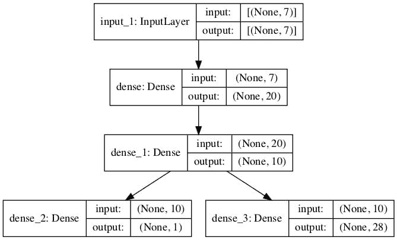

# 用于组合分类和回归的神经网络模型

> 原文：<https://machinelearningmastery.com/neural-network-models-for-combined-classification-and-regression/>

一些预测问题需要预测相同输入的数值和类别标签。

一个简单的方法是在相同的数据上开发回归和分类预测模型，并按顺序使用这些模型。

另一种通常更有效的方法是开发一个单一的神经网络模型，该模型可以从同一输入中预测数值和类别标签值。这被称为**多输出模型**，使用现代深度学习库如 Keras 和 TensorFlow 可以相对容易地开发和评估。

在本教程中，您将发现如何开发用于组合回归和分类预测的神经网络。

完成本教程后，您将知道:

*   有些预测问题需要预测每个输入示例的数值和类别标签值。
*   如何为需要多个输出的问题开发单独的回归和分类模型？
*   如何开发和评估能够同时进行回归和分类预测的神经网络模型？

我们开始吧。


开发用于组合分类和回归的神经网络
图片由[桑特林](https://www.flickr.com/photos/inottawa/6037081748/)提供，保留部分权利。

## 教程概述

本教程分为三个部分；它们是:

1.  回归和分类的单一模型
2.  分离回归和分类模型
    1.  鲍鱼数据集
    2.  回归模型
    3.  分类模型
3.  组合回归和分类模型

## 回归和分类的单一模型

为回归或分类问题开发深度学习神经网络模型是很常见的，但是在一些预测建模任务中，我们可能希望开发一个既能进行回归预测又能进行分类预测的单一模型。

回归是指预测建模问题，包括预测给定输入的数值。

分类指的是预测建模问题，包括预测给定输入的类别标签或类别标签的概率。

有关分类和回归之间区别的更多信息，请参见教程:

*   [机器学习中分类和回归的区别](https://machinelearningmastery.com/classification-versus-regression-in-machine-learning/)

可能会有一些问题，我们希望预测一个数值和一个分类值。

解决这个问题的一种方法是为每个需要的预测开发一个单独的模型。

这种方法的问题在于，不同模型做出的预测可能会有所不同。

在使用神经网络模型时，可以使用的另一种方法是开发一个单一模型，该模型能够对同一输入的数值和类别输出进行单独预测。

这被称为多输出神经网络模型。

这种类型的模型的好处是，我们有一个单一的模型来开发和维护，而不是两个模型，同时在两种输出类型上训练和更新模型可能会在两种输出类型之间的预测中提供更多的一致性。

我们将开发一个能够同时进行回归和分类预测的多输出神经网络模型。

首先，让我们选择一个有意义的数据集，并从为回归和分类预测开发单独的模型开始。

## 分离回归和分类模型

在这一节中，我们将从选择一个真实的数据集开始，在那里我们可能同时需要回归和分类预测，然后为每种类型的预测开发单独的模型。

### 鲍鱼数据集

我们将使用“*鲍鱼*”数据集。

确定鲍鱼的年龄是一项耗时的任务，仅从身体细节来确定年龄是可取的。

这是一个描述鲍鱼的物理细节的数据集，需要预测鲍鱼的环数，这是这种生物年龄的代理。

您可以从这里了解有关数据集的更多信息:

*   [数据集(鲍鱼 csv)](https://raw.githubusercontent.com/jbrownlee/Datasets/master/abalone.csv)
*   [数据集详细信息(鲍鱼名称)](https://raw.githubusercontent.com/jbrownlee/Datasets/master/abalone.names)

“*年龄*”既可以作为数值(以年为单位)预测，也可以作为类别标签(以序数年为类别)预测。

不需要下载数据集，因为我们将自动下载它作为工作示例的一部分。

数据集提供了一个数据集示例，我们可能需要输入的数字和分类。

首先，让我们开发一个下载和总结数据集的示例。

```py
# load and summarize the abalone dataset
from pandas import read_csv
from matplotlib import pyplot
# load dataset
url = 'https://raw.githubusercontent.com/jbrownlee/Datasets/master/abalone.csv'
dataframe = read_csv(url, header=None)
# summarize shape
print(dataframe.shape)
# summarize first few lines
print(dataframe.head())
```

运行该示例首先下载并总结数据集的形状。

我们可以看到，有 4，177 个例子(行)可以用来训练和评估一个模型，以及包括目标变量在内的 9 个特性(列)。

我们可以看到所有的输入变量都是数字，除了第一个，它是一个字符串值。

为了简化数据准备，我们将从模型中删除第一列，并将重点放在数字输入值的建模上。

```py
(4177, 9)
   0      1      2      3       4       5       6      7   8
0  M  0.455  0.365  0.095  0.5140  0.2245  0.1010  0.150  15
1  M  0.350  0.265  0.090  0.2255  0.0995  0.0485  0.070   7
2  F  0.530  0.420  0.135  0.6770  0.2565  0.1415  0.210   9
3  M  0.440  0.365  0.125  0.5160  0.2155  0.1140  0.155  10
4  I  0.330  0.255  0.080  0.2050  0.0895  0.0395  0.055   7
```

我们可以使用这些数据作为开发单独的回归和分类多层感知器(MLP)神经网络模型的基础。

**注**:我们并不是试图为此数据集开发一个最优模型；相反，我们正在演示一种特定的技术:开发一个可以进行回归和分类预测的模型。

### 回归模型

在本节中，我们将为鲍鱼数据集开发一个回归 MLP 模型。

首先，我们必须将列分成输入和输出元素，并删除包含字符串值的第一列。

我们还将强制所有加载的列具有浮点类型(神经网络模型所期望的)，并记录输入特征的数量，这将需要由模型稍后知道。

```py
...
# split into input (X) and output (y) variables
X, y = dataset[:, 1:-1], dataset[:, -1]
X, y = X.astype('float'), y.astype('float')
n_features = X.shape[1]
```

接下来，我们可以将数据集分割成一个训练和测试数据集。

我们将使用 67%的随机样本来训练模型，剩下的 33%用于评估模型。

```py
...
# split data into train and test sets
X_train, X_test, y_train, y_test = train_test_split(X, y, test_size=0.33, random_state=1)
```

然后我们可以定义一个 MLP 神经网络模型。

模型将有两个隐藏层，第一个有 20 个节点，第二个有 10 个节点，都使用 [ReLU 激活](https://machinelearningmastery.com/rectified-linear-activation-function-for-deep-learning-neural-networks/)和*he normal*[权重初始化](https://machinelearningmastery.com/weight-initialization-for-deep-learning-neural-networks/)(很好的做法)。层数和节点数是任意选择的。

输出层将有一个用于预测数值的节点和一个线性激活函数。

```py
...
# define the keras model
model = Sequential()
model.add(Dense(20, input_dim=n_features, activation='relu', kernel_initializer='he_normal'))
model.add(Dense(10, activation='relu', kernel_initializer='he_normal'))
model.add(Dense(1, activation='linear'))
```

该模型将被训练为使用随机梯度下降的有效亚当版本来最小化均方误差损失函数。

```py
...
# compile the keras model
model.compile(loss='mse', optimizer='adam')
```

我们将用 32 个样本的小批量为 150 个时代训练模型，同样是任意选择的。

```py
...
# fit the keras model on the dataset
model.fit(X_train, y_train, epochs=150, batch_size=32, verbose=2)
```

最后，在训练模型后，我们将在保持测试数据集上对其进行评估，并报告平均绝对误差(MAE)。

```py
...
# evaluate on test set
yhat = model.predict(X_test)
error = mean_absolute_error(y_test, yhat)
print('MAE: %.3f' % error)
```

将所有这些联系在一起，鲍鱼数据集的 MLP 神经网络的完整示例被框定为回归问题，如下所示。

```py
# regression mlp model for the abalone dataset
from pandas import read_csv
from tensorflow.keras.models import Sequential
from tensorflow.keras.layers import Dense
from sklearn.metrics import mean_absolute_error
from sklearn.model_selection import train_test_split
# load dataset
url = 'https://raw.githubusercontent.com/jbrownlee/Datasets/master/abalone.csv'
dataframe = read_csv(url, header=None)
dataset = dataframe.values
# split into input (X) and output (y) variables
X, y = dataset[:, 1:-1], dataset[:, -1]
X, y = X.astype('float'), y.astype('float')
n_features = X.shape[1]
# split data into train and test sets
X_train, X_test, y_train, y_test = train_test_split(X, y, test_size=0.33, random_state=1)
# define the keras model
model = Sequential()
model.add(Dense(20, input_dim=n_features, activation='relu', kernel_initializer='he_normal'))
model.add(Dense(10, activation='relu', kernel_initializer='he_normal'))
model.add(Dense(1, activation='linear'))
# compile the keras model
model.compile(loss='mse', optimizer='adam')
# fit the keras model on the dataset
model.fit(X_train, y_train, epochs=150, batch_size=32, verbose=2)
# evaluate on test set
yhat = model.predict(X_test)
error = mean_absolute_error(y_test, yhat)
print('MAE: %.3f' % error)
```

运行该示例将准备数据集，拟合模型，并报告模型误差的估计值。

**注**:考虑到算法或评估程序的随机性，或数值精确率的差异，您的[结果可能会有所不同](https://machinelearningmastery.com/different-results-each-time-in-machine-learning/)。考虑运行该示例几次，并比较平均结果。

在这种情况下，我们可以看到模型实现了大约 1.5(环)的误差。

```py
...
Epoch 145/150
88/88 - 0s - loss: 4.6130
Epoch 146/150
88/88 - 0s - loss: 4.6182
Epoch 147/150
88/88 - 0s - loss: 4.6277
Epoch 148/150
88/88 - 0s - loss: 4.6437
Epoch 149/150
88/88 - 0s - loss: 4.6166
Epoch 150/150
88/88 - 0s - loss: 4.6132
MAE: 1.554
```

目前为止一切顺利。

接下来，让我们看看开发一个类似的分类模型。

### 分类模型

鲍鱼数据集可以被构建为一个分类问题，其中每个“*环*”整数被视为一个单独的类标签。

示例和模型与上面的回归示例基本相同，只是有一些重要的变化。

这需要首先为每个“*环*值分配一个单独的整数，从 0 开始，以“*类*的总数减 1 结束。

这可以通过[标签编码器](https://scikit-learn.org/stable/modules/generated/sklearn.preprocessing.LabelEncoder.html)来实现。

我们还可以将类的总数记录为唯一编码类值的总数，这将是模型稍后需要的。

```py
...
# encode strings to integer
y = LabelEncoder().fit_transform(y)
n_class = len(unique(y))
```

像以前一样将数据拆分为训练集和测试集后，我们可以定义模型，并将模型的输出数量更改为等于类的数量，并使用多类分类通用的 softmax 激活函数。

```py
...
# define the keras model
model = Sequential()
model.add(Dense(20, input_dim=n_features, activation='relu', kernel_initializer='he_normal'))
model.add(Dense(10, activation='relu', kernel_initializer='he_normal'))
model.add(Dense(n_class, activation='softmax'))
```

假设我们已经将类标签编码为整数值，我们可以通过最小化稀疏分类交叉熵损失函数来拟合模型，适用于具有整数编码类标签的多类分类任务。

```py
...
# compile the keras model
model.compile(loss='sparse_categorical_crossentropy', optimizer='adam')
```

如前所述，在将模型拟合到训练数据集上之后，我们可以通过计算保持测试集上的分类精确率来评估模型的性能。

```py
...
# evaluate on test set
yhat = model.predict(X_test)
yhat = argmax(yhat, axis=-1).astype('int')
acc = accuracy_score(y_test, yhat)
print('Accuracy: %.3f' % acc)
```

将所有这些结合起来，下面列出了鲍鱼数据集的 MLP 神经网络作为分类问题的完整示例。

```py
# classification mlp model for the abalone dataset
from numpy import unique
from numpy import argmax
from pandas import read_csv
from tensorflow.keras.models import Sequential
from tensorflow.keras.layers import Dense
from sklearn.metrics import accuracy_score
from sklearn.model_selection import train_test_split
from sklearn.preprocessing import LabelEncoder
# load dataset
url = 'https://raw.githubusercontent.com/jbrownlee/Datasets/master/abalone.csv'
dataframe = read_csv(url, header=None)
dataset = dataframe.values
# split into input (X) and output (y) variables
X, y = dataset[:, 1:-1], dataset[:, -1]
X, y = X.astype('float'), y.astype('float')
n_features = X.shape[1]
# encode strings to integer
y = LabelEncoder().fit_transform(y)
n_class = len(unique(y))
# split data into train and test sets
X_train, X_test, y_train, y_test = train_test_split(X, y, test_size=0.33, random_state=1)
# define the keras model
model = Sequential()
model.add(Dense(20, input_dim=n_features, activation='relu', kernel_initializer='he_normal'))
model.add(Dense(10, activation='relu', kernel_initializer='he_normal'))
model.add(Dense(n_class, activation='softmax'))
# compile the keras model
model.compile(loss='sparse_categorical_crossentropy', optimizer='adam')
# fit the keras model on the dataset
model.fit(X_train, y_train, epochs=150, batch_size=32, verbose=2)
# evaluate on test set
yhat = model.predict(X_test)
yhat = argmax(yhat, axis=-1).astype('int')
acc = accuracy_score(y_test, yhat)
print('Accuracy: %.3f' % acc)
```

运行该示例将准备数据集，拟合模型，并报告模型误差的估计值。

**注**:考虑到算法或评估程序的随机性，或数值精确率的差异，您的[结果可能会有所不同](https://machinelearningmastery.com/different-results-each-time-in-machine-learning/)。考虑运行该示例几次，并比较平均结果。

在这种情况下，我们可以看到模型达到了大约 27%的准确率。

```py
...
Epoch 145/150
88/88 - 0s - loss: 1.9271
Epoch 146/150
88/88 - 0s - loss: 1.9265
Epoch 147/150
88/88 - 0s - loss: 1.9265
Epoch 148/150
88/88 - 0s - loss: 1.9271
Epoch 149/150
88/88 - 0s - loss: 1.9262
Epoch 150/150
88/88 - 0s - loss: 1.9260
Accuracy: 0.274
```

目前为止一切顺利。

接下来，让我们看看开发一个能够进行回归和分类预测的组合模型。

## 组合回归和分类模型

在这一部分，我们可以开发一个单一的 MLP 神经网络模型，可以对单一输入进行回归和分类预测。

这被称为多输出模型，可以使用功能性的 Keras API 进行开发。

关于这个函数式 API 的更多信息，对于初学者来说可能很棘手，请参见教程:

*   [TensorFlow 2 教程:使用 tf.keras 开始深度学习](https://machinelearningmastery.com/tensorflow-tutorial-deep-learning-with-tf-keras/)
*   [如何使用 Keras 函数 API 进行深度学习](https://machinelearningmastery.com/keras-functional-api-deep-learning/)

首先，必须准备好数据集。

我们可以像以前一样准备数据集进行分类，尽管我们应该用单独的名称保存编码的目标变量，以将其与原始目标变量值区分开来。

```py
...
# encode strings to integer
y_class = LabelEncoder().fit_transform(y)
n_class = len(unique(y_class))
```

然后，我们可以将输入、原始输出和编码输出变量分成训练集和测试集。

```py
...
# split data into train and test sets
X_train, X_test, y_train, y_test, y_train_class, y_test_class = train_test_split(X, y, y_class, test_size=0.33, random_state=1)
```

接下来，我们可以使用功能 API 来定义模型。

该模型采用与独立模型相同数量的输入，并使用以相同方式配置的两个隐藏层。

```py
...
# input
visible = Input(shape=(n_features,))
hidden1 = Dense(20, activation='relu', kernel_initializer='he_normal')(visible)
hidden2 = Dense(10, activation='relu', kernel_initializer='he_normal')(hidden1)
```

然后，我们可以定义两个独立的输出层，它们连接到模型的第二个隐藏层。

第一个是回归输出层，具有单个节点和线性激活函数。

```py
...
# regression output
out_reg = Dense(1, activation='linear')(hidden2)
```

第二个是分类输出层，每个被预测的类有一个节点，并使用 softmax 激活函数。

```py
...
# classification output
out_clas = Dense(n_class, activation='softmax')(hidden2)
```

然后，我们可以用一个输入层和两个输出层来定义模型。

```py
...
# define model
model = Model(inputs=visible, outputs=[out_reg, out_clas])
```

给定两个输出层，我们可以编译具有两个损失函数的模型，第一(回归)输出层的均方误差损失和第二(分类)输出层的稀疏分类交叉熵。

```py
...
# compile the keras model
model.compile(loss=['mse','sparse_categorical_crossentropy'], optimizer='adam')
```

我们也可以创建一个模型图作为参考。

这要求安装 pydot 和 pygraphviz。如果这是一个问题，您可以注释掉这一行和 *plot_model()* 函数的导入语句。

```py
...
# plot graph of model
plot_model(model, to_file='model.png', show_shapes=True)
```

模型每次做预测，都会预测两个值。

类似地，当训练模型时，对于每个输出，每个样本需要一个目标变量。

因此，我们可以训练模型，小心地为模型的每个输出提供回归目标和分类目标数据。

```py
...
# fit the keras model on the dataset
model.fit(X_train, [y_train,y_train_class], epochs=150, batch_size=32, verbose=2)
```

然后，拟合模型可以对搁置测试集中的每个示例进行回归和分类预测。

```py
...
# make predictions on test set
yhat1, yhat2 = model.predict(X_test)
```

第一个数组可用于通过平均绝对误差评估回归预测。

```py
...
# calculate error for regression model
error = mean_absolute_error(y_test, yhat1)
print('MAE: %.3f' % error)
```

第二阵列可用于通过分类精确率评估分类预测。

```py
...
# evaluate accuracy for classification model
yhat2 = argmax(yhat2, axis=-1).astype('int')
acc = accuracy_score(y_test_class, yhat2)
print('Accuracy: %.3f' % acc)
```

就这样。

将这些结合起来，下面列出了在鲍鱼数据集上训练和评估用于组合器回归和分类预测的多输出模型的完整示例。

```py
# mlp for combined regression and classification predictions on the abalone dataset
from numpy import unique
from numpy import argmax
from pandas import read_csv
from sklearn.metrics import mean_absolute_error
from sklearn.metrics import accuracy_score
from sklearn.model_selection import train_test_split
from sklearn.preprocessing import LabelEncoder
from tensorflow.keras.models import Model
from tensorflow.keras.layers import Input
from tensorflow.keras.layers import Dense
from tensorflow.keras.utils import plot_model
# load dataset
url = 'https://raw.githubusercontent.com/jbrownlee/Datasets/master/abalone.csv'
dataframe = read_csv(url, header=None)
dataset = dataframe.values
# split into input (X) and output (y) variables
X, y = dataset[:, 1:-1], dataset[:, -1]
X, y = X.astype('float'), y.astype('float')
n_features = X.shape[1]
# encode strings to integer
y_class = LabelEncoder().fit_transform(y)
n_class = len(unique(y_class))
# split data into train and test sets
X_train, X_test, y_train, y_test, y_train_class, y_test_class = train_test_split(X, y, y_class, test_size=0.33, random_state=1)
# input
visible = Input(shape=(n_features,))
hidden1 = Dense(20, activation='relu', kernel_initializer='he_normal')(visible)
hidden2 = Dense(10, activation='relu', kernel_initializer='he_normal')(hidden1)
# regression output
out_reg = Dense(1, activation='linear')(hidden2)
# classification output
out_clas = Dense(n_class, activation='softmax')(hidden2)
# define model
model = Model(inputs=visible, outputs=[out_reg, out_clas])
# compile the keras model
model.compile(loss=['mse','sparse_categorical_crossentropy'], optimizer='adam')
# plot graph of model
plot_model(model, to_file='model.png', show_shapes=True)
# fit the keras model on the dataset
model.fit(X_train, [y_train,y_train_class], epochs=150, batch_size=32, verbose=2)
# make predictions on test set
yhat1, yhat2 = model.predict(X_test)
# calculate error for regression model
error = mean_absolute_error(y_test, yhat1)
print('MAE: %.3f' % error)
# evaluate accuracy for classification model
yhat2 = argmax(yhat2, axis=-1).astype('int')
acc = accuracy_score(y_test_class, yhat2)
print('Accuracy: %.3f' % acc)
```

运行该示例将准备数据集，拟合模型，并报告模型误差的估计值。

**注**:考虑到算法或评估程序的随机性，或数值精确率的差异，您的[结果可能会有所不同](https://machinelearningmastery.com/different-results-each-time-in-machine-learning/)。考虑运行该示例几次，并比较平均结果。

创建多输出模型的图，清楚地显示连接到模型的第二个隐藏层的回归(左)和分类(右)输出层。



用于组合回归和分类预测的多输出模型图

在这种情况下，我们可以看到该模型实现了大约 1.495(环)的合理误差和大约 25.6%的类似精确率。

```py
...
Epoch 145/150
88/88 - 0s - loss: 6.5707 - dense_2_loss: 4.5396 - dense_3_loss: 2.0311
Epoch 146/150
88/88 - 0s - loss: 6.5753 - dense_2_loss: 4.5466 - dense_3_loss: 2.0287
Epoch 147/150
88/88 - 0s - loss: 6.5970 - dense_2_loss: 4.5723 - dense_3_loss: 2.0247
Epoch 148/150
88/88 - 0s - loss: 6.5640 - dense_2_loss: 4.5389 - dense_3_loss: 2.0251
Epoch 149/150
88/88 - 0s - loss: 6.6053 - dense_2_loss: 4.5827 - dense_3_loss: 2.0226
Epoch 150/150
88/88 - 0s - loss: 6.5754 - dense_2_loss: 4.5524 - dense_3_loss: 2.0230
MAE: 1.495
Accuracy: 0.256
```

## 进一步阅读

如果您想更深入地了解这个主题，本节将提供更多资源。

### 教程

*   [机器学习中分类和回归的区别](https://machinelearningmastery.com/classification-versus-regression-in-machine-learning/)
*   [TensorFlow 2 教程:使用 tf.keras 开始深度学习](https://machinelearningmastery.com/tensorflow-tutorial-deep-learning-with-tf-keras/)
*   [标准机器学习数据集的最佳结果](https://machinelearningmastery.com/results-for-standard-classification-and-regression-machine-learning-datasets/)
*   [如何使用 Keras 函数 API 进行深度学习](https://machinelearningmastery.com/keras-functional-api-deep-learning/)

## 摘要

在本教程中，您发现了如何开发用于组合回归和分类预测的神经网络。

具体来说，您了解到:

*   有些预测问题需要预测每个输入示例的数值和类别标签值。
*   如何为需要多个输出的问题开发单独的回归和分类模型？
*   如何开发和评估能够同时进行回归和分类预测的神经网络模型？

**你有什么问题吗？**
在下面的评论中提问，我会尽力回答。