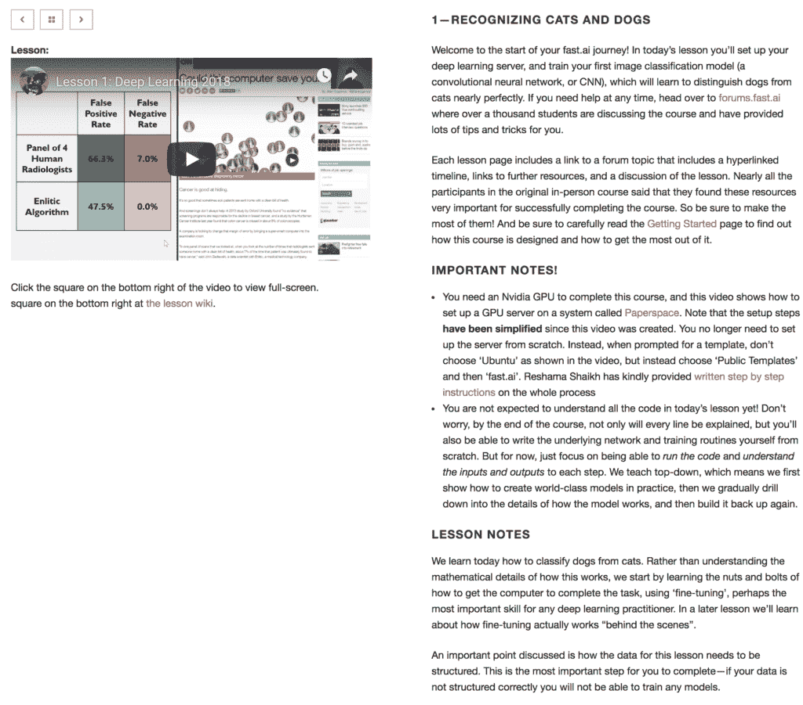
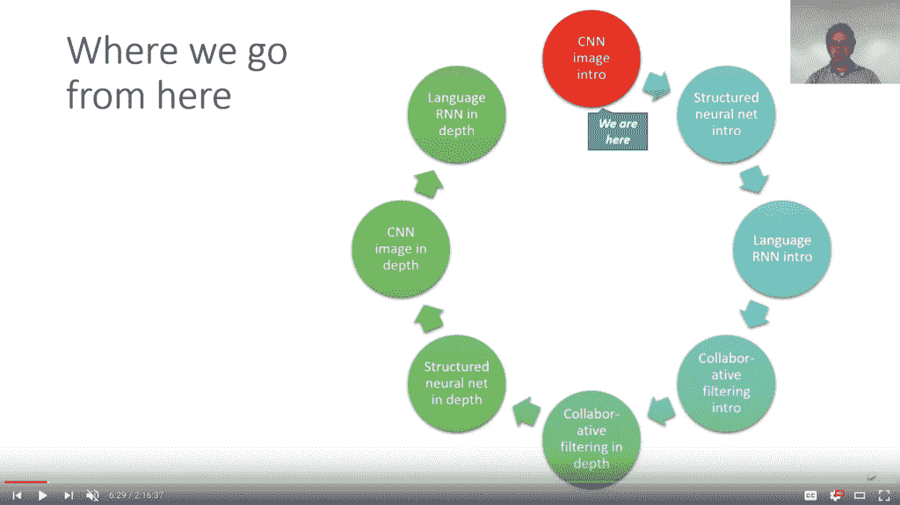
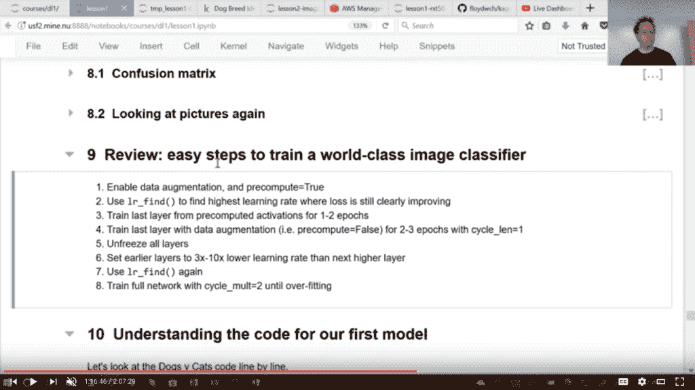

# 面向程序员的实用深度学习(复习)

> 原文：<https://machinelearningmastery.com/practical-deep-learning-for-coders-review/>

最后更新于 2019 年 11 月 1 日

实用的深度学习是一门具有挑战性的学科。

它通常以自下而上的方式教授，要求您在最终学习神经网络技术之前首先熟悉线性代数、微积分和数学优化。这可能需要几年的时间，而且大部分的背景理论都不会帮你得到好的结果，快。

相反，可以使用自上而下的方法，首先学习如何利用现实问题的深度学习模型获得结果，然后进一步学习这些方法是如何工作的。

这正是在 fast.ai 上教授的流行事业中使用的方法，名为“程序员实用深度学习”

在这篇文章中，您将发现 fast.ai 课程，该课程面向希望入门并擅长深度学习的开发人员，包括课程本身的概述、课程中介绍的最佳实践以及对整个课程的讨论和回顾。

**用我的新书[用 Python 深度学习](https://machinelearningmastery.com/deep-learning-with-python/)来启动你的项目**，包括*分步教程*和所有示例的 *Python 源代码*文件。

我们开始吧。

*   **2019 年 11 月更新**:修复了 2019 版课程更新后的断链。

程序员实用深度学习回顾
图片由[弗雷泽·穆梅利](https://www.flickr.com/photos/73014677@N05/10035345914/)提供，版权所有。

## 概观

本教程分为四个部分；它们是:

1.  课程概述
2.  课程分解
3.  最佳实践
4.  讨论和回顾

## 课程概述

fast.ai 是一个小型组织，提供关于实用机器学习和深度学习的免费培训。

他们的使命是让深度学习对所有人开放，真正对开发者开放。

在写这篇文章的时候，fast.ai 提供了四门课程；它们是:

*   [面向程序员的实用深度学习，第 1 部分](https://course.fast.ai/)
*   [面向程序员的前沿深度学习，第 2 部分](https://course.fast.ai/part2.html)
*   [面向编码人员的机器学习介绍](http://course18.fast.ai/ml.html)
*   [编码器的计算线性代数](https://github.com/fastai/numerical-linear-algebra/blob/master/README.md)

该组织由[杰瑞米·霍华德](https://www.linkedin.com/in/howardjeremy/)(恩利蒂克、卡格尔等)和[蕾切尔·托马斯](https://www.linkedin.com/in/rachel-thomas-942a7923/)(优步三藩市大学等)创立。

杰里米是一名世界级的从业者，他首先在卡格尔上取得了优异的表现，后来加入了公司。他对机器学习或深度学习的实践有什么要说的都应该考虑。雷切尔拥有合作伙伴关系所需的学术(博士)和数学才能，并继续提供深度学习的一些相关数学基础的姐妹课程。

大多数课程首先由杰里米或雷切尔在旧金山大学讲授，然后视频和课程材料免费提供。

值得注意的是他们的第一个也是最重要的课程:

*   **面向程序员的实用深度学习(第一部分)**。

该课程于 2016 年底首次推出。最近对其进行了更新或重新创建(2017 年底)，这是编写本报告时可用的课程的当前版本。这可能会随着未来的更新而改变。

重要的是，课程从 v1 到 v2 的主要变化是从 [Keras 深度学习框架](https://keras.io/)(谷歌 TensorFlow 的包装器)转移到自己的开源 [fast.ai 库](https://github.com/fastai/fastai)，它为脸书的 [PyTorch 深度学习框架](https://pytorch.org/)提供了包装器。

这种从喀拉斯到 PyTorch 的转变是出于灵活性的考虑。他们自己的包装器捕获了许多最先进的方法和最佳实践，但也隐藏了许多细节。它可能最适合从业者，而不太适合学者，比更一般的喀拉斯。

## 课程分解

**更新**:我复习了 2018 版的课程，虽然 [2019 版现在有](https://www.youtube.com/playlist?list=PLfYUBJiXbdtSIJb-Qd3pw0cqCbkGeS0xn)了。

本课程的完整讲座列表如下(每个嵌入式视频的链接)。

*   1.识别猫和狗。
*   2.改进您的图像分类器。
*   3.理解回旋。
*   4.结构化、时间序列和语言模型。
*   5.协同过滤。在训练循环中。
*   6.解释嵌入。从零开始的 RNNs。
*   7.从头再来。

我更喜欢以双倍的速度看视频和做笔记。所有视频都可以作为 YouTube 播放列表。

*   [讲座 YouTube 播放列表(2018)](https://www.youtube.com/playlist?list=PLfYUBJiXbdtS2UQRzyrxmyVHoGW0gmLSM)

将讲座嵌入课程材料的示例

该课程采用自上而下的教学方法，而不是自下而上的方法。具体来说，这意味着首先展示如何做某事，然后重复这个过程，但展示所有的细节。这并不意味着后续一定要数学和理论；相反，它指的是如何取得结果的实际问题。

这是处理材料的一个很好的方法。第三讲中的一张幻灯片(在整个课程中多次出现)概述了这种深度学习的方法；具体来说，前几个教程演示了如何使用计算机视觉、结构化数据(表格数据)、自然语言处理和协作过滤来实现结果，然后这些主题又以相反的顺序进行了介绍，但是模型是从头开始开发的，以展示它们是如何工作的(即不是为什么工作)。

课程结构概述

## 最佳实践

课程的重点是教授最佳实践。

这些是使用深度学习方法处理特定预测建模问题的推荐方法。

最佳实践以过程(例如，处理新的预测建模问题的一致方式)和技术的形式呈现。它们也被烘焙成所有讲座中使用的名为 fast.ai 的 PyTorch 包装。

涵盖了许多最佳实践，有些是微妙的，因为它是介绍主题的方式，而不是指出实践是传统方法的替代方法。

有人试图将最佳做法分类；例如:

*   [30+最佳实践，论坛发帖。](https://forums.fast.ai/t/30-best-practices/12344)
*   [深度学习最佳实践，GitHub。](https://github.com/alessiamarcolini/deep-learning_best-practices)
*   [用于 PyTorch 的 fastai v1:使用现代最佳实践的快速准确的神经网络。](https://www.fast.ai/2018/10/02/fastai-ai/)
*   [从 fast.ai 学到的十大技巧](https://blog.floydhub.com/ten-techniques-from-fast-ai/)

查看我的笔记，我总结了以下一些最佳实践:

*   在计算机视觉中始终使用迁移学习(例如 ImageNet 模型)作为起点，但要仔细选择模型中的点来添加新的图层。
*   在计算机视觉的迁移学习(如差异学习)中，尝试不同层次的不同学习速率。
*   使用测试时间增加给一个模型多次机会做出一个好的预测(哇！).
*   首先用非常小的图像训练模型，然后用更大的图像重新训练(例如，调整图像的大小)。
*   使用循环学习率来快速为 SGD 找到一个好的学习率(例如学习率查找器)。
    *   [训练神经网络的循环学习率](https://arxiv.org/abs/1506.01186)，2015。
*   使用余弦退火学习速率计划，在训练期间重新开始。
    *   [SGDR:温重启随机梯度下降](https://arxiv.org/abs/1608.03983)，2016。
*   将迁移学习用于语言模型。
    *   [文本分类通用语言模型微调](https://arxiv.org/abs/1801.06146)，2018。
*   更广泛地使用嵌入层，例如用于所有分类输入变量，而不仅仅是单词。
*   在协同过滤中为电影和用户使用嵌入层。

我遇到了每一种方法，我只是没有考虑到它们应该是起点(例如最佳实践)。相反，我认为它们是在项目需要时提升绩效的工具。

训练世界级图像分类器的简单步骤

## 讨论和回顾

课程很棒。

*   杰里米是一个大师级的实践者和优秀的沟通者。
*   细节层次是对的:先高层，再低层，但都是怎么做，不是为什么。
*   注重应用而不是技术。

如果你是一个深度学习的实践者或者你想成为，那么这门课程是必须的。

视频对我来说太长了。当我在文本编辑器中做笔记时，我使用了 YouTube 播放列表并双倍时间观看视频。

我在这个阶段对使用 fast.ai 库或 pytorch 不感兴趣，所以我浏览或跳过了代码特定的部分。总的来说，我不喜欢从视频中学习代码，所以我会跳过这些部分。

这些讲座的价值在于看到杰里米使用深度学习方法通过预测建模问题的具体方式背后的步骤和思维过程。因为他专注于好的和快速的结果，你得到的正是你需要知道的，没有其他人强迫你在进入重点之前涉水而过的细节和背景。

有点像吴恩达，他把一切解释得如此简单，以至于你有足够的信心拿起工具并开始使用它们。

他在卡格尔竞赛中的能力让你想深入过去的竞赛数据集来立即测试这些方法。

最后，他在论坛上培养的社区意识，以及他在博客上发布的总结他的教导的帖子，让你想加入并做出贡献。

同样，如果你真的想成为一个深度学习的实践者，这是需要观察的。

## 进一步阅读

如果您想更深入地了解这个主题，本节将提供更多资源。

*   [面向程序员的实用深度学习，第 1 部分，主页](https://course.fast.ai/)。
*   [深度学习证书第一部分，首页](https://www.usfca.edu/data-institute/certificates/deep-learning-part-one)。
*   [Coders 1 实用深度学习，YouTube Playlist (2018)](https://www.youtube.com/playlist?list=PLfYUBJiXbdtS2UQRzyrxmyVHoGW0gmLSM) 。
*   [面向程序员的实用深度学习，Python 笔记本](https://github.com/fastai/fastai/tree/master/courses/dl1)。
*   [马士泰 PyTorch 包装](https://github.com/fastai/fastai) .
*   [与杰瑞米·霍华德的 Fastai v1 深度学习框架，播客访谈](https://twimlai.com/twiml-talk-186-the-fastai-v1-deep-learning-framework-with-jeremy-howard/)。

## 摘要

在这篇文章中，您发现了 fast.ai 课程，该课程面向希望开始并擅长深度学习的开发人员

你学过这门课或者学过这些材料吗？
在下面的评论中让我知道你对它的想法。

你有什么问题吗？
在下面的评论中提问，我会尽力回答。