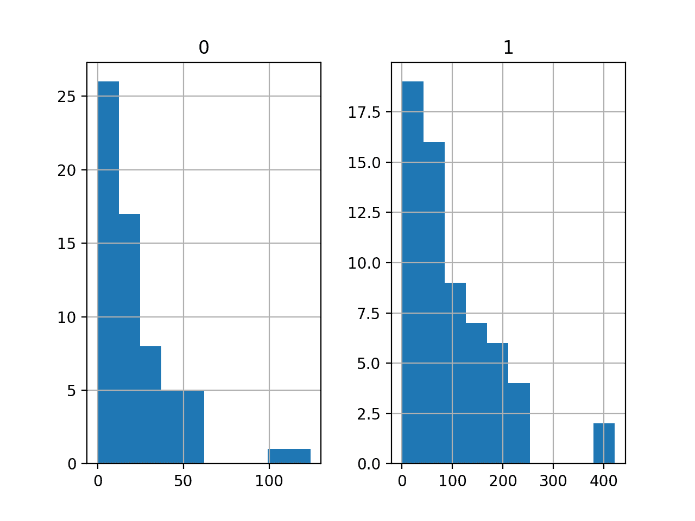
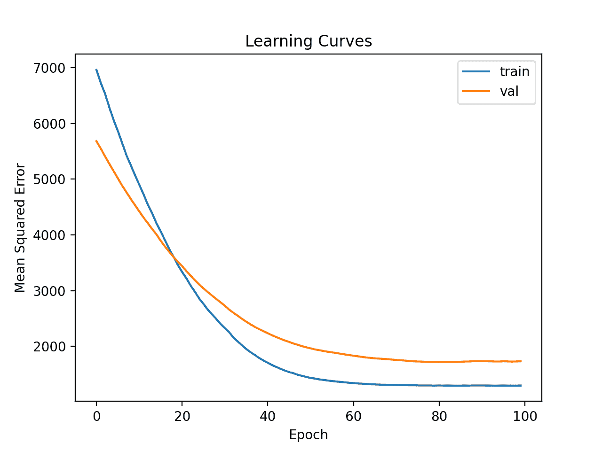
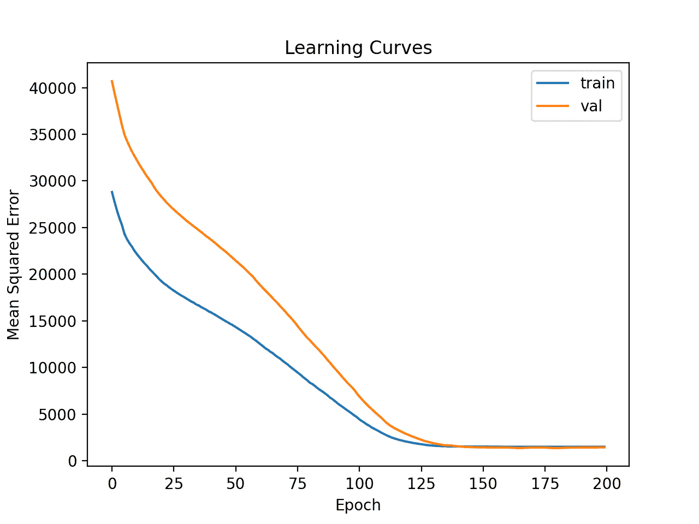
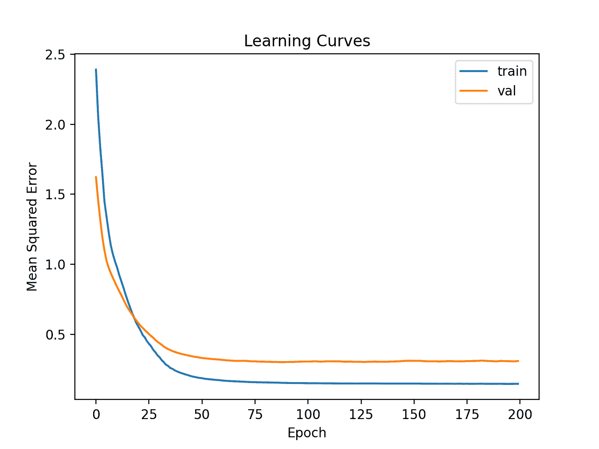

# 如何开发预测车险赔付的神经网络

> 原文:[https://machinelearning master . com/prediction-car-insurance-payment/](https://machinelearningmastery.com/predicting-car-insurance-payout/)

为新数据集开发神经网络预测模型可能具有挑战性。

一种方法是首先检查数据集，并为哪些模型可能起作用提出想法，然后探索数据集上简单模型的学习动态，最后利用强大的测试工具为数据集开发和调整模型。

该过程可用于开发用于分类和回归预测建模问题的有效神经网络模型。

在本教程中，您将发现如何为瑞典汽车保险回归数据集开发多层感知器神经网络模型。

完成本教程后，您将知道:

*   如何加载和总结瑞典汽车保险数据集，并使用结果建议数据准备和模型配置使用。
*   如何探索数据集上简单 MLP 模型和数据转换的学习动态。
*   如何对模型性能进行稳健估计，调整模型性能，并对新数据进行预测。

我们开始吧。


如何开发预测车险赔付的神经网络
图片由[迪米特里·b .](https://www.flickr.com/photos/ru_boff/13663817085/)提供，版权所有。

## 教程概述

本教程分为四个部分；它们是:

1.  汽车保险回归数据集
2.  第一 MLP 和学习动力
3.  评估和调整 MLP 模型
4.  最终模型和做出预测

## 汽车保险回归数据集

第一步是定义和探索数据集。

我们将使用“*汽车保险*”标准回归数据集。

数据集描述了瑞典汽车保险。有一个单一的输入变量，即索赔数量，目标变量是以千[瑞典克朗](https://en.wikipedia.org/wiki/Swedish_krona)为单位的索赔付款总额。目标是预测给定索赔数量的总付款。

您可以在此了解有关数据集的更多信息:

*   [车险数据集(auto-insurance.csv)](https://raw.githubusercontent.com/jbrownlee/Datasets/master/auto-insurance.csv)
*   [汽车保险数据集详细信息(汽车保险.名称)](https://raw.githubusercontent.com/jbrownlee/Datasets/master/auto-insurance.names)

您可以在下面看到数据集的前几行。

```
108,392.5
19,46.2
13,15.7
124,422.2
40,119.4
...
```

我们可以看到这些值是数字，可能从几十到几百。这表明当用神经网络建模时，某种类型的缩放将适用于数据。

我们可以直接从网址将数据集加载为熊猫数据帧；例如:

```
# load the dataset and summarize the shape
from pandas import read_csv
# define the location of the dataset
url = 'https://raw.githubusercontent.com/jbrownlee/Datasets/master/auto-insurance.csv'
# load the dataset
df = read_csv(url, header=None)
# summarize shape
print(df.shape)
```

运行该示例直接从 URL 加载数据集，并报告数据集的形状。

在这种情况下，我们可以确认数据集有两个变量(一个输入和一个输出)，并且数据集有 63 行数据。

对于一个神经网络来说，这不是很多行的数据，这表明一个小的网络，也许有[正则化](https://machinelearningmastery.com/introduction-to-regularization-to-reduce-overfitting-and-improve-generalization-error/)，将是合适的。

它还建议使用 [k 倍交叉验证](https://machinelearningmastery.com/k-fold-cross-validation/)将是一个好主意，因为它将给出比训练/测试分割更可靠的模型性能估计，并且因为单个模型将在几秒钟内适合最大数据集，而不是几小时或几天。

```
(63, 2)
```

接下来，我们可以通过查看汇总统计数据和数据图来了解更多关于数据集的信息。

```
# show summary statistics and plots of the dataset
from pandas import read_csv
from matplotlib import pyplot
# define the location of the dataset
url = 'https://raw.githubusercontent.com/jbrownlee/Datasets/master/auto-insurance.csv'
# load the dataset
df = read_csv(url, header=None)
# show summary statistics
print(df.describe())
# plot histograms
df.hist()
pyplot.show()
```

运行该示例首先加载之前的数据，然后打印每个变量的汇总统计信息

我们可以看到，每个变量的平均值都在十位数，取值范围从 0 到数百。这证实了扩展数据可能是一个好主意。

```
                0           1
count   63.000000   63.000000
mean    22.904762   98.187302
std     23.351946   87.327553
min      0.000000    0.000000
25%      7.500000   38.850000
50%     14.000000   73.400000
75%     29.000000  140.000000
max    124.000000  422.200000
```

然后为每个变量创建直方图。

我们可以看到每个变量都有相似的分布。它看起来像一个偏斜的高斯分布或指数分布。

我们在每个变量上使用幂变换可能会有一些好处，以便使概率分布不那么偏斜，这可能会提高模型性能。



汽车保险回归数据集的直方图

现在我们已经熟悉了数据集，让我们探索如何开发一个神经网络模型。

## 第一 MLP 和学习动力

我们将使用张量流为数据集开发一个多层感知器(MLP)模型。

我们无法知道什么样的学习超参数的模型架构对这个数据集是好的或最好的，所以我们必须实验并发现什么是好的。

假设数据集很小，小的[批量](https://machinelearningmastery.com/how-to-control-the-speed-and-stability-of-training-neural-networks-with-gradient-descent-batch-size/)可能是个好主意，例如 8 或 16 行。开始时使用亚当版本的随机梯度下降是一个好主意，因为它会自动调整学习速率，并且在大多数数据集上运行良好。

在我们认真评估模型之前，最好回顾学习动态，调整模型架构和学习配置，直到我们有稳定的学习动态，然后看看如何从模型中获得最大收益。

我们可以通过对数据进行简单的训练/测试分割并查看[学习曲线](https://machinelearningmastery.com/learning-curves-for-diagnosing-machine-learning-model-performance/)的曲线来做到这一点。这将有助于我们了解自己是学习过度还是学习不足；然后我们可以相应地调整配置。

首先，我们可以将数据集拆分成输入和输出变量，然后分成 67/33 [训练和测试集](https://machinelearningmastery.com/train-test-split-for-evaluating-machine-learning-algorithms/)。

```
...
# split into input and output columns
X, y = df.values[:, :-1], df.values[:, -1]
# split into train and test datasets
X_train, X_test, y_train, y_test = train_test_split(X, y, test_size=0.33)
```

接下来，我们可以定义一个最小 MLP 模型。在这种情况下，我们将使用一个具有 10 个节点的隐藏层和一个输出层(任意选择)。我们将使用隐藏层中的 [ReLU 激活功能](https://machinelearningmastery.com/rectified-linear-activation-function-for-deep-learning-neural-networks/)和 *he_normal* 权重初始化，作为一个整体，它们是一个很好的实践。

模型的输出是线性激活(无激活)，我们将最小化均方误差(MSE)损失。

```
...
# determine the number of input features
n_features = X.shape[1]
# define model
model = Sequential()
model.add(Dense(10, activation='relu', kernel_initializer='he_normal', input_shape=(n_features,)))
model.add(Dense(1))
# compile the model
model.compile(optimizer='adam', loss='mse')
```

我们将为 100 个训练时期(任意选择)拟合模型，批次大小为 8，因为它是一个小数据集。

我们正在原始数据上拟合模型，我们认为这可能是一个坏主意，但这是一个重要的起点。

```
...
# fit the model
history = model.fit(X_train, y_train, epochs=100, batch_size=8, verbose=0, validation_data=(X_test,y_test))
```

在训练结束时，我们将评估模型在测试数据集上的性能，并将性能报告为平均绝对误差(MAE)，与 MSE 或 r MSE 相比，我通常更喜欢它。

```
...
# predict test set
yhat = model.predict(X_test)
# evaluate predictions
score = mean_absolute_error(y_test, yhat)
print('MAE: %.3f' % score)
```

最后，我们将绘制训练和测试集上的均方误差损失的学习曲线。

```
...
# plot learning curves
pyplot.title('Learning Curves')
pyplot.xlabel('Epoch')
pyplot.ylabel('Mean Squared Error')
pyplot.plot(history.history['loss'], label='train')
pyplot.plot(history.history['val_loss'], label='val')
pyplot.legend()
pyplot.show()
```

将所有这些结合起来，下面列出了在汽车保险数据集上评估我们的第一个 MLP 的完整示例。

```
# fit a simple mlp model and review learning curves
from pandas import read_csv
from sklearn.model_selection import train_test_split
from sklearn.metrics import mean_absolute_error
from tensorflow.keras import Sequential
from tensorflow.keras.layers import Dense
from matplotlib import pyplot
# load the dataset
path = 'https://raw.githubusercontent.com/jbrownlee/Datasets/master/auto-insurance.csv'
df = read_csv(path, header=None)
# split into input and output columns
X, y = df.values[:, :-1], df.values[:, -1]
# split into train and test datasets
X_train, X_test, y_train, y_test = train_test_split(X, y, test_size=0.33)
# determine the number of input features
n_features = X.shape[1]
# define model
model = Sequential()
model.add(Dense(10, activation='relu', kernel_initializer='he_normal', input_shape=(n_features,)))
model.add(Dense(1))
# compile the model
model.compile(optimizer='adam', loss='mse')
# fit the model
history = model.fit(X_train, y_train, epochs=100, batch_size=8, verbose=0, validation_data=(X_test,y_test))
# predict test set
yhat = model.predict(X_test)
# evaluate predictions
score = mean_absolute_error(y_test, yhat)
print('MAE: %.3f' % score)
# plot learning curves
pyplot.title('Learning Curves')
pyplot.xlabel('Epoch')
pyplot.ylabel('Mean Squared Error')
pyplot.plot(history.history['loss'], label='train')
pyplot.plot(history.history['val_loss'], label='val')
pyplot.legend()
pyplot.show()
```

运行该示例首先在训练数据集上拟合模型，然后在测试数据集上报告 MAE。

**注**:考虑到算法或评估程序的随机性，或数值精度的差异，您的[结果可能会有所不同](https://machinelearningmastery.com/different-results-each-time-in-machine-learning/)。考虑运行该示例几次，并比较平均结果。

在这种情况下，我们可以看到模型实现了大约 33.2 的 MAE，这是一个很好的性能基线，我们可能可以在此基础上进行改进。

```
MAE: 33.233
```

然后创建列车和测试集上的最小均方误差线图。

我们可以看到，该模型具有很好的拟合性和很好的收敛性。模型的配置是一个很好的起点。



简单 MLP 在汽车保险数据集上的学习曲线

到目前为止，学习动态是好的，MAE 是一个粗略的估计，不应该依赖。

我们可能会稍微增加模型的容量，并期望类似的学习动态。例如，我们可以添加第二个具有八个节点的隐藏层(任意选择)，并将训练时期的数量增加一倍至 200。

```
...
# define model
model = Sequential()
model.add(Dense(10, activation='relu', kernel_initializer='he_normal', input_shape=(n_features,)))
model.add(Dense(8, activation='relu', kernel_initializer='he_normal'))
model.add(Dense(1))
# compile the model
model.compile(optimizer='adam', loss='mse')
# fit the model
history = model.fit(X_train, y_train, epochs=200, batch_size=8, verbose=0, validation_data=(X_test,y_test))
```

下面列出了完整的示例。

```
# fit a deeper mlp model and review learning curves
from pandas import read_csv
from sklearn.model_selection import train_test_split
from sklearn.metrics import mean_absolute_error
from tensorflow.keras import Sequential
from tensorflow.keras.layers import Dense
from matplotlib import pyplot
# load the dataset
path = 'https://raw.githubusercontent.com/jbrownlee/Datasets/master/auto-insurance.csv'
df = read_csv(path, header=None)
# split into input and output columns
X, y = df.values[:, :-1], df.values[:, -1]
# split into train and test datasets
X_train, X_test, y_train, y_test = train_test_split(X, y, test_size=0.33)
# determine the number of input features
n_features = X.shape[1]
# define model
model = Sequential()
model.add(Dense(10, activation='relu', kernel_initializer='he_normal', input_shape=(n_features,)))
model.add(Dense(8, activation='relu', kernel_initializer='he_normal'))
model.add(Dense(1))
# compile the model
model.compile(optimizer='adam', loss='mse')
# fit the model
history = model.fit(X_train, y_train, epochs=200, batch_size=8, verbose=0, validation_data=(X_test,y_test))
# predict test set
yhat = model.predict(X_test)
# evaluate predictions
score = mean_absolute_error(y_test, yhat)
print('MAE: %.3f' % score)
# plot learning curves
pyplot.title('Learning Curves')
pyplot.xlabel('Epoch')
pyplot.ylabel('Mean Squared Error')
pyplot.plot(history.history['loss'], label='train')
pyplot.plot(history.history['val_loss'], label='val')
pyplot.legend()
pyplot.show()
```

运行该示例首先在训练数据集上拟合模型，然后在测试数据集上报告 MAE。

**注**:考虑到算法或评估程序的随机性，或数值精度的差异，您的[结果可能会有所不同](https://machinelearningmastery.com/different-results-each-time-in-machine-learning/)。考虑运行该示例几次，并比较平均结果。

在这种情况下，我们可以看到 MAE 略有提高，约为 27.9，尽管列车/测试分割的高方差意味着这种评估不可靠。

```
MAE: 27.939
```

然后绘制最小均方误差训练和测试集的学习曲线。我们可以看到，正如预期的那样，模型在合理的迭代次数内实现了良好的拟合和收敛。



汽车保险数据集上的深 MLP 学习曲线

最后，我们可以尝试转换数据，看看这会如何影响学习动态。

在这种情况下，我们将使用幂变换来减少数据分布的偏差。这也将自动标准化变量，使它们的平均值为零，标准偏差为 1——这是用神经网络建模时的一个良好做法。

首先，我们必须确保目标变量是一个二维数组。

```
...
# ensure that the target variable is a 2d array
y_train, y_test = y_train.reshape((len(y_train),1)), y_test.reshape((len(y_test),1))
```

接下来，我们可以将[电力变压器](https://machinelearningmastery.com/power-transforms-with-scikit-learn/)应用于输入和目标变量。

这可以通过首先在训练数据上拟合变换，然后变换训练集和测试集来实现。

该过程对输入和输出变量分别应用于[以避免数据泄露](https://machinelearningmastery.com/data-preparation-without-data-leakage/)。

```
...
# power transform input data
pt1 = PowerTransformer()
pt1.fit(X_train)
X_train = pt1.transform(X_train)
X_test = pt1.transform(X_test)
# power transform output data
pt2 = PowerTransformer()
pt2.fit(y_train)
y_train = pt2.transform(y_train)
y_test = pt2.transform(y_test)
```

数据然后被用于拟合模型。

然后，可以根据模型做出的预测和测试集的预期目标值对转换进行反演，我们可以像以前一样以正确的比例计算 MAE。

```
...
# inverse transforms on target variable
y_test = pt2.inverse_transform(y_test)
yhat = pt2.inverse_transform(yhat)
```

将这些联系在一起，下面列出了用转换后的数据拟合和评估 MLP 并创建模型的学习曲线的完整示例。

```
# fit a mlp model with data transforms and review learning curves
from pandas import read_csv
from sklearn.model_selection import train_test_split
from sklearn.metrics import mean_absolute_error
from sklearn.preprocessing import PowerTransformer
from tensorflow.keras import Sequential
from tensorflow.keras.layers import Dense
from matplotlib import pyplot
# load the dataset
path = 'https://raw.githubusercontent.com/jbrownlee/Datasets/master/auto-insurance.csv'
df = read_csv(path, header=None)
# split into input and output columns
X, y = df.values[:, :-1], df.values[:, -1]
# split into train and test datasets
X_train, X_test, y_train, y_test = train_test_split(X, y, test_size=0.33)
# ensure that the target variable is a 2d array
y_train, y_test = y_train.reshape((len(y_train),1)), y_test.reshape((len(y_test),1))
# power transform input data
pt1 = PowerTransformer()
pt1.fit(X_train)
X_train = pt1.transform(X_train)
X_test = pt1.transform(X_test)
# power transform output data
pt2 = PowerTransformer()
pt2.fit(y_train)
y_train = pt2.transform(y_train)
y_test = pt2.transform(y_test)
# determine the number of input features
n_features = X.shape[1]
# define model
model = Sequential()
model.add(Dense(10, activation='relu', kernel_initializer='he_normal', input_shape=(n_features,)))
model.add(Dense(8, activation='relu', kernel_initializer='he_normal'))
model.add(Dense(1))
# compile the model
model.compile(optimizer='adam', loss='mse')
# fit the model
history = model.fit(X_train, y_train, epochs=200, batch_size=8, verbose=0, validation_data=(X_test,y_test))
# predict test set
yhat = model.predict(X_test)
# inverse transforms on target variable
y_test = pt2.inverse_transform(y_test)
yhat = pt2.inverse_transform(yhat)
# evaluate predictions
score = mean_absolute_error(y_test, yhat)
print('MAE: %.3f' % score)
# plot learning curves
pyplot.title('Learning Curves')
pyplot.xlabel('Epoch')
pyplot.ylabel('Mean Squared Error')
pyplot.plot(history.history['loss'], label='train')
pyplot.plot(history.history['val_loss'], label='val')
pyplot.legend()
pyplot.show()
```

运行该示例首先在训练数据集上拟合模型，然后在测试数据集上报告 MAE。

**注**:考虑到算法或评估程序的随机性，或数值精度的差异，您的[结果可能会有所不同](https://machinelearningmastery.com/different-results-each-time-in-machine-learning/)。考虑运行该示例几次，并比较平均结果。

在这种情况下，该模型获得了合理的 MAE 分数，尽管比以前报告的性能差。我们将暂时忽略模型性能。

```
MAE: 34.320
```

创建的学习曲线的线图表明，该模型实现了合理的拟合，并且有足够的时间收敛。



利用汽车保险数据集上的数据变换学习深度 MLP 曲线

现在，我们已经对简单 MLP 模型的学习动态有了一些了解，无论有没有数据转换，我们都可以评估模型的性能以及调整模型的配置。

## 评估和调整 MLP 模型

[k 倍交叉验证程序](https://machinelearningmastery.com/k-fold-cross-validation/)可以提供更可靠的 MLP 性能估计，尽管它可能非常慢。

这是因为 *k* 模型必须拟合和评估。当数据集很小时，例如汽车保险数据集，这不是问题。

我们可以使用 [KFold](https://scikit-learn.org/stable/modules/generated/sklearn.model_selection.KFold.html) 类创建拆分并手动枚举每个折叠，拟合模型，对其进行评估，然后在过程结束时报告评估分数的平均值。

```
# prepare cross validation
kfold = KFold(10)
# enumerate splits
scores = list()
for train_ix, test_ix in kfold.split(X, y):
	# fit and evaluate the model...
	...
...
# summarize all scores
print('Mean MAE: %.3f (%.3f)' % (mean(scores), std(scores)))
```

我们可以使用这个框架，通过一系列不同的数据准备、模型架构和学习配置，来开发 MLP 模型性能的可靠估计。

重要的是，在使用 k-fold 交叉验证来估计性能之前，我们首先了解了上一节中模型在数据集上的学习动态。如果我们开始直接调整模型，我们可能会得到好的结果，但如果没有，我们可能不知道为什么，例如，模型过度或拟合不足。

如果我们再次对模型进行大的更改，最好返回并确认模型正在适当收敛。

下面列出了评估前一节中的基本 MLP 模型的框架的完整示例。

```
# k-fold cross-validation of base model for the auto insurance regression dataset
from numpy import mean
from numpy import std
from pandas import read_csv
from sklearn.model_selection import KFold
from sklearn.metrics import mean_absolute_error
from tensorflow.keras import Sequential
from tensorflow.keras.layers import Dense
from matplotlib import pyplot
# load the dataset
path = 'https://raw.githubusercontent.com/jbrownlee/Datasets/master/auto-insurance.csv'
df = read_csv(path, header=None)
# split into input and output columns
X, y = df.values[:, :-1], df.values[:, -1]
# prepare cross validation
kfold = KFold(10)
# enumerate splits
scores = list()
for train_ix, test_ix in kfold.split(X, y):
	# split data
	X_train, X_test, y_train, y_test = X[train_ix], X[test_ix], y[train_ix], y[test_ix]
	# determine the number of input features
	n_features = X.shape[1]
	# define model
	model = Sequential()
	model.add(Dense(10, activation='relu', kernel_initializer='he_normal', input_shape=(n_features,)))
	model.add(Dense(1))
	# compile the model
	model.compile(optimizer='adam', loss='mse')
	# fit the model
	model.fit(X_train, y_train, epochs=100, batch_size=8, verbose=0)
	# predict test set
	yhat = model.predict(X_test)
	# evaluate predictions
	score = mean_absolute_error(y_test, yhat)
	print('>%.3f' % score)
	scores.append(score)
# summarize all scores
print('Mean MAE: %.3f (%.3f)' % (mean(scores), std(scores)))
```

运行该示例会报告评估程序每次迭代的模型性能，并在运行结束时报告 MAE 的平均值和标准偏差。

**注**:考虑到算法或评估程序的随机性，或数值精度的差异，您的[结果可能会有所不同](https://machinelearningmastery.com/different-results-each-time-in-machine-learning/)。考虑运行该示例几次，并比较平均结果。

在这种情况下，我们可以看到 MLP 模型实现了大约 38.913 的 MAE。

我们将使用这个结果作为我们的基线，看看我们是否可以实现更好的性能。

```
>27.314
>69.577
>20.891
>14.810
>13.412
>69.540
>25.612
>49.508
>35.769
>62.696
Mean MAE: 38.913 (21.056)
```

首先，让我们尝试在原始数据集上评估更深层次的模型，看看它是否比基线模型表现得更好。

```
...
# define model
model = Sequential()
model.add(Dense(10, activation='relu', kernel_initializer='he_normal', input_shape=(n_features,)))
model.add(Dense(8, activation='relu', kernel_initializer='he_normal'))
model.add(Dense(1))
# compile the model
model.compile(optimizer='adam', loss='mse')
# fit the model
model.fit(X_train, y_train, epochs=200, batch_size=8, verbose=0)
```

下面列出了完整的示例。

```
# k-fold cross-validation of deeper model for the auto insurance regression dataset
from numpy import mean
from numpy import std
from pandas import read_csv
from sklearn.model_selection import KFold
from sklearn.metrics import mean_absolute_error
from tensorflow.keras import Sequential
from tensorflow.keras.layers import Dense
from matplotlib import pyplot
# load the dataset
path = 'https://raw.githubusercontent.com/jbrownlee/Datasets/master/auto-insurance.csv'
df = read_csv(path, header=None)
# split into input and output columns
X, y = df.values[:, :-1], df.values[:, -1]
# prepare cross validation
kfold = KFold(10)
# enumerate splits
scores = list()
for train_ix, test_ix in kfold.split(X, y):
	# split data
	X_train, X_test, y_train, y_test = X[train_ix], X[test_ix], y[train_ix], y[test_ix]
	# determine the number of input features
	n_features = X.shape[1]
	# define model
	model = Sequential()
	model.add(Dense(10, activation='relu', kernel_initializer='he_normal', input_shape=(n_features,)))
	model.add(Dense(8, activation='relu', kernel_initializer='he_normal'))
	model.add(Dense(1))
	# compile the model
	model.compile(optimizer='adam', loss='mse')
	# fit the model
	model.fit(X_train, y_train, epochs=200, batch_size=8, verbose=0)
	# predict test set
	yhat = model.predict(X_test)
	# evaluate predictions
	score = mean_absolute_error(y_test, yhat)
	print('>%.3f' % score)
	scores.append(score)
# summarize all scores
print('Mean MAE: %.3f (%.3f)' % (mean(scores), std(scores)))
```

运行报告运行结束时的平均和标准偏差。

**注**:考虑到算法或评估程序的随机性，或数值精度的差异，您的[结果可能会有所不同](https://machinelearningmastery.com/different-results-each-time-in-machine-learning/)。考虑运行该示例几次，并比较平均结果。

在这种情况下，我们可以看到 MLP 模型实现了大约 35.384 的 MAE，这比基线模型实现了大约 38.913 的 MAE 稍好。

```
Mean MAE: 35.384 (14.951)
```

接下来，让我们尝试使用与上一节相同的模型，对输入变量和目标变量进行幂变换。

下面列出了完整的示例。

```
# k-fold cross-validation of deeper model with data transforms
from numpy import mean
from numpy import std
from pandas import read_csv
from sklearn.model_selection import KFold
from sklearn.metrics import mean_absolute_error
from sklearn.preprocessing import PowerTransformer
from tensorflow.keras import Sequential
from tensorflow.keras.layers import Dense
from matplotlib import pyplot
# load the dataset
path = 'https://raw.githubusercontent.com/jbrownlee/Datasets/master/auto-insurance.csv'
df = read_csv(path, header=None)
# split into input and output columns
X, y = df.values[:, :-1], df.values[:, -1]
# prepare cross validation
kfold = KFold(10)
# enumerate splits
scores = list()
for train_ix, test_ix in kfold.split(X, y):
	# split data
	X_train, X_test, y_train, y_test = X[train_ix], X[test_ix], y[train_ix], y[test_ix]
	# ensure target is a 2d array
	y_train, y_test = y_train.reshape((len(y_train),1)), y_test.reshape((len(y_test),1))
	# prepare input data
	pt1 = PowerTransformer()
	pt1.fit(X_train)
	X_train = pt1.transform(X_train)
	X_test = pt1.transform(X_test)
	# prepare target
	pt2 = PowerTransformer()
	pt2.fit(y_train)
	y_train = pt2.transform(y_train)
	y_test = pt2.transform(y_test)
	# determine the number of input features
	n_features = X.shape[1]
	# define model
	model = Sequential()
	model.add(Dense(10, activation='relu', kernel_initializer='he_normal', input_shape=(n_features,)))
	model.add(Dense(8, activation='relu', kernel_initializer='he_normal'))
	model.add(Dense(1))
	# compile the model
	model.compile(optimizer='adam', loss='mse')
	# fit the model
	model.fit(X_train, y_train, epochs=200, batch_size=8, verbose=0)
	# predict test set
	yhat = model.predict(X_test)
	# inverse transforms
	y_test = pt2.inverse_transform(y_test)
	yhat = pt2.inverse_transform(yhat)
	# evaluate predictions
	score = mean_absolute_error(y_test, yhat)
	print('>%.3f' % score)
	scores.append(score)
# summarize all scores
print('Mean MAE: %.3f (%.3f)' % (mean(scores), std(scores)))
```

运行报告运行结束时的平均和标准偏差。

**注**:考虑到算法或评估程序的随机性，或数值精度的差异，您的[结果可能会有所不同](https://machinelearningmastery.com/different-results-each-time-in-machine-learning/)。考虑运行该示例几次，并比较平均结果。

在这种情况下，我们可以看到 MLP 模型实现了大约 37.371 的 MAE，比基线模型好，但并不比更深的基线模型好。

也许这种转变并不像我们最初认为的那样有帮助。

```
Mean MAE: 37.371 (29.326)
```

另一种变换是标准化输入和目标变量。

这意味着将每个变量的值缩放到范围[0，1]。我们可以使用[最小最大缩放器](https://machinelearningmastery.com/standardscaler-and-minmaxscaler-transforms-in-python/)来实现这一点；例如:

```
...
# prepare input data
pt1 = MinMaxScaler()
pt1.fit(X_train)
X_train = pt1.transform(X_train)
X_test = pt1.transform(X_test)
# prepare target
pt2 = MinMaxScaler()
pt2.fit(y_train)
y_train = pt2.transform(y_train)
y_test = pt2.transform(y_test)
```

将这些联系在一起，下面列出了使用数据规范化评估更深层次的 MLP 的完整示例。

```
# k-fold cross-validation of deeper model with normalization transforms
from numpy import mean
from numpy import std
from pandas import read_csv
from sklearn.model_selection import KFold
from sklearn.metrics import mean_absolute_error
from sklearn.preprocessing import MinMaxScaler
from tensorflow.keras import Sequential
from tensorflow.keras.layers import Dense
from matplotlib import pyplot
# load the dataset
path = 'https://raw.githubusercontent.com/jbrownlee/Datasets/master/auto-insurance.csv'
df = read_csv(path, header=None)
# split into input and output columns
X, y = df.values[:, :-1], df.values[:, -1]
# prepare cross validation
kfold = KFold(10)
# enumerate splits
scores = list()
for train_ix, test_ix in kfold.split(X, y):
	# split data
	X_train, X_test, y_train, y_test = X[train_ix], X[test_ix], y[train_ix], y[test_ix]
	# ensure target is a 2d array
	y_train, y_test = y_train.reshape((len(y_train),1)), y_test.reshape((len(y_test),1))
	# prepare input data
	pt1 = MinMaxScaler()
	pt1.fit(X_train)
	X_train = pt1.transform(X_train)
	X_test = pt1.transform(X_test)
	# prepare target
	pt2 = MinMaxScaler()
	pt2.fit(y_train)
	y_train = pt2.transform(y_train)
	y_test = pt2.transform(y_test)
	# determine the number of input features
	n_features = X.shape[1]
	# define model
	model = Sequential()
	model.add(Dense(10, activation='relu', kernel_initializer='he_normal', input_shape=(n_features,)))
	model.add(Dense(8, activation='relu', kernel_initializer='he_normal'))
	model.add(Dense(1))
	# compile the model
	model.compile(optimizer='adam', loss='mse')
	# fit the model
	model.fit(X_train, y_train, epochs=200, batch_size=8, verbose=0)
	# predict test set
	yhat = model.predict(X_test)
	# inverse transforms
	y_test = pt2.inverse_transform(y_test)
	yhat = pt2.inverse_transform(yhat)
	# evaluate predictions
	score = mean_absolute_error(y_test, yhat)
	print('>%.3f' % score)
	scores.append(score)
# summarize all scores
print('Mean MAE: %.3f (%.3f)' % (mean(scores), std(scores)))
```

运行报告运行结束时的平均和标准偏差。

**注**:考虑到算法或评估程序的随机性，或数值精度的差异，您的[结果可能会有所不同](https://machinelearningmastery.com/different-results-each-time-in-machine-learning/)。考虑运行该示例几次，并比较平均结果。

在这种情况下，我们可以看到 MLP 模型实现了大约 30.388 的 MAE，这比我们迄今为止尝试的任何其他配置都要好。

```
Mean MAE: 30.388 (14.258)
```

我们可以继续测试模型架构的替代配置(更多或更少的节点或层)、学习超参数(更多或更少的批次)和数据转换。

我把这个作为练习；让我知道你的发现。**能不能取得更好的成绩？**
在下面的评论中发布你的结果，我很想看看你得到了什么。

接下来，让我们看看如何拟合最终模型并使用它进行预测。

## 最终模型和做出预测

一旦我们选择了一个模型配置，我们就可以在所有可用的数据上训练一个最终模型，并使用它来对新数据进行预测。

在这种情况下，我们将使用带有数据规范化的深层模型作为最终模型。

这意味着，如果我们想将模型保存到文件中，我们必须保存模型本身(用于进行预测)、输入数据的转换(用于新的输入数据)和目标变量的转换(用于新的预测)。

我们可以像以前一样准备数据并拟合模型，尽管是在整个数据集上，而不是数据集的训练子集上。

```
...
# split into input and output columns
X, y = df.values[:, :-1], df.values[:, -1]
# ensure target is a 2d array
y = y.reshape((len(y),1))
# prepare input data
pt1 = MinMaxScaler()
pt1.fit(X)
X = pt1.transform(X)
# prepare target
pt2 = MinMaxScaler()
pt2.fit(y)
y = pt2.transform(y)
# determine the number of input features
n_features = X.shape[1]
# define model
model = Sequential()
model.add(Dense(10, activation='relu', kernel_initializer='he_normal', input_shape=(n_features,)))
model.add(Dense(8, activation='relu', kernel_initializer='he_normal'))
model.add(Dense(1))
# compile the model
model.compile(optimizer='adam', loss='mse')
```

然后，我们可以使用这个模型对新数据进行预测。

首先，我们可以定义一行新数据，这只是这个数据集的一个变量。

```
...
# define a row of new data
row = [13]
```

然后，我们可以转换这些新数据，准备用作模型的输入。

```
...
# transform the input data
X_new = pt1.transform([row])
```

然后我们可以做一个预测。

```
...
# make prediction
yhat = model.predict(X_new)
```

然后反转预测的变换，这样我们就可以用正确的比例来使用或解释结果。

```
...
# invert transform on prediction
yhat = pt2.inverse_transform(yhat)
```

在这种情况下，我们将简单地报告预测。

```
...
# report prediction
print('f(%s) = %.3f' % (row, yhat[0]))
```

将所有这些结合起来，下面列出了为汽车保险数据集拟合最终模型并使用它对新数据进行预测的完整示例。

```
# fit a final model and make predictions on new data.
from pandas import read_csv
from sklearn.model_selection import KFold
from sklearn.metrics import mean_absolute_error
from sklearn.preprocessing import MinMaxScaler
from tensorflow.keras import Sequential
from tensorflow.keras.layers import Dense
# load the dataset
path = 'https://raw.githubusercontent.com/jbrownlee/Datasets/master/auto-insurance.csv'
df = read_csv(path, header=None)
# split into input and output columns
X, y = df.values[:, :-1], df.values[:, -1]
# ensure target is a 2d array
y = y.reshape((len(y),1))
# prepare input data
pt1 = MinMaxScaler()
pt1.fit(X)
X = pt1.transform(X)
# prepare target
pt2 = MinMaxScaler()
pt2.fit(y)
y = pt2.transform(y)
# determine the number of input features
n_features = X.shape[1]
# define model
model = Sequential()
model.add(Dense(10, activation='relu', kernel_initializer='he_normal', input_shape=(n_features,)))
model.add(Dense(8, activation='relu', kernel_initializer='he_normal'))
model.add(Dense(1))
# compile the model
model.compile(optimizer='adam', loss='mse')
# fit the model
model.fit(X, y, epochs=200, batch_size=8, verbose=0)
# define a row of new data
row = [13]
# transform the input data
X_new = pt1.transform([row])
# make prediction
yhat = model.predict(X_new)
# invert transform on prediction
yhat = pt2.inverse_transform(yhat)
# report prediction
print('f(%s) = %.3f' % (row, yhat[0]))
```

运行该示例使模型适合整个数据集，并对单行新数据进行预测。

**注**:考虑到算法或评估程序的随机性，或数值精度的差异，您的[结果可能会有所不同](https://machinelearningmastery.com/different-results-each-time-in-machine-learning/)。考虑运行该示例几次，并比较平均结果。

在这种情况下，我们可以看到输入 13 导致输出 62(千瑞典克朗)。

```
f([13]) = 62.595
```

## 进一步阅读

如果您想更深入地了解这个主题，本节将提供更多资源。

### 教程

*   [标准机器学习数据集的最佳结果](https://machinelearningmastery.com/results-for-standard-classification-and-regression-machine-learning-datasets/)
*   [TensorFlow 2 教程:使用 tf.keras 开始深度学习](https://machinelearningmastery.com/tensorflow-tutorial-deep-learning-with-tf-keras/)
*   [k 倍交叉验证的温和介绍](https://machinelearningmastery.com/k-fold-cross-validation/)

## 摘要

在本教程中，您发现了如何为瑞典汽车保险回归数据集开发多层感知器神经网络模型。

具体来说，您了解到:

*   如何加载和总结瑞典汽车保险数据集，并使用结果建议数据准备和模型配置使用。
*   如何探索数据集上简单 MLP 模型和数据转换的学习动态。
*   如何对模型性能进行稳健的估计，调整模型性能并对新数据进行预测。

**你有什么问题吗？**
在下面的评论中提问，我会尽力回答。