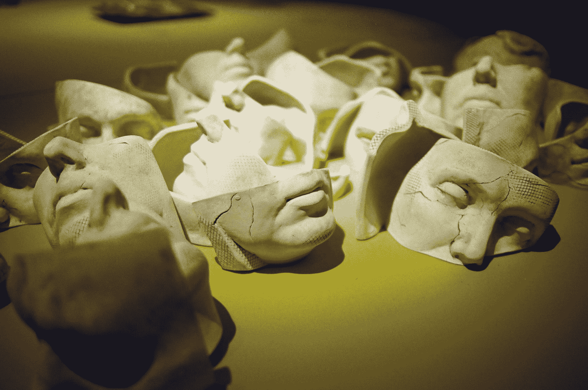
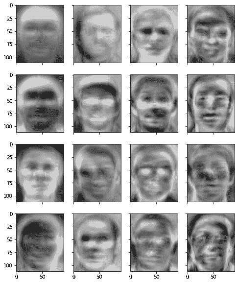
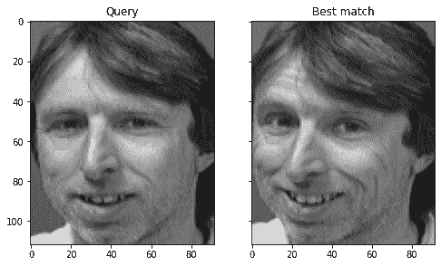
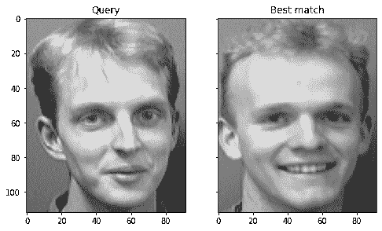
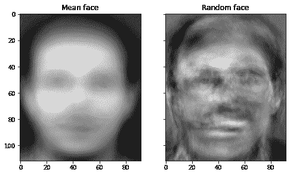

# 将主成分分析用于人脸识别

> 原文：<https://machinelearningmastery.com/face-recognition-using-principal-component-analysis/>

最后更新于 2021 年 10 月 30 日

最近机器学习的进步使得人脸识别不是一个难题。但在此之前，研究人员进行了各种尝试，开发了各种技能，使计算机能够识别人。其中一个早期的尝试取得了一定的成功，这就是基于线性代数技术的**特征脸**。

在本教程中，我们将看到如何使用一些简单的线性代数技术(如主成分分析)来构建一个原始的人脸识别系统。

完成本教程后，您将知道:

*   特征脸技术的发展
*   如何利用主成分分析从图像数据集中提取特征图像
*   如何将任意图像表示为特征图像的加权和
*   如何从主成分的权重来比较图像的相似性

我们开始吧。



使用主成分分析的人脸识别
照片作者: [Rach Teo](https://unsplash.com/photos/2BzUlVUWCoo) ，版权所有。

## 教程概述

本教程分为 3 个部分；它们是:

*   图像和人脸识别
*   特征脸概述
*   实现特征脸

## 图像和人脸识别

在计算机中，图片被表示为一个像素矩阵，每个像素都有一个特定的颜色编码在一些数值中。很自然的会问计算机能不能读懂图片，理解它是什么，如果能，是否能用矩阵数学来描述逻辑。为了不那么雄心勃勃，人们试图将这个问题的范围限制在识别人脸上。人脸识别的早期尝试是将矩阵视为高维细节，我们从中推断出一个低维信息向量，然后尝试在低维中识别该人。在过去，这是必要的，因为计算机功能不强，内存非常有限。然而，通过探索如何将**图像压缩到更小的尺寸，我们开发了一种技术来比较两幅图像是否描绘了同一张人脸，即使图片不完全相同。**

1987 年，西罗维奇和柯比的一篇论文认为人脸的所有图片都是一些“关键图片”的加权和。西罗维奇和柯比将这些关键图片称为“特征图片”，因为它们是人脸减去平均值后的图片的协方差矩阵的特征向量。在论文中，他们确实提供了矩阵形式的人脸图像数据集的主成分分析算法。并且在加权和中使用的权重确实对应于人脸图像到每个特征图像的投影。

1991 年，特克和彭特兰的一篇论文创造了“特征脸”这个术语。他们建立在西罗维奇和柯比的思想之上，并使用权重和特征图作为特征特征来识别人脸。图尔克和彭特兰的论文提出了一种计算特征图像的有效记忆方法。它还提出了人脸识别系统如何运行的算法，包括如何更新系统以包含新的人脸，以及如何将其与视频捕获系统相结合。该文还指出，特征脸的概念有助于部分遮挡图像的重建。

## 特征脸概述

在我们进入代码之前，让我们概述使用特征脸进行人脸识别的步骤，并指出一些简单的线性代数技术如何帮助完成任务。

假设我们有一堆人脸图片，都在同一个像素维度(例如，都是 r×c 灰度图像)。如果我们得到 M 张不同的图片**并将每张图片**矢量化为 L=r×c 像素，我们可以将整个数据集表示为 L×M 矩阵(我们称之为矩阵$A$)，其中矩阵中的每个元素都是像素的灰度值。

回想一下，主成分分析(PCA)可以应用于任何矩阵，结果是许多称为**主成分**的向量。每个主成分的长度与矩阵的列长度相同。同一矩阵的不同主成分是相互正交的，这意味着其中任何两个主成分的矢量点积为零。因此，各种主成分构建了一个向量空间，对于该向量空间，矩阵中的每一列可以表示为主成分的线性组合(即加权和)。

方法是首先取$ C = A–A $其中$a$是矩阵$A$的平均向量。所以$C$是用平均向量$A$减去$a$的每一列的矩阵。那么协方差矩阵是

$S = C\cdot C^T$

从中我们可以找到它的特征向量和特征值。主成分是特征值递减顺序的特征向量。因为矩阵$S$是 L×L 矩阵，我们可以考虑寻找 M×M 矩阵的特征向量$C^T\cdot C$来代替，因为$C^T\cdot C$的特征向量$v$可以通过$u=C\cdot v$转换成$C\cdot C^T$的特征向量$u$，除了我们通常更喜欢把$u$写成归一化向量(即$u$的范数是 1)。

$A$的主成分向量，或等价于$S=C\cdot C^T$的特征向量的物理意义是，它们是我们可以构造矩阵$A$的列的关键方向。不同主成分向量的相对重要性可以从相应的特征值中推断出来。特征值越大，主成分向量就越有用(即保存更多关于$A$)的信息。因此，我们只能保留前 K 个主成分向量。如果矩阵$A$是人脸图片的数据集，那么前 K 个主成分向量就是前 K 个最重要的“人脸图片”。我们称它们为**特征脸**图片。

对于任何给定的人脸图像，我们可以使用矢量点积将其减去平均值的版本投影到特征人脸图像上。结果是这张人脸图片与特征脸的关系有多密切。如果人脸图片与特征脸完全无关，我们会期望它的结果是零。对于 K 个特征脸，我们可以找到任意给定人脸图像的 K 点积。我们可以将结果表示为这张人脸图片相对于特征脸的**权重**。权重通常表示为向量。

相反，如果我们有一个权重向量，我们可以将每个受权重影响的特征脸相加，重建一个新的脸。让我们将特征面表示为矩阵$F$，它是一个 L×K 矩阵，权重向量$w$是一个列向量。然后对于任何$w$我们可以构建一张脸的图片为

$ z = f \ CDO w $

其中$z$是长度为 l 的列向量的结果。因为我们只使用了顶部的 K 个主成分向量，所以我们应该预期得到的人脸图像是失真的，但保留了一些面部特征。

因为特征脸矩阵对于数据集是恒定的，所以变化的权重向量$w$意味着变化的人脸图片。因此，我们可以预期同一个人的照片会提供相似的权重向量，即使照片不完全相同。因此，我们可以利用两个权重向量之间的距离(如 L2 范数)作为衡量两幅图片相似程度的指标。

## 实现特征脸

现在我们尝试用 numpy 和 scikit-learn 实现特征脸的思想。我们也会利用 OpenCV 来读取图片文件。您可能需要使用`pip`命令安装相关软件包:

```py
pip install opencv-python
```

我们使用的数据集是 [ORL 人脸数据库](https://cam-orl.co.uk/facedatabase.html)，这个数据库已经很老了，但是我们可以从 Kaggle 下载:

*   [https://www . ka ggle . com/kasi krit/att-人脸数据库/下载](https://www.kaggle.com/kasikrit/att-database-of-faces/download)

该文件是一个 4MB 左右的压缩文件。它有 40 个人的照片，每个人有 10 张照片。总计 400 张图片。在下文中，我们假设文件被下载到本地目录并命名为`attface.zip`。

我们可以提取 zip 文件获取图片，也可以利用 Python 中的`zipfile`包直接从 zip 文件中读取内容:

```py
import cv2
import zipfile
import numpy as np

faces = {}
with zipfile.ZipFile("attface.zip") as facezip:
    for filename in facezip.namelist():
        if not filename.endswith(".pgm"):
            continue # not a face picture
        with facezip.open(filename) as image:
            # If we extracted files from zip, we can use cv2.imread(filename) instead
            faces[filename] = cv2.imdecode(np.frombuffer(image.read(), np.uint8), cv2.IMREAD_GRAYSCALE)
```

上面是读取 zip 中的每个 PGM 文件。PGM 是一种灰度图像文件格式。我们通过`image.read()`将每个 PGM 文件提取为一个字节字符串，并将其转换为一个 numpy 字节数组。然后我们使用 OpenCV 使用`cv2.imdecode()`将字节串解码成像素阵列。该文件格式将由 OpenCV 自动检测。我们将每张图片保存到 Python 字典`faces`中以备后用。

这里我们可以用 matplotlib 来看看这些人脸照片:

```py
...
import matplotlib.pyplot as plt

fig, axes = plt.subplots(4,4,sharex=True,sharey=True,figsize=(8,10))
faceimages = list(faces.values())[-16:] # take last 16 images
for i in range(16):
    axes[i%4][i//4].imshow(faceimages[i], cmap="gray")
plt.show()
```


我们还可以找到每张图片的像素大小:

```py
...
faceshape = list(faces.values())[0].shape
print("Face image shape:", faceshape)
```

```py
Face image shape: (112, 92)
```

在 Python 字典中，人脸的图片由它们的文件名来标识。我们可以浏览一下文件名:

```py
...
print(list(faces.keys())[:5])
```

```py
['s1/1.pgm', 's1/10.pgm', 's1/2.pgm', 's1/3.pgm', 's1/4.pgm']
```

因此我们可以把同一个人的脸放入同一类。共有 40 节课，共 400 张图片:

```py
...
classes = set(filename.split("/")[0] for filename in faces.keys())
print("Number of classes:", len(classes))
print("Number of pictures:", len(faces))
```

```py
Number of classes: 40
Number of pictures: 400
```

为了说明使用特征脸进行识别的能力，我们想在生成特征脸之前保留一些图片。我们拿出一个人的所有照片以及另一个人的一张照片作为我们的测试集。剩余的图片被矢量化并转换成 2D 数字阵列:

```py
...
# Take classes 1-39 for eigenfaces, keep entire class 40 and
# image 10 of class 39 as out-of-sample test
facematrix = []
facelabel = []
for key,val in faces.items():
    if key.startswith("s40/"):
        continue # this is our test set
    if key == "s39/10.pgm":
        continue # this is our test set
    facematrix.append(val.flatten())
    facelabel.append(key.split("/")[0])

# Create facematrix as (n_samples,n_pixels) matrix
facematrix = np.array(facematrix)
```

现在我们可以对这个数据集矩阵进行主成分分析。我们没有一步一步地计算主成分分析，而是利用 scikit-learn 中的主成分分析功能，我们可以轻松检索所需的所有结果:

```py
...
# Apply PCA to extract eigenfaces
from sklearn.decomposition import PCA

pca = PCA().fit(facematrix)
```

我们可以从解释的方差比中确定每个主成分的重要性:

```py
...
print(pca.explained_variance_ratio_)
```

```py
[1.77824822e-01 1.29057925e-01 6.67093882e-02 5.63561346e-02
 5.13040312e-02 3.39156477e-02 2.47893586e-02 2.27967054e-02
 1.95632067e-02 1.82678428e-02 1.45655853e-02 1.38626271e-02
 1.13318896e-02 1.07267786e-02 9.68365599e-03 9.17860717e-03
 8.60995215e-03 8.21053028e-03 7.36580634e-03 7.01112888e-03
 6.69450840e-03 6.40327943e-03 5.98295099e-03 5.49298705e-03
 5.36083980e-03 4.99408106e-03 4.84854321e-03 4.77687371e-03
...
 1.12203331e-04 1.11102187e-04 1.08901471e-04 1.06750318e-04
 1.05732991e-04 1.01913786e-04 9.98164783e-05 9.85530209e-05
 9.51582720e-05 8.95603083e-05 8.71638147e-05 8.44340263e-05
 7.95894118e-05 7.77912922e-05 7.06467912e-05 6.77447444e-05
 2.21225931e-32]
```

或者我们可以简单地组成一个适中的数，比如说 50，然后把这些主成分向量看作特征面。为了方便起见，我们从主成分分析结果中提取特征脸，并将其存储为 numpy 数组。请注意，本征面以行的形式存储在矩阵中。如果我们想展示它，我们可以把它转换回 2D。在下面，我们展示了一些特征脸，看看它们是什么样子的:

```py
...
# Take the first K principal components as eigenfaces
n_components = 50
eigenfaces = pca.components_[:n_components]

# Show the first 16 eigenfaces
fig, axes = plt.subplots(4,4,sharex=True,sharey=True,figsize=(8,10))
for i in range(16):
    axes[i%4][i//4].imshow(eigenfaces[i].reshape(faceshape), cmap="gray")
plt.show()
```



从这张照片中，我们可以看到特征脸是模糊的脸，但实际上每个特征脸都有一些可以用来构建图片的面部特征。

由于我们的目标是建立一个人脸识别系统，我们首先计算每个输入图片的权重向量:

```py
...
# Generate weights as a KxN matrix where K is the number of eigenfaces and N the number of samples
weights = eigenfaces @ (facematrix - pca.mean_).T
```

上面的代码是用矩阵乘法代替循环。大致相当于以下内容:

```py
...
weights = []
for i in range(facematrix.shape[0]):
    weight = []
    for j in range(n_components):
        w = eigenfaces[j] @ (facematrix[i] - pca.mean_)
        weight.append(w)
    weights.append(weight)
```

至此，我们的人脸识别系统已经完成。我们用 39 个人的照片来建立我们的特征脸。我们使用属于这 39 个人中的一个人的测试图片(从训练主成分分析模型的矩阵中拿出的图片)来看它是否能成功识别人脸:

```py
...
# Test on out-of-sample image of existing class
query = faces["s39/10.pgm"].reshape(1,-1)
query_weight = eigenfaces @ (query - pca.mean_).T
euclidean_distance = np.linalg.norm(weights - query_weight, axis=0)
best_match = np.argmin(euclidean_distance)
print("Best match %s with Euclidean distance %f" % (facelabel[best_match], euclidean_distance[best_match]))
# Visualize
fig, axes = plt.subplots(1,2,sharex=True,sharey=True,figsize=(8,6))
axes[0].imshow(query.reshape(faceshape), cmap="gray")
axes[0].set_title("Query")
axes[1].imshow(facematrix[best_match].reshape(faceshape), cmap="gray")
axes[1].set_title("Best match")
plt.show()
```

上面，我们首先用从主成分分析结果中检索到的平均向量减去矢量化图像。然后我们计算这个减去平均值的向量到每个特征面的投影，并把它作为这张图片的权重。然后，我们将所讨论的图片的权重向量与每个现有图片的权重向量进行比较，并找到具有最小 L2 距离的图片作为最佳匹配。我们可以看到，它确实可以成功地在同一个类中找到最接近的匹配:

```py
Best match s39 with Euclidean distance 1559.997137
```

我们可以通过并排比较最接近的匹配来可视化结果:



我们可以用 PCA 中第 40 个人的照片再试一次。我们永远不会把它纠正过来，因为它对我们的模型来说是一个新人。但是，我们想看看它的错误程度以及距离度量中的值:

```py
...
# Test on out-of-sample image of new class
query = faces["s40/1.pgm"].reshape(1,-1)
query_weight = eigenfaces @ (query - pca.mean_).T
euclidean_distance = np.linalg.norm(weights - query_weight, axis=0)
best_match = np.argmin(euclidean_distance)
print("Best match %s with Euclidean distance %f" % (facelabel[best_match], euclidean_distance[best_match]))
# Visualize
fig, axes = plt.subplots(1,2,sharex=True,sharey=True,figsize=(8,6))
axes[0].imshow(query.reshape(faceshape), cmap="gray")
axes[0].set_title("Query")
axes[1].imshow(facematrix[best_match].reshape(faceshape), cmap="gray")
axes[1].set_title("Best match")
plt.show()
```

我们可以看到，它的最佳匹配具有更大的 L2 距离:

```py
Best match s5 with Euclidean distance 2690.209330
```

但是我们可以看到，错误的结果与所讨论的图片有一些相似之处:


在特克和佩特兰的论文中，建议我们为 L2 距离设置一个阈值。如果最佳匹配的距离小于阈值，我们会认为该人脸被识别为同一个人。如果距离超过了阈值，我们就声称这张照片是我们从未见过的人，即使在数字上可以找到最佳匹配。在这种情况下，我们可以考虑通过记住这个新的权重向量，将它作为一个新的人包含到我们的模型中。

实际上，我们可以更进一步，使用特征脸生成新的人脸，但是结果不是很现实。在下面，我们使用随机权重向量生成一个，并将其与“平均脸”并排显示:

```py
...
# Visualize the mean face and random face
fig, axes = plt.subplots(1,2,sharex=True,sharey=True,figsize=(8,6))
axes[0].imshow(pca.mean_.reshape(faceshape), cmap="gray")
axes[0].set_title("Mean face")
random_weights = np.random.randn(n_components) * weights.std()
newface = random_weights @ eigenfaces + pca.mean_
axes[1].imshow(newface.reshape(faceshape), cmap="gray")
axes[1].set_title("Random face")
plt.show()
```



特征脸有多好？令人惊讶的是，它因模型的简单性而被超越。然而，特克和彭特兰在各种条件下对其进行了测试。它发现它的精确度是“光线变化时平均 96%，方向变化时平均 85%，尺寸变化时平均 64%。”因此，它作为人脸识别系统可能不太实用。毕竟作为矩阵的图片在放大缩小后会在主成分域失真很多。因此，现代的替代方法是使用卷积神经网络，它对各种变换更加宽容。

将所有内容放在一起，下面是完整的代码:

```py
import zipfile
import cv2
import numpy as np
import matplotlib.pyplot as plt
from sklearn.decomposition import PCA

# Read face image from zip file on the fly
faces = {}
with zipfile.ZipFile("attface.zip") as facezip:
    for filename in facezip.namelist():
        if not filename.endswith(".pgm"):
            continue # not a face picture
        with facezip.open(filename) as image:
            # If we extracted files from zip, we can use cv2.imread(filename) instead
            faces[filename] = cv2.imdecode(np.frombuffer(image.read(), np.uint8), cv2.IMREAD_GRAYSCALE)

# Show sample faces using matplotlib
fig, axes = plt.subplots(4,4,sharex=True,sharey=True,figsize=(8,10))
faceimages = list(faces.values())[-16:] # take last 16 images
for i in range(16):
    axes[i%4][i//4].imshow(faceimages[i], cmap="gray")
print("Showing sample faces")
plt.show()

# Print some details
faceshape = list(faces.values())[0].shape
print("Face image shape:", faceshape)

classes = set(filename.split("/")[0] for filename in faces.keys())
print("Number of classes:", len(classes))
print("Number of images:", len(faces))

# Take classes 1-39 for eigenfaces, keep entire class 40 and
# image 10 of class 39 as out-of-sample test
facematrix = []
facelabel = []
for key,val in faces.items():
    if key.startswith("s40/"):
        continue # this is our test set
    if key == "s39/10.pgm":
        continue # this is our test set
    facematrix.append(val.flatten())
    facelabel.append(key.split("/")[0])

# Create a NxM matrix with N images and M pixels per image
facematrix = np.array(facematrix)

# Apply PCA and take first K principal components as eigenfaces
pca = PCA().fit(facematrix)

n_components = 50
eigenfaces = pca.components_[:n_components]

# Show the first 16 eigenfaces
fig, axes = plt.subplots(4,4,sharex=True,sharey=True,figsize=(8,10))
for i in range(16):
    axes[i%4][i//4].imshow(eigenfaces[i].reshape(faceshape), cmap="gray")
print("Showing the eigenfaces")
plt.show()

# Generate weights as a KxN matrix where K is the number of eigenfaces and N the number of samples
weights = eigenfaces @ (facematrix - pca.mean_).T
print("Shape of the weight matrix:", weights.shape)

# Test on out-of-sample image of existing class
query = faces["s39/10.pgm"].reshape(1,-1)
query_weight = eigenfaces @ (query - pca.mean_).T
euclidean_distance = np.linalg.norm(weights - query_weight, axis=0)
best_match = np.argmin(euclidean_distance)
print("Best match %s with Euclidean distance %f" % (facelabel[best_match], euclidean_distance[best_match]))
# Visualize
fig, axes = plt.subplots(1,2,sharex=True,sharey=True,figsize=(8,6))
axes[0].imshow(query.reshape(faceshape), cmap="gray")
axes[0].set_title("Query")
axes[1].imshow(facematrix[best_match].reshape(faceshape), cmap="gray")
axes[1].set_title("Best match")
plt.show()

# Test on out-of-sample image of new class
query = faces["s40/1.pgm"].reshape(1,-1)
query_weight = eigenfaces @ (query - pca.mean_).T
euclidean_distance = np.linalg.norm(weights - query_weight, axis=0)
best_match = np.argmin(euclidean_distance)
print("Best match %s with Euclidean distance %f" % (facelabel[best_match], euclidean_distance[best_match]))
# Visualize
fig, axes = plt.subplots(1,2,sharex=True,sharey=True,figsize=(8,6))
axes[0].imshow(query.reshape(faceshape), cmap="gray")
axes[0].set_title("Query")
axes[1].imshow(facematrix[best_match].reshape(faceshape), cmap="gray")
axes[1].set_title("Best match")
plt.show()
```

## 进一步阅读

如果您想更深入地了解这个主题，本节将提供更多资源。

### 报纸

*   长度西罗维奇和 m .柯比(1987)。“[人脸表征的低维程序](https://www.researchgate.net/publication/19588504_Low-Dimensional_Procedure_for_the_Characterization_of_Human_Faces)”。*美国光学学会杂志* *A* 。4(3): 519–524.
*   米（meter 的缩写））特克和彭特兰(1991)。"[用于识别的特征脸](https://www.cs.ucsb.edu/~mturk/Papers/jcn.pdf)"。*认知神经科学杂志*。3(1): 71–86.

### 书

*   [线性代数导论](https://amzn.to/2CZgTTB)，第五版，2016。

### 蜜蜂

*   [硬化。分解。PCA API](https://scikit-learn.org/stable/modules/generated/sklearn.decomposition.PCA.html)
*   [matplotlib . pyplot . im how API](https://matplotlib.org/stable/api/_as_gen/matplotlib.pyplot.imshow.html)

### 文章

*   维基百科上的特征脸

## 摘要

在本教程中，您发现了如何使用特征脸构建人脸识别系统，该特征脸是从主成分分析中导出的。

具体来说，您了解到:

*   如何利用主成分分析从图像数据集中提取特征图像
*   如何使用该组特征图像为任何可见或不可见的图像创建权重向量
*   如何利用不同图像的权重向量来度量它们的相似性，并将该技术应用于人脸识别
*   如何从特征图像生成新的随机图像