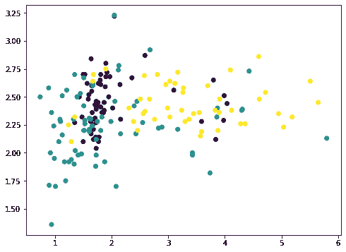
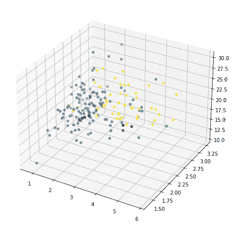
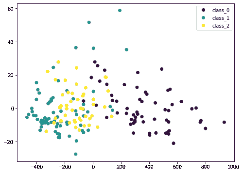
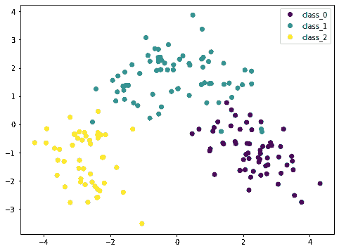
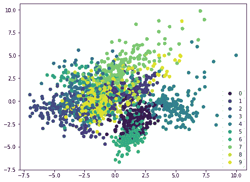
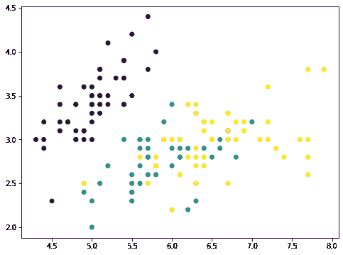
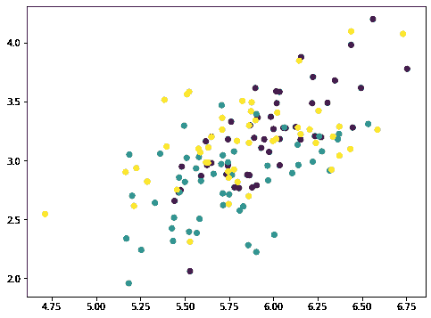
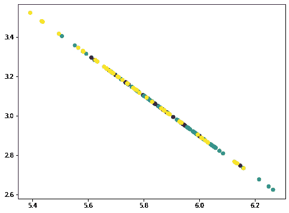
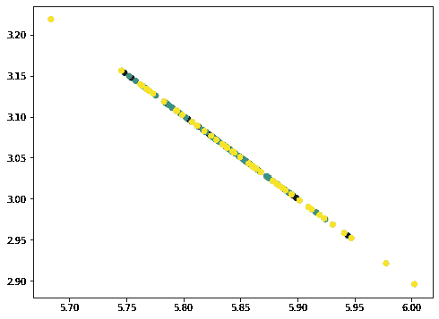

# 可视化主成分分析

> 原文：<https://machinelearningmastery.com/principal-component-analysis-for-visualization/>

最后更新于 2021 年 10 月 27 日

主成分分析是一种无监督的机器学习技术。主成分分析最常用的方法可能是降维。除了使用主成分分析作为数据准备技术，我们还可以使用它来帮助可视化数据。一幅画胜过千言万语。随着数据的可视化，我们更容易获得一些见解，并决定机器学习模型的下一步。

在本教程中，您将发现如何使用主成分分析可视化数据，以及如何使用可视化来帮助确定降维参数。

完成本教程后，您将知道:

*   如何使用可视化的高维数据
*   什么解释了主成分分析中的差异
*   从高维数据的主成分分析结果中直观地观察解释的差异

我们开始吧。


可视化主成分分析
图片由[莱万·戈卡兹](https://www.flickr.com/photos/vampa__/6099561804/)提供，保留部分权利。

## **教程概述**

本教程分为两部分；它们是:

*   高维数据散点图
*   可视化解释的差异

## **先决条件**

对于本教程，我们假设您已经熟悉:

*   [如何在 Python 中从头计算主成分分析](https://machinelearningmastery.com/calculate-principal-component-analysis-scratch-python/) 
*   [Python 中降维的主成分分析](https://machinelearningmastery.com/principal-components-analysis-for-dimensionality-reduction-in-python/)

## **高维数据散点图**

可视化是从数据中获得洞察力的关键一步。我们可以从可视化中了解到一个模式是否可以被观察到，从而估计哪个机器学习模型是合适的。

用二维来描绘事物是很容易的。通常，x 轴和 y 轴的散点图是二维的。用三维方式描绘事物有点挑战性，但并非不可能。例如，在 matplotlib 中，可以进行 3D 绘图。唯一的问题是在纸上或屏幕上，我们一次只能在一个视口或投影上查看 3D 图。在 matplotlib 中，这是由仰角和方位角的度数控制的。描绘四维或五维的事物是不可能的，因为我们生活在一个三维世界中，不知道如此高维度的事物会是什么样子。

这就是像主成分分析这样的降维技术发挥作用的地方。我们可以把维度缩小到两到三个，这样我们就可以把它可视化。让我们从一个例子开始。

我们从[葡萄酒数据集](https://scikit-learn.org/stable/datasets/toy_dataset.html#wine-dataset)开始，这是一个包含 13 个特征(即数据集是 13 维的)和 3 个类的分类数据集。共有 178 个样本:

```py
from sklearn.datasets import load_wine
winedata = load_wine()
X, y = winedata['data'], winedata['target']
print(X.shape)
print(y.shape)
```

```py
(178, 13)
(178,)
```

在 13 个特征中，我们可以选择任意两个并用 matplotlib 绘制(我们使用`c`参数对不同的类进行颜色编码):

```py
...
import matplotlib.pyplot as plt
plt.scatter(X[:,1], X[:,2], c=y)
plt.show()
```



或者我们也可以选择任意三个，用 3D 显示:

```py
...
ax = fig.add_subplot(projection='3d')
ax.scatter(X[:,1], X[:,2], X[:,3], c=y)
plt.show()
```



但这并没有揭示数据的大部分样子，因为大多数特征都没有显示出来。我们现在求助于主成分分析:

```py
...
from sklearn.decomposition import PCA
pca = PCA()
Xt = pca.fit_transform(X)
plot = plt.scatter(Xt[:,0], Xt[:,1], c=y)
plt.legend(handles=plot.legend_elements()[0], labels=list(winedata['target_names']))
plt.show()
```



这里我们通过主成分分析将输入数据`X`转化为`Xt`。我们只考虑包含最多信息的前两列，并以二维方式绘制。我们可以看到紫色类还是挺有特色的，但是还是有一些重叠。如果我们在进行主成分分析之前对数据进行缩放，结果会有所不同:

```py
...
from sklearn.preprocessing import StandardScaler
from sklearn.pipeline import Pipeline
pca = PCA()
pipe = Pipeline([('scaler', StandardScaler()), ('pca', pca)])
Xt = pipe.fit_transform(X)
plot = plt.scatter(Xt[:,0], Xt[:,1], c=y)
plt.legend(handles=plot.legend_elements()[0], labels=list(winedata['target_names']))
plt.show()
```



由于 PCA 对尺度敏感，如果我们通过`StandardScaler`对每个特征进行归一化，可以看到更好的结果。这里不同的阶层更有特色。通过查看此图，我们确信像 SVM 这样的简单模型可以高精确率地对该数据集进行分类。

将这些放在一起，下面是生成可视化的完整代码:

```py
from sklearn.datasets import load_wine
from sklearn.decomposition import PCA
from sklearn.preprocessing import StandardScaler
from sklearn.pipeline import Pipeline
import matplotlib.pyplot as plt

# Load dataset
winedata = load_wine()
X, y = winedata['data'], winedata['target']
print("X shape:", X.shape)
print("y shape:", y.shape)

# Show any two features
plt.figure(figsize=(8,6))
plt.scatter(X[:,1], X[:,2], c=y)
plt.xlabel(winedata["feature_names"][1])
plt.ylabel(winedata["feature_names"][2])
plt.title("Two particular features of the wine dataset")
plt.show()

# Show any three features
fig = plt.figure(figsize=(10,8))
ax = fig.add_subplot(projection='3d')
ax.scatter(X[:,1], X[:,2], X[:,3], c=y)
ax.set_xlabel(winedata["feature_names"][1])
ax.set_ylabel(winedata["feature_names"][2])
ax.set_zlabel(winedata["feature_names"][3])
ax.set_title("Three particular features of the wine dataset")
plt.show()

# Show first two principal components without scaler
pca = PCA()
plt.figure(figsize=(8,6))
Xt = pca.fit_transform(X)
plot = plt.scatter(Xt[:,0], Xt[:,1], c=y)
plt.legend(handles=plot.legend_elements()[0], labels=list(winedata['target_names']))
plt.xlabel("PC1")
plt.ylabel("PC2")
plt.title("First two principal components")
plt.show()

# Show first two principal components with scaler
pca = PCA()
pipe = Pipeline([('scaler', StandardScaler()), ('pca', pca)])
plt.figure(figsize=(8,6))
Xt = pipe.fit_transform(X)
plot = plt.scatter(Xt[:,0], Xt[:,1], c=y)
plt.legend(handles=plot.legend_elements()[0], labels=list(winedata['target_names']))
plt.xlabel("PC1")
plt.ylabel("PC2")
plt.title("First two principal components after scaling")
plt.show()
```

如果我们在不同的数据集(如 MINST 手写数字)上应用相同的方法，散点图不会显示明显的边界，因此需要更复杂的模型(如神经网络)来分类:

```py
from sklearn.datasets import load_digits
from sklearn.decomposition import PCA
from sklearn.preprocessing import StandardScaler
from sklearn.pipeline import Pipeline
import matplotlib.pyplot as plt

digitsdata = load_digits()
X, y = digitsdata['data'], digitsdata['target']
pca = PCA()
pipe = Pipeline([('scaler', StandardScaler()), ('pca', pca)])
plt.figure(figsize=(8,6))
Xt = pipe.fit_transform(X)
plot = plt.scatter(Xt[:,0], Xt[:,1], c=y)
plt.legend(handles=plot.legend_elements()[0], labels=list(digitsdata['target_names']))
plt.show()
```



## **可视化解释的差异**

主成分分析本质上是通过特征的线性组合来重新排列特征。因此，它被称为特征提取技术。主成分分析的一个特点是第一主成分包含了数据集的大部分信息。第二主成分比第三主成分信息量更大，以此类推。

为了说明这个想法，我们可以分步骤从原始数据集中移除主成分，并查看数据集的外观。让我们考虑具有较少要素的数据集，并在图中显示两个要素:

```py
from sklearn.datasets import load_iris
irisdata = load_iris()
X, y = irisdata['data'], irisdata['target']
plt.figure(figsize=(8,6))
plt.scatter(X[:,0], X[:,1], c=y)
plt.show()
```



这是[虹膜数据集](https://scikit-learn.org/stable/modules/generated/sklearn.datasets.load_iris.html)，它只有四个特征。这些功能的比例相当，因此我们可以跳过缩放器。利用 4 特征数据，主成分分析最多可以产生 4 个主成分:

```py
...
pca = PCA().fit(X)
print(pca.components_)
```

```py
[[ 0.36138659 -0.08452251  0.85667061  0.3582892 ]
 [ 0.65658877  0.73016143 -0.17337266 -0.07548102]
 [-0.58202985  0.59791083  0.07623608  0.54583143]
 [-0.31548719  0.3197231   0.47983899 -0.75365743]]
```

例如，第一行是在其上创建第一主分量的第一主轴。对于具有特征$p=(a，b，c，d)$ $的任何数据点$p$，由于主轴由向量$v=(0.36，-0.08，0.86，0.36)表示，因此该数据点的第一个主成分在主轴上的值为$ 0.36 \u 乘以 a–0.08 \u 乘以 b+0.86 \u 乘以 c+0.36 \u 乘以 d$。使用向量点积，这个值可以用
$
p \cdot v
$
表示因此，用数据集$X$作为 150 $ \乘以$ 4 矩阵(150 个数据点，每个有 4 个特征)，我们可以通过矩阵-向量乘法将每个数据点映射到这个主轴上的值:
$
X \cdot v
$
结果是一个长度为 150 的向量。现在，如果我们沿着主轴向量从每个数据点移除相应的值，那将是
$
x –( x \ cdot v)\ cdot v^t
$
，其中转置向量$v^T$是一行，$X\cdot v$是一列。乘积$(X \cdot v) \cdot v^T$遵循矩阵-矩阵乘法，结果是一个$ 150 \乘以 4$的矩阵，与$X$的维数相同。

如果我们绘制$(X \cdot v) \cdot v^T$的前两个特征，它看起来像这样:

```py
...
# Remove PC1
Xmean = X - X.mean(axis=0)
value = Xmean @ pca.components_[0]
pc1 = value.reshape(-1,1) @ pca.components_[0].reshape(1,-1)
Xremove = X - pc1
plt.scatter(Xremove[:,0], Xremove[:,1], c=y)
plt.show()
```



numpy 数组`Xmean`是将`X`的特征移动到零中心。这是 PCA 所必需的。然后通过矩阵向量乘法计算阵列`value`。
数组`value`是映射在主轴上的每个数据点的大小。所以如果我们把这个值乘以主轴向量，我们得到一个数组`pc1`。从原始数据集`X`中移除这个，我们得到一个新的数组`Xremove`。在图中，我们观察到散点图上的点破碎在一起，每个类的聚类没有以前那么明显。这意味着我们通过去除第一主成分去除了很多信息。如果我们再次重复同样的过程，这些点会进一步瓦解:

```py
...
# Remove PC2
value = Xmean @ pca.components_[1]
pc2 = value.reshape(-1,1) @ pca.components_[1].reshape(1,-1)
Xremove = Xremove - pc2
plt.scatter(Xremove[:,0], Xremove[:,1], c=y)
plt.show()
```



这看起来像一条直线，但实际上不是。如果我们再重复一次，所有的点都会折叠成一条直线:

```py
...
# Remove PC3
value = Xmean @ pca.components_[2]
pc3 = value.reshape(-1,1) @ pca.components_[2].reshape(1,-1)
Xremove = Xremove - pc3
plt.scatter(Xremove[:,0], Xremove[:,1], c=y)
plt.show()
```



这些点都落在一条直线上，因为我们从只有四个特征的数据中去除了三个主成分。因此，我们的数据矩阵成为**等级 1** 。你可以试着再重复一次这个过程，结果是所有的点都折叠成一个点。当我们去除主成分时，每个步骤中去除的信息量可以通过主成分分析中相应的**解释方差比**找到:

```py
...
print(pca.explained_variance_ratio_)
```

```py
[0.92461872 0.05306648 0.01710261 0.00521218]
```

这里我们可以看到，第一个分量解释了 92.5%的方差，第二个分量解释了 5.3%的方差。如果我们去掉前两个主成分，剩余的方差只有 2.2%，因此从视觉上看，去掉两个成分后的图看起来像一条直线。事实上，当我们查看上面的图时，我们不仅看到点被粉碎，而且当我们移除组件时，x 轴和 y 轴的范围也变小了。

在机器学习方面，我们可以考虑在这个数据集中只使用一个单一的特征进行分类，即第一主成分。使用全套功能时，我们应期望达到不低于 90%的原始精确率:

```py
...
from sklearn.model_selection import train_test_split
from sklearn.metrics import f1_score
from collections import Counter
from sklearn.svm import SVC

X_train, X_test, y_train, y_test = train_test_split(X, y, test_size=0.33)
clf = SVC(kernel="linear", gamma='auto').fit(X_train, y_train)
print("Using all features, accuracy: ", clf.score(X_test, y_test))
print("Using all features, F1: ", f1_score(y_test, clf.predict(X_test), average="macro"))

mean = X_train.mean(axis=0)
X_train2 = X_train - mean
X_train2 = (X_train2 @ pca.components_[0]).reshape(-1,1)
clf = SVC(kernel="linear", gamma='auto').fit(X_train2, y_train)
X_test2 = X_test - mean
X_test2 = (X_test2 @ pca.components_[0]).reshape(-1,1)
print("Using PC1, accuracy: ", clf.score(X_test2, y_test))
print("Using PC1, F1: ", f1_score(y_test, clf.predict(X_test2), average="macro"))
```

```py
Using all features, accuracy:  1.0
Using all features, F1:  1.0
Using PC1, accuracy:  0.96
Using PC1, F1:  0.9645191409897292
```

解释方差的另一个用途是压缩。给定第一主成分的解释方差很大，如果我们需要存储数据集，我们可以只存储第一主轴上的投影值($X\cdot v$)，以及主轴的向量$v$。然后我们可以通过将它们相乘来近似地再现原始数据集:
$
x \近似值(X\cdot v) \cdot v^T
$
这样，我们只需要为每个数据点存储一个值，而不是为四个特征存储四个值。如果我们将投影值存储在多个主轴上，并将多个主分量相加，则近似更准确。

将这些放在一起，下面是生成可视化的完整代码:

```py
from sklearn.datasets import load_iris
from sklearn.model_selection import train_test_split
from sklearn.decomposition import PCA
from sklearn.metrics import f1_score
from sklearn.svm import SVC
import matplotlib.pyplot as plt

# Load iris dataset
irisdata = load_iris()
X, y = irisdata['data'], irisdata['target']
plt.figure(figsize=(8,6))
plt.scatter(X[:,0], X[:,1], c=y)
plt.xlabel(irisdata["feature_names"][0])
plt.ylabel(irisdata["feature_names"][1])
plt.title("Two features from the iris dataset")
plt.show()

# Show the principal components
pca = PCA().fit(X)
print("Principal components:")
print(pca.components_)

# Remove PC1
Xmean = X - X.mean(axis=0)
value = Xmean @ pca.components_[0]
pc1 = value.reshape(-1,1) @ pca.components_[0].reshape(1,-1)
Xremove = X - pc1
plt.figure(figsize=(8,6))
plt.scatter(Xremove[:,0], Xremove[:,1], c=y)
plt.xlabel(irisdata["feature_names"][0])
plt.ylabel(irisdata["feature_names"][1])
plt.title("Two features from the iris dataset after removing PC1")
plt.show()

# Remove PC2
Xmean = X - X.mean(axis=0)
value = Xmean @ pca.components_[1]
pc2 = value.reshape(-1,1) @ pca.components_[1].reshape(1,-1)
Xremove = Xremove - pc2
plt.figure(figsize=(8,6))
plt.scatter(Xremove[:,0], Xremove[:,1], c=y)
plt.xlabel(irisdata["feature_names"][0])
plt.ylabel(irisdata["feature_names"][1])
plt.title("Two features from the iris dataset after removing PC1 and PC2")
plt.show()

# Remove PC3
Xmean = X - X.mean(axis=0)
value = Xmean @ pca.components_[2]
pc3 = value.reshape(-1,1) @ pca.components_[2].reshape(1,-1)
Xremove = Xremove - pc3
plt.figure(figsize=(8,6))
plt.scatter(Xremove[:,0], Xremove[:,1], c=y)
plt.xlabel(irisdata["feature_names"][0])
plt.ylabel(irisdata["feature_names"][1])
plt.title("Two features from the iris dataset after removing PC1 to PC3")
plt.show()

# Print the explained variance ratio
print("Explainedd variance ratios:")
print(pca.explained_variance_ratio_)

# Split data
X_train, X_test, y_train, y_test = train_test_split(X, y, test_size=0.33)

# Run classifer on all features
clf = SVC(kernel="linear", gamma='auto').fit(X_train, y_train)
print("Using all features, accuracy: ", clf.score(X_test, y_test))
print("Using all features, F1: ", f1_score(y_test, clf.predict(X_test), average="macro"))

# Run classifier on PC1
mean = X_train.mean(axis=0)
X_train2 = X_train - mean
X_train2 = (X_train2 @ pca.components_[0]).reshape(-1,1)
clf = SVC(kernel="linear", gamma='auto').fit(X_train2, y_train)
X_test2 = X_test - mean
X_test2 = (X_test2 @ pca.components_[0]).reshape(-1,1)
print("Using PC1, accuracy: ", clf.score(X_test2, y_test))
print("Using PC1, F1: ", f1_score(y_test, clf.predict(X_test2), average="macro"))
```

## 进一步阅读

如果您想更深入地了解这个主题，本节将提供更多资源。

### 书

*   [深度学习](https://amzn.to/3qSk3C2)

### 教程

*   [如何在 Python 中从头计算主成分分析](https://machinelearningmastery.com/calculate-principal-component-analysis-scratch-python/)
*   [Python 中降维的主成分分析](https://machinelearningmastery.com/principal-components-analysis-for-dimensionality-reduction-in-python/)

### 蜜蜂

*   [sci kit-学习玩具数据集](https://scikit-learn.org/stable/datasets/toy_dataset.html)
*   [sci kit-学习虹膜数据集](https://scikit-learn.org/stable/modules/generated/sklearn.datasets.load_iris.html)
*   [sci kit-学习葡萄酒数据集](https://scikit-learn.org/stable/modules/generated/sklearn.datasets.load_wine.html)
*   [matplotlib scatter API](https://matplotlib.org/stable/api/_as_gen/matplotlib.pyplot.scatter.html)
*   [mplot 3d 工具包](https://matplotlib.org/stable/tutorials/toolkits/mplot3d.html)

## 摘要

在本教程中，您发现了如何使用主成分分析来可视化数据。

具体来说，您了解到:

*   使用主成分分析可视化 2D 的高维数据集
*   如何使用主成分分析维度中的图来帮助选择合适的机器学习模型
*   如何观察主成分分析的解释方差比
*   解释的方差比对机器学习意味着什么