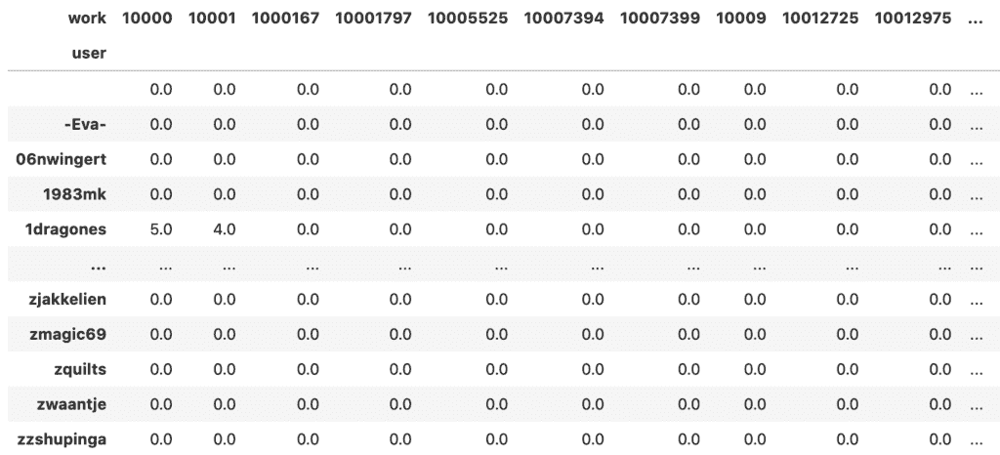

# 利用奇异值分解构建推荐系统

> 原文:[https://machinelearning master . com/使用奇异值分解构建推荐系统/](https://machinelearningmastery.com/using-singular-value-decomposition-to-build-a-recommender-system/)

最后更新于 2021 年 10 月 29 日

奇异值分解是一种非常流行的线性代数技术，用于将矩阵分解为几个较小矩阵的乘积。事实上，这是一种有许多用途的技术。一个例子是，我们可以使用奇异值分解来发现项目之间的关系。由此可以很容易地建立一个推荐系统。

在本教程中，我们将看到如何使用线性代数技术构建推荐系统。

完成本教程后，您将知道:

*   奇异值分解对矩阵做了什么
*   如何解释奇异值分解的结果
*   单个推荐系统需要哪些数据，如何利用支持向量机进行分析
*   我们如何利用奇异值分解的结果提出建议

我们开始吧。


使用奇异值分解构建推荐系统
图片由[罗伯托·阿里亚斯](https://unsplash.com/photos/ihpiRgog1vs)提供，保留部分权利。

## 教程概述

本教程分为 3 个部分；它们是:

*   奇异值分解综述
*   奇异值分解在推荐系统中的意义
*   实现推荐系统

## 奇异值分解综述

就像 24 这样的数可以分解为因子 24=2×3×4 一样，一个矩阵也可以表示为其他一些矩阵的乘法。因为矩阵是数字的数组，所以它们有自己的乘法规则。因此，它们有不同的分解方式，或称为**分解**。QR 分解或 LU 分解是常见的例子。另一个例子是**奇异值分解**，它对要分解的矩阵的形状或属性没有限制。

奇异值分解假设一个矩阵$M$(例如，一个$ m \乘以 n$矩阵)被分解为
$
m = u \ cdot \ sigma \ cdot v^t
$
其中$U$是一个$ m \乘以 M$矩阵，$\Sigma$是一个$ m \乘以 n$的对角矩阵，而$V^T$是一个$ n \乘以 n$矩阵。对角线矩阵$ \适马$是一个有趣的矩阵，它可以是非正方形的，但是只有对角线上的条目可以是非零的。矩阵$U$和$V^T$是**正交**矩阵。意味着$U$的列或$V$的行是(1)相互正交的，并且是(2)单位向量。如果任意两个向量的点积为零，则向量相互正交。如果向量的 L2 范数为 1，则向量是单位向量。正交矩阵具有转置是逆矩阵的性质。换句话说，由于$U$是正交矩阵，$U^T = U^{-1}$或$U\cdot U^T=U^T\cdot U=I$，其中$I$是单位矩阵。

奇异值分解得名于$ \适马$上的对角条目，它们被称为矩阵 M$的奇异值。事实上，它们是 M^T$.矩阵特征值的平方根就像分解成素数的数一样，矩阵的奇异值分解揭示了该矩阵的许多结构。

但实际上上面描述的叫做**全 SVD** 。还有一个版本叫做**缩小版 SVD** 或者**紧凑型 SVD** 。我们仍然必须写$M = U\cdot\Sigma\cdot V^T$，但是我们有$ \ sigma $ a $ r \乘以 r$正方形对角矩阵，其中$r$是矩阵$M$的**秩**,它通常小于或等于$m$和$n$中较小的一个。矩阵$U$是一个$ m \\ r \u 矩阵，而$V^T$是一个$ r \\ n \u 矩阵。因为矩阵$U$和$V^T$是非正方形的，所以它们被称为**半正交**，意思是$U^T\cdot U=I$和$V^T\cdot V=I$，两种情况下的$I$都是$ r \乘以 r$的单位矩阵。

## 奇异值分解在推荐系统中的意义

如果矩阵$M$是秩$r$，那么我们可以证明矩阵$M\cdot M^T$和$M^T\cdot M$都是秩$r$。在奇异值分解(简化的 SVD)中，矩阵$U$的列是 M^T$的特征向量，矩阵$V^T$的行是$M^T\cdot 的特征向量。有趣的是，$M\cdot M^T$和$M^T\cdot M$可能大小不同(因为 matrix $M$可以是非方形的)，但它们有相同的特征值集合，即$\Sigma$对角线上的值的平方。

这就是为什么奇异值分解的结果可以揭示矩阵的很多信息。

想象一下，我们收集了一些书评，书是列，人是行，条目是一个人给一本书的评分。在这种情况下，$M\cdot M^T$将是一个人对人的表格，其中的条目将意味着一个人给出的评分与另一个人匹配的总和。类似地，$M^T\cdot M$将是一个书与书之间的表，其中的条目是与另一本书所获得的评级相匹配的所获得的评级的总和。人和书之间有什么潜在的联系？这可能是类型，或作者，或类似性质的东西。

## 实现推荐系统

让我们看看如何利用奇异值分解的结果来构建一个推荐系统。首先，让我们从这个链接下载数据集(注意:它有 600 兆字节大)

*   [http://deep yeti . ucsd . edu/JM caley/datasets/library thing/lthing _ data . tar . gz](http://deepyeti.ucsd.edu/jmcauley/datasets/librarything/lthing_data.tar.gz)

该数据集是来自[推荐系统和个性化数据集](https://cseweb.ucsd.edu/~jmcauley/datasets.html#social_data)的“社交推荐数据”。它包含用户对[图书馆事物](https://www.librarything.com/)上的书籍的评论。我们感兴趣的是用户给一本书的“星星”数量。

如果我们打开这个 tar 文件，我们会看到一个名为“reviews.json”的大文件。我们可以提取它，或者动态读取包含的文件。下面显示了前三行 reviews.json:

```
import tarfile

# Read downloaded file from:
# http://deepyeti.ucsd.edu/jmcauley/datasets/librarything/lthing_data.tar.gz
with tarfile.open("lthing_data.tar.gz") as tar:
    print("Files in tar archive:")
    tar.list()

    with tar.extractfile("lthing_data/reviews.json") as file:
        count = 0
        for line in file:
            print(line)
            count += 1
            if count > 3:
                break
```

上面会打印:

```
Files in tar archive:
?rwxr-xr-x julian/julian 0 2016-09-30 17:58:55 lthing_data/
?rw-r--r-- julian/julian 4824989 2014-01-02 13:55:12 lthing_data/edges.txt
?rw-rw-r-- julian/julian 1604368260 2016-09-30 17:58:25 lthing_data/reviews.json
b"{'work': '3206242', 'flags': [], 'unixtime': 1194393600, 'stars': 5.0, 'nhelpful': 0, 'time': 'Nov 7, 2007', 'comment': 'This a great book for young readers to be introduced to the world of Middle Earth. ', 'user': 'van_stef'}\n"
b"{'work': '12198649', 'flags': [], 'unixtime': 1333756800, 'stars': 5.0, 'nhelpful': 0, 'time': 'Apr 7, 2012', 'comment': 'Help Wanted: Tales of On The Job Terror from Evil Jester Press is a fun and scary read. This book is edited by Peter Giglio and has short stories by Joe McKinney, Gary Brandner, Henry Snider and many more. As if work wasnt already scary enough, this book gives you more reasons to be scared. Help Wanted is an excellent anthology that includes some great stories by some master storytellers.\\nOne of the stories includes Agnes: A Love Story by David C. Hayes, which tells the tale of a lawyer named Jack who feels unappreciated at work and by his wife so he starts a relationship with a photocopier. They get along well until the photocopier starts wanting the lawyer to kill for it. The thing I liked about this story was how the author makes you feel sorry for Jack. His two co-workers are happily married and love their jobs while Jack is married to a paranoid alcoholic and he hates and works at a job he cant stand. You completely understand how he can fall in love with a copier because he is a lonely soul that no one understands except the copier of course.\\nAnother story in Help Wanted is Work Life Balance by Jeff Strand. In this story a man works for a company that starts to let their employees do what they want at work. It starts with letting them come to work a little later than usual, then the employees are allowed to hug and kiss on the job. Things get really out of hand though when the company starts letting employees carry knives and stab each other, as long as it doesnt interfere with their job. This story is meant to be more funny then scary but still has its scary moments. Jeff Strand does a great job mixing humor and horror in this story.\\nAnother good story in Help Wanted: On The Job Terror is The Chapel Of Unrest by Stephen Volk. This is a gothic horror story that takes place in the 1800s and has to deal with an undertaker who has the duty of capturing and embalming a ghoul who has been eating dead bodies in a graveyard. Stephen Volk through his use of imagery in describing the graveyard, the chapel and the clothes of the time, transports you into an 1800s gothic setting that reminded me of Bram Stokers Dracula.\\nOne more story in this anthology that I have to mention is Expulsion by Eric Shapiro which tells the tale of a mad man going into a office to kill his fellow employees. This is a very short but very powerful story that gets you into the mind of a disgruntled employee but manages to end on a positive note. Though there were stories I didnt like in Help Wanted, all in all its a very good anthology. I highly recommend this book ', 'user': 'dwatson2'}\n"
b"{'work': '12533765', 'flags': [], 'unixtime': 1352937600, 'nhelpful': 0, 'time': 'Nov 15, 2012', 'comment': 'Magoon, K. (2012). Fire in the streets. New York: Simon and Schuster/Aladdin. 336 pp. ISBN: 978-1-4424-2230-8\. (Hardcover); $16.99.\\nKekla Magoon is an author to watch (http://www.spicyreads.org/Author_Videos.html- scroll down). One of my favorite books from 2007 is Magoons The Rock and the River. At the time, I mentioned in reviews that we have very few books that even mention the Black Panther Party, let alone deal with them in a careful, thorough way. Fire in the Streets continues the story Magoon began in her debut book. While her familys financial fortunes drip away, not helped by her mothers drinking and assortment of boyfriends, the Panthers provide a very real respite for Maxie. Sam is still dealing with the death of his brother. Maxies relationship with Sam only serves to confuse and upset them both. Her friends, Emmalee and Patrice, are slowly drifting away. The Panther Party is the only thing that seems to make sense and she basks in its routine and consistency. She longs to become a full member of the Panthers and constantly battles with her Panther brother Raheem over her maturity and ability to do more than office tasks. Maxie wants to have her own gun. When Maxie discovers that there is someone working with the Panthers that is leaking information to the government about Panther activity, Maxie investigates. Someone is attempting to destroy the only place that offers her shelter. Maxie is determined to discover the identity of the traitor, thinking that this will prove her worth to the organization. However, the truth is not simple and it is filled with pain. Unfortunately we still do not have many teen books that deal substantially with the Democratic National Convention in Chicago, the Black Panther Party, and the social problems in Chicago that lead to the civil unrest. Thankfully, Fire in the Streets lives up to the standard Magoon set with The Rock and the River. Readers will feel like they have stepped back in time. Magoons factual tidbits add journalistic realism to the story and only improves the atmosphere. Maxie has spunk. Readers will empathize with her Atlas-task of trying to hold onto her world. Fire in the Streets belongs in all middle school and high school libraries. While readers are able to read this story independently of The Rock and the River, I strongly urge readers to read both and in order. Magoons recognition by the Coretta Scott King committee and the NAACP Image awards are NOT mistakes!', 'user': 'edspicer'}\n"
b'{\'work\': \'12981302\', \'flags\': [], \'unixtime\': 1364515200, \'stars\': 4.0, \'nhelpful\': 0, \'time\': \'Mar 29, 2013\', \'comment\': "Well, I definitely liked this book better than the last in the series. There was less fighting and more story. I liked both Toni and Ricky Lee and thought they were pretty good together. The banter between the two was sweet and often times funny. I enjoyed seeing some of the past characters and of course it\'s always nice to be introduced to new ones. I just wonder how many more of these books there will be. At least two hopefully, one each for Rory and Reece. ", \'user\': \'amdrane2\'}\n'
```

reviews.json 中的每一行都是一条记录。我们将提取每个记录的“用户”、“工作”和“星星”字段，只要这三个字段中没有缺失数据。尽管有名字，但记录不是格式良好的 JSON 字符串(最明显的是它使用单引号而不是双引号)。因此，我们不能使用 Python 中的`json`包，而是使用`ast`来解码这样的字符串:

```
...
import ast

reviews = []
with tarfile.open("lthing_data.tar.gz") as tar:
    with tar.extractfile("lthing_data/reviews.json") as file:
        for line in file:
            record = ast.literal_eval(line.decode("utf8"))
            if any(x not in record for x in ['user', 'work', 'stars']):
                continue
            reviews.append([record['user'], record['work'], record['stars']])
print(len(reviews), "records retrieved")
```

```
1387209 records retrieved
```

现在我们应该制作一个不同用户如何评价每本书的矩阵。我们利用熊猫库来帮助将我们收集的数据转换成表格:

```
...
import pandas as pd
reviews = pd.DataFrame(reviews, columns=["user", "work", "stars"])
print(reviews.head())
```

```
            user      work  stars
0       van_stef   3206242    5.0
1       dwatson2  12198649    5.0
2       amdrane2  12981302    4.0
3  Lila_Gustavus   5231009    3.0
4      skinglist    184318    2.0
```

例如，为了节省时间和内存，我们尽量不使用所有数据。这里我们只考虑那些评论超过 50 本书的用户，也考虑那些被超过 50 个用户评论的书。通过这种方式，我们将数据集修剪到原始大小的 15%以下:

```
...
# Look for the users who reviewed more than 50 books
usercount = reviews[["work","user"]].groupby("user").count()
usercount = usercount[usercount["work"] >= 50]
print(usercount.head())
```

```
            work
user
              84
-Eva-        602
06nwingert   370
1983mk        63
1dragones    194
```

```
...
# Look for the books who reviewed by more than 50 users
workcount = reviews[["work","user"]].groupby("work").count()
workcount = workcount[workcount["user"] >= 50]
print(workcount.head())
```

```
          user
work
10000      106
10001       53
1000167    186
10001797    53
10005525   134
```

```
...
# Keep only the popular books and active users
reviews = reviews[reviews["user"].isin(usercount.index) & reviews["work"].isin(workcount.index)]
print(reviews)
```

```
                user     work  stars
0           van_stef  3206242    5.0
6            justine     3067    4.5
18           stephmo  1594925    4.0
19         Eyejaybee  2849559    5.0
35       LisaMaria_C   452949    4.5
...              ...      ...    ...
1387161     connie53     1653    4.0
1387177   BruderBane    24623    4.5
1387192  StuartAston  8282225    4.0
1387202      danielx  9759186    4.0
1387206     jclark88  8253945    3.0

[205110 rows x 3 columns]
```

然后我们可以利用熊猫中的“透视表”功能将其转换成矩阵:

```
...
reviewmatrix = reviews.pivot(index="user", columns="work", values="stars").fillna(0)
```

结果是 5593 行 2898 列的矩阵


这里我们用一个矩阵表示了 5593 个用户和 2898 本书。然后我们应用奇异值分解(这需要一段时间):

```
...
from numpy.linalg import svd
matrix = reviewmatrix.values
u, s, vh = svd(matrix, full_matrices=False)
```

默认情况下，`svd()`返回一个完整的奇异值分解。我们选择缩小版，这样我们可以使用更小的矩阵来节省内存。`vh`的栏目对应书籍。我们可以基于向量空间模型来找出哪本书与我们正在看的那本最相似:

```
...
import numpy as np
def cosine_similarity(v,u):
    return (v @ u)/ (np.linalg.norm(v) * np.linalg.norm(u))

highest_similarity = -np.inf
highest_sim_col = -1
for col in range(1,vh.shape[1]):
    similarity = cosine_similarity(vh[:,0], vh[:,col])
    if similarity > highest_similarity:
        highest_similarity = similarity
        highest_sim_col = col

print("Column %d is most similar to column 0" % highest_sim_col)
```

在上面的例子中，我们试图找到与第一列最匹配的书。结果是:

```
Column 906 is most similar to column 0
```

在推荐系统中，当用户挑选一本书时，我们可以根据上面计算的余弦距离向她展示几本与她挑选的书相似的书。

取决于数据集，我们可以使用截断奇异值分解来降低矩阵`vh`的维数。本质上，这意味着在我们使用它来计算相似度之前，我们正在删除`vh`上的几行，即`s`中对应的奇异值很小。这可能会使预测更加准确，因为一本书中那些不太重要的特征被排除在考虑之外。

请注意，在分解$M=U\cdot\Sigma\cdot V^T$中，我们知道$U$的行是用户，而$V^T$的列是书籍，我们无法识别$U$的列或$V^T$的行(相当于$\Sigma$)的含义。例如，我们知道它们可能是在用户和书籍之间提供某种潜在联系的流派，但我们无法确定它们到底是什么。然而，这并不妨碍我们在推荐系统中将它们作为**特征**使用。

以下是完整的代码:

```
import tarfile
import ast
import pandas as pd
import numpy as np

# Read downloaded file from:
# http://deepyeti.ucsd.edu/jmcauley/datasets/librarything/lthing_data.tar.gz
with tarfile.open("lthing_data.tar.gz") as tar:
    print("Files in tar archive:")
    tar.list()

    print("\nSample records:")
    with tar.extractfile("lthing_data/reviews.json") as file:
        count = 0
        for line in file:
            print(line)
            count += 1
            if count > 3:
                break

# Collect records
reviews = []
with tarfile.open("lthing_data.tar.gz") as tar:
    with tar.extractfile("lthing_data/reviews.json") as file:
        for line in file:
            try:
                record = ast.literal_eval(line.decode("utf8"))
            except:
                print(line.decode("utf8"))
                raise
            if any(x not in record for x in ['user', 'work', 'stars']):
                continue
            reviews.append([record['user'], record['work'], record['stars']])
print(len(reviews), "records retrieved")

# Print a few sample of what we collected
reviews = pd.DataFrame(reviews, columns=["user", "work", "stars"])
print(reviews.head())

# Look for the users who reviewed more than 50 books
usercount = reviews[["work","user"]].groupby("user").count()
usercount = usercount[usercount["work"] >= 50]

# Look for the books who reviewed by more than 50 users
workcount = reviews[["work","user"]].groupby("work").count()
workcount = workcount[workcount["user"] >= 50]

# Keep only the popular books and active users
reviews = reviews[reviews["user"].isin(usercount.index) & reviews["work"].isin(workcount.index)]
print("\nSubset of data:")
print(reviews)

# Convert records into user-book review score matrix
reviewmatrix = reviews.pivot(index="user", columns="work", values="stars").fillna(0)
matrix = reviewmatrix.values

# Singular value decomposition
u, s, vh = np.linalg.svd(matrix, full_matrices=False)

# Find the highest similarity
def cosine_similarity(v,u):
    return (v @ u)/ (np.linalg.norm(v) * np.linalg.norm(u))

highest_similarity = -np.inf
highest_sim_col = -1
for col in range(1,vh.shape[1]):
    similarity = cosine_similarity(vh[:,0], vh[:,col])
    if similarity > highest_similarity:
        highest_similarity = similarity
        highest_sim_col = col

print("Column %d (book id %s) is most similar to column 0 (book id %s)" %
        (highest_sim_col, reviewmatrix.columns[col], reviewmatrix.columns[0])
)
```

## 进一步阅读

如果您想更深入地了解这个主题，本节将提供更多资源。

### 书

*   [线性代数导论](https://amzn.to/2CZgTTB)，第五版，2016。

### 蜜蜂

*   [熊猫。数据框架枢轴应用编程接口](https://pandas.pydata.org/docs/reference/api/pandas.DataFrame.pivot.html)
*   num py . linalg . SVD API
*   [sklearn . declaration .截断的 VD API](https://scikit-learn.org/stable/modules/generated/sklearn.decomposition.TruncatedSVD.html)

### 文章

*   [维基百科上的向量空间模型](https://en.wikipedia.org/wiki/Vector_space_model)
*   [维基百科上的奇异值分解](https://en.wikipedia.org/wiki/Singular_value_decomposition)

## 摘要

在本教程中，您发现了如何使用奇异值分解来构建推荐系统。

具体来说，您了解到:

*   奇异值分解对矩阵意味着什么
*   如何解释奇异值分解的结果
*   从奇异值分解得到的矩阵$V^T$列中找出相似性，并根据相似性提出建议