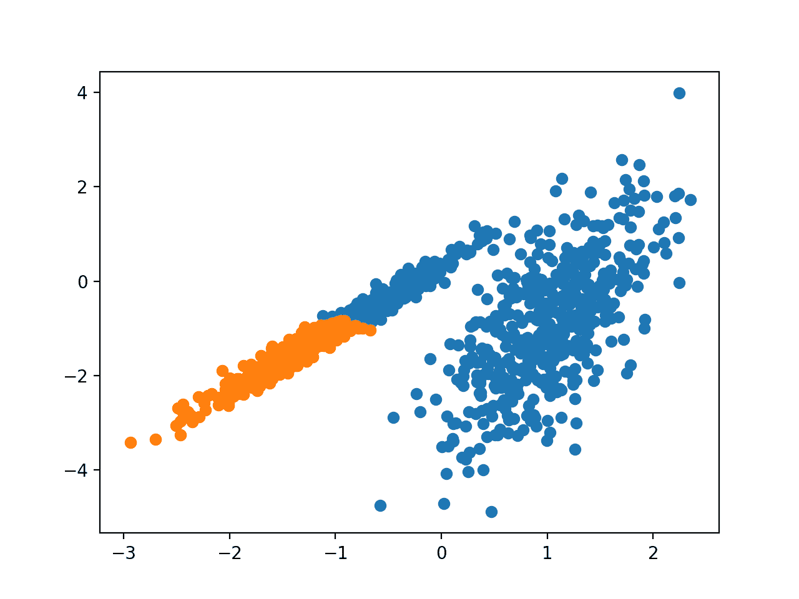
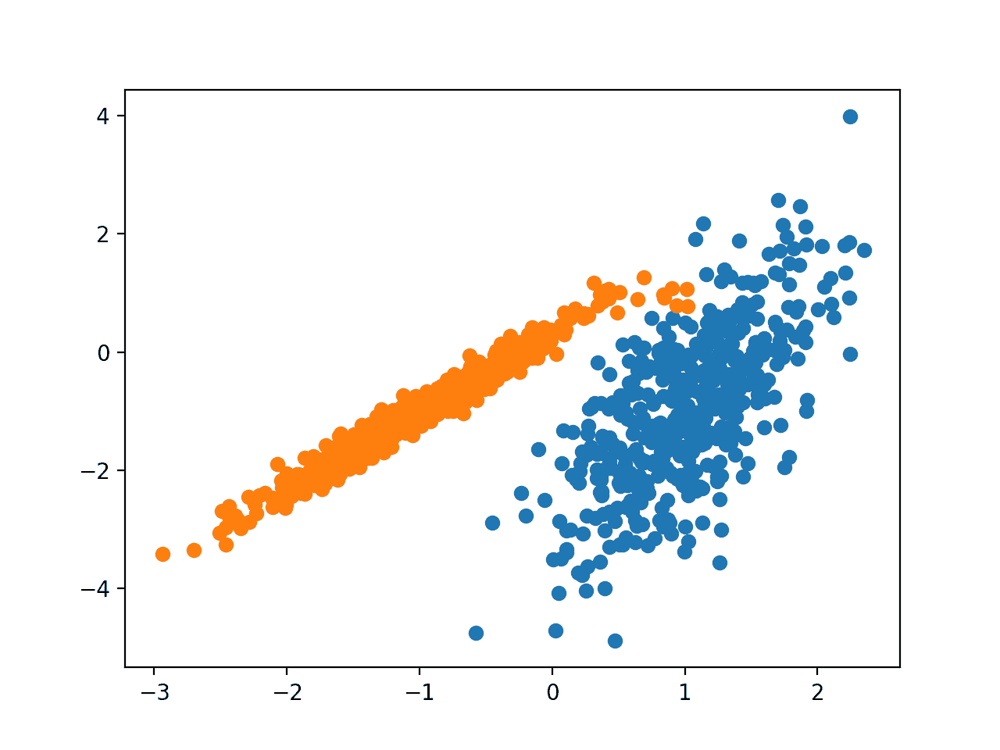
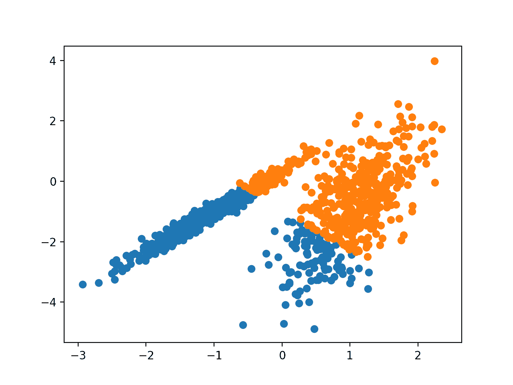
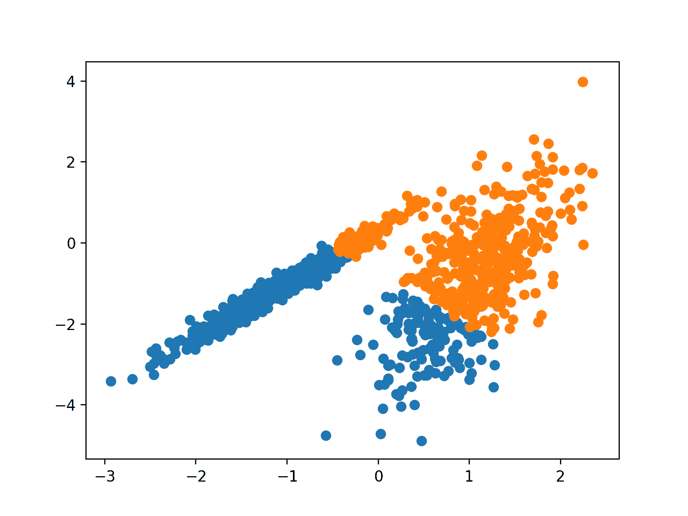
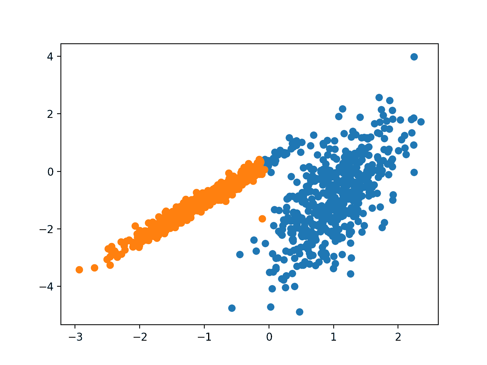
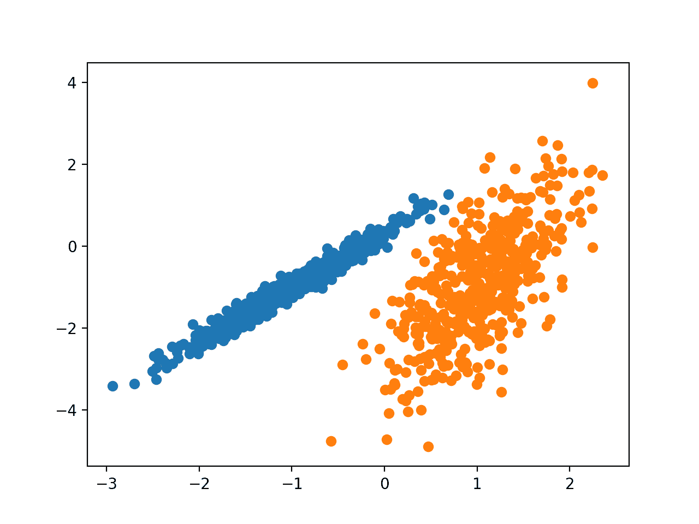

# 10 个 Python 聚类算法

> 原文：<https://machinelearningmastery.com/clustering-algorithms-with-python/>

最后更新于 2020 年 8 月 20 日

**聚类**或**聚类分析**是一个无监督的学习问题。

它通常被用作一种数据分析技术，用于发现数据中有趣的模式，例如基于客户行为的客户群。

有许多聚类算法可供选择，但没有一个最佳聚类算法适用于所有情况。相反，探索一系列聚类算法和每个算法的不同配置是一个好主意。

在本教程中，您将发现如何适合并使用 python 中的顶级聚类算法。

完成本教程后，您将知道:

*   聚类是在输入数据的特征空间中寻找自然群体的无监督问题。
*   有许多不同的聚类算法，没有一种最佳方法适用于所有数据集。
*   如何使用 scikit-learn 机器学习库在 Python 中实现、适应和使用顶级聚类算法。

**用我的新书[Python 机器学习精通](https://machinelearningmastery.com/machine-learning-with-python/)启动你的项目**，包括*分步教程*和所有示例的 *Python 源代码*文件。

我们开始吧。


Python 聚类算法
图片由 [Lars Plougmann](https://flickr.com/photos/criminalintent/25341994044/) 提供，保留部分权利。

## 教程概述

本教程分为三个部分；它们是:

1.  使聚集
2.  聚类算法
3.  聚类算法示例
    1.  库安装
    2.  聚类数据集
    3.  亲和传播
    4.  聚集聚类
    5.  桦树
    6.  DBSCAN
    7.  k 均值
    8.  小批量 K 均值
    9.  均值漂移
    10.  光学
    11.  光谱聚类
    12.  高斯混合模型

## 使聚集

聚类分析是一种无监督的机器学习任务。

它包括自动发现数据中的自然分组。与监督学习(如预测建模)不同，聚类算法仅解释输入数据，并在特征空间中找到自然组或聚类。

> 当没有要预测的类时，而是当实例被分成自然组时，聚类技术适用。

—第 141 页，[数据挖掘:实用机器学习工具与技术](https://amzn.to/2R0G3uG)，2016。

聚类通常是特征空间中的密度区域，其中来自域的示例(观察或数据行)比其他聚类更接近聚类。聚类可以具有作为样本或点特征空间的中心(质心)，并且可以具有边界或范围。

> 这些集群大概反映了在从中提取实例的领域中起作用的某种机制，这种机制使得一些实例比其他实例具有更强的相似性。

—第 141-142 页，[数据挖掘:实用机器学习工具与技术](https://amzn.to/2R0G3uG)，2016。

聚类作为一种数据分析活动，可以帮助我们了解更多关于问题领域的知识，即所谓的模式发现或知识发现。

例如:

*   [系统发育树](https://en.wikipedia.org/wiki/Phylogenetic_tree)可以认为是人工聚类分析的结果。
*   将正常数据与异常值或异常值分开可能被认为是一个聚类问题。
*   基于自然行为分离集群是一个集群问题，称为市场分割。

聚类作为一种特征工程也是有用的，现有的和新的例子可以被映射和标记为属于数据中的一个识别的聚类。

对已识别聚类的评估是主观的，可能需要领域专家，尽管确实存在许多特定于聚类的量化度量。典型地，聚类算法在合成数据集上与算法期望发现的预定义聚类进行学术比较。

> 聚类是一种无监督的学习技术，因此很难评估任何给定方法的输出质量。

—第 534 页，[机器学习:概率视角](https://amzn.to/2TwpXuC)，2012。

## 聚类算法

有许多类型的聚类算法。

许多算法使用特征空间中示例之间的相似性或距离度量来发现密集的观察区域。因此，在使用聚类算法之前缩放数据通常是一种好的做法。

> 聚类分析的所有目标的核心是被聚类的单个对象之间的相似度(或相异度)的概念。聚类方法试图根据提供给它的相似性定义对对象进行分组。

—第 502 页，[统计学习的要素:数据挖掘、推理和预测](https://amzn.to/38bbWGH)，2016。

一些聚类算法要求您指定或猜测要在数据中发现的聚类数量，而另一些算法要求指定观察值之间的最小距离，其中示例可以被认为是“*接近*或“*连接*”

因此，聚类分析是一个迭代过程，其中对所识别的聚类的主观评估被反馈到算法配置的改变中，直到获得期望的或适当的结果。

scikit-learn 库提供了一套不同的聚类算法可供选择。

下面列出了 10 种比较流行的算法:

*   亲和传播
*   聚集聚类
*   桦树
*   DBSCAN
*   k 均值
*   小批量 K 均值
*   均值漂移
*   光学
*   光谱聚类
*   高斯人的混合物

每种算法都提供了一种不同的方法来应对在数据中发现自然群体的挑战。

没有最佳的聚类算法，也没有简单的方法可以在不使用受控实验的情况下为您的数据找到最佳算法。

在本教程中，我们将回顾如何使用 scikit-learn 库中这 10 种流行的聚类算法。

这些示例将为您复制粘贴示例和在自己的数据上测试方法提供基础。

我们不会深入研究算法背后的理论，也不会直接比较它们。有关此主题的良好起点，请参见:

*   [聚类，sci kit-学习 API](https://scikit-learn.org/stable/modules/clustering.html) 。

让我们开始吧。

## 聚类算法示例

在本节中，我们将回顾如何在 scikit-learn 中使用 10 种流行的聚类算法。

这包括拟合模型的示例和可视化结果的示例。

这些示例旨在让您复制粘贴到自己的项目中，并将这些方法应用到自己的数据中。

### 库安装

首先，让我们安装库。

不要跳过这一步，因为您需要确保安装了最新版本。

您可以使用 pip Python 安装程序安装 scikit-learn 库，如下所示:

```py
sudo pip install scikit-learn
```

有关特定于您的平台的其他安装说明，请参见:

*   [安装 scikit-learn](https://scikit-learn.org/stable/install.html)

接下来，让我们确认库已安装，并且您使用的是现代版本。

运行以下脚本打印库版本号。

```py
# check scikit-learn version
import sklearn
print(sklearn.__version__)
```

运行该示例时，您应该会看到以下版本号或更高版本号。

```py
0.22.1
```

### 聚类数据集

我们将使用 [make_classification()函数](https://scikit-learn.org/stable/modules/generated/sklearn.datasets.make_classification.html)创建一个测试二进制分类数据集。

数据集将有 1，000 个示例，每个类有两个输入要素和一个聚类。聚类在两个维度上是视觉上明显的，因此我们可以用散点图绘制数据，并用指定的聚类给图中的点着色。这将有助于看到，至少在测试问题上，集群被识别得有多“好”。

这个测试问题中的聚类是基于多元高斯的，并且不是所有的聚类算法都能够有效地识别这些类型的聚类。因此，本教程中的结果不应用作比较一般方法的基础。

下面列出了创建和汇总合成聚类数据集的示例。

```py
# synthetic classification dataset
from numpy import where
from sklearn.datasets import make_classification
from matplotlib import pyplot
# define dataset
X, y = make_classification(n_samples=1000, n_features=2, n_informative=2, n_redundant=0, n_clusters_per_class=1, random_state=4)
# create scatter plot for samples from each class
for class_value in range(2):
	# get row indexes for samples with this class
	row_ix = where(y == class_value)
	# create scatter of these samples
	pyplot.scatter(X[row_ix, 0], X[row_ix, 1])
# show the plot
pyplot.show()
```

运行该示例会创建合成聚类数据集，然后创建输入数据的散点图，其中的点由类标签着色(理想化的聚类)。

我们可以清楚地看到二维的两组不同的数据，希望自动聚类算法能够检测到这些分组。


已知聚类着色点的综合聚类数据集散点图

接下来，我们可以开始查看应用于该数据集的聚类算法的示例。

我已经做了一些最小的尝试来调整每个方法到数据集。

**其中一个算法能得到更好的结果吗？**
在下面的评论里告诉我。

### 亲和传播

相似性传播包括找到一组最能概括数据的样本。

> 我们设计了一种称为“相似性传播”的方法，它将数据点对之间的相似性度量作为输入。实值消息在数据点之间交换，直到一组高质量的样本和相应的簇逐渐出现

——[通过在数据点之间传递消息进行聚类](https://science.sciencemag.org/content/315/5814/972)，2007 年。

该技术在本文中进行了描述:

*   [通过在数据点之间传递消息进行聚类](https://science.sciencemag.org/content/315/5814/972)，2007。

它是通过 [AffinityPropagation 类](https://scikit-learn.org/stable/modules/generated/sklearn.cluster.AffinityPropagation.html)实现的，主要配置是设置在 0.5 和 1 之间的“*阻尼*，可能还有“偏好”

下面列出了完整的示例。

```py
# affinity propagation clustering
from numpy import unique
from numpy import where
from sklearn.datasets import make_classification
from sklearn.cluster import AffinityPropagation
from matplotlib import pyplot
# define dataset
X, _ = make_classification(n_samples=1000, n_features=2, n_informative=2, n_redundant=0, n_clusters_per_class=1, random_state=4)
# define the model
model = AffinityPropagation(damping=0.9)
# fit the model
model.fit(X)
# assign a cluster to each example
yhat = model.predict(X)
# retrieve unique clusters
clusters = unique(yhat)
# create scatter plot for samples from each cluster
for cluster in clusters:
	# get row indexes for samples with this cluster
	row_ix = where(yhat == cluster)
	# create scatter of these samples
	pyplot.scatter(X[row_ix, 0], X[row_ix, 1])
# show the plot
pyplot.show()
```

运行该示例使模型适合训练数据集，并预测数据集中每个示例的聚类。然后创建散点图，用指定的簇给点着色。

在这种情况下，我不可能取得好的结果。


使用相似性传播识别聚类的数据集散点图

### 聚集聚类

凝聚聚类包括合并示例，直到达到期望的聚类数量。

它是更广泛的层次聚类方法的一部分，您可以在这里了解更多信息:

*   [层次聚类，维基百科](https://en.wikipedia.org/wiki/Hierarchical_clustering)。

它是通过[凝聚聚类](https://scikit-learn.org/stable/modules/generated/sklearn.cluster.AgglomerativeClustering.html)类实现的，主要配置是“ *n_clusters* ”集合，数据中聚类数量的估计，例如 2。

下面列出了完整的示例。

```py
# agglomerative clustering
from numpy import unique
from numpy import where
from sklearn.datasets import make_classification
from sklearn.cluster import AgglomerativeClustering
from matplotlib import pyplot
# define dataset
X, _ = make_classification(n_samples=1000, n_features=2, n_informative=2, n_redundant=0, n_clusters_per_class=1, random_state=4)
# define the model
model = AgglomerativeClustering(n_clusters=2)
# fit model and predict clusters
yhat = model.fit_predict(X)
# retrieve unique clusters
clusters = unique(yhat)
# create scatter plot for samples from each cluster
for cluster in clusters:
	# get row indexes for samples with this cluster
	row_ix = where(yhat == cluster)
	# create scatter of these samples
	pyplot.scatter(X[row_ix, 0], X[row_ix, 1])
# show the plot
pyplot.show()
```

运行该示例使模型适合训练数据集，并预测数据集中每个示例的聚类。然后创建散点图，用指定的簇给点着色。

在这种情况下，找到了合理的分组。



使用凝聚聚类识别聚类的数据集散点图

### 桦树

BIRCH 聚类(BIRCH 是使用
层次结构的平衡迭代约简和聚类的缩写)包括构建从中提取聚类中心的树结构。

> BIRCH 对输入的多维度量数据点进行增量式动态聚类，试图利用可用资源(即可用内存和时间限制)产生最佳质量的聚类。

——[BIRCH:一种高效的大型数据库数据聚类方法](https://dl.acm.org/doi/10.1145/235968.233324)，1996。

该技术在本文中进行了描述:

*   [BIRCH:一种高效的大型数据库数据聚类方法](https://dl.acm.org/doi/10.1145/235968.233324)，1996。

它是通过 [Birch 类](https://scikit-learn.org/stable/modules/generated/sklearn.cluster.Birch.html)实现的，要调优的主要配置是“*阈值*”和“ *n_clusters* ”超参数，后者提供了集群数量的估计。

下面列出了完整的示例。

```py
# birch clustering
from numpy import unique
from numpy import where
from sklearn.datasets import make_classification
from sklearn.cluster import Birch
from matplotlib import pyplot
# define dataset
X, _ = make_classification(n_samples=1000, n_features=2, n_informative=2, n_redundant=0, n_clusters_per_class=1, random_state=4)
# define the model
model = Birch(threshold=0.01, n_clusters=2)
# fit the model
model.fit(X)
# assign a cluster to each example
yhat = model.predict(X)
# retrieve unique clusters
clusters = unique(yhat)
# create scatter plot for samples from each cluster
for cluster in clusters:
	# get row indexes for samples with this cluster
	row_ix = where(yhat == cluster)
	# create scatter of these samples
	pyplot.scatter(X[row_ix, 0], X[row_ix, 1])
# show the plot
pyplot.show()
```

运行该示例使模型适合训练数据集，并预测数据集中每个示例的聚类。然后创建散点图，用指定的簇给点着色。

在这种情况下，找到了一个优秀的分组。



使用 BIRCH 聚类识别聚类的数据集散点图

## DBSCAN

DBSCAN 聚类(其中 DBSCAN 是基于密度的噪声应用空间聚类的缩写)包括在域中找到高密度区域，并将这些区域周围的特征空间扩展为聚类。

> ……我们提出了新的聚类算法 DBSCAN，它依赖于基于密度的聚类概念，旨在发现任意形状的聚类。DBSCAN 只需要一个输入参数，并支持用户为其确定合适的值

——[在有噪声的大型空间数据库中发现聚类的基于密度的算法](https://www.osti.gov/biblio/421283)，1996。

该技术在本文中进行了描述:

*   [一种基于密度的算法，用于在有噪声的大型空间数据库中发现聚类](https://www.osti.gov/biblio/421283)，1996。

它是通过 [DBSCAN 类](https://scikit-learn.org/stable/modules/generated/sklearn.cluster.DBSCAN.html)实现的，主要配置是 *eps* 和 *min_samples* 超参数。

下面列出了完整的示例。

```py
# dbscan clustering
from numpy import unique
from numpy import where
from sklearn.datasets import make_classification
from sklearn.cluster import DBSCAN
from matplotlib import pyplot
# define dataset
X, _ = make_classification(n_samples=1000, n_features=2, n_informative=2, n_redundant=0, n_clusters_per_class=1, random_state=4)
# define the model
model = DBSCAN(eps=0.30, min_samples=9)
# fit model and predict clusters
yhat = model.fit_predict(X)
# retrieve unique clusters
clusters = unique(yhat)
# create scatter plot for samples from each cluster
for cluster in clusters:
	# get row indexes for samples with this cluster
	row_ix = where(yhat == cluster)
	# create scatter of these samples
	pyplot.scatter(X[row_ix, 0], X[row_ix, 1])
# show the plot
pyplot.show()
```

运行该示例使模型适合训练数据集，并预测数据集中每个示例的聚类。然后创建散点图，用指定的簇给点着色。

在这种情况下，找到了一个合理的分组，尽管需要更多的调整。


使用数据库扫描聚类识别聚类的数据集散点图

### k 均值

[K-Means 聚类](https://en.wikipedia.org/wiki/K-means_clustering)可能是最广为人知的聚类算法，它包括为聚类分配示例，以尽量减少每个聚类内的差异。

> 本文的主要目的是描述一个基于样本将 N 维种群划分为 k 个集合的过程。这个被称为“k-means”的过程似乎给出了在类内方差意义上合理有效的划分。

——[多元观测值分类和分析的一些方法](https://projecteuclid.org/euclid.bsmsp/1200512992)，1967。

这里描述了该技术:

*   [k-means 聚类，维基百科](https://en.wikipedia.org/wiki/K-means_clustering)。

它通过 [KMeans 类](https://scikit-learn.org/stable/modules/generated/sklearn.cluster.KMeans.html)实现，主要配置是将“ *n_clusters* ”超参数设置为数据中的估计集群数。

下面列出了完整的示例。

```py
# k-means clustering
from numpy import unique
from numpy import where
from sklearn.datasets import make_classification
from sklearn.cluster import KMeans
from matplotlib import pyplot
# define dataset
X, _ = make_classification(n_samples=1000, n_features=2, n_informative=2, n_redundant=0, n_clusters_per_class=1, random_state=4)
# define the model
model = KMeans(n_clusters=2)
# fit the model
model.fit(X)
# assign a cluster to each example
yhat = model.predict(X)
# retrieve unique clusters
clusters = unique(yhat)
# create scatter plot for samples from each cluster
for cluster in clusters:
	# get row indexes for samples with this cluster
	row_ix = where(yhat == cluster)
	# create scatter of these samples
	pyplot.scatter(X[row_ix, 0], X[row_ix, 1])
# show the plot
pyplot.show()
```

运行该示例使模型适合训练数据集，并预测数据集中每个示例的聚类。然后创建散点图，用指定的簇给点着色。

在这种情况下，找到了一个合理的分组，尽管每个维度的不等等方差使该方法不太适合此数据集。



用 K-均值聚类识别聚类的数据集散点图

### 小批量 K 均值

Mini-Batch K-Means 是 K-Means 的修改版本，它使用样本的小批量而不是整个数据集来更新聚类质心，这可以使它对大数据集更快，并且可能对统计噪声更鲁棒。

> ……我们建议将小批量优化用于 k-means 聚类。与经典批处理算法相比，这将计算成本降低了几个数量级，同时产生了比在线随机梯度下降更好的解。

——[网络规模的 K 均值聚类](https://dl.acm.org/doi/10.1145/1772690.1772862)，2010。

该技术在本文中进行了描述:

*   [网页级 K 均值聚类](https://dl.acm.org/doi/10.1145/1772690.1772862)，2010。

它是通过[微型批处理工具类](https://scikit-learn.org/stable/modules/generated/sklearn.cluster.MiniBatchKMeans.html)实现的，主要配置是将“ *n_clusters* ”超参数设置为数据中的估计集群数。

下面列出了完整的示例。

```py
# mini-batch k-means clustering
from numpy import unique
from numpy import where
from sklearn.datasets import make_classification
from sklearn.cluster import MiniBatchKMeans
from matplotlib import pyplot
# define dataset
X, _ = make_classification(n_samples=1000, n_features=2, n_informative=2, n_redundant=0, n_clusters_per_class=1, random_state=4)
# define the model
model = MiniBatchKMeans(n_clusters=2)
# fit the model
model.fit(X)
# assign a cluster to each example
yhat = model.predict(X)
# retrieve unique clusters
clusters = unique(yhat)
# create scatter plot for samples from each cluster
for cluster in clusters:
	# get row indexes for samples with this cluster
	row_ix = where(yhat == cluster)
	# create scatter of these samples
	pyplot.scatter(X[row_ix, 0], X[row_ix, 1])
# show the plot
pyplot.show()
```

运行该示例使模型适合训练数据集，并预测数据集中每个示例的聚类。然后创建散点图，用指定的簇给点着色。

在这种情况下，找到了与标准 k-means 算法等价的结果。



用小批量 K-均值聚类识别聚类的数据集散点图

### 均值漂移

均值漂移聚类包括基于特征空间中的示例密度来寻找和调整质心。

> 对于离散数据，我们证明了递归均值漂移过程收敛到底层密度函数的最近平稳点，从而证明了它在检测密度模式中的效用。

——[均值漂移:一种稳健的特征空间分析方法](https://www.computer.org/csdl/journal/tp/2002/05/i0603/13rRUxYrbVE)，2002。

该技术在本文中进行了描述:

*   [均值漂移:一种稳健的特征空间分析方法](https://www.computer.org/csdl/journal/tp/2002/05/i0603/13rRUxYrbVE)，2002。

它是通过 [MeanShift 类](https://scikit-learn.org/stable/modules/generated/sklearn.cluster.MeanShift.html)实现的，主要配置是*带宽*超参数。

下面列出了完整的示例。

```py
# mean shift clustering
from numpy import unique
from numpy import where
from sklearn.datasets import make_classification
from sklearn.cluster import MeanShift
from matplotlib import pyplot
# define dataset
X, _ = make_classification(n_samples=1000, n_features=2, n_informative=2, n_redundant=0, n_clusters_per_class=1, random_state=4)
# define the model
model = MeanShift()
# fit model and predict clusters
yhat = model.fit_predict(X)
# retrieve unique clusters
clusters = unique(yhat)
# create scatter plot for samples from each cluster
for cluster in clusters:
	# get row indexes for samples with this cluster
	row_ix = where(yhat == cluster)
	# create scatter of these samples
	pyplot.scatter(X[row_ix, 0], X[row_ix, 1])
# show the plot
pyplot.show()
```

运行该示例使模型适合训练数据集，并预测数据集中每个示例的聚类。然后创建散点图，用指定的簇给点着色。

在这种情况下，可以在数据中找到一组合理的聚类。


使用均值漂移聚类识别聚类的数据集散点图

### 光学

光学聚类(其中光学是排序点的缩写，用于识别聚类结构)是上述数据库扫描的修改版本。

> 我们引入了一种新的算法用于聚类分析，这种算法不会显式地产生数据集的聚类；而是创建表示其基于密度的聚类结构的数据库的扩充排序。这种聚类排序包含的信息相当于对应于各种参数设置的基于密度的聚类。

——[OPTICS:排序点识别聚类结构](https://dl.acm.org/doi/10.1145/304182.304187)，1999。

该技术在本文中进行了描述:

*   [OPTICS:排序点识别聚类结构](https://dl.acm.org/doi/10.1145/304182.304187)，1999。

它是通过 [OPTICS 类](https://scikit-learn.org/stable/modules/generated/sklearn.cluster.OPTICS.html)实现的，主要配置是 *eps* 和 *min_samples* 超参数。

下面列出了完整的示例。

```py
# optics clustering
from numpy import unique
from numpy import where
from sklearn.datasets import make_classification
from sklearn.cluster import OPTICS
from matplotlib import pyplot
# define dataset
X, _ = make_classification(n_samples=1000, n_features=2, n_informative=2, n_redundant=0, n_clusters_per_class=1, random_state=4)
# define the model
model = OPTICS(eps=0.8, min_samples=10)
# fit model and predict clusters
yhat = model.fit_predict(X)
# retrieve unique clusters
clusters = unique(yhat)
# create scatter plot for samples from each cluster
for cluster in clusters:
	# get row indexes for samples with this cluster
	row_ix = where(yhat == cluster)
	# create scatter of these samples
	pyplot.scatter(X[row_ix, 0], X[row_ix, 1])
# show the plot
pyplot.show()
```

运行该示例使模型适合训练数据集，并预测数据集中每个示例的聚类。然后创建散点图，用指定的簇给点着色。

在这种情况下，我无法在这个数据集上获得合理的结果。


使用光学聚类识别聚类的数据集散点图

### 光谱聚类

谱聚类是一类通用的聚类方法，来源于[线性代数](https://machinelearningmastery.com/linear-algebra-machine-learning-7-day-mini-course/)。

> 最近在许多领域出现的一种有希望的替代方法是使用光谱方法进行聚类。这里，我们使用从点之间的距离导出的矩阵的顶部特征向量。

——[关于谱聚类:分析和算法](https://papers.nips.cc/paper/2092-on-spectral-clustering-analysis-and-an-algorithm.pdf)，2002 年。

该技术在本文中进行了描述:

*   [关于谱聚类:分析和算法](https://papers.nips.cc/paper/2092-on-spectral-clustering-analysis-and-an-algorithm.pdf)，2002。

它是通过[光谱聚类类](https://scikit-learn.org/stable/modules/generated/sklearn.cluster.SpectralClustering.html)实现的，主要的光谱聚类是一类通用的聚类方法，取自线性代数。要调优的是“ *n_clusters* ”超参数，用于指定数据中估计的集群数量。

下面列出了完整的示例。

```py
# spectral clustering
from numpy import unique
from numpy import where
from sklearn.datasets import make_classification
from sklearn.cluster import SpectralClustering
from matplotlib import pyplot
# define dataset
X, _ = make_classification(n_samples=1000, n_features=2, n_informative=2, n_redundant=0, n_clusters_per_class=1, random_state=4)
# define the model
model = SpectralClustering(n_clusters=2)
# fit model and predict clusters
yhat = model.fit_predict(X)
# retrieve unique clusters
clusters = unique(yhat)
# create scatter plot for samples from each cluster
for cluster in clusters:
	# get row indexes for samples with this cluster
	row_ix = where(yhat == cluster)
	# create scatter of these samples
	pyplot.scatter(X[row_ix, 0], X[row_ix, 1])
# show the plot
pyplot.show()
```

运行该示例使模型适合训练数据集，并预测数据集中每个示例的聚类。然后创建散点图，用指定的簇给点着色。

在这种情况下，找到了合理的聚类。



使用光谱聚类识别聚类的数据集散点图

### 高斯混合模型

高斯混合模型总结了一个多元概率密度函数，顾名思义，它是高斯概率分布的混合。

有关该模型的更多信息，请参见:

*   [混合模型，维基百科](https://en.wikipedia.org/wiki/Mixture_model)。

它通过[高斯混合类](https://scikit-learn.org/stable/modules/generated/sklearn.mixture.GaussianMixture.html)实现，要调整的主要配置是“ *n_clusters* ”超参数，用于指定数据中估计的集群数量。

下面列出了完整的示例。

```py
# gaussian mixture clustering
from numpy import unique
from numpy import where
from sklearn.datasets import make_classification
from sklearn.mixture import GaussianMixture
from matplotlib import pyplot
# define dataset
X, _ = make_classification(n_samples=1000, n_features=2, n_informative=2, n_redundant=0, n_clusters_per_class=1, random_state=4)
# define the model
model = GaussianMixture(n_components=2)
# fit the model
model.fit(X)
# assign a cluster to each example
yhat = model.predict(X)
# retrieve unique clusters
clusters = unique(yhat)
# create scatter plot for samples from each cluster
for cluster in clusters:
	# get row indexes for samples with this cluster
	row_ix = where(yhat == cluster)
	# create scatter of these samples
	pyplot.scatter(X[row_ix, 0], X[row_ix, 1])
# show the plot
pyplot.show()
```

运行该示例使模型适合训练数据集，并预测数据集中每个示例的聚类。然后创建散点图，用指定的簇给点着色。

在这种情况下，我们可以看到集群被完美地识别。这并不奇怪，因为数据集是由高斯混合生成的。



使用高斯混合聚类识别聚类的数据集散点图

## 进一步阅读

如果您想更深入地了解这个主题，本节将提供更多资源。

### 报纸

*   [通过在数据点之间传递消息进行聚类](https://science.sciencemag.org/content/315/5814/972)，2007。
*   [BIRCH:一种高效的大型数据库数据聚类方法](https://dl.acm.org/doi/10.1145/235968.233324)，1996。
*   [一种基于密度的算法，用于在有噪声的大型空间数据库中发现聚类](https://www.osti.gov/biblio/421283)，1996。
*   [多元观测值分类和分析的一些方法](https://projecteuclid.org/euclid.bsmsp/1200512992)，1967。
*   [网页级 K 均值聚类](https://dl.acm.org/doi/10.1145/1772690.1772862)，2010。
*   [均值漂移:一种稳健的特征空间分析方法](https://www.computer.org/csdl/journal/tp/2002/05/i0603/13rRUxYrbVE)，2002。
*   [关于谱聚类:分析和算法](https://papers.nips.cc/paper/2092-on-spectral-clustering-analysis-and-an-algorithm.pdf)，2002。

### 书

*   [数据挖掘:实用机器学习工具与技术](https://amzn.to/2R0G3uG)，2016。
*   [统计学习的要素:数据挖掘、推理和预测](https://amzn.to/38bbWGH)，2016。
*   [机器学习:概率视角](https://amzn.to/2TwpXuC)，2012。

### 蜜蜂

*   [聚类，sci kit-学习 API](https://scikit-learn.org/stable/modules/clustering.html) 。
*   [sklearn . datasets . make _ classification API](https://scikit-learn.org/stable/modules/generated/sklearn.datasets.make_classification.html)。
*   硬化。群集 API 。

### 文章

*   [聚类分析，维基百科](https://en.wikipedia.org/wiki/Cluster_analysis)。
*   [层次聚类，维基百科](https://en.wikipedia.org/wiki/Hierarchical_clustering)。
*   [k-means 聚类，维基百科](https://en.wikipedia.org/wiki/K-means_clustering)。
*   [混合模型，维基百科](https://en.wikipedia.org/wiki/Mixture_model)。

## 摘要

在本教程中，您发现了如何在 python 中适应和使用顶级聚类算法。

具体来说，您了解到:

*   聚类是在输入数据的特征空间中寻找自然群体的无监督问题。
*   有许多不同的聚类算法，没有一种最佳方法适用于所有数据集。
*   如何使用 scikit-learn 机器学习库在 Python 中实现、适应和使用顶级聚类算法。

**你有什么问题吗？**
在下面的评论中提问，我会尽力回答。