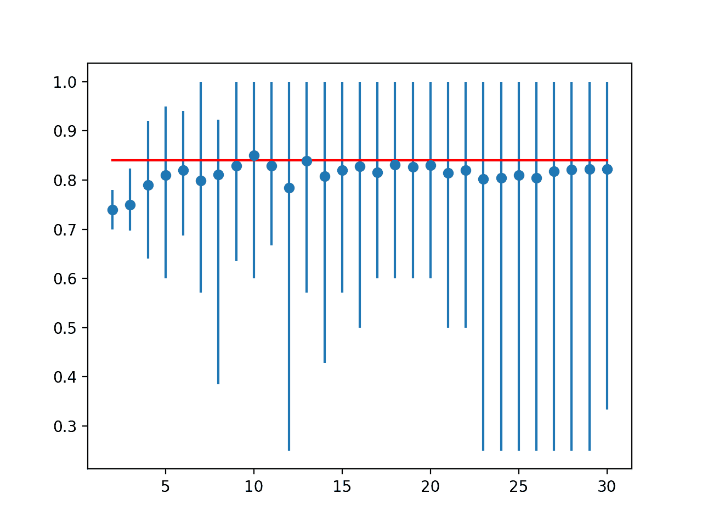
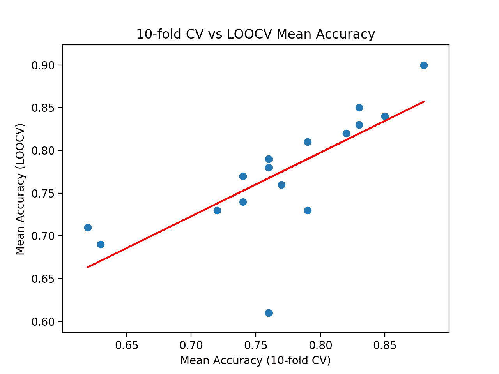

# 如何配置 k 重交叉验证

> 原文：<https://machinelearningmastery.com/how-to-configure-k-fold-cross-validation/>

最后更新于 2020 年 8 月 26 日

k-fold 交叉验证过程是一种评估数据集上机器学习算法性能的标准方法。

*k* 的一个常见值是 10，尽管我们如何知道这个配置适合我们的数据集和算法？

一种方法是探索不同的 *k* 值对模型性能估计的影响，并将其与理想的测试条件进行比较。这有助于为 *k* 选择合适的值。

一旦选择了*k*-值，它可以用于评估数据集上的一套不同算法，并且可以使用理想的测试条件将结果的分布与相同算法的评估进行比较，以查看它们是否高度相关。如果相关，它确认所选配置是理想测试条件的可靠近似。

在本教程中，您将发现如何配置和评估 k-fold 交叉验证的配置。

完成本教程后，您将知道:

*   如何在数据集上使用 k 重交叉验证评估机器学习算法？
*   如何对 k 值进行敏感性分析以进行 k 倍交叉验证？
*   如何计算交叉验证测试线束和理想测试条件之间的相关性？

**用我的新书[Python 机器学习精通](https://machinelearningmastery.com/machine-learning-with-python/)启动你的项目**，包括*分步教程*和所有示例的 *Python 源代码*文件。

我们开始吧。


如何配置 k-Fold 交叉验证
图片由[帕特丽夏·法雷尔](https://flickr.com/photos/patriciafarrell/15817428214/)提供，保留部分权利。

## 教程概述

本教程分为三个部分；它们是:

1.  k 折叠交叉验证
2.  钾的敏感性分析
3.  测试线束与目标的相关性

## k 折叠交叉验证

使用 k 重交叉验证在数据集上评估机器学习模型是很常见的。

k 折叠交叉验证过程将有限的数据集分成 k 个不重叠的折叠。k 个折叠中的每一个都有机会被用作保留测试集，而所有其他折叠一起被用作训练数据集。在 k 个保持测试集上，对总共 k 个模型进行拟合和评估，并报告平均性能。

有关 k-fold 交叉验证过程的更多信息，请参见教程:

*   [k 倍交叉验证的温和介绍](https://machinelearningmastery.com/k-fold-cross-validation/)

使用 scikit-learn 机器学习库可以轻松实现 k-fold 交叉验证过程。

首先，让我们定义一个可以作为本教程基础的综合分类数据集。

[make_classification()函数](https://scikit-learn.org/stable/modules/generated/sklearn.datasets.make_classification.html)可用于创建合成二进制分类数据集。我们将配置它生成 100 个样本，每个样本有 20 个输入特征，其中 15 个有助于目标变量。

下面的示例创建并汇总了数据集。

```py
# test classification dataset
from sklearn.datasets import make_classification
# define dataset
X, y = make_classification(n_samples=100, n_features=20, n_informative=15, n_redundant=5, random_state=1)
# summarize the dataset
print(X.shape, y.shape)
```

运行该示例会创建数据集，并确认它包含 100 个样本和 10 个输入变量。

伪随机数发生器的固定种子确保我们每次生成数据集时获得相同的样本。

```py
(100, 20) (100,)
```

接下来，我们可以使用 k-fold 交叉验证来评估这个数据集上的模型。

我们将评估一个[logisticreduce](https://scikit-learn.org/stable/modules/generated/sklearn.linear_model.LogisticRegression.html)模型，并使用 [KFold 类](https://scikit-learn.org/stable/modules/generated/sklearn.model_selection.KFold.html)执行交叉验证，配置为洗牌数据集并设置 k=10，这是一个流行的默认值。

[cross_val_score()函数](https://scikit-learn.org/stable/modules/generated/sklearn.model_selection.cross_val_score.html)将用于执行评估，获取数据集和交叉验证配置，并返回为每个折叠计算的分数列表。

下面列出了完整的示例。

```py
# evaluate a logistic regression model using k-fold cross-validation
from numpy import mean
from numpy import std
from sklearn.datasets import make_classification
from sklearn.model_selection import KFold
from sklearn.model_selection import cross_val_score
from sklearn.linear_model import LogisticRegression
# create dataset
X, y = make_classification(n_samples=100, n_features=20, n_informative=15, n_redundant=5, random_state=1)
# prepare the cross-validation procedure
cv = KFold(n_splits=10, random_state=1, shuffle=True)
# create model
model = LogisticRegression()
# evaluate model
scores = cross_val_score(model, X, y, scoring='accuracy', cv=cv, n_jobs=-1)
# report performance
print('Accuracy: %.3f (%.3f)' % (mean(scores), std(scores)))
```

运行该示例会创建数据集，然后使用 10 倍交叉验证对其进行逻辑回归模型评估。然后报告数据集的平均分类精度。

**注**:考虑到算法或评估程序的随机性，或数值精度的差异，您的[结果可能会有所不同](https://machinelearningmastery.com/different-results-each-time-in-machine-learning/)。考虑运行该示例几次，并比较平均结果。

在这种情况下，我们可以看到该模型实现了大约 85.0%的估计分类准确率。

```py
Accuracy: 0.850 (0.128)
```

现在我们已经熟悉了 k-fold 交叉验证，让我们看看如何配置这个过程。

## 钾的敏感性分析

k-fold 交叉验证的关键配置参数是 k，它定义了分割给定数据集的折叠次数。

常见的值有 k=3、k=5 和 k=10，到目前为止，应用机器学习中用来评估模型的最流行的值是 k=10。其原因是进行了研究，发现 k=10 在低计算成本和低模型性能估计偏差之间提供了良好的平衡。

**我们如何知道在自己的数据集上评估模型时使用什么 k 值？**

你可以选择 k=10，但是你怎么知道这对你的数据集有意义呢？

回答这个问题的一种方法是对不同的 k 值进行敏感性分析。也就是说，用不同的 k 值评估同一数据集上同一模型的性能，看看它们是如何比较的。

预期低 k 值将导致模型性能的噪声估计，大 k 值将导致模型性能的噪声估计较小。

但是吵起来比什么呢？

在对新的/未看到的数据进行预测时，我们不知道模型的真实性能，因为我们无法访问新的/未看到的数据。如果我们这样做了，我们将在模型的评估中使用它。

然而，我们可以选择一个代表模型性能的“*理想*”或“尽我们所能达到的最佳”*理想*”评估的测试条件。

一种方法是在所有可用数据的基础上训练模型，并在一个独立的大型代表性搁置数据集上估计性能。这个保持数据集上的性能将代表模型的“*真*”性能，并且训练数据集上的任何交叉验证性能将代表这个分数的估计。

这很少可能，因为我们通常没有足够的数据来保留一些数据并将其用作测试集。Kaggle 机器学习竞赛是一个例外，我们确实有一个搁置测试集，其样本通过提交进行评估。

相反，我们可以使用[省去一个交叉验证(LOOCV)](https://machinelearningmastery.com/loocv-for-evaluating-machine-learning-algorithms/) 来模拟这种情况，这是一个计算量很大的交叉验证版本，其中 *k=N* ，而 *N* 是训练数据集中的示例总数。也就是说，训练集中的每个样本都给出了一个单独用作测试评估数据集的示例。它很少用于大型数据集，因为它的计算成本很高，尽管在给定可用数据的情况下，它可以很好地估计模型性能。

然后，我们可以将不同 k 值的平均分类精度与同一数据集上来自 LOOCV 的平均分类精度进行比较。分数之间的差异为 k 值接近理想模型评估测试条件的程度提供了一个粗略的代表。

让我们探索如何实现 k 倍交叉验证的敏感性分析。

首先，让我们定义一个函数来创建数据集。这允许您根据需要将数据集更改为自己的数据集。

```py
# create the dataset
def get_dataset(n_samples=100):
	X, y = make_classification(n_samples=n_samples, n_features=20, n_informative=15, n_redundant=5, random_state=1)
	return X, y
```

接下来，我们可以定义一个数据集来创建要评估的模型。

同样，如果您愿意，这种分离允许您将模型更改为自己的模型。

```py
# retrieve the model to be evaluate
def get_model():
	model = LogisticRegression()
	return model
```

接下来，您可以定义一个函数来评估给定测试条件下数据集上的模型。测试条件可以是配置了给定 k 值的 KFold 的实例，也可以是代表我们理想测试条件的 LeaveOneOut 的实例。

该函数返回平均分类精度以及折叠的最小和最大精度。我们可以用最小值和最大值来总结分数的分布。

```py
# evaluate the model using a given test condition
def evaluate_model(cv):
	# get the dataset
	X, y = get_dataset()
	# get the model
	model = get_model()
	# evaluate the model
	scores = cross_val_score(model, X, y, scoring='accuracy', cv=cv, n_jobs=-1)
	# return scores
	return mean(scores), scores.min(), scores.max()
```

接下来，我们可以使用 LOOCV 程序计算模型性能。

```py
...
# calculate the ideal test condition
ideal, _, _ = evaluate_model(LeaveOneOut())
print('Ideal: %.3f' % ideal)
```

然后我们可以定义要评估的 k 值。在这种情况下，我们将测试 2 到 30 之间的值。

```py
...
# define folds to test
folds = range(2,31)
```

然后，我们可以依次评估每个值，并存储结果。

```py
...
# record mean and min/max of each set of results
means, mins, maxs = list(),list(),list()
# evaluate each k value
for k in folds:
	# define the test condition
	cv = KFold(n_splits=k, shuffle=True, random_state=1)
	# evaluate k value
	k_mean, k_min, k_max = evaluate_model(cv)
	# report performance
	print('> folds=%d, accuracy=%.3f (%.3f,%.3f)' % (k, k_mean, k_min, k_max))
	# store mean accuracy
	means.append(k_mean)
	# store min and max relative to the mean
	mins.append(k_mean - k_min)
	maxs.append(k_max - k_mean)
```

最后，我们可以绘制结果进行解释。

```py
...
# line plot of k mean values with min/max error bars
pyplot.errorbar(folds, means, yerr=[mins, maxs], fmt='o')
# plot the ideal case in a separate color
pyplot.plot(folds, [ideal for _ in range(len(folds))], color='r')
# show the plot
pyplot.show()
```

将这些联系在一起，完整的示例如下所示。

```py
# sensitivity analysis of k in k-fold cross-validation
from numpy import mean
from sklearn.datasets import make_classification
from sklearn.model_selection import LeaveOneOut
from sklearn.model_selection import KFold
from sklearn.model_selection import cross_val_score
from sklearn.linear_model import LogisticRegression
from matplotlib import pyplot

# create the dataset
def get_dataset(n_samples=100):
	X, y = make_classification(n_samples=n_samples, n_features=20, n_informative=15, n_redundant=5, random_state=1)
	return X, y

# retrieve the model to be evaluate
def get_model():
	model = LogisticRegression()
	return model

# evaluate the model using a given test condition
def evaluate_model(cv):
	# get the dataset
	X, y = get_dataset()
	# get the model
	model = get_model()
	# evaluate the model
	scores = cross_val_score(model, X, y, scoring='accuracy', cv=cv, n_jobs=-1)
	# return scores
	return mean(scores), scores.min(), scores.max()

# calculate the ideal test condition
ideal, _, _ = evaluate_model(LeaveOneOut())
print('Ideal: %.3f' % ideal)
# define folds to test
folds = range(2,31)
# record mean and min/max of each set of results
means, mins, maxs = list(),list(),list()
# evaluate each k value
for k in folds:
	# define the test condition
	cv = KFold(n_splits=k, shuffle=True, random_state=1)
	# evaluate k value
	k_mean, k_min, k_max = evaluate_model(cv)
	# report performance
	print('> folds=%d, accuracy=%.3f (%.3f,%.3f)' % (k, k_mean, k_min, k_max))
	# store mean accuracy
	means.append(k_mean)
	# store min and max relative to the mean
	mins.append(k_mean - k_min)
	maxs.append(k_max - k_mean)
# line plot of k mean values with min/max error bars
pyplot.errorbar(folds, means, yerr=[mins, maxs], fmt='o')
# plot the ideal case in a separate color
pyplot.plot(folds, [ideal for _ in range(len(folds))], color='r')
# show the plot
pyplot.show()
```

运行该示例首先报告 LOOCV，然后报告评估的每个 k 值的平均值、最小值和最大值。

**注**:考虑到算法或评估程序的随机性，或数值精度的差异，您的[结果可能会有所不同](https://machinelearningmastery.com/different-results-each-time-in-machine-learning/)。考虑运行该示例几次，并比较平均结果。

在这种情况下，我们可以看到 LOOCV 结果约为 84%，略低于 85%的 k=10 结果。

```py
Ideal: 0.840
> folds=2, accuracy=0.740 (0.700,0.780)
> folds=3, accuracy=0.749 (0.697,0.824)
> folds=4, accuracy=0.790 (0.640,0.920)
> folds=5, accuracy=0.810 (0.600,0.950)
> folds=6, accuracy=0.820 (0.688,0.941)
> folds=7, accuracy=0.799 (0.571,1.000)
> folds=8, accuracy=0.811 (0.385,0.923)
> folds=9, accuracy=0.829 (0.636,1.000)
> folds=10, accuracy=0.850 (0.600,1.000)
> folds=11, accuracy=0.829 (0.667,1.000)
> folds=12, accuracy=0.785 (0.250,1.000)
> folds=13, accuracy=0.839 (0.571,1.000)
> folds=14, accuracy=0.807 (0.429,1.000)
> folds=15, accuracy=0.821 (0.571,1.000)
> folds=16, accuracy=0.827 (0.500,1.000)
> folds=17, accuracy=0.816 (0.600,1.000)
> folds=18, accuracy=0.831 (0.600,1.000)
> folds=19, accuracy=0.826 (0.600,1.000)
> folds=20, accuracy=0.830 (0.600,1.000)
> folds=21, accuracy=0.814 (0.500,1.000)
> folds=22, accuracy=0.820 (0.500,1.000)
> folds=23, accuracy=0.802 (0.250,1.000)
> folds=24, accuracy=0.804 (0.250,1.000)
> folds=25, accuracy=0.810 (0.250,1.000)
> folds=26, accuracy=0.804 (0.250,1.000)
> folds=27, accuracy=0.818 (0.250,1.000)
> folds=28, accuracy=0.821 (0.250,1.000)
> folds=29, accuracy=0.822 (0.250,1.000)
> folds=30, accuracy=0.822 (0.333,1.000)
```

创建一个线图，将平均准确度分数与 LOOCV 结果进行比较，并使用误差线指示每个结果分布的最小值和最大值。

结果表明，对于该数据集上的模型，与理想情况相比，大多数 k 值低估了模型的性能。结果表明，也许仅 k=10 是稍微乐观的，也许 k=13 可能是更准确的估计。



带有误差线的交叉验证 k 值的平均准确度线图(蓝色)与理想情况(红色)

这提供了一个模板，您可以使用该模板根据给定的理想测试条件对数据集上所选模型的 k 值进行敏感性分析。

## 测试线束与目标的相关性

一旦选择了测试线束，另一个考虑因素是它在不同算法中与理想测试条件的匹配程度。

与其他算法和算法配置相比，对于某些算法和某些配置，k 倍交叉验证可能是理想测试条件的更好近似。

我们可以明确地评估和报告这种关系。这可以通过计算一系列算法的 k 倍交叉验证结果与理想测试条件下相同算法的评估匹配程度来实现。

两组分数之间可以计算出[皮尔逊相关系数](https://machinelearningmastery.com/how-to-use-correlation-to-understand-the-relationship-between-variables/)来衡量它们的匹配程度。也就是说，它们是否以相同的方式一起改变:当一个算法通过 k 倍交叉验证看起来比另一个算法更好时，这是否在理想的测试条件下成立？

我们希望看到分数之间有很强的正相关性，比如 0.5 或更高。低相关性表明需要改变 k 倍交叉验证测试工具，以更好地匹配理想的测试条件。

首先，我们可以定义一个函数，创建一个标准机器学习模型列表，通过每个测试工具进行评估。

```py
# get a list of models to evaluate
def get_models():
	models = list()
	models.append(LogisticRegression())
	models.append(RidgeClassifier())
	models.append(SGDClassifier())
	models.append(PassiveAggressiveClassifier())
	models.append(KNeighborsClassifier())
	models.append(DecisionTreeClassifier())
	models.append(ExtraTreeClassifier())
	models.append(LinearSVC())
	models.append(SVC())
	models.append(GaussianNB())
	models.append(AdaBoostClassifier())
	models.append(BaggingClassifier())
	models.append(RandomForestClassifier())
	models.append(ExtraTreesClassifier())
	models.append(GaussianProcessClassifier())
	models.append(GradientBoostingClassifier())
	models.append(LinearDiscriminantAnalysis())
	models.append(QuadraticDiscriminantAnalysis())
	return models
```

我们将使用 k=10 作为选择的测试线束。

然后，我们可以列举每个模型，并使用 10 倍交叉验证和我们的理想测试条件(在本例中是 LOOCV)对其进行评估。

```py
...
# define test conditions
ideal_cv = LeaveOneOut()
cv = KFold(n_splits=10, shuffle=True, random_state=1)
# get the list of models to consider
models = get_models()
# collect results
ideal_results, cv_results = list(), list()
# evaluate each model
for model in models:
	# evaluate model using each test condition
	cv_mean = evaluate_model(cv, model)
	ideal_mean = evaluate_model(ideal_cv, model)
	# check for invalid results
	if isnan(cv_mean) or isnan(ideal_mean):
		continue
	# store results
	cv_results.append(cv_mean)
	ideal_results.append(ideal_mean)
	# summarize progress
	print('>%s: ideal=%.3f, cv=%.3f' % (type(model).__name__, ideal_mean, cv_mean))
```

然后，我们可以计算 10 倍交叉验证测试工具和 LOOCV 测试工具的平均分类准确度之间的相关性。

```py
...
# calculate the correlation between each test condition
corr, _ = pearsonr(cv_results, ideal_results)
print('Correlation: %.3f' % corr)
```

最后，我们可以创建两组结果的散点图，并绘制一条最佳拟合线，以直观地看到它们一起变化的情况。

```py
...
# scatter plot of results
pyplot.scatter(cv_results, ideal_results)
# plot the line of best fit
coeff, bias = polyfit(cv_results, ideal_results, 1)
line = coeff * asarray(cv_results) + bias
pyplot.plot(cv_results, line, color='r')
# show the plot
pyplot.show()
```

将所有这些结合在一起，下面列出了完整的示例。

```py
# correlation between test harness and ideal test condition
from numpy import mean
from numpy import isnan
from numpy import asarray
from numpy import polyfit
from scipy.stats import pearsonr
from matplotlib import pyplot
from sklearn.datasets import make_classification
from sklearn.model_selection import KFold
from sklearn.model_selection import LeaveOneOut
from sklearn.model_selection import cross_val_score
from sklearn.linear_model import LogisticRegression
from sklearn.linear_model import RidgeClassifier
from sklearn.linear_model import SGDClassifier
from sklearn.linear_model import PassiveAggressiveClassifier
from sklearn.neighbors import KNeighborsClassifier
from sklearn.tree import DecisionTreeClassifier
from sklearn.tree import ExtraTreeClassifier
from sklearn.svm import LinearSVC
from sklearn.svm import SVC
from sklearn.naive_bayes import GaussianNB
from sklearn.ensemble import AdaBoostClassifier
from sklearn.ensemble import BaggingClassifier
from sklearn.ensemble import RandomForestClassifier
from sklearn.ensemble import ExtraTreesClassifier
from sklearn.gaussian_process import GaussianProcessClassifier
from sklearn.ensemble import GradientBoostingClassifier
from sklearn.discriminant_analysis import LinearDiscriminantAnalysis
from sklearn.discriminant_analysis import QuadraticDiscriminantAnalysis

# create the dataset
def get_dataset(n_samples=100):
	X, y = make_classification(n_samples=n_samples, n_features=20, n_informative=15, n_redundant=5, random_state=1)
	return X, y

# get a list of models to evaluate
def get_models():
	models = list()
	models.append(LogisticRegression())
	models.append(RidgeClassifier())
	models.append(SGDClassifier())
	models.append(PassiveAggressiveClassifier())
	models.append(KNeighborsClassifier())
	models.append(DecisionTreeClassifier())
	models.append(ExtraTreeClassifier())
	models.append(LinearSVC())
	models.append(SVC())
	models.append(GaussianNB())
	models.append(AdaBoostClassifier())
	models.append(BaggingClassifier())
	models.append(RandomForestClassifier())
	models.append(ExtraTreesClassifier())
	models.append(GaussianProcessClassifier())
	models.append(GradientBoostingClassifier())
	models.append(LinearDiscriminantAnalysis())
	models.append(QuadraticDiscriminantAnalysis())
	return models

# evaluate the model using a given test condition
def evaluate_model(cv, model):
	# get the dataset
	X, y = get_dataset()
	# evaluate the model
	scores = cross_val_score(model, X, y, scoring='accuracy', cv=cv, n_jobs=-1)
	# return scores
	return mean(scores)

# define test conditions
ideal_cv = LeaveOneOut()
cv = KFold(n_splits=10, shuffle=True, random_state=1)
# get the list of models to consider
models = get_models()
# collect results
ideal_results, cv_results = list(), list()
# evaluate each model
for model in models:
	# evaluate model using each test condition
	cv_mean = evaluate_model(cv, model)
	ideal_mean = evaluate_model(ideal_cv, model)
	# check for invalid results
	if isnan(cv_mean) or isnan(ideal_mean):
		continue
	# store results
	cv_results.append(cv_mean)
	ideal_results.append(ideal_mean)
	# summarize progress
	print('>%s: ideal=%.3f, cv=%.3f' % (type(model).__name__, ideal_mean, cv_mean))
# calculate the correlation between each test condition
corr, _ = pearsonr(cv_results, ideal_results)
print('Correlation: %.3f' % corr)
# scatter plot of results
pyplot.scatter(cv_results, ideal_results)
# plot the line of best fit
coeff, bias = polyfit(cv_results, ideal_results, 1)
line = coeff * asarray(cv_results) + bias
pyplot.plot(cv_results, line, color='r')
# label the plot
pyplot.title('10-fold CV vs LOOCV Mean Accuracy')
pyplot.xlabel('Mean Accuracy (10-fold CV)')
pyplot.ylabel('Mean Accuracy (LOOCV)')
# show the plot
pyplot.show()
```

运行该示例会报告通过每个测试线束计算出的每个算法的平均分类精度。

**注**:考虑到算法或评估程序的随机性，或数值精度的差异，您的[结果可能会有所不同](https://machinelearningmastery.com/different-results-each-time-in-machine-learning/)。考虑运行该示例几次，并比较平均结果。

您可能会看到一些可以安全忽略的警告，例如:

```py
Variables are collinear
```

我们可以看到，对于某些算法，与 LOOCV 相比，测试工具高估了精度，而在其他情况下，它低估了精度。这是意料之中的。

在运行结束时，我们可以看到两组结果之间的相关性被报告。在这种情况下，我们可以看到报告了 0.746 的相关性，这是一个很好的强正相关。结果表明，10 倍交叉验证确实为该数据集上的 LOOCV 测试工具提供了一个很好的近似，这是用 18 种流行的机器学习算法计算的。

```py
>LogisticRegression: ideal=0.840, cv=0.850
>RidgeClassifier: ideal=0.830, cv=0.830
>SGDClassifier: ideal=0.730, cv=0.790
>PassiveAggressiveClassifier: ideal=0.780, cv=0.760
>KNeighborsClassifier: ideal=0.760, cv=0.770
>DecisionTreeClassifier: ideal=0.690, cv=0.630
>ExtraTreeClassifier: ideal=0.710, cv=0.620
>LinearSVC: ideal=0.850, cv=0.830
>SVC: ideal=0.900, cv=0.880
>GaussianNB: ideal=0.730, cv=0.720
>AdaBoostClassifier: ideal=0.740, cv=0.740
>BaggingClassifier: ideal=0.770, cv=0.740
>RandomForestClassifier: ideal=0.810, cv=0.790
>ExtraTreesClassifier: ideal=0.820, cv=0.820
>GaussianProcessClassifier: ideal=0.790, cv=0.760
>GradientBoostingClassifier: ideal=0.820, cv=0.820
>LinearDiscriminantAnalysis: ideal=0.830, cv=0.830
>QuadraticDiscriminantAnalysis: ideal=0.610, cv=0.760
Correlation: 0.746
```

最后，创建散点图，比较测试装具(x 轴)的平均准确度分数分布与通过 LOOCV (y 轴)的准确度分数分布。

通过显示强线性相关性的结果画出最佳拟合的红线。



交叉验证散点图与具有最佳拟合线的理想测试平均准确度

这提供了一个工具，用于将您选择的测试工具与您自己数据集上的理想测试条件进行比较。

## 进一步阅读

如果您想更深入地了解这个主题，本节将提供更多资源。

### 教程

*   [k 倍交叉验证的温和介绍](https://machinelearningmastery.com/k-fold-cross-validation/)
*   [如何固定不平衡分类的 k 重交叉验证](https://machinelearningmastery.com/cross-validation-for-imbalanced-classification/)

### 蜜蜂

*   [sklearn.model_selection。KFold API](https://scikit-learn.org/stable/modules/generated/sklearn.model_selection.KFold.html) 。
*   [sklearn.model_selection。离开应用编程接口](https://scikit-learn.org/stable/modules/generated/sklearn.model_selection.LeaveOneOut.html)。
*   [sklearn . model _ selection . cross _ val _ score API](https://scikit-learn.org/stable/modules/generated/sklearn.model_selection.cross_val_score.html)。

### 文章

*   [交叉验证(统计)，维基百科](https://en.wikipedia.org/wiki/Cross-validation_(statistics))。

## 摘要

在本教程中，您发现了如何配置和评估 k-fold 交叉验证的配置。

具体来说，您了解到:

*   如何在数据集上使用 k 重交叉验证评估机器学习算法？
*   如何对 k 值进行敏感性分析以进行 k 倍交叉验证？
*   如何计算交叉验证测试线束和理想测试条件之间的相关性？

**你有什么问题吗？**
在下面的评论中提问，我会尽力回答。