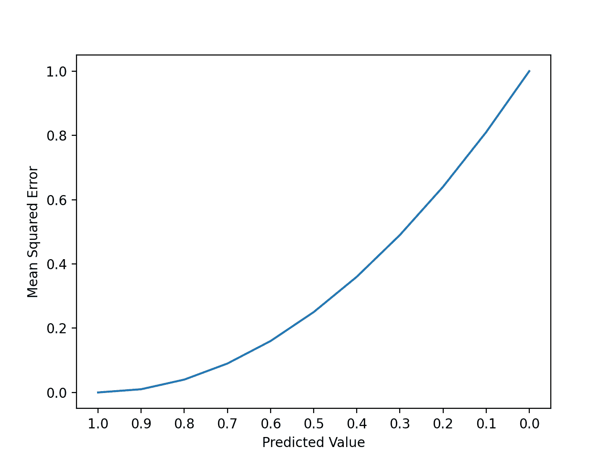
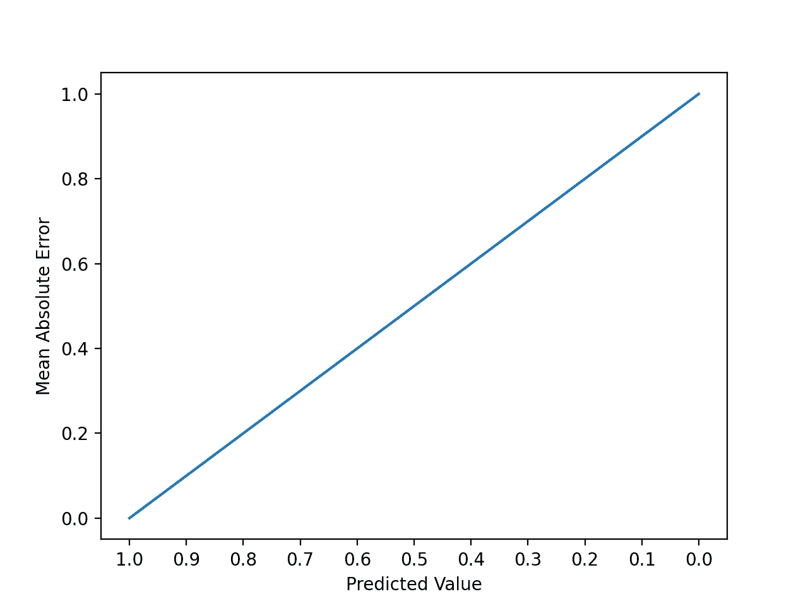

# 机器学习的回归度量

> 原文：<https://machinelearningmastery.com/regression-metrics-for-machine-learning/>

最后更新于 2021 年 2 月 16 日

回归是指涉及预测数值的预测建模问题。

它不同于涉及预测类别标签的分类。与分类不同，您不能使用分类精确率来评估回归模型所做的预测。

相反，您必须使用专门为评估回归问题预测而设计的误差度量。

在本教程中，您将发现如何为回归预测建模项目计算**误差度量。**

完成本教程后，您将知道:

*   回归预测建模是那些涉及预测数值的问题。
*   回归的度量包括计算误差分数来总结模型的预测技巧。
*   如何计算和报告均方误差、均方根误差和平均绝对误差。

我们开始吧。


机器学习的回归度量
图片由[盖尔·瓦罗库](https://www.flickr.com/photos/gaelvaroquaux/26239856196/)提供，保留部分权利。

## 教程概述

本教程分为三个部分；它们是:

1.  回归预测建模
2.  评估回归模型
3.  回归的度量
    1.  均方误差
    2.  均方根误差
    3.  绝对平均误差

## 回归预测建模

预测建模是使用历史数据开发模型的问题，以便在我们没有答案的情况下对新数据进行预测。

预测建模可以描述为从输入变量(X)到输出变量(y)近似映射函数(f)的数学问题。这就是所谓的函数近似问题。

建模算法的工作是在给定可用时间和资源的情况下，找到我们能找到的最佳映射函数。

有关应用机器学习中近似函数的更多信息，请参见文章:

*   [机器学习算法如何工作](https://machinelearningmastery.com/how-machine-learning-algorithms-work/)

回归预测建模是将映射函数( *f* )从输入变量( *X* )近似为连续输出变量( *y* )的任务。

回归不同于分类，分类涉及预测类别或类别标签。

有关分类和回归之间区别的更多信息，请参见教程:

*   [机器学习中分类和回归的区别](https://machinelearningmastery.com/classification-versus-regression-in-machine-learning/)

连续输出变量是一个实值，例如一个整数值或浮点值。这些通常是数量，例如数量和大小。

例如，一栋房子可能会以特定的美元价值出售，可能在 10 万至 20 万美元的范围内。

*   回归问题需要预测一个量。
*   回归可以有实值或离散输入变量。
*   具有多个输入变量的问题通常称为多元回归问题。
*   输入变量按时间排序的回归问题称为时间序列预测问题。

现在我们已经熟悉了回归预测建模，让我们看看如何评估回归模型。

## 评估回归模型

回归预测建模项目初学者的一个常见问题是:

> 如何计算回归模型的准确性？

准确性(例如分类准确性)是分类的一种度量，而不是回归。

**我们无法计算回归模型**的精确率。

回归模型的技巧或表现必须作为这些预测中的错误报告。

仔细想想，这是有道理的。如果你预测的是一个数字值，比如身高或美元金额，你不会想知道模型是否准确预测了这个值(这在实践中可能很难做到)；相反，我们想知道预测值与期望值有多接近。

误差正好解决了这个问题，并总结了预测值与期望值的平均接近程度。

有三种误差度量通常用于评估和报告回归模型的表现；它们是:

*   均方误差。
*   均方根误差(RMSE)。
*   平均绝对误差

回归还有许多其他的度量标准，尽管这些是最常用的。您可以在这里看到 Sklearn Python 机器学习库支持的回归度量的完整列表:

*   [Sklearn API:回归度量](https://Sklearn.org/stable/modules/classes.html#regression-metrics)。

在下一节中，让我们依次仔细看看每一个。

## 回归的度量

在这一节中，我们将进一步了解回归模型的流行指标，以及如何为您的预测建模项目计算这些指标。

### 均方误差

[均方误差](https://en.wikipedia.org/wiki/Mean_squared_error)，简称 MSE，是回归问题的一种流行误差度量。

对于使用回归问题的最小二乘框架拟合或优化的算法，这也是一个重要的损失函数。这里的*最小二乘*是指最小化预测值和期望值之间的均方误差。

均方误差计算为数据集中预测目标值和预期目标值之间的平方差的平均值。

*   MSE = 1/n * I 与 n 之和(y _ I–yhat_i)^2)

其中 *y_i* 是数据集中的第 I 个期望值， *yhat_i* 是第 I 个预测值。这两个值之间的差值被平方，这具有去除符号的效果，导致正误差值。

平方还具有放大或放大大误差的效果。也就是说，预测值和期望值之间的差异越大，产生的正误差平方就越大。当使用均方误差作为损失函数时，这具有“T0”惩罚“T1”模型更大误差的效果。它还具有“T2”惩罚“T3”模型的效果，即在用作指标时夸大平均误差分数。

我们可以创建一个图来了解预测误差的变化如何影响平方误差。

下面的例子给出了一个由所有 1.0 值和预测组成的小的人为数据集，范围从完美(1.0)到错误(0.0)，增量为 0.1。计算并绘制每个预测值和期望值之间的平方误差，以显示平方误差的二次增加。

```py
...
# calculate error
err = (expected[i] - predicted[i])**2
```

下面列出了完整的示例。

```py
# example of increase in mean squared error
from matplotlib import pyplot
from sklearn.metrics import mean_squared_error
# real value
expected = [1.0, 1.0, 1.0, 1.0, 1.0, 1.0, 1.0, 1.0, 1.0, 1.0, 1.0]
# predicted value
predicted = [1.0, 0.9, 0.8, 0.7, 0.6, 0.5, 0.4, 0.3, 0.2, 0.1, 0.0]
# calculate errors
errors = list()
for i in range(len(expected)):
	# calculate error
	err = (expected[i] - predicted[i])**2
	# store error
	errors.append(err)
	# report error
	print('>%.1f, %.1f = %.3f' % (expected[i], predicted[i], err))
# plot errors
pyplot.plot(errors)
pyplot.xticks(ticks=[i for i in range(len(errors))], labels=predicted)
pyplot.xlabel('Predicted Value')
pyplot.ylabel('Mean Squared Error')
pyplot.show()
```

运行该示例首先报告每种情况下的期望值、预测值和平方误差。

我们可以看到误差上升得很快，比线性(直线)上升得更快。

```py
>1.0, 1.0 = 0.000
>1.0, 0.9 = 0.010
>1.0, 0.8 = 0.040
>1.0, 0.7 = 0.090
>1.0, 0.6 = 0.160
>1.0, 0.5 = 0.250
>1.0, 0.4 = 0.360
>1.0, 0.3 = 0.490
>1.0, 0.2 = 0.640
>1.0, 0.1 = 0.810
>1.0, 0.0 = 1.000
```

创建一个线图，显示随着预期值和预测值之间的差异增加，平方误差值的曲线或超线性增加。

曲线不是直线，因为我们可能天真地认为它是误差度量。



预测误差平方增加的线图

对单个误差项进行平均，这样我们就可以报告模型在进行预测时通常会产生多少误差，而不是针对给定的示例。

均方误差的单位是平方单位。

例如，如果你的目标值代表“*美元*，那么均线将是“*平方美元*这可能会让利益相关者感到困惑；因此，在报告结果时，通常使用均方根误差来代替(*将在下一节*中讨论)。

可以使用 Sklearn 库中的[均方误差()函数](https://Sklearn.org/stable/modules/generated/sklearn.metrics.mean_squared_error.html)计算预期值和预测值之间的均方误差。

该函数采用一维数组或期望值和预测值的列表，并返回均方误差值。

```py
...
# calculate errors
errors = mean_squared_error(expected, predicted)
```

下面的例子给出了一个计算设计的期望值和预测值之间的均方误差的例子。

```py
# example of calculate the mean squared error
from sklearn.metrics import mean_squared_error
# real value
expected = [1.0, 1.0, 1.0, 1.0, 1.0, 1.0, 1.0, 1.0, 1.0, 1.0, 1.0]
# predicted value
predicted = [1.0, 0.9, 0.8, 0.7, 0.6, 0.5, 0.4, 0.3, 0.2, 0.1, 0.0]
# calculate errors
errors = mean_squared_error(expected, predicted)
# report error
print(errors)
```

运行该示例计算并打印均方误差。

```py
0.35000000000000003
```

完美的均方误差值为 0.0，这意味着所有预测都与期望值完全匹配。

这几乎从来都不是这样，如果真的发生了，这表明您的预测建模问题微不足道。

一个好的均方误差是相对于你的特定数据集的。

最好首先使用简单的预测模型为数据集建立基线均方误差，例如从训练数据集中预测平均目标值。一个比简单模型的均方误差更好的模型是有技巧的。

### 均方根误差

[均方根误差](https://en.wikipedia.org/wiki/Root-mean-square_deviation)，或 RMSE，是均方误差的延伸。

重要的是，计算误差的平方根，这意味着 RMSE 的单位与被预测的目标值的原始单位相同。

例如，如果你的目标变量有单位“*美元*”，那么 RMSE 误差分数也会有单位“*美元*”，而不是像 MSE 一样有单位“*平方美元*”。

因此，通常使用均方误差损失来训练回归预测模型，并使用 RMSE 来评估和报告其表现。

RMSE 可以计算如下:

*   RMSE = sqrt(1/n * I 与 n 之和(y _ I–yhat_i)^2)

其中 *y_i* 为数据集中第 I 个期望值， *yhat_i* 为第 I 个预测值， *sqrt()* 为平方根函数。

我们可以用最小均方误差来重申 RMSE:

*   RMSE = sqrt(姆塞)

请注意，RMSE 不能计算为均方误差值的平方根的平均值。这是初学者常犯的错误，是[詹森不等式](https://machinelearningmastery.com/a-gentle-introduction-to-jensens-inequality/)的例子。

你可能还记得平方根是平方运算的倒数。MSE 使用平方运算来移除每个误差值的符号，并惩罚较大的误差。平方根反转这个操作，虽然它确保结果保持正。

可以使用 Sklearn 库中的[均方误差()函数](https://Sklearn.org/stable/modules/generated/sklearn.metrics.mean_squared_error.html)计算预期值和预测值之间的均方根误差。

默认情况下，该函数计算均方误差，但我们可以将其配置为通过将“*平方*”参数设置为*假*来计算均方误差的平方根。

该函数采用一维数组或期望值和预测值的列表，并返回均方误差值。

```py
...
# calculate errors
errors = mean_squared_error(expected, predicted, squared=False)
```

下面的例子给出了一个计算设计的期望值和预测值之间的均方根误差的例子。

```py
# example of calculate the root mean squared error
from sklearn.metrics import mean_squared_error
# real value
expected = [1.0, 1.0, 1.0, 1.0, 1.0, 1.0, 1.0, 1.0, 1.0, 1.0, 1.0]
# predicted value
predicted = [1.0, 0.9, 0.8, 0.7, 0.6, 0.5, 0.4, 0.3, 0.2, 0.1, 0.0]
# calculate errors
errors = mean_squared_error(expected, predicted, squared=False)
# report error
print(errors)
```

运行该示例计算并打印均方根误差。

```py
0.5916079783099616
```

完美的 RMSE 值为 0.0，这意味着所有预测都与期望值完全匹配。

这几乎从来都不是这样，如果真的发生了，这表明您的预测建模问题微不足道。

一个好的 RMSE 是相对于你的特定数据集的。

最好首先使用简单的预测模型为数据集建立基线 RMSE，例如从训练数据集预测平均目标值。一个比 RMSE 的幼稚模型更能获得 RMSE 奖的模型是有技巧的。

### 绝对平均误差

[平均绝对误差](https://en.wikipedia.org/wiki/Mean_absolute_error)，或 MAE，是一个流行的度量标准，因为像 RMSE 一样，误差分数的单位与被预测的目标值的单位相匹配。

与 RMSE 不同，房利美的变化是线性的，因此是直观的。

也就是说，MSE 和 RMSE 对较大误差的惩罚比对较小误差的惩罚更大，夸大或放大了平均误差分数。这是由于误差值的平方。MAE 不会对不同类型的错误给予或多或少的权重，相反，分数会随着错误的增加而线性增加。

顾名思义，MAE 分数的计算是绝对误差值的平均值。绝对值或 *abs()* 是一个数学函数，它只是使一个数为正。因此，预期值和预测值之间的差异可能是正的或负的，并且在计算 MAE 时被迫为正。

MAE 可以计算如下:

*   资产净值对资产净值之和(y _ I–yhat _ I)

其中 *y_i* 是数据集中的第 I 个期望值， *yhat_i* 是第 I 个预测值， *abs()* 是绝对函数。

我们可以创建一个图来了解预测误差的变化如何影响 MAE。

下面的例子给出了一个由所有 1.0 值和预测组成的小的人为数据集，范围从完美(1.0)到错误(0.0)，增量为 0.1。计算并绘制每个预测值和期望值之间的绝对误差，以显示误差的线性增加。

```py
...
# calculate error
err = abs((expected[i] - predicted[i]))
```

下面列出了完整的示例。

```py
# plot of the increase of mean absolute error with prediction error
from matplotlib import pyplot
from sklearn.metrics import mean_squared_error
# real value
expected = [1.0, 1.0, 1.0, 1.0, 1.0, 1.0, 1.0, 1.0, 1.0, 1.0, 1.0]
# predicted value
predicted = [1.0, 0.9, 0.8, 0.7, 0.6, 0.5, 0.4, 0.3, 0.2, 0.1, 0.0]
# calculate errors
errors = list()
for i in range(len(expected)):
	# calculate error
	err = abs((expected[i] - predicted[i]))
	# store error
	errors.append(err)
	# report error
	print('>%.1f, %.1f = %.3f' % (expected[i], predicted[i], err))
# plot errors
pyplot.plot(errors)
pyplot.xticks(ticks=[i for i in range(len(errors))], labels=predicted)
pyplot.xlabel('Predicted Value')
pyplot.ylabel('Mean Absolute Error')
pyplot.show()
```

运行该示例首先报告每个案例的期望值、预测值和绝对误差。

我们可以看到误差线性上升，直观易懂。

```py
>1.0, 1.0 = 0.000
>1.0, 0.9 = 0.100
>1.0, 0.8 = 0.200
>1.0, 0.7 = 0.300
>1.0, 0.6 = 0.400
>1.0, 0.5 = 0.500
>1.0, 0.4 = 0.600
>1.0, 0.3 = 0.700
>1.0, 0.2 = 0.800
>1.0, 0.1 = 0.900
>1.0, 0.0 = 1.000
```

创建一个线图，显示当预期值和预测值之间的差值增加时，绝对误差值的直线或线性增加。



预测绝对误差增加的线图

可以使用 Sklearn 库中的 [mean_absolute_error()函数](https://Sklearn.org/stable/modules/generated/sklearn.metrics.mean_absolute_error.html)来计算预期值和预测值之间的平均绝对误差。

该函数采用一维数组或期望值和预测值的列表，并返回平均绝对误差值。

```py
...
# calculate errors
errors = mean_absolute_error(expected, predicted)
```

下面的例子给出了一个计算设计的期望值和预测值之间的平均绝对误差的例子。

```py
# example of calculate the mean absolute error
from sklearn.metrics import mean_absolute_error
# real value
expected = [1.0, 1.0, 1.0, 1.0, 1.0, 1.0, 1.0, 1.0, 1.0, 1.0, 1.0]
# predicted value
predicted = [1.0, 0.9, 0.8, 0.7, 0.6, 0.5, 0.4, 0.3, 0.2, 0.1, 0.0]
# calculate errors
errors = mean_absolute_error(expected, predicted)
# report error
print(errors)
```

运行该示例计算并打印平均绝对误差。

```py
0.5
```

完美的平均绝对误差值为 0.0，这意味着所有预测都与期望值完全匹配。

这几乎从来都不是这样，如果真的发生了，这表明您的预测建模问题微不足道。

一个好的 MAE 是与你的特定数据集相关的。

最好首先使用简单的预测模型为数据集建立基线 MAE，例如从训练数据集预测平均目标值。一个比朴素模型的 MAE 更好地实现 MAE 的模型是有技巧的。

## 进一步阅读

如果您想更深入地了解这个主题，本节将提供更多资源。

### 教程

*   [机器学习算法如何工作](https://machinelearningmastery.com/how-machine-learning-algorithms-work/)
*   [机器学习中分类和回归的区别](https://machinelearningmastery.com/classification-versus-regression-in-machine-learning/)

### 蜜蜂

*   [Sklearn API:回归度量](https://Sklearn.org/stable/modules/classes.html#regression-metrics)。
*   [sci kit-学习用户指南第 3.3.4 节。回归指标](https://Sklearn.org/stable/modules/model_evaluation.html#regression-metrics)。
*   [sklearn . metrics . mean _ squared _ error API](https://Sklearn.org/stable/modules/generated/sklearn.metrics.mean_squared_error.html)。
*   [均值 _ 绝对 _ 误差 API](https://Sklearn.org/stable/modules/generated/sklearn.metrics.mean_absolute_error.html) 。

### 文章

*   [均方误差，维基百科](https://en.wikipedia.org/wiki/Mean_squared_error)。
*   [均方根偏差，维基百科](https://en.wikipedia.org/wiki/Root-mean-square_deviation)。
*   [平均绝对误差，维基百科](https://en.wikipedia.org/wiki/Mean_absolute_error)。
*   [决定系数，维基百科](https://en.wikipedia.org/wiki/Coefficient_of_determination)。

## 摘要

在本教程中，您发现了如何计算回归预测建模项目的误差。

具体来说，您了解到:

*   回归预测建模是那些涉及预测数值的问题。
*   回归的度量包括计算误差分数来总结模型的预测技巧。
*   如何计算和报告均方误差、均方根误差和平均绝对误差。

**你有什么问题吗？**
在下面的评论中提问，我会尽力回答。