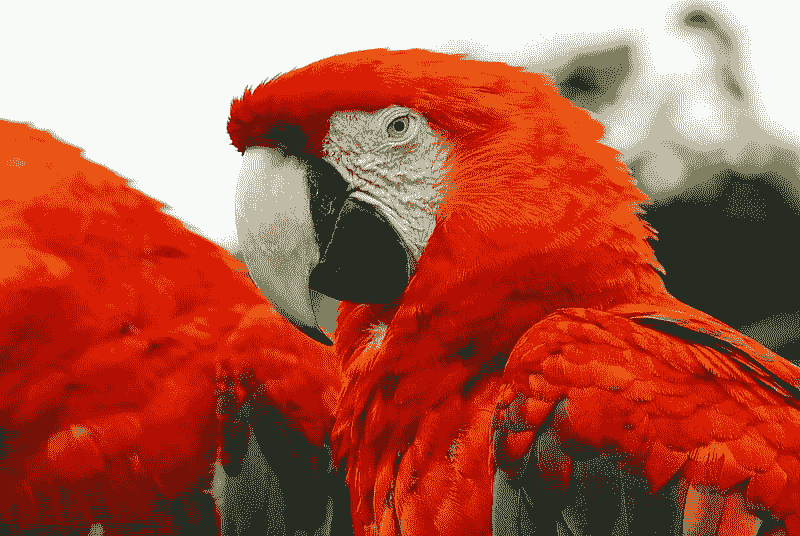
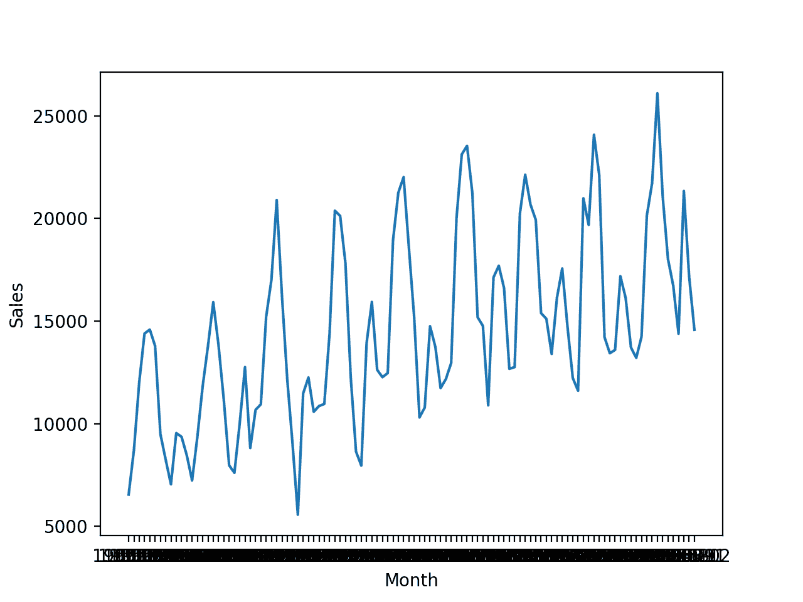
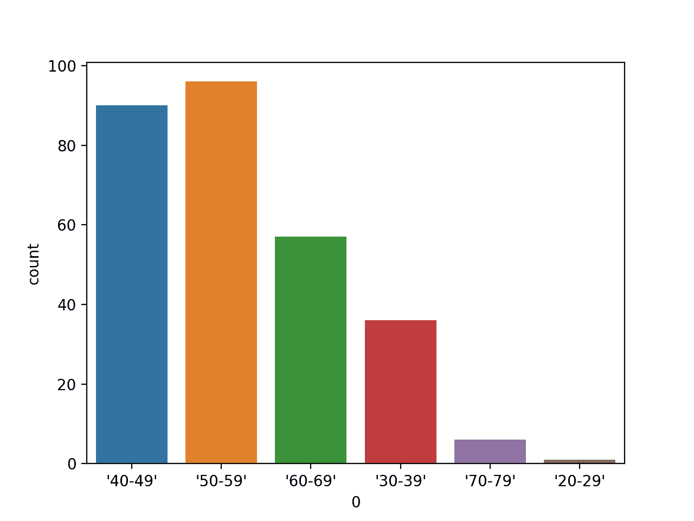
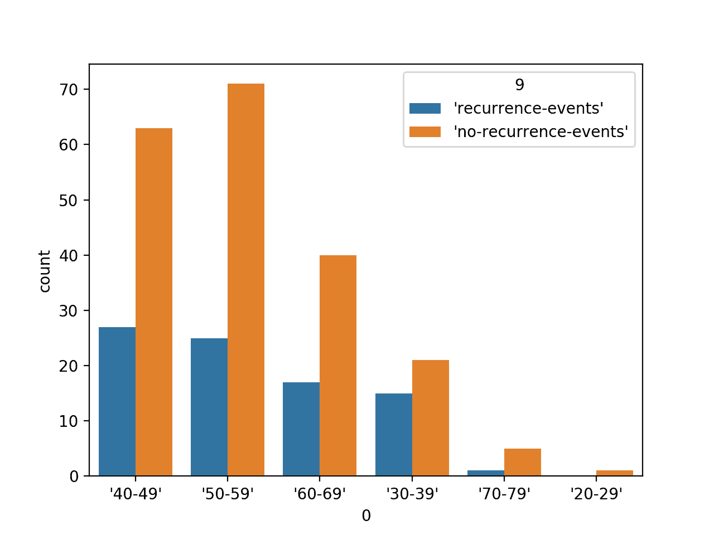
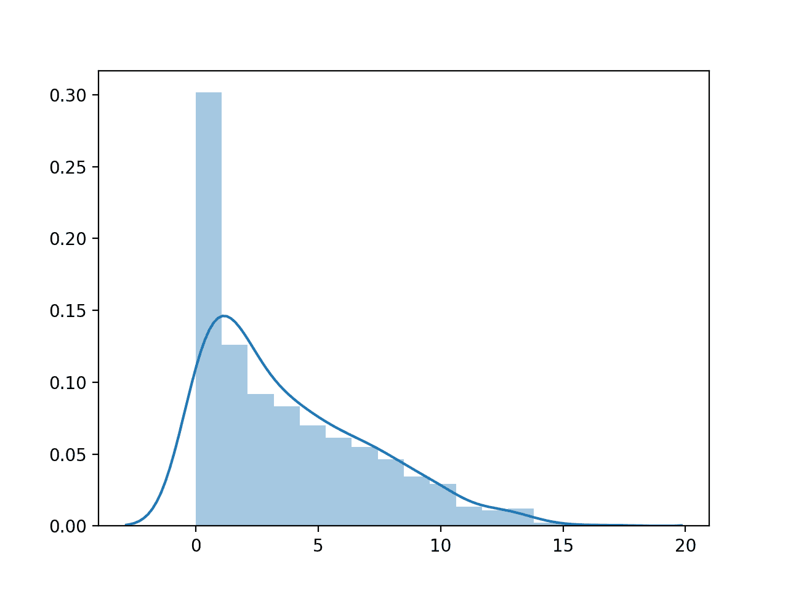
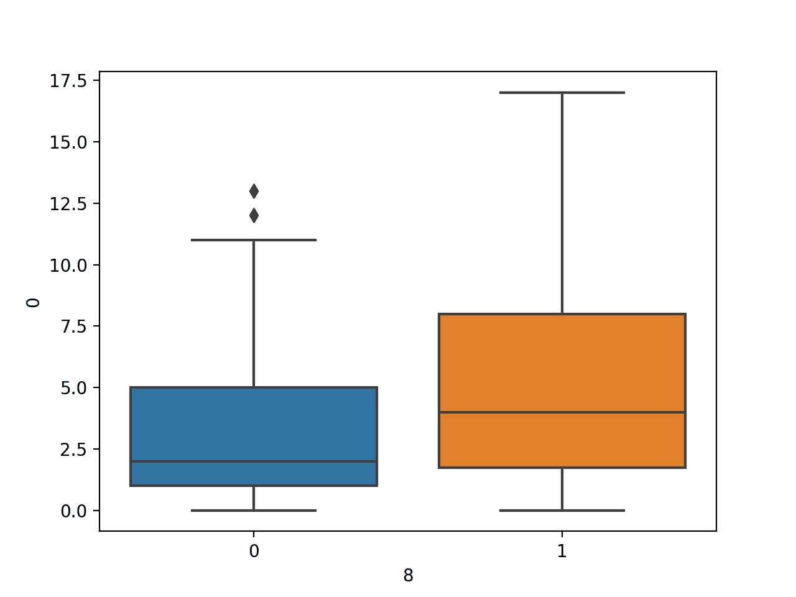
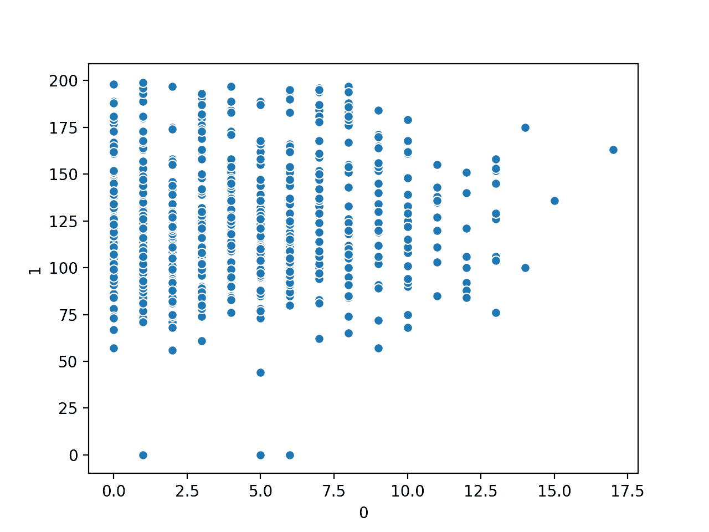
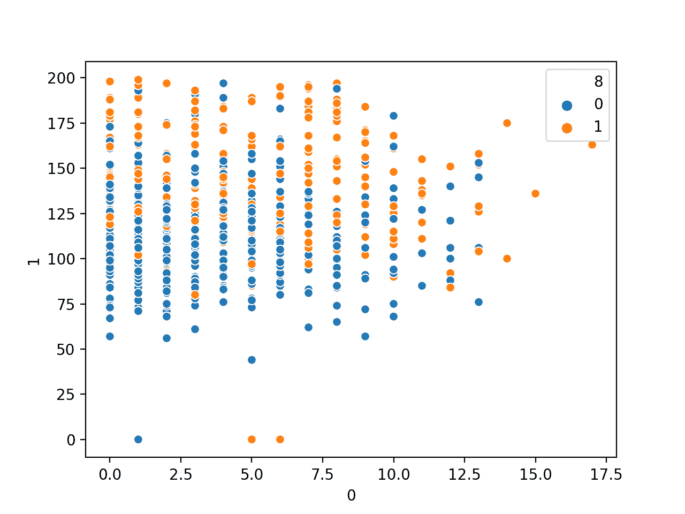

# 如何使用 Seaborn 数据可视化进行机器学习

> 原文:[https://machinelearning master . com/seaborn-data-visualization-for-machinelearning/](https://machinelearningmastery.com/seaborn-data-visualization-for-machine-learning/)

最后更新于 2020 年 8 月 19 日

数据可视化提供了对数据集中变量之间的分布和关系的洞察。

这种洞察力有助于在建模之前选择要应用的数据准备技术，以及最适合数据的算法类型。

Seaborn 是一个 Python 的数据可视化库，它运行在流行的 Matplotlib 数据可视化库之上，尽管它提供了简单的界面和美学上更好看的图。

在本教程中，您将发现一个关于机器学习的 Seaborn 数据可视化的温和介绍。

完成本教程后，您将知道:

*   如何使用条形图、直方图、方框图和触须图总结变量的分布。
*   如何用线图和散点图总结关系？
*   如何比较同一图上不同类值的变量分布和关系？

**用我的新书[Python 机器学习精通](https://machinelearningmastery.com/machine-learning-with-python/)启动你的项目**，包括*分步教程*和所有示例的 *Python 源代码*文件。

我们开始吧。



如何使用 Seaborn 数据可视化进行机器学习
图片由[马丁·佩蒂特](https://flickr.com/photos/mdpettitt/2743243609/)提供，版权所有。

## 教程概述

本教程分为六个部分；它们是:

*   海底数据可视化库
*   线形图
*   条形图
*   直方图
*   方框图和触须图
*   散点图

## 海底数据可视化库

Python 的主要绘图库称为 [Matplotlib](https://matplotlib.org/) 。

[Seaborn](https://seaborn.pydata.org/) 是一个绘图库，它提供了更简单的界面，为机器学习所需的绘图提供了合理的默认值，最重要的是，这些绘图在美学上比 Matplotlib 中的那些更好看。

Seaborn 要求先安装 Matplotlib。

可以直接使用 [pip](https://en.wikipedia.org/wiki/Pip_(package_manager)) 安装 Matplotlib，如下所示:

```py
sudo pip install matplotlib
```

安装后，您可以通过打印版本号来确认库可以加载和使用，如下所示:

```py
# matplotlib
import matplotlib
print('matplotlib: %s' % matplotlib.__version__)
```

运行该示例将打印 Matplotlib 库的当前版本。

```py
matplotlib: 3.1.2
```

接下来，也可以使用 pip 安装 Seaborn 库:

```py
sudo pip install seaborn
```

安装后，我们还可以通过打印版本号来确认库是否可以加载和使用，如下所示:

```py
# seaborn
import seaborn
print('seaborn: %s' % seaborn.__version__)
```

运行该示例将打印当前版本的 Seaborn 库。

```py
seaborn: 0.10.0
```

要创建 Seaborn 地块，必须导入 Seaborn 库并调用函数来创建地块。

重要的是，Seaborn 绘图功能期望数据作为[熊猫数据帧](https://pandas.pydata.org/pandas-docs/stable/reference/api/pandas.DataFrame.html)提供。这意味着，如果您从 CSV 文件加载数据，您必须使用熊猫函数，如 [read_csv()](https://pandas.pydata.org/pandas-docs/stable/reference/api/pandas.read_csv.html) 将数据加载为数据帧。绘图时，可以通过数据框名称或列索引指定列。

要显示剧情，可以调用 Matplotlib 库上的 [show()函数](https://matplotlib.org/api/_as_gen/matplotlib.pyplot.show.html)。

```py
...
# display the plot
pyplot.show()
```

或者，可以将绘图保存到文件中，例如 PNG 格式的图像文件。 [savefig() Matplotlib 功能](https://matplotlib.org/api/_as_gen/matplotlib.pyplot.savefig.html)可用于保存图像。

```py
...
# save the plot
pyplot.savefig('my_image.png')
```

现在我们已经安装了 Seaborn，让我们看看在处理机器学习数据时可能需要的一些常见图。

## 线形图

线图通常用于呈现定期收集的观测数据。

x 轴表示规则的时间间隔，如时间。y 轴显示观察值，按 x 轴排序，用一条线连接。

通过调用 [lineplot()函数](https://seaborn.pydata.org/generated/seaborn.lineplot.html)并传递规则间隔的 x 轴数据和观察的 y 轴数据，可以在 Seaborn 中创建线图。

我们可以使用[月汽车销量](https://raw.githubusercontent.com/jbrownlee/Datasets/master/monthly-car-sales.csv)的时间序列数据集来演示线图。

数据集有两列:“*月*”和“*销售*”月将用作 x 轴，销售额将绘制在 y 轴上。

```py
...
# create line plot
lineplot(x='Month', y='Sales', data=dataset)
```

将这些联系在一起，完整的示例如下所示。

```py
# line plot of a time series dataset
from pandas import read_csv
from seaborn import lineplot
from matplotlib import pyplot
# load the dataset
url = 'https://raw.githubusercontent.com/jbrownlee/Datasets/master/monthly-car-sales.csv'
dataset = read_csv(url, header=0)
# create line plot
lineplot(x='Month', y='Sales', data=dataset)
# show plot
pyplot.show()
```

运行该示例首先加载时间序列数据集，并创建数据的折线图，清楚地显示销售数据的趋势和季节性。



时间序列数据集的线图

有关使用 Seaborn 绘制线图的更多优秀示例，请参见:[可视化统计关系](https://seaborn.pydata.org/tutorial/relational.html)。

## 条形图

条形图通常用于表示多个类别的相对数量。

x 轴表示均匀分布的类别。y 轴表示每个类别的数量，并绘制为从基线到 y 轴上适当级别的条形图。

通过调用 [countplot()函数](https://seaborn.pydata.org/generated/seaborn.countplot.html)并传递数据，可以在 Seaborn 中创建条形图。

我们将展示一个条形图，其中包含由分类输入变量组成的[乳腺癌分类数据集](https://raw.githubusercontent.com/jbrownlee/Datasets/master/breast-cancer.csv)中的一个变量。

我们将只绘制一个变量，在这种情况下，第一个变量是年龄段。

```py
...
# create line plot
countplot(x=0, data=dataset)
```

将这些联系在一起，完整的示例如下所示。

```py
# bar chart plot of a categorical variable
from pandas import read_csv
from seaborn import countplot
from matplotlib import pyplot
# load the dataset
url = 'https://raw.githubusercontent.com/jbrownlee/Datasets/master/breast-cancer.csv'
dataset = read_csv(url, header=None)
# create bar chart plot
countplot(x=0, data=dataset)
# show plot
pyplot.show()
```

运行该示例首先加载乳腺癌数据集，并创建数据的条形图，显示每个年龄组和属于可及组的个体(样本)数量。



年龄范围分类变量的条形图

我们可能还想针对类标签绘制一个变量的每个类别的计数，例如第一个变量。

这可以通过使用 *countplot()* 函数并通过“*色调*参数指定类变量(列索引 9)来实现，如下所示:

```py
...
# create bar chart plot
countplot(x=0, hue=9, data=dataset)
```

将这些联系在一起，完整的示例如下所示。

```py
# bar chart plot of a categorical variable against a class variable
from pandas import read_csv
from seaborn import countplot
from matplotlib import pyplot
# load the dataset
url = 'https://raw.githubusercontent.com/jbrownlee/Datasets/master/breast-cancer.csv'
dataset = read_csv(url, header=None)
# create bar chart plot
countplot(x=0, hue=9, data=dataset)
# show plot
pyplot.show()
```

运行该示例首先加载乳腺癌数据集，并创建数据的条形图，显示每个年龄组和每个组中由数据集的两个类别标签分隔的个人(样本)数量。



按类别标签划分的年龄范围分类变量的条形图

有关使用 Seaborn 绘制条形图的更多示例，请参见:[使用分类数据绘制](https://seaborn.pydata.org/tutorial/categorical.html)。

## 直方图

直方图通常用于总结数字数据样本的分布。

x 轴代表观察的离散面元或间隔。例如，值在 1 和 10 之间的观测值可以被分成五个仓，值[1，2]将被分配给第一个仓，[3，4]将被分配给第二个仓，以此类推。

y 轴表示数据集中属于每个面元的观测值的频率或数量。

本质上，数据样本被转换成条形图，其中 x 轴上的每个类别代表一个观察值区间。

通过调用 [distplot()函数](https://seaborn.pydata.org/generated/seaborn.distplot.html)并传递变量，可以在 Seaborn 中创建直方图。

我们将展示一个带有来自[糖尿病分类数据集](https://raw.githubusercontent.com/jbrownlee/Datasets/master/pima-indians-diabetes.csv)的数字变量的箱线图。我们将只绘制一个变量，在这种情况下，第一个变量，即患者怀孕的次数。

```py
...
# create histogram plot
distplot(dataset[[0]])
```

将这些联系在一起，完整的示例如下所示。

```py
# histogram plot of a numerical variable
from pandas import read_csv
from seaborn import distplot
from matplotlib import pyplot
# load the dataset
url = 'https://raw.githubusercontent.com/jbrownlee/Datasets/master/pima-indians-diabetes.csv'
dataset = read_csv(url, header=None)
# create histogram plot
distplot(dataset[[0]])
# show plot
pyplot.show()
```

运行该示例首先加载糖尿病数据集，并创建变量的直方图，显示值的分布，硬截止值为零。

该图显示了直方图(箱数)以及概率密度函数的平滑估计。



怀孕次数数值变量直方图

有关使用 Seaborn 绘制直方图的更多示例，请参见:[可视化数据集的分布](https://seaborn.pydata.org/tutorial/distributions.html)。

## 方框图和触须图

盒式和触须图，简称盒式图，通常用于总结数据样本的分布。

x 轴用于表示数据样本，如果需要，可以在 x 轴上并排绘制多个箱线图。

y 轴代表观察值。绘制一个方框来总结数据集的中间 50%，从第 25 个百分位数的观察值开始，到第 75 个百分位数结束。这被称为[四分位数区间](https://en.wikipedia.org/wiki/Interquartile_range)，或 IQR。中间值，或第 50 个百分点，用一条线画出来。

称为须的线从盒子的两端延伸出来，计算为(1.5 * IQR)，以展示分布中可感知值的预期范围。络腮胡子外的观察结果可能是异常值，用小圆圈表示。

通过调用 [boxplot()函数](https://seaborn.pydata.org/generated/seaborn.boxplot.html)并传递数据，可以在 Seaborn 中创建 boxplot。

我们将展示一个带有来自[糖尿病分类数据集](https://raw.githubusercontent.com/jbrownlee/Datasets/master/pima-indians-diabetes.csv)的数字变量的箱线图。我们将只绘制一个变量，在这种情况下，第一个变量，即患者怀孕的次数。

```py
...
# create box and whisker plot
boxplot(x=0, data=dataset)
```

将这些联系在一起，完整的示例如下所示。

```py
# box and whisker plot of a numerical variable
from pandas import read_csv
from seaborn import boxplot
from matplotlib import pyplot
# load the dataset
url = 'https://raw.githubusercontent.com/jbrownlee/Datasets/master/pima-indians-diabetes.csv'
dataset = read_csv(url, header=None)
# create box and whisker plot
boxplot(x=0, data=dataset)
# show plot
pyplot.show()
```

运行该示例首先加载糖尿病数据集，并创建第一个输入变量的箱线图，显示患者怀孕次数的分布。

我们可以看到中位数刚刚超过 2.5 倍，一些异常值上升了 15 倍左右(哇！).


孕次数值变量的盒须图

我们可能还想对照类标签，为分类变量(如第一个变量)的每个值绘制数字变量的分布。

这可以通过调用 *boxplot()* 函数，将类变量作为 x 轴传递，将数值变量作为 y 轴传递来实现。

```py
...
# create box and whisker plot
boxplot(x=8, y=0, data=dataset)
```

将这些联系在一起，完整的示例如下所示。

```py
# box and whisker plot of a numerical variable vs class label
from pandas import read_csv
from seaborn import boxplot
from matplotlib import pyplot
# load the dataset
url = 'https://raw.githubusercontent.com/jbrownlee/Datasets/master/pima-indians-diabetes.csv'
dataset = read_csv(url, header=None)
# create box and whisker plot
boxplot(x=8, y=0, data=dataset)
# show plot
pyplot.show()
```

运行该示例首先加载糖尿病数据集，并创建数据的箱线图，将怀孕次数的分布显示为两类标签的数字变量。



按类别标签列出的数值变量怀孕次数的方框图和触须图

## 散点图

散点图通常用于总结两个配对数据样本之间的关系。

成对的数据样本意味着对于给定的观察记录了两个测量值，例如一个人的体重和身高。

x 轴代表第一个样本的观察值，y 轴代表第二个样本的观察值。图上的每个点代表一个单独的观察。

通过调用[散点图()函数](https://seaborn.pydata.org/generated/seaborn.scatterplot.html)并传递两个数值变量，可以在 Seaborn 中创建散点图。

我们将用来自[糖尿病分类数据集](https://raw.githubusercontent.com/jbrownlee/Datasets/master/pima-indians-diabetes.csv)的两个数值变量演示散点图。我们将绘制第一个变量与第二个变量的对比图，在本例中，第一个变量是患者怀孕的次数，第二个是两小时口服葡萄糖耐量试验后的血浆葡萄糖浓度([变量的更多细节在此](https://raw.githubusercontent.com/jbrownlee/Datasets/master/pima-indians-diabetes.names))。

```py
...
# create scatter plot
scatterplot(x=0, y=1, data=dataset)
```

将这些联系在一起，完整的示例如下所示。

```py
# scatter plot of two numerical variables
from pandas import read_csv
from seaborn import scatterplot
from matplotlib import pyplot
# load the dataset
url = 'https://raw.githubusercontent.com/jbrownlee/Datasets/master/pima-indians-diabetes.csv'
dataset = read_csv(url, header=None)
# create scatter plot
scatterplot(x=0, y=1, data=dataset)
# show plot
pyplot.show()
```

运行该示例首先加载糖尿病数据集，并创建前两个输入变量的散点图。

我们可以看到这两个变量之间有某种统一的关系。



怀孕次数与血糖数值变量的散点图

我们可能还想绘制一对数值变量与类标签之间的关系。

这可以通过使用散点图()函数并通过“*色调*”参数指定类变量(列索引 8)来实现，如下所示:

```py
...
# create scatter plot
scatterplot(x=0, y=1, hue=8, data=dataset)
```

将这些联系在一起，完整的示例如下所示。

```py
# scatter plot of two numerical variables vs class label
from pandas import read_csv
from seaborn import scatterplot
from matplotlib import pyplot
# load the dataset
url = 'https://raw.githubusercontent.com/jbrownlee/Datasets/master/pima-indians-diabetes.csv'
dataset = read_csv(url, header=None)
# create scatter plot
scatterplot(x=0, y=1, hue=8, data=dataset)
# show plot
pyplot.show()
```

运行该示例首先加载糖尿病数据集，并创建前两个变量与类别标签的散点图。



按类别标记的怀孕次数与血糖数值变量的散点图

## 进一步阅读

如果您想更深入地了解这个主题，本节将提供更多资源。

### 教程

*   [Python 中数据可视化方法的温和介绍](https://machinelearningmastery.com/data-visualization-methods-in-python/)

### 蜜蜂

*   [海洋出生主页](https://seaborn.pydata.org/index.html)。
*   [官方海鸟教程](https://seaborn.pydata.org/tutorial.html)。

## 摘要

在本教程中，您发现了针对机器学习的 Seaborn 数据可视化的温和介绍。

具体来说，您了解到:

*   如何使用条形图、直方图、方框图和触须图总结变量的分布。
*   如何用线图和散点图总结关系？
*   如何比较同一图上不同类值的变量分布和关系？

**你有什么问题吗？**
在下面的评论中提问，我会尽力回答。