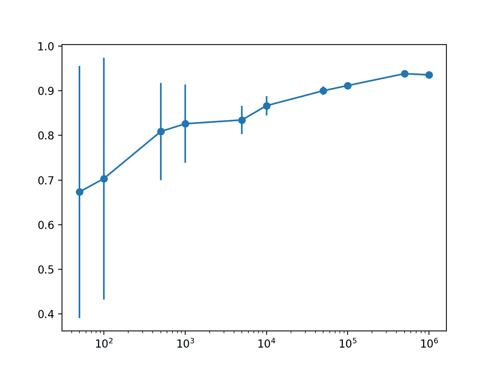

# 数据集大小对模型性能的敏感性分析

> 原文：<https://machinelearningmastery.com/sensitivity-analysis-of-dataset-size-vs-model-performance/>

机器学习模型性能通常随着用于预测建模的数据集大小而提高。

这取决于具体的数据集和模型的选择，尽管这通常意味着使用更多的数据可以获得更好的性能，并且使用较小的数据集来估计模型性能的发现通常可以扩展到使用较大的数据集。

问题是，对于给定的数据集和模型，这种关系是未知的，对于某些数据集和模型，这种关系可能不存在。此外，如果确实存在这种关系，可能会有一个或多个收益递减点，在这些点上，添加更多数据可能不会提高模型性能，或者数据集太小，无法有效捕获更大规模模型的能力。

这些问题可以通过执行**灵敏度分析**来量化数据集大小和模型性能之间的关系来解决。一旦计算出来，我们就可以解释分析的结果，并决定有多少数据是足够的，以及一个数据集可以有多小，以有效地估计较大数据集的性能。

在本教程中，您将了解如何对数据集大小和模型性能进行敏感性分析。

完成本教程后，您将知道:

*   为机器学习选择数据集大小是一个具有挑战性的开放问题。
*   对于给定的模型和预测问题，灵敏度分析提供了一种量化模型性能和数据集大小之间关系的方法。
*   如何对数据集大小进行敏感性分析并解释结果。

我们开始吧。


数据集大小对模型性能的敏感性分析
图片由[格雷姆·邱嘉德](https://www.flickr.com/photos/graeme/10628420113/)提供，保留部分权利。

## 教程概述

本教程分为三个部分；它们是:

1.  数据集大小敏感性分析
2.  综合预测任务和基线模型
3.  数据集大小的敏感性分析

## 数据集大小敏感性分析

机器学习预测模型所需的训练数据量是一个未决问题。

这取决于您对模型的选择、准备数据的方式以及数据本身的细节。

有关选择训练数据集大小的挑战的更多信息，请参见教程:

*   [机器学习需要多少训练数据？](https://machinelearningmastery.com/much-training-data-required-machine-learning/)

解决这个问题的一种方法是执行[灵敏度分析](https://en.wikipedia.org/wiki/Sensitivity_analysis)，并发现模型在数据集上的性能如何随数据的多少而变化。

这可能涉及用不同大小的数据集评估同一模型，并寻找数据集大小和性能之间的关系或收益递减点。

通常，训练数据集大小和模型性能之间有很强的关系，尤其是对于非线性模型。随着数据集大小的增加，这种关系通常会在某种程度上提高性能，并普遍降低模型的预期方差。

了解模型和数据集之间的这种关系可能会有所帮助，原因如下:

*   评估更多模型。
*   找一个更好的模型。
*   决定收集更多的数据。

您可以在较小的数据集样本上快速评估大量模型和模型配置，确信性能可能会以特定方式推广到较大的训练数据集。

这可能允许评估比您在给定时间内能够评估的更多的模型和配置，并且反过来，可能发现更好的整体性能模型。

您还可以将模型性能的预期性能推广和估计到更大的数据集，并估计收集更多训练数据是否值得。

既然我们已经熟悉了执行模型性能对数据集大小的敏感性分析的想法，让我们来看一个工作示例。

## 综合预测任务和基线模型

在我们深入进行敏感性分析之前，让我们为调查选择一个数据集和基线模型。

在本教程中，我们将使用合成二进制(两类)分类数据集。这是理想的，因为它允许我们根据需要为相同的问题调整生成样本的数量。

[make _ classification()sci kit-learn 功能](https://scikit-learn.org/stable/modules/generated/sklearn.datasets.make_classification.html)可用于创建合成分类数据集。在这种情况下，我们将使用 20 个输入特征(列)并生成 1，000 个样本(行)。伪随机数生成器的种子是固定的，以确保每次生成样本时使用相同的基本“问题”。

下面的示例生成了合成分类数据集，并总结了生成数据的形状。

```py
# test classification dataset
from sklearn.datasets import make_classification
# define dataset
X, y = make_classification(n_samples=1000, n_features=20, n_informative=15, n_redundant=5, random_state=1)
# summarize the dataset
print(X.shape, y.shape)
```

运行该示例会生成数据并报告输入和输出组件的大小，从而确认预期的形状。

```py
(1000, 20) (1000,)
```

接下来，我们可以在这个数据集上评估一个预测模型。

我们将使用决策树([决策树分类器](https://scikit-learn.org/stable/modules/generated/sklearn.tree.DecisionTreeClassifier.html))作为预测模型。之所以选择它，是因为它是一种非线性算法，并且具有较高的方差，这意味着我们预计性能会随着训练数据集大小的增加而提高。

我们将使用[重复分层 k 折叠交叉验证](https://machinelearningmastery.com/repeated-k-fold-cross-validation-with-python/)的最佳实践来评估数据集上的模型，重复 3 次，折叠 10 次。

下面列出了在综合分类数据集上评估决策树模型的完整示例。

```py
# evaluate a decision tree model on the synthetic classification dataset
from sklearn.datasets import make_classification
from sklearn.model_selection import cross_val_score
from sklearn.model_selection import RepeatedStratifiedKFold
from sklearn.tree import DecisionTreeClassifier
# load dataset
X, y = make_classification(n_samples=1000, n_features=20, n_informative=15, n_redundant=5, random_state=1)
# define model evaluation procedure
cv = RepeatedStratifiedKFold(n_splits=10, n_repeats=3, random_state=1)
# define model
model = DecisionTreeClassifier()
# evaluate model
scores = cross_val_score(model, X, y, scoring='accuracy', cv=cv, n_jobs=-1)
# report performance
print('Mean Accuracy: %.3f (%.3f)' % (scores.mean(), scores.std()))
```

运行该示例会创建数据集，然后使用所选的测试工具来评估模型在问题上的性能。

**注**:考虑到算法或评估程序的随机性，或数值精确率的差异，您的[结果可能会有所不同](https://machinelearningmastery.com/different-results-each-time-in-machine-learning/)。考虑运行该示例几次，并比较平均结果。

在这种情况下，我们可以看到平均分类准确率约为 82.7%。

```py
Mean Accuracy: 0.827 (0.042)
```

接下来，让我们看看如何对数据集大小对模型性能进行敏感性分析。

## 数据集大小的敏感性分析

上一节展示了如何在可用数据集上评估所选模型。

这引起了一些问题，例如:

> 模型在更多数据上的表现会更好吗？

更一般地说，我们可能有复杂的问题，例如:

> 问题域中较小或较大样本的估计性能是否成立？

这些都是很难回答的问题，但是我们可以通过敏感性分析来解决。具体来说，我们可以通过敏感度分析来了解:

> 模型性能对数据集大小有多敏感？

或者更一般地说:

> 数据集大小与模型性能有什么关系？

执行敏感性分析的方法有很多，但最简单的方法可能是定义一个测试工具来评估模型性能，然后用不同大小的数据集在相同的问题上评估相同的模型。

这将允许数据集的训练和测试部分随着整个数据集的大小而增加。

为了使代码更容易阅读，我们将把它分成函数。

首先，我们可以定义一个函数来准备(或加载)给定大小的数据集。数据集中的行数由函数的参数指定。

如果您将此代码用作模板，则可以更改此函数以从文件中加载数据集，并选择给定大小的随机样本。

```py
# load dataset
def load_dataset(n_samples):
	# define the dataset
	X, y = make_classification(n_samples=int(n_samples), n_features=20, n_informative=15, n_redundant=5, random_state=1)
	return X, y
```

接下来，我们需要一个函数来评估加载数据集上的模型。

我们将定义一个函数，该函数接受一个数据集，并返回使用数据集上的测试工具评估的模型性能的摘要。

下面列出了这个函数，它获取数据集的输入和输出元素，并返回数据集上决策树模型的平均值和标准差。

```py
# evaluate a model
def evaluate_model(X, y):
	# define model evaluation procedure
	cv = RepeatedStratifiedKFold(n_splits=10, n_repeats=3, random_state=1)
	# define model
	model = DecisionTreeClassifier()
	# evaluate model
	scores = cross_val_score(model, X, y, scoring='accuracy', cv=cv, n_jobs=-1)
	# return summary stats
	return [scores.mean(), scores.std()]
```

接下来，我们可以定义一系列不同的数据集大小来进行评估。

大小的选择应与您可用的数据量和您愿意花费的运行时间成比例。

在这种情况下，我们将保持适当的大小来限制运行时间，从 50 行到 100 万行，大致按 log10 的比例。

```py
...
# define number of samples to consider
sizes = [50, 100, 500, 1000, 5000, 10000, 50000, 100000, 500000, 1000000]
```

接下来，我们可以枚举每个数据集的大小，创建数据集，评估数据集上的模型，并存储结果供以后分析。

```py
...
# evaluate each number of samples
means, stds = list(), list()
for n_samples in sizes:
	# get a dataset
	X, y = load_dataset(n_samples)
	# evaluate a model on this dataset size
	mean, std = evaluate_model(X, y)
	# store
	means.append(mean)
	stds.append(std)
```

接下来，我们可以总结数据集大小和模型性能之间的关系。

在这种情况下，我们将简单地用误差线绘制结果，这样我们就可以直观地发现任何趋势。

我们将使用标准偏差作为估计模型性能不确定性的度量。如果性能遵循正态分布，这可以通过将该值乘以 2 以覆盖大约 95%的预期性能来实现。

这可以在图上显示为数据集大小的平均预期性能周围的误差线。

```py
...
# define error bar as 2 standard deviations from the mean or 95%
err = [min(1, s * 2) for s in stds]
# plot dataset size vs mean performance with error bars
pyplot.errorbar(sizes, means, yerr=err, fmt='-o')
```

为了使图更易读，我们可以将 x 轴的比例改为 log，因为我们的数据集大小大约为 log10。

```py
...
# change the scale of the x-axis to log
ax = pyplot.gca()
ax.set_xscale("log", nonpositive='clip')
# show the plot
pyplot.show()
```

就这样。

我们通常预期平均模型性能会随着数据集的大小而增加。我们还预计模型性能的不确定性会随着数据集的大小而降低。

将所有这些结合起来，下面列出了对数据集大小对模型性能进行敏感性分析的完整示例。

```py
# sensitivity analysis of model performance to dataset size
from sklearn.datasets import make_classification
from sklearn.model_selection import cross_val_score
from sklearn.model_selection import RepeatedStratifiedKFold
from sklearn.tree import DecisionTreeClassifier
from matplotlib import pyplot

# load dataset
def load_dataset(n_samples):
	# define the dataset
	X, y = make_classification(n_samples=int(n_samples), n_features=20, n_informative=15, n_redundant=5, random_state=1)
	return X, y

# evaluate a model
def evaluate_model(X, y):
	# define model evaluation procedure
	cv = RepeatedStratifiedKFold(n_splits=10, n_repeats=3, random_state=1)
	# define model
	model = DecisionTreeClassifier()
	# evaluate model
	scores = cross_val_score(model, X, y, scoring='accuracy', cv=cv, n_jobs=-1)
	# return summary stats
	return [scores.mean(), scores.std()]

# define number of samples to consider
sizes = [50, 100, 500, 1000, 5000, 10000, 50000, 100000, 500000, 1000000]
# evaluate each number of samples
means, stds = list(), list()
for n_samples in sizes:
	# get a dataset
	X, y = load_dataset(n_samples)
	# evaluate a model on this dataset size
	mean, std = evaluate_model(X, y)
	# store
	means.append(mean)
	stds.append(std)
	# summarize performance
	print('>%d: %.3f (%.3f)' % (n_samples, mean, std))
# define error bar as 2 standard deviations from the mean or 95%
err = [min(1, s * 2) for s in stds]
# plot dataset size vs mean performance with error bars
pyplot.errorbar(sizes, means, yerr=err, fmt='-o')
# change the scale of the x-axis to log
ax = pyplot.gca()
ax.set_xscale("log", nonpositive='clip')
# show the plot
pyplot.show()
```

运行该示例会报告数据集大小和估计模型性能的状态。

**注**:考虑到算法或评估程序的随机性，或数值精确率的差异，您的[结果可能会有所不同](https://machinelearningmastery.com/different-results-each-time-in-machine-learning/)。考虑运行该示例几次，并比较平均结果。

在这种情况下，我们可以看到平均模型性能随着数据集大小的增加而增加，而使用分类精确率的标准偏差测量的模型方差减少的预期趋势。

我们可以看到，在估计大约 10，000 或 50，000 行的模型性能时，可能存在收益递减点。

具体来说，我们确实看到行越多，性能越好，但我们可能可以捕捉到这种关系，与 10K 或 50K 行数据的差异很小。

我们还可以看到 1000000 行数据的估计性能下降，这表明我们可能在 100000 行以上最大化模型的能力，而是在估计中测量统计噪声。

这可能意味着预期性能有一个上限，超过这个上限的数据可能不会改善所选测试工具的特定模型和配置。

```py
>50: 0.673 (0.141)
>100: 0.703 (0.135)
>500: 0.809 (0.055)
>1000: 0.826 (0.044)
>5000: 0.835 (0.016)
>10000: 0.866 (0.011)
>50000: 0.900 (0.005)
>100000: 0.912 (0.003)
>500000: 0.938 (0.001)
>1000000: 0.936 (0.001)
```

该图使数据集大小和估计模型性能之间的关系更加清晰。

这种关系几乎与日志数据集的大小成线性关系。误差线所示的不确定性的变化也在图上显著减少，从 50 或 100 个样本的非常大的值，到 5000 和 10000 个样本的中等值，实际上超过了这些大小。

考虑到 5，000 和 10，000 个样本的适度分布以及实际上的对数线性关系，我们可能可以使用 5K 或 10K 行来近似模型性能。



数据集大小误差线与模型性能的线图

我们可以将这些发现作为测试其他模型配置甚至不同模型类型的基础。

危险在于，不同的模型在或多或少的数据下可能表现得非常不同，用不同的模型重复敏感性分析来确认关系成立可能是明智的。或者，用一套不同的模型类型重复分析可能会很有趣。

## 进一步阅读

如果您想更深入地了解这个主题，本节将提供更多资源。

### 教程

*   [Python 中历史规模对 ARIMA 预测技能的敏感性分析](https://machinelearningmastery.com/sensitivity-analysis-history-size-forecast-skill-arima-python/)
*   [机器学习需要多少训练数据？](https://machinelearningmastery.com/much-training-data-required-machine-learning/)

### 蜜蜂

*   [sklearn . datasets . make _ classification API](https://scikit-learn.org/stable/modules/generated/sklearn.datasets.make_classification.html)。
*   [硬化. tree .决策树分类器 API](https://scikit-learn.org/stable/modules/generated/sklearn.tree.DecisionTreeClassifier.html) 。

### 文章

*   [敏感性分析，维基百科](https://en.wikipedia.org/wiki/Sensitivity_analysis)。
*   [68–95–99.7 规则，维基百科](https://en.wikipedia.org/wiki/68%E2%80%9395%E2%80%9399.7_rule)。

## 摘要

在本教程中，您发现了如何对数据集大小和模型性能进行敏感性分析。

具体来说，您了解到:

*   为机器学习选择数据集大小是一个具有挑战性的开放问题。
*   对于给定的模型和预测问题，灵敏度分析提供了一种量化模型性能和数据集大小之间关系的方法。
*   如何对数据集大小进行敏感性分析并解释结果。

**你有什么问题吗？**
在下面的评论中提问，我会尽力回答。