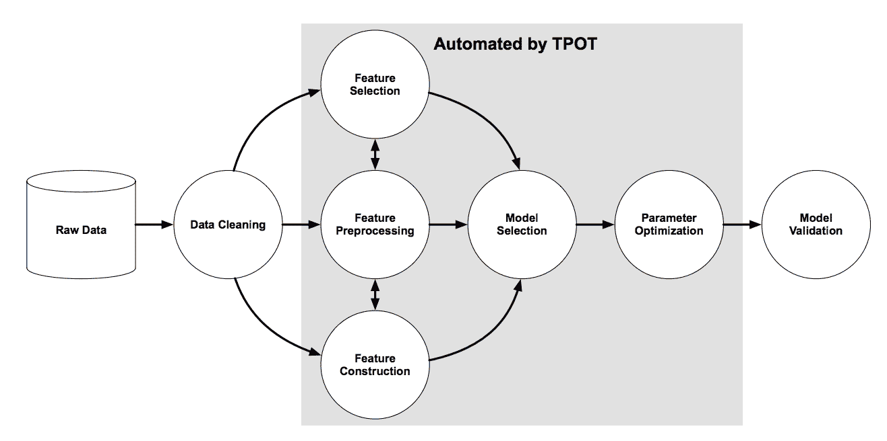

# Python 自动机器学习 TPOT

> 原文:[https://machinelearning master . com/tpot-for-automatic-machine-learning-in-python/](https://machinelearningmastery.com/tpot-for-automated-machine-learning-in-python/)

自动机器学习(AutoML)指的是在很少用户参与的情况下，自动发现用于预测建模任务的性能良好的模型的技术。

TPOT 是一个用 Python 执行自动语言的开源库。它利用流行的 Scikit-Learn 机器学习库进行数据转换和机器学习算法，并使用遗传编程随机全局搜索过程来有效地发现给定数据集的最佳模型管道。

在本教程中，您将发现如何在 Python 中使用 TPOT for AutoML 和 Scikit-Learn 机器学习算法。

完成本教程后，您将知道:

*   TPOT 是一个面向 AutoML 的开源库，具有 scikit-learn 数据准备和机器学习模型。
*   如何使用 TPOT 自动发现分类任务的最佳模型。
*   如何使用 TPOT 自动发现回归任务的最佳模型。

我们开始吧。


Python 中的自动机器学习 TPOT
图片由[格温](https://flickr.com/photos/theaudiochick/5385120043/)提供，保留部分权利。

## 教程概述

本教程分为四个部分；它们是:

1.  TPOT 自动化机器学习中心
2.  安装和使用 TPOT
3.  TPOT 分类协会
4.  回归的 TPOT

## TPOT 自动化机器学习中心

[基于树的管道优化工具](https://epistasislab.github.io/tpot/)，简称 TPOT，是一个用于自动机器学习的 Python 库。

TPOT 使用基于树的结构来表示预测建模问题的模型管道，包括数据准备和建模算法以及模型超参数。

> …一种称为基于树的管道优化工具(TPOT)的进化算法，可自动设计和优化机器学习管道。

——[评估用于自动化数据科学的基于树的管道优化工具](https://dl.acm.org/doi/10.1145/2908812.2908918)，2016 年。

然后执行优化过程，以找到对给定数据集表现最佳的树结构。具体地说，是一种遗传编程算法，用于对表示为树的程序进行随机全局优化。

> TPOT 使用一个版本的遗传编程来自动设计和优化一系列数据转换和机器学习模型，试图最大化给定监督学习数据集的分类精度。

——[评估用于自动化数据科学的基于树的管道优化工具](https://dl.acm.org/doi/10.1145/2908812.2908918)，2016 年。

下图取自 TPOT 论文，显示了管道搜索中涉及的元素，包括数据清理、特征选择、特征处理、特征构建、模型选择和超参数优化。



TPOT 管道搜索概述
摘自:自动化数据科学基于树的管道优化工具评估，2016 年。

现在我们已经熟悉了什么是 TPOT，让我们看看如何安装和使用 TPOT 找到一个有效的模型管道。

## 安装和使用 TPOT

第一步是安装 TPOT 图书馆，这可以使用 pip 实现，如下所示:

```py
pip install tpot
```

安装后，我们可以导入库并打印版本号，以确认安装成功:

```py
# check tpot version
import tpot
print('tpot: %s' % tpot.__version__)
```

运行该示例会打印版本号。

您的版本号应该相同或更高。

```py
tpot: 0.11.1
```

使用 TPOT 很简单。

它包括创建一个[tpotrecruler 或 TPOTClassifier 类](https://epistasislab.github.io/tpot/api/)的实例，为搜索进行配置，然后导出在数据集上获得最佳性能的模型管道。

配置类涉及两个主要元素。

首先是如何评估模型，例如交叉验证方案和性能指标。我建议用您选择的配置和要使用的性能度量来显式指定交叉验证类。

例如，用“*负平均绝对误差*度量进行回归时，[重复“T1”:](https://scikit-learn.org/stable/modules/generated/sklearn.model_selection.RepeatedKFold.html)

```py
...
# define evaluation procedure
cv = RepeatedKFold(n_splits=10, n_repeats=3, random_state=1)
# define search
model = TPOTRegressor(... scoring='neg_mean_absolute_error', cv=cv)
```

或者是一个[重复的 stratifiedfold](https://scikit-learn.org/stable/modules/generated/sklearn.model_selection.RepeatedStratifiedKFold.html)进行回归，用*精度*度量进行分类:

```py
...
# define evaluation procedure
cv = RepeatedStratifiedKFold(n_splits=10, n_repeats=3, random_state=1)
# define search
model = TPOTClassifier(... scoring='accuracy', cv=cv)
```

另一个因素是随机全局搜索过程的性质。

作为一种进化算法，这涉及到设置配置，例如种群的大小、要运行的世代数以及潜在的交叉和变异率。前者重要的是控制搜索的范围；如果进化搜索对你来说是新的，那么后者可以保留默认值。

例如，100 代和 5 代或 10 代的适度人口规模是一个很好的起点。

```py
...
# define search
model = TPOTClassifier(generations=5, population_size=50, ...)
```

在搜索结束时，会找到性能最佳的管道。

这个管道可以作为代码导出到 Python 文件中，以后可以复制粘贴到自己的项目中。

```py
...
# export the best model
model.export('tpot_model.py')
```

现在我们已经熟悉了如何使用 TPOT，让我们看看一些真实数据的工作示例。

## TPOT 分类协会

在本节中，我们将使用 TPOT 发现声纳数据集的模型。

声纳数据集是一个标准的机器学习数据集，由 208 行数据组成，包含 60 个数字输入变量和一个具有两个类值的目标变量，例如二进制分类。

使用三次重复的重复分层 10 倍交叉验证的测试工具，一个简单的模型可以达到大约 53%的准确率。一个性能最好的模型在同样的测试设备上可以达到 88%的准确率。这提供了此数据集的预期性能范围。

该数据集包括预测声纳回波显示的是岩石还是模拟地雷。

*   [声纳数据集(声纳. csv)](https://raw.githubusercontent.com/jbrownlee/Datasets/master/sonar.csv)
*   [声纳数据集描述(声纳.名称)](https://raw.githubusercontent.com/jbrownlee/Datasets/master/sonar.names)

不需要下载数据集；我们将自动下载它作为我们工作示例的一部分。

下面的示例下载数据集并总结其形状。

```py
# summarize the sonar dataset
from pandas import read_csv
# load dataset
url = 'https://raw.githubusercontent.com/jbrownlee/Datasets/master/sonar.csv'
dataframe = read_csv(url, header=None)
# split into input and output elements
data = dataframe.values
X, y = data[:, :-1], data[:, -1]
print(X.shape, y.shape)
```

运行该示例会下载数据集，并将其拆分为输入和输出元素。不出所料，我们可以看到有 208 行数据，60 个输入变量。

```py
(208, 60) (208,)
```

接下来，让我们使用 TPOT 为声纳数据集找到一个好的模型。

首先，我们可以定义评估模型的方法。我们将采用[重复分层 k 倍交叉验证](https://machinelearningmastery.com/k-fold-cross-validation/)的良好做法，重复 3 次，重复 10 次。

```py
...
# define model evaluation
cv = RepeatedStratifiedKFold(n_splits=10, n_repeats=3, random_state=1)
```

我们将使用五代 50 的人口规模进行搜索，并通过将“ *n_jobs* ”设置为-1 来使用系统上的所有核心。

```py
...
# define search
model = TPOTClassifier(generations=5, population_size=50, cv=cv, scoring='accuracy', verbosity=2, random_state=1, n_jobs=-1)
```

最后，我们可以开始搜索，并确保在运行结束时保存性能最佳的模型。

```py
...
# perform the search
model.fit(X, y)
# export the best model
model.export('tpot_sonar_best_model.py')
```

将这些联系在一起，完整的示例如下所示。

```py
# example of tpot for the sonar classification dataset
from pandas import read_csv
from sklearn.preprocessing import LabelEncoder
from sklearn.model_selection import RepeatedStratifiedKFold
from tpot import TPOTClassifier
# load dataset
url = 'https://raw.githubusercontent.com/jbrownlee/Datasets/master/sonar.csv'
dataframe = read_csv(url, header=None)
# split into input and output elements
data = dataframe.values
X, y = data[:, :-1], data[:, -1]
# minimally prepare dataset
X = X.astype('float32')
y = LabelEncoder().fit_transform(y.astype('str'))
# define model evaluation
cv = RepeatedStratifiedKFold(n_splits=10, n_repeats=3, random_state=1)
# define search
model = TPOTClassifier(generations=5, population_size=50, cv=cv, scoring='accuracy', verbosity=2, random_state=1, n_jobs=-1)
# perform the search
model.fit(X, y)
# export the best model
model.export('tpot_sonar_best_model.py')
```

运行该示例可能需要几分钟时间，您将在命令行上看到一个进度条。

**注**:考虑到算法或评估程序的随机性，或数值精度的差异，您的[结果可能会有所不同](https://machinelearningmastery.com/different-results-each-time-in-machine-learning/)。考虑运行该示例几次，并比较平均结果。

高性能模型的准确性将在过程中报告。

```py
Generation 1 - Current best internal CV score: 0.8650793650793651
Generation 2 - Current best internal CV score: 0.8650793650793651
Generation 3 - Current best internal CV score: 0.8650793650793651
Generation 4 - Current best internal CV score: 0.8650793650793651
Generation 5 - Current best internal CV score: 0.8667460317460318

Best pipeline: GradientBoostingClassifier(GaussianNB(input_matrix), learning_rate=0.1, max_depth=7, max_features=0.7000000000000001, min_samples_leaf=15, min_samples_split=10, n_estimators=100, subsample=0.9000000000000001)
```

在这种情况下，我们可以看到性能最好的管道实现了大约 86.6%的平均准确率。这是一个技巧性的模型，接近于这个数据集上表现最好的模型。

然后，性能最好的管道被保存到名为“ *tpot_sonar_best_model.py* 的文件中。

打开这个文件，您可以看到有一些用于加载数据集和拟合管道的通用代码。下面列出了一个例子。

```py
import numpy as np
import pandas as pd
from sklearn.ensemble import GradientBoostingClassifier
from sklearn.model_selection import train_test_split
from sklearn.naive_bayes import GaussianNB
from sklearn.pipeline import make_pipeline, make_union
from tpot.builtins import StackingEstimator
from tpot.export_utils import set_param_recursive

# NOTE: Make sure that the outcome column is labeled 'target' in the data file
tpot_data = pd.read_csv('PATH/TO/DATA/FILE', sep='COLUMN_SEPARATOR', dtype=np.float64)
features = tpot_data.drop('target', axis=1)
training_features, testing_features, training_target, testing_target = \
            train_test_split(features, tpot_data['target'], random_state=1)

# Average CV score on the training set was: 0.8667460317460318
exported_pipeline = make_pipeline(
    StackingEstimator(estimator=GaussianNB()),
    GradientBoostingClassifier(learning_rate=0.1, max_depth=7, max_features=0.7000000000000001, min_samples_leaf=15, min_samples_split=10, n_estimators=100, subsample=0.9000000000000001)
)
# Fix random state for all the steps in exported pipeline
set_param_recursive(exported_pipeline.steps, 'random_state', 1)

exported_pipeline.fit(training_features, training_target)
results = exported_pipeline.predict(testing_features)
```

**注**:按原样，该代码不执行，这是设计好的。这是一个可以复制粘贴到项目中的模板。

在这种情况下，我们可以看到性能最好的模型是由朴素贝叶斯模型和梯度增强模型组成的管道。

我们可以修改这段代码，使其适合所有可用数据的最终模型，并对新数据进行预测。

下面列出了完整的示例。

```py
# example of fitting a final model and making a prediction on the sonar dataset
from pandas import read_csv
from sklearn.preprocessing import LabelEncoder
from sklearn.model_selection import RepeatedStratifiedKFold
from sklearn.ensemble import GradientBoostingClassifier
from sklearn.naive_bayes import GaussianNB
from sklearn.pipeline import make_pipeline
from tpot.builtins import StackingEstimator
from tpot.export_utils import set_param_recursive
# load dataset
url = 'https://raw.githubusercontent.com/jbrownlee/Datasets/master/sonar.csv'
dataframe = read_csv(url, header=None)
# split into input and output elements
data = dataframe.values
X, y = data[:, :-1], data[:, -1]
# minimally prepare dataset
X = X.astype('float32')
y = LabelEncoder().fit_transform(y.astype('str'))
# Average CV score on the training set was: 0.8667460317460318
exported_pipeline = make_pipeline(
    StackingEstimator(estimator=GaussianNB()),
    GradientBoostingClassifier(learning_rate=0.1, max_depth=7, max_features=0.7000000000000001, min_samples_leaf=15, min_samples_split=10, n_estimators=100, subsample=0.9000000000000001)
)
# Fix random state for all the steps in exported pipeline
set_param_recursive(exported_pipeline.steps, 'random_state', 1)
# fit the model
exported_pipeline.fit(X, y)
# make a prediction on a new row of data
row = [0.0200,0.0371,0.0428,0.0207,0.0954,0.0986,0.1539,0.1601,0.3109,0.2111,0.1609,0.1582,0.2238,0.0645,0.0660,0.2273,0.3100,0.2999,0.5078,0.4797,0.5783,0.5071,0.4328,0.5550,0.6711,0.6415,0.7104,0.8080,0.6791,0.3857,0.1307,0.2604,0.5121,0.7547,0.8537,0.8507,0.6692,0.6097,0.4943,0.2744,0.0510,0.2834,0.2825,0.4256,0.2641,0.1386,0.1051,0.1343,0.0383,0.0324,0.0232,0.0027,0.0065,0.0159,0.0072,0.0167,0.0180,0.0084,0.0090,0.0032]
yhat = exported_pipeline.predict([row])
print('Predicted: %.3f' % yhat[0])
```

运行该示例适合数据集上性能最好的模型，并对单行新数据进行预测。

```py
Predicted: 1.000
```

## 回归的 TPOT

在本节中，我们将使用 TPOT 发现汽车保险数据集的模型。

汽车保险数据集是一个标准的机器学习数据集，由 63 行数据组成，包括一个数字输入变量和一个数字目标变量。

使用三次重复的重复分层 10 倍交叉验证的测试工具，一个简单的模型可以获得大约 66 的平均绝对误差(MAE)。一个性能最好的模型可以在大约 28 的相同测试线束上实现 MAE。这提供了此数据集的预期性能范围。

考虑到不同地理区域的索赔数量，数据集包括预测索赔总额(千瑞典克朗)。

*   [车险数据集(auto-insurance.csv)](https://raw.githubusercontent.com/jbrownlee/Datasets/master/auto-insurance.csv)
*   [车险数据集描述(车险.名称)](https://raw.githubusercontent.com/jbrownlee/Datasets/master/auto-insurance.names)

不需要下载数据集；我们将自动下载它作为我们工作示例的一部分。

下面的示例下载数据集并总结其形状。

```py
# summarize the auto insurance dataset
from pandas import read_csv
# load dataset
url = 'https://raw.githubusercontent.com/jbrownlee/Datasets/master/auto-insurance.csv'
dataframe = read_csv(url, header=None)
# split into input and output elements
data = dataframe.values
X, y = data[:, :-1], data[:, -1]
print(X.shape, y.shape)
```

运行该示例会下载数据集，并将其拆分为输入和输出元素。不出所料，我们可以看到有 63 行数据带有一个输入变量。

```py
(63, 1) (63,)
```

接下来，我们可以使用 TPOT 为汽车保险数据集找到一个好的模型。

首先，我们可以定义评估模型的方法。我们将使用重复 k-fold 交叉验证的良好实践，重复 3 次，重复 10 次。

```py
...
# define evaluation procedure
cv = RepeatedKFold(n_splits=10, n_repeats=3, random_state=1)
```

我们将使用 5 代 50 的种群大小进行搜索，并通过将“ *n_jobs* ”设置为-1 来使用系统上的所有内核。

```py
...
# define search
model = TPOTRegressor(generations=5, population_size=50, scoring='neg_mean_absolute_error', cv=cv, verbosity=2, random_state=1, n_jobs=-1)
```

最后，我们可以开始搜索，并确保在运行结束时保存性能最佳的模型。

```py
...
# perform the search
model.fit(X, y)
# export the best model
model.export('tpot_insurance_best_model.py')
```

将这些联系在一起，完整的示例如下所示。

```py
# example of tpot for the insurance regression dataset
from pandas import read_csv
from sklearn.model_selection import RepeatedKFold
from tpot import TPOTRegressor
# load dataset
url = 'https://raw.githubusercontent.com/jbrownlee/Datasets/master/auto-insurance.csv'
dataframe = read_csv(url, header=None)
# split into input and output elements
data = dataframe.values
data = data.astype('float32')
X, y = data[:, :-1], data[:, -1]
# define evaluation procedure
cv = RepeatedKFold(n_splits=10, n_repeats=3, random_state=1)
# define search
model = TPOTRegressor(generations=5, population_size=50, scoring='neg_mean_absolute_error', cv=cv, verbosity=2, random_state=1, n_jobs=-1)
# perform the search
model.fit(X, y)
# export the best model
model.export('tpot_insurance_best_model.py')
```

运行该示例可能需要几分钟时间，您将在命令行上看到一个进度条。

**注**:考虑到算法或评估程序的随机性，或数值精度的差异，您的[结果可能会有所不同](https://machinelearningmastery.com/different-results-each-time-in-machine-learning/)。考虑运行该示例几次，并比较平均结果。

高性能模型的 MAE 将会一路被报道。

```py
Generation 1 - Current best internal CV score: -29.147625969129034
Generation 2 - Current best internal CV score: -29.147625969129034
Generation 3 - Current best internal CV score: -29.147625969129034
Generation 4 - Current best internal CV score: -29.147625969129034
Generation 5 - Current best internal CV score: -29.147625969129034

Best pipeline: LinearSVR(input_matrix, C=1.0, dual=False, epsilon=0.0001, loss=squared_epsilon_insensitive, tol=0.001)
```

在这种情况下，我们可以看到表现最好的管道实现了大约 29.14 的平均 MAE。这是一个技巧性的模型，接近于这个数据集上表现最好的模型。

然后，性能最好的管道被保存到名为“*tpot _ insurance _ best _ model . py*的文件中。

打开这个文件，您可以看到有一些用于加载数据集和拟合管道的通用代码。下面列出了一个例子。

```py
import numpy as np
import pandas as pd
from sklearn.model_selection import train_test_split
from sklearn.svm import LinearSVR

# NOTE: Make sure that the outcome column is labeled 'target' in the data file
tpot_data = pd.read_csv('PATH/TO/DATA/FILE', sep='COLUMN_SEPARATOR', dtype=np.float64)
features = tpot_data.drop('target', axis=1)
training_features, testing_features, training_target, testing_target = \
            train_test_split(features, tpot_data['target'], random_state=1)

# Average CV score on the training set was: -29.147625969129034
exported_pipeline = LinearSVR(C=1.0, dual=False, epsilon=0.0001, loss="squared_epsilon_insensitive", tol=0.001)
# Fix random state in exported estimator
if hasattr(exported_pipeline, 'random_state'):
    setattr(exported_pipeline, 'random_state', 1)

exported_pipeline.fit(training_features, training_target)
results = exported_pipeline.predict(testing_features)
```

**注**:按原样，该代码不执行，这是设计好的。这是一个可以复制粘贴到项目中的模板。

在这种情况下，我们可以看到性能最好的模型是由线性支持向量机模型组成的管道。

我们可以修改这段代码，使其适合所有可用数据的最终模型，并对新数据进行预测。

下面列出了完整的示例。

```py
# example of fitting a final model and making a prediction on the insurance dataset
from pandas import read_csv
from sklearn.model_selection import train_test_split
from sklearn.svm import LinearSVR
# load dataset
url = 'https://raw.githubusercontent.com/jbrownlee/Datasets/master/auto-insurance.csv'
dataframe = read_csv(url, header=None)
# split into input and output elements
data = dataframe.values
data = data.astype('float32')
X, y = data[:, :-1], data[:, -1]
# Average CV score on the training set was: -29.147625969129034
exported_pipeline = LinearSVR(C=1.0, dual=False, epsilon=0.0001, loss="squared_epsilon_insensitive", tol=0.001)
# Fix random state in exported estimator
if hasattr(exported_pipeline, 'random_state'):
    setattr(exported_pipeline, 'random_state', 1)
# fit the model
exported_pipeline.fit(X, y)
# make a prediction on a new row of data
row = [108]
yhat = exported_pipeline.predict([row])
print('Predicted: %.3f' % yhat[0])
```

运行该示例适合数据集上性能最好的模型，并对单行新数据进行预测。

```py
Predicted: 389.612
```

## 进一步阅读

如果您想更深入地了解这个主题，本节将提供更多资源。

*   [评估用于自动化数据科学的基于树的管道优化工具](https://dl.acm.org/doi/10.1145/2908812.2908918)，2016 年。
*   [TPOT 文件](https://epistasislab.github.io/tpot/)。
*   [TPOT GitHub 项目](https://github.com/EpistasisLab/tpot)。

## 摘要

在本教程中，您发现了如何在 Python 中使用 TPOT for AutoML 和 Scikit-Learn 机器学习算法。

具体来说，您了解到:

*   TPOT 是一个面向 AutoML 的开源库，具有 scikit-learn 数据准备和机器学习模型。
*   如何使用 TPOT 自动发现分类任务的最佳模型。
*   如何使用 TPOT 自动发现回归任务的最佳模型。

**你有什么问题吗？**
在下面的评论中提问，我会尽力回答。