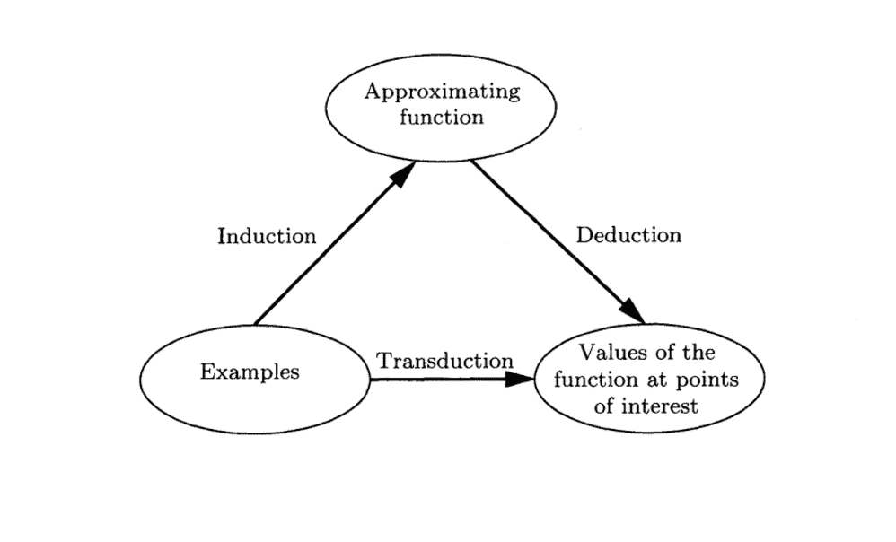

# 机器学习中的 14 种不同类型的学习

> 原文:[https://machinelearning master . com/机器学习中的学习类型/](https://machinelearningmastery.com/types-of-learning-in-machine-learning/)

最后更新于 2019 年 11 月 11 日

机器学习是一个很大的研究领域，它与人工智能等许多相关领域重叠并继承了这些领域的思想。

该领域的重点是学习，即从经验中获得技能或知识。最常见的是，这意味着从历史数据中综合有用的概念。

因此，作为机器学习领域的实践者，您可能会遇到许多不同类型的学习:从整个研究领域到特定技术。

在这篇文章中，你会发现对机器学习领域可能遇到的不同类型的学习的温和介绍。

看完这篇文章，你会知道:

*   研究领域，如监督学习、非监督学习和强化学习。
*   混合类型的学习，如半监督和自监督学习。
*   广泛的技术，如主动学习、在线学习和迁移学习。

我们开始吧。

机器学习中的学习类型
图片由 [Lenny K 摄影](https://flickr.com/photos/lennykphotography/24007709514/)提供，保留部分权利。

## 学习的类型

鉴于机器学习领域的重点是“*学习*”，作为一名实践者，你可能会遇到很多类型。

一些类型的学习描述了由许多不同类型的算法组成的整个子领域的学习，例如“*监督学习*”其他人描述了你可以在项目中使用的强大技术，例如“*转移学习*”

作为机器学习实践者，您可能必须熟悉 14 种学习类型；它们是:

**学习问题**

*   1.监督学习
*   2.无监督学习
*   3.强化学习

**混合学习问题**

*   4.半监督学习
*   5.自我监督学习
*   6.多实例学习

**统计推断**

*   7.归纳学习
*   8.演绎推理
*   9.转导学习

**学习技巧**

*   10.多任务学习
*   11.主动学习
*   12.在线学习
*   13.迁移学习
*   14.集成学习

在接下来的几节中，我们将依次仔细研究每一个。

**我错过了一个重要的学习类型吗？**
在下面的评论里告诉我。

## 学习问题

首先，我们将仔细研究机器学习中的三种主要类型的学习问题:有监督的、无监督的和强化学习。

### 1.监督学习

[监督学习](https://en.wikipedia.org/wiki/Supervised_learning)描述了一类涉及使用模型来学习输入示例和目标变量之间的映射的问题。

> 训练数据包括输入向量及其对应目标向量的例子的应用被称为监督学习问题。

—第 3 页，[模式识别与机器学习](https://amzn.to/2O2WWnj)，2006。

模型适合于由输入和输出组成的训练数据，并用于在测试集上进行预测，其中仅提供输入，模型的输出与保留的目标变量进行比较，并用于估计模型的技能。

> 学习是在可能的假设空间中寻找一个表现良好的假设，即使是在训练集之外的新例子上。为了衡量假设的准确性，我们给它一组不同于训练集的测试示例。

—第 695 页，[人工智能:现代方法](https://amzn.to/2O039k5)，第 3 版，2015 年。

有两种主要类型的监督学习问题:它们是涉及预测类别标签的分类和涉及预测数值的回归。

*   **分类**:涉及预测类标签的监督学习问题。
*   **回归**:涉及预测数字标签的监督学习问题。

分类和回归问题都可能有一个或多个输入变量，输入变量可以是任何数据类型，如数值或分类。

分类问题的一个例子是 [MNIST 手写数字](https://machinelearningmastery.com/how-to-develop-a-convolutional-neural-network-from-scratch-for-mnist-handwritten-digit-classification/)数据集，其中输入是手写数字的图像(像素数据)，输出是图像代表的数字的类别标签(数字 0 到 9)。

回归问题的一个例子是[波士顿房价](https://machinelearningmastery.com/regression-tutorial-keras-deep-learning-library-python/)数据集，其中输入是描述一个社区的变量，输出是以美元为单位的房价。

一些机器学习算法被描述为“*监督的*”机器学习算法，因为它们是为监督的机器学习问题而设计的。流行的例子包括:[决策树](https://machinelearningmastery.com/implement-decision-tree-algorithm-scratch-python/)、[支持向量机](https://machinelearningmastery.com/support-vector-machines-for-machine-learning/)等等。

> 我们的目标是找到函数 f(x)的一个有用的近似值 f(x)，它是输入和输出之间预测关系的基础

—第 28 页，[统计学习的要素:数据挖掘、推理和预测](https://amzn.to/2NYnmH0)，第 2 版，2016 年。

算法被称为“有监督的”*，因为它们通过给定输入数据的例子进行预测来学习，并且模型通过算法被监督和校正，以更好地预测训练数据集中的预期目标输出。*

 *> 术语“监督学习”源于教师或教师提供的目标 y 的视图，该教师或教师向机器学习系统展示该做什么。

—第 105 页，[深度学习](https://amzn.to/34OHNfi)，2016。

有些算法可能是专门为分类(如[逻辑回归](https://machinelearningmastery.com/implement-logistic-regression-stochastic-gradient-descent-scratch-python/))或回归(如线性回归)而设计的，有些算法可能在稍加修改后用于两种类型的问题(如人工神经网络)。

### 2.无监督学习

[无监督学习](https://en.wikipedia.org/wiki/Unsupervised_learning)描述了一类涉及使用模型描述或提取数据中关系的问题。

与监督学习相比，无监督学习只对输入数据进行操作，没有输出或目标变量。因此，无监督学习不像有监督学习的情况那样，有老师纠正模型。

> 在无监督学习中，没有指导老师或老师，算法必须学会在没有这个指导的情况下理解数据。

—第 105 页，[深度学习](https://amzn.to/34OHNfi)，2016。

有许多类型的无监督学习，尽管有两个主要问题是从业者经常遇到的:它们是涉及在数据中寻找组的聚类和涉及总结数据分布的密度估计。

*   **聚类:无监督的**学习问题，涉及到在数据中寻找组。
*   **密度估计**:涉及汇总数据分布的无监督学习问题。

聚类算法的一个例子是 k-Means，其中 *k* 指的是要在数据中发现的聚类数。密度估计算法的一个例子是[核密度估计](https://machinelearningmastery.com/probability-density-estimation/)，它涉及使用小组密切相关的数据样本来估计问题空间中新点的分布。

> 最常见的无监督学习任务是聚类:检测潜在有用的输入示例聚类。例如，出租车代理可能会逐渐形成一个“交通好的日子”和“交通不好的日子”的概念，而不会被老师给每一个例子贴上标签。

—第 694-695 页，[人工智能:现代方法](https://amzn.to/2O039k5)，第 3 版，2015 年。

可以执行聚类和密度估计来了解数据中的模式。

也可以使用额外的无监督方法，例如涉及以不同方式绘制或绘制数据的可视化，以及涉及降低数据维度的投影方法。

*   **可视化**:涉及创建数据图的无监督学习问题。
*   **投影**:涉及创建数据的低维表示的无监督学习问题。

[可视化技术](https://machinelearningmastery.com/data-visualization-methods-in-python/)的一个例子是散点图矩阵，它为数据集中的每对变量创建一个散点图。投影方法的一个例子是[主成分分析](https://machinelearningmastery.com/calculate-principal-component-analysis-scratch-python/)，它涉及根据特征值和特征向量对数据集进行汇总，并去除线性相关性。

> 这种无监督学习问题的目标可能是在数据中发现一组组相似的例子，这被称为聚类，或者确定数据在输入空间中的分布，这被称为密度估计，或者为了可视化的目的将数据从高维空间投影到二维或三维。

—第 3 页，[模式识别与机器学习](https://amzn.to/2O2WWnj)，2006。

### 3.强化学习

[强化学习](https://en.wikipedia.org/wiki/Reinforcement_learning)描述了一类问题，其中代理在一个环境中运行，必须*学习*才能使用反馈进行操作。

> 强化学习是学习做什么——如何将情境映射到行动——以便最大化数字奖励信号。学习者不会被告知要采取哪些行动，而是必须通过尝试来发现哪些行动会产生最大的回报。

—第 1 页，[强化学习:导论](https://amzn.to/300E1Rj)，2018 年第 2 版。

环境的使用意味着没有固定的训练数据集，而是代理需要实现的一个目标或一组目标，他们可能执行的操作，以及关于朝向目标的性能的反馈。

> 一些机器学习算法不仅仅是体验固定的数据集。例如，强化学习算法与环境交互，因此在学习系统及其体验之间存在反馈回路。

—第 105 页，[深度学习](https://amzn.to/34OHNfi)，2016。

它与监督学习的相似之处在于，模型有一些可以学习的响应，尽管反馈可能会被延迟并且在统计上有噪声，这使得代理或模型很难将因果联系起来。

强化问题的一个例子是玩一个游戏，其中代理人的目标是获得高分，并可以在游戏中采取行动，并收到惩罚或奖励方面的反馈。

> 在许多复杂的领域中，强化学习是训练程序在高水平上运行的唯一可行的方法。例如，在玩游戏时，人类很难提供大量位置的准确和一致的评估，这将需要直接从示例中训练评估函数。相反，程序可以被告知它何时赢或输，并且它可以使用这些信息来学习一个评估函数，该函数给出从任何给定位置获胜的概率的合理准确的估计。

—第 831 页，[人工智能:现代方法](https://amzn.to/2O039k5)，第 3 版，2015 年。

最近令人印象深刻的结果包括在谷歌的 AlphaGo 中使用强化，表现超过了世界顶级围棋选手。

强化学习算法的一些流行例子包括 Q 学习、时间差异学习和深度强化学习。

## 混合学习问题

无监督学习和有监督学习之间的界限是模糊的，每个研究领域都有许多混合方法。

在这一节中，我们将仔细研究一些更常见的混合学习领域:半监督、自监督和多实例学习。

### 4.半监督学习

[半监督学习](https://en.wikipedia.org/wiki/Semi-supervised_learning)是训练数据中包含极少数已标记示例和大量未标记示例的监督学习。

半监督学习模型的目标是有效利用所有可用的数据，而不仅仅是像监督学习中那样的标记数据。

> 在半监督学习中，我们会得到一些有标签的例子，并且必须尽我们所能收集大量的无标签的例子。甚至标签本身也可能不是我们所希望的神圣真理。

—第 695 页，[人工智能:现代方法](https://amzn.to/2O039k5)，第 3 版，2015 年。

有效利用未标记的数据可能需要使用无监督的方法，如聚类和密度估计，或从中获得灵感。一旦发现了组或模式，来自监督学习的监督方法或思想可以被用于标记未标记的例子，或者将标记应用于随后用于预测的未标记表示。

> 无监督学习可以为如何在表示空间中对示例进行分组提供有用的线索。在输入空间中紧密聚集的示例应该映射到类似的表示。

—第 243 页，[深度学习](https://amzn.to/34OHNfi)，2016。

考虑到标记示例的费用或计算成本，许多真实世界的监督学习问题通常是半监督学习问题的示例。例如，对照片进行分类需要已经由人工操作员标记的照片数据集。

来自计算机视觉(图像数据)、自然语言处理(文本数据)和自动语音识别(音频数据)领域的许多问题都属于这一类，并且不能使用标准的监督学习方法容易地解决。

> ……在许多实际应用中，有标签的数据非常稀少，但无标签的数据却很多。“半监督”学习试图通过利用未标记数据中的信息来提高监督学习的准确性。这听起来像魔法，但它可以工作！

—第 467 页，[数据挖掘:实用机器学习工具与技术](https://amzn.to/34NGayw)，2016 年第 4 版。

### 5.自我监督学习

自监督学习是指为了应用监督学习算法来解决问题，将无监督学习问题框架化为监督学习问题。

监督学习算法用于解决替代或借口任务，其结果是可用于解决原始(实际)建模问题的模型或表示。

> 自监督学习框架只需要未标记的数据，以便制定借口学习任务，例如预测上下文或图像旋转，为此可以在没有监督的情况下计算目标。

——[重温自监督视觉表征学习](https://arxiv.org/abs/1901.09005)，2019。

自监督学习的一个常见例子是计算机视觉，其中未标记图像的语料库是可用的，并且可以用于训练监督模型，例如使图像灰度化并且让模型预测图像的颜色表示(着色)或者去除图像的块并且让模型预测缺失的部分(修复)。

> 在有区别的自我监督学习中，这是这项工作的主要重点，一个模型是在一个辅助或“借口”任务上训练的，地面真相是免费提供的。在大多数情况下，借口任务涉及预测数据的某些隐藏部分(例如，预测灰度图像的颜色

——[自监督视觉表征学习的缩放和对标](https://arxiv.org/abs/1905.01235)，2019。

自监督学习算法的一般例子是[自动编码器](https://machinelearningmastery.com/lstm-autoencoders/)。这是一种神经网络，用于创建输入样本的紧凑或压缩表示。他们通过一个模型来实现这一点，该模型有一个编码器和一个解码器元件，它们被一个瓶颈分隔开，该瓶颈表示输入的内部紧凑表示。

> 自动编码器是一个神经网络，它被训练成试图将其输入复制到其输出。在内部，它有一个隐藏层 *h* ，描述了用于表示输入的代码。

—第 502 页，[深度学习](https://amzn.to/34OHNfi)，2016。

这些自动编码器模型是通过向模型提供输入作为输入和目标输出来训练的，要求模型通过首先将其编码为压缩表示，然后将其解码回原始表示来再现输入。一旦经过训练，解码器就被丢弃，编码器根据需要被用来创建输入的紧凑表示。

虽然自动编码器是使用监督学习方法训练的，但是它们解决了无监督学习问题，即，它们是一种用于降低输入数据的维数的投影方法。

> 传统上，自动编码器用于降维或特征学习。

—第 502 页，[深度学习](https://amzn.to/34OHNfi)，2016。

另一个自我监督学习的例子是[生成性对抗网络](https://machinelearningmastery.com/what-are-generative-adversarial-networks-gans/)，或 GANs。这些是生成模型，最常用于仅使用来自目标域的未标记示例的集合来创建合成照片。

GAN 模型通过单独的鉴别器模型进行间接训练，该模型将来自该域的照片示例分类为真实或伪造(生成)，其结果被反馈以更新 GAN 模型，并鼓励其在下一次迭代中生成更逼真的照片。

> 发生器网络直接产生样本[…]。它的对手鉴别器网络试图区分从训练数据提取的样本和从生成器提取的样本。鉴别器发出由 d(x；θ(d))，表示 x 是真实训练示例而不是从模型中提取的假样本的概率。

—第 699 页，[深度学习](https://amzn.to/34OHNfi)，2016。

### 6.多实例学习

[多实例学习](https://en.wikipedia.org/wiki/Multiple_instance_learning)是一个单个实例未标注的监督学习问题；取而代之的是，样品袋或样品组被贴上标签。

> 在多实例学习中，整个示例集合被标记为包含或不包含类的示例，但是集合的单个成员没有被标记。

—第 106 页，[深度学习](https://amzn.to/34OHNfi)，2016。

实例在“*包*中，而不是集合中，因为给定的实例可能会出现一次或多次，例如重复出现。

建模包括使用袋子中的一个或一些实例与目标标签相关联的知识，并预测未来新袋子的标签，给定它们由多个未标记的实例组成。

> 在有监督的多实例学习中，类标签与每个包相关联，学习的目标是确定如何从组成包的实例中推断类。

—第 156 页，[数据挖掘:实用机器学习工具与技术](https://amzn.to/34NGayw)，2016 年第 4 版。

简单的方法，如给单个实例分配类标签和使用标准的监督学习算法，通常是很好的第一步。

## 统计推断

推论是指达成一个结果或决定。

在机器学习中，拟合模型和进行预测都是推理的类型。

有不同的推理范例可以用作理解一些机器学习算法如何工作或者如何处理一些学习问题的框架。

一些学习方法的例子是归纳、演绎和转换学习和推理。

### 7.归纳学习

[归纳学习](https://en.wikipedia.org/wiki/Inductive_reasoning)涉及使用证据来确定结果。

归纳推理是指用具体的案例来确定一般的结果，例如具体到一般。

大多数机器学习模型使用一种归纳推理或归纳推理来学习，其中一般规则(模型)是从特定的历史例子(数据)中学习的。

> ……归纳的问题，即如何从过去的具体观察中得出关于未来的一般性结论的问题。

—第 77 页，[机器学习:概率视角](https://amzn.to/2ZZTfpZ)，2012 年。

拟合机器学习模型是一个归纳的过程。该模型是训练数据集中特定示例的概括。

使用训练数据建立关于问题的模型或假设，并且当模型被使用时，它被认为保留了新的看不见的数据。

> 由于缺乏任何进一步的信息，我们的假设是，关于看不见的实例的最佳假设是最适合观察到的训练数据的假设。这是归纳学习的基本假设…

—第 23 页，[机器学习](https://amzn.to/2Qal4Hu)，1997。

### 8.演绎推理

演绎或[演绎推理](https://en.wikipedia.org/wiki/Deductive_reasoning)是指用一般规则来确定具体的结果。

我们可以通过对比归纳和演绎来更好地理解归纳。

演绎是归纳的反义词。如果归纳法是从具体到一般，演绎就是从一般到具体。

> ……简单的观察，归纳只是演绎的逆！

—第 291 页，[机器学习](https://amzn.to/2Qal4Hu)，1997。

演绎是一种自上而下的推理，寻求在确定结论之前满足所有前提，而归纳是一种自下而上的推理，使用可用数据作为结果的证据。

在机器学习的背景下，一旦我们使用归纳法在训练数据集上拟合模型，该模型就可以用来进行预测。模型的使用是一种演绎或演绎推理。

### 9.转导学习

[转导](https://machinelearningmastery.com/transduction-in-machine-learning/)或[转导学习](https://en.wikipedia.org/wiki/Transduction_(machine_learning))在统计学习理论领域中用于指预测来自某个领域的给定具体示例的具体示例。

它不同于归纳法，归纳法涉及从具体的例子中学习一般的规则，例如从具体到具体。

> 归纳法，从给定的数据中推导出函数。推导，得出兴趣点的给定函数值。转导，从给定数据中推导出感兴趣点的未知函数值。

—第 169 页，[统计学习理论的本质](https://amzn.to/2uvHt5a)，1995。

不像归纳法，不需要泛化；相反，直接使用具体的例子。事实上，这可能是一个比归纳法更容易解决的问题。

> 在给定的兴趣点上估计一个函数的值的模型描述了一个新的推理概念:从特定的到特定的。我们称这种类型的推理为转导推理。请注意，当人们希望从有限的信息量中获得最佳结果时，就会出现这种推理概念。

—第 169 页，[统计学习理论的本质](https://amzn.to/2uvHt5a)，1995。

换能算法的一个经典例子是 k 近邻算法，该算法不模拟训练数据，而是在每次需要预测时直接使用它。

有关转导主题的更多信息，请参见教程:

*   [机器学习中转导的温和介绍](https://machinelearningmastery.com/transduction-in-machine-learning/)

### 对比归纳、演绎和转换:

我们可以在机器学习的背景下对比这三种推理。

例如:

*   **归纳**:从具体的例子中学习一个通用的模型。
*   **推演**:用模型做预测。
*   **转导**:用具体的例子来做预测。

下图很好地总结了这三种不同的方法。

归纳、演绎和转换之间的关系
摘自《统计学习理论的本质》。

## 学习技巧

有许多技术被描述为学习的类型。

在这一节中，我们将仔细研究一些更常见的方法。

这包括多任务、主动、在线、迁移和集成学习。

### 10.多任务学习

[多任务学习](https://en.wikipedia.org/wiki/Multi-task_learning)是一种监督学习，包括在一个数据集上拟合模型，以解决多个相关问题。

它包括设计一个可以在多个相关任务上进行训练的模型，通过跨任务训练来提高模型的性能，而不是在任何单个任务上进行训练。

> 多任务学习是一种通过汇集几个任务产生的例子(可以被视为对参数的软约束)来提高泛化能力的方法。

—第 244 页，[深度学习](https://amzn.to/34OHNfi)，2016。

当一个任务有大量标记的输入数据可以与另一个标记数据少得多的任务共享时，多任务学习可能是解决问题的有用方法。

> ……我们可能希望同时学习多个相关模型，这就是所谓的多任务学习。这将允许我们从具有大量数据的任务中“借用统计力量”，并与具有少量数据的任务共享它。

第 231 页，[机器学习:概率视角](https://amzn.to/2ZZTfpZ)，2012。

例如，多任务学习问题通常涉及相同的输入模式，这些模式可用于多个不同的输出或监督学习问题。在这种设置中，每个输出可以由模型的不同部分来预测，允许模型的核心针对相同的输入在每个任务中进行归纳。

> 同样，当模型的一部分在任务间共享时，额外的训练示例会对模型的参数施加更大的压力，使其趋向于良好的值(假设共享是合理的)，通常会产生更好的泛化能力。

—第 244 页，[深度学习](https://amzn.to/34OHNfi)，2016。

多任务学习的一个流行例子是，使用相同的单词嵌入来学习文本中单词的分布式表示，然后在多个不同的自然语言处理监督学习任务之间共享。

### 11.主动学习

[主动学习](https://en.wikipedia.org/wiki/Active_learning_(machine_learning))是一种技术，其中模型能够在学习过程中查询人类用户操作者，以便在学习过程中解决歧义。

> 主动学习:学习者自适应地或交互式地收集训练示例，通常通过查询甲骨文来请求新点的标签。

—第 7 页，[机器学习基础](https://amzn.to/2LyEotA)，2018 年第 2 版。

主动学习是监督学习的一种类型，并寻求实现与所谓的“T0”被动监督学习相同或更好的性能，尽管在模型收集或使用什么数据方面效率更高。

> 主动学习背后的关键思想是，如果允许机器学习算法选择它学习的数据，它可以用更少的训练标签获得更高的精度。主动学习者可以提出查询，通常是以未标记的数据实例的形式由甲骨文(例如，人类注释者)标记。

——[主动学习文献调查](https://minds.wisconsin.edu/handle/1793/60660)，2009 年。

将主动学习视为解决半监督学习问题的一种方法，或者是同类问题的一种替代范式，并非没有道理。

> ……我们看到主动学习和半监督学习从相反的方向攻击同一个问题。半监督方法利用学习者认为它知道的关于未标记数据的知识，而主动方法试图探索未知的方面。因此，考虑将两者结合起来是很自然的

——[主动学习文献调查](https://minds.wisconsin.edu/handle/1793/60660)，2009 年。

当可用数据不多，并且收集或标记新数据的成本很高时，主动学习是一种有用的方法。

主动学习过程允许以最小化样本数量和最大化模型有效性的方式对域进行采样。

> 主动学习通常用于标签获取成本较高的应用，例如计算生物学应用。

—第 7 页，[机器学习基础](https://amzn.to/2LyEotA)，2018 年第 2 版。

### 12.在线学习

[在线学习](https://en.wikipedia.org/wiki/Online_machine_learning)包括使用可用的数据，并在需要预测之前或进行最后一次观察之后直接更新模型。

在线学习适用于那些随着时间的推移而提供观察值，并且观察值的概率分布预计也会随着时间的推移而变化的问题。因此，为了捕捉和利用这些变化，模型应该同样频繁地变化。

> 传统上，机器学习是离线执行的，这意味着我们有一批数据，我们优化一个等式[…]然而，如果我们有流式数据，我们需要执行在线学习，因此我们可以在每个新数据点到达时更新我们的估计，而不是等到“结束”(这可能永远不会发生)。

—第 261 页，[机器学习:概率视角](https://amzn.to/2ZZTfpZ)，2012。

算法也使用这种方法，在这种情况下，观察值可能会超过内存的合理容量，因此，学习是在观察值(如数据流)上逐步执行的。

> 当数据可能随着时间快速变化时，在线学习很有帮助。它对于包含大量不断增长的数据的应用程序也很有用，即使变化是渐进的。

—第 753 页，[人工智能:现代方法](https://amzn.to/2O039k5)，第 3 版，2015 年。

一般来说，在线学习寻求最大限度地减少“T0”遗憾，这是与如果所有可用信息作为一批可用时模型的表现相比，模型的表现有多好。

> 在理论上的机器学习社区中，在线学习中使用的目标是后悔，后悔是相对于我们事后使用单个固定参数值可能获得的最佳结果而言的平均损失

—第 262 页，[机器学习:概率视角](https://amzn.to/2ZZTfpZ)，2012。

在线学习的一个例子是用于拟合人工神经网络的所谓随机或在线梯度下降。

> 随机梯度下降最小化泛化误差的事实在在线学习的情况下最容易看到，在这种情况下，例子或小批量是从数据流中提取的。

—第 281 页，[深度学习](https://amzn.to/34OHNfi)，2016。

### 13.迁移学习

[迁移学习](https://machinelearningmastery.com/how-to-use-transfer-learning-when-developing-convolutional-neural-network-models/)是一种学习类型，首先在一个任务上训练模型，然后将模型的一部分或全部用作相关任务的起点。

> 在迁移学习中，学习者必须执行两个或更多不同的任务，但是我们假设解释 P1 变化的许多因素与学习 P2 需要捕捉的变化相关。

—第 536 页，[深度学习](https://amzn.to/34OHNfi)，2016。

对于存在与感兴趣的主要任务相关的任务并且相关任务具有大量数据的问题，这是一种有用的方法。

它不同于多任务学习，因为任务是在迁移学习中按顺序学习的，而多任务学习通过单个模型同时并行地在所有考虑的任务上寻求良好的性能。

> ……对一组任务(1000 个 ImageNet 对象类别的子集)预训练一个具有 8 层权重的深度卷积网络，然后用第一个网络的前 k 层初始化一个相同大小的网络。然后，第二个网络的所有层(上层随机初始化)被联合训练来执行不同的任务集(1000 个 ImageNet 对象类别的另一个子集)，训练示例比第一组任务少。

—第 325 页，[深度学习](https://amzn.to/34OHNfi)，2016。

一个例子是图像分类，其中预测模型，例如人工神经网络，可以在大的通用图像语料库上训练，并且当在更小的更具体的数据集上训练时，模型的权重可以用作起点，例如[狗和猫](https://machinelearningmastery.com/how-to-develop-a-convolutional-neural-network-to-classify-photos-of-dogs-and-cats/)。模型已经在更广泛的任务中学习到的特性，例如提取线条和模式，将有助于新的相关任务。

> 如果在第一种情况下有明显更多的数据(从 P1 取样)，那么这可能有助于从 P2 的极少数例子中学习有助于快速概括的表示法。许多视觉类别共享边缘和视觉形状、几何变化的效果、照明变化等低级概念。

—第 536 页，[深度学习](https://amzn.to/34OHNfi)，2016。

如上所述，迁移学习对于增量训练的模型特别有用，现有模型可以用作继续训练的起点，例如深度学习网络。

有关迁移学习主题的更多信息，请参见教程:

*   [深度学习迁移学习入门](https://machinelearningmastery.com/transfer-learning-for-deep-learning/)

### 14.集成学习

集成学习是一种方法，其中两个或多个模式适合于相同的数据，并且来自每个模型的预测被组合。

> 集成学习领域提供了许多组合集成成员预测的方法，包括统一的权重和在验证集上选择的权重。

—第 472 页，[深度学习](https://amzn.to/34OHNfi)，2016。

与任何单个模型相比，集成学习的目标是通过模型的集成实现更好的性能。这包括决定如何创建用于集合的模型，以及如何最好地组合来自集合成员的预测。

> 集成学习可以分解为两个任务:从训练数据中开发一个基本学习者群体，然后将它们组合起来形成复合预测器。

—第 605 页，[统计学习的要素:数据挖掘、推理和预测](https://amzn.to/2NYnmH0)，第 2 版，2016 年。

集成学习是一种提高问题域预测能力和减少随机学习算法(如人工神经网络)方差的有效方法。

流行的集成学习算法的一些例子包括:[加权平均](https://machinelearningmastery.com/weighted-average-ensemble-for-deep-learning-neural-networks/)、堆叠泛化([堆叠](https://machinelearningmastery.com/stacking-ensemble-for-deep-learning-neural-networks/))和自举聚合([打包](https://machinelearningmastery.com/how-to-create-a-random-split-cross-validation-and-bagging-ensemble-for-deep-learning-in-keras/))。

> 在过去的几十年里，装袋、助推和堆叠已经得到了发展，它们的表现通常令人惊讶地好。机器学习研究人员一直在努力理解为什么。

—第 480 页，[数据挖掘:实用机器学习工具与技术](https://amzn.to/34NGayw)，2016 年第 4 版。

有关集成学习主题的更多信息，请参见教程:

*   [深度学习神经网络的集成学习方法](https://machinelearningmastery.com/ensemble-methods-for-deep-learning-neural-networks/)

## 进一步阅读

如果您想更深入地了解这个主题，本节将提供更多资源。

### 书

*   [模式识别与机器学习](https://amzn.to/2O2WWnj)，2006。
*   [深度学习](https://amzn.to/34OHNfi)，2016 年。
*   [强化学习:导论](https://amzn.to/300E1Rj)，第二版，2018。
*   [数据挖掘:实用机器学习工具与技术](https://amzn.to/34NGayw)，第 4 版，2016。
*   [统计学习的要素:数据挖掘、推理和预测](https://amzn.to/2NYnmH0)，第二版，2016。
*   [机器学习:概率视角](https://amzn.to/2ZZTfpZ)，2012。
*   [机器学习](https://amzn.to/2Qal4Hu)，1997。
*   [统计学习理论的本质](https://amzn.to/2uvHt5a)，1995。
*   [机器学习基础](https://amzn.to/2LyEotA)，2018 年第 2 版。
*   [人工智能:现代方法](https://amzn.to/2O039k5)，第 3 版，2015 年。

### 报纸

*   [重温自监督视觉表征学习](https://arxiv.org/abs/1901.09005)，2019。
*   [主动学习文献调查](https://minds.wisconsin.edu/handle/1793/60660)，2009。

### 教程

*   [有监督和无监督机器学习算法](https://machinelearningmastery.com/supervised-and-unsupervised-machine-learning-algorithms/)
*   [为什么机器学习算法对新数据有效？](https://machinelearningmastery.com/what-is-generalization-in-machine-learning/)
*   [机器学习算法如何工作](https://machinelearningmastery.com/how-machine-learning-algorithms-work/)
*   [机器学习中转导的温和介绍](https://machinelearningmastery.com/transduction-in-machine-learning/)
*   [深度学习迁移学习入门](https://machinelearningmastery.com/transfer-learning-for-deep-learning/)
*   [深度学习神经网络的集成学习方法](https://machinelearningmastery.com/ensemble-methods-for-deep-learning-neural-networks/)

### 录像

*   [Yann le Cun @ EPFL–“自我监督学习:机器能像人类一样学习吗？”](https://www.youtube.com/watch?v=7I0Qt7GALVk) 2018

### 文章

*   [监督学习，维基百科。](https://en.wikipedia.org/wiki/Supervised_learning)
*   [无监督学习，维基百科。](https://en.wikipedia.org/wiki/Unsupervised_learning)
*   [强化学习，维基百科。](https://en.wikipedia.org/wiki/Reinforcement_learning)
*   [半监督学习，维基百科。](https://en.wikipedia.org/wiki/Semi-supervised_learning)
*   [多任务学习，维基百科。](https://en.wikipedia.org/wiki/Multi-task_learning)
*   [多实例学习，维基百科。](https://en.wikipedia.org/wiki/Multiple_instance_learning)
*   [归纳推理，维基百科。](https://en.wikipedia.org/wiki/Inductive_reasoning)
*   [演绎推理，维基百科。](https://en.wikipedia.org/wiki/Deductive_reasoning)
*   [转导(机器学习)，维基百科。](https://en.wikipedia.org/wiki/Transduction_(machine_learning))
*   [主动学习(机器学习)，维基百科。](https://en.wikipedia.org/wiki/Active_learning_(machine_learning))
*   [在线机器学习，维基百科。](https://en.wikipedia.org/wiki/Online_machine_learning)
*   [迁移学习，维基百科。](https://en.wikipedia.org/wiki/Transfer_learning)
*   [一起学习，维基百科。](https://en.wikipedia.org/wiki/Ensemble_learning)

## 摘要

在这篇文章中，你发现了对机器学习领域中可能遇到的不同类型的学习的温和介绍。

具体来说，您了解到:

*   研究领域，如监督学习、非监督学习和强化学习。
*   混合类型的学习，如半监督和自监督学习。
*   广泛的技术，如主动学习、在线学习和迁移学习。

你有什么问题吗？
在下面的评论中提问，我会尽力回答。*