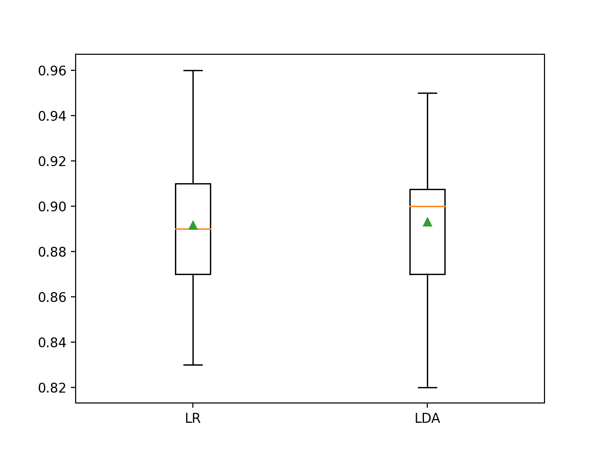

# 用于比较机器学习算法的假设检验

> 原文：<https://machinelearningmastery.com/hypothesis-test-for-comparing-machine-learning-algorithms/>

最后更新于 2020 年 9 月 1 日

机器学习模型是根据它们的平均表现来选择的，通常使用 k 倍交叉验证来计算。

平均表现最好的算法有望优于平均表现较差的算法。但是如果平均表现的差异是由统计上的侥幸造成的呢？

解决方法是使用**统计假设检验**来评估任意两种算法之间的平均表现差异是否真实。

在本教程中，您将发现如何使用统计假设测试来比较机器学习算法。

完成本教程后，您将知道:

*   基于平均模型表现执行模型选择可能会产生误导。
*   使用修改后的学生 t-Test 进行五次重复的双重交叉验证是比较机器学习算法的良好实践。
*   如何使用 MLxtend 机器学习来比较使用统计假设检验的算法。

**用我的新书[机器学习统计](https://machinelearningmastery.com/statistics_for_machine_learning/)启动你的项目**，包括*分步教程*和所有示例的 *Python 源代码*文件。

我们开始吧。


比较机器学习算法的假设检验
图片由[弗兰克·谢泼德](https://flickr.com/photos/142252831@N04/28291959831/)提供，保留部分权利。

## 教程概述

本教程分为三个部分；它们是:

1.  比较算法的假设检验
2.  带扩展的 5×2 程序
3.  比较分类器算法

## 比较算法的假设检验

[模型选择](https://machinelearningmastery.com/a-gentle-introduction-to-model-selection-for-machine-learning/)包括评估一套不同的机器学习算法或建模管道，并根据它们的表现进行比较。

然后，根据您的表现指标获得最佳表现的模型或建模管道将被选为您的最终模型，您可以使用该模型开始对新数据进行预测。

这适用于具有经典机器学习算法和深度学习的回归和分类预测建模任务。过程总是一样的。

问题是，你怎么知道两个模型的区别是真实的，而不仅仅是统计上的侥幸？

这个问题可以通过[统计假设检验](https://machinelearningmastery.com/statistical-hypothesis-tests/)来解决。

一种方法是在数据的相同 [k 倍交叉验证](https://machinelearningmastery.com/k-fold-cross-validation/)分割上评估每个模型(例如，在每种情况下使用相同的随机数种子分割数据)，并为每个分割计算分数。这将为 10 倍交叉验证提供一个 10 分的样本。然后可以使用成对的统计假设检验来比较分数，因为每个算法使用相同的处理(数据行)来得出每个分数。可以使用[配对学生测试](https://machinelearningmastery.com/parametric-statistical-significance-tests-in-python/)。

在这种情况下，使用配对学生测验的一个问题是，模型的每个评估都不是独立的。这是因为相同的数据行被多次用于训练数据——实际上，每次都是如此，除了一行数据被用于暂停测试文件夹的时间。这种评估缺乏独立性意味着配对学生的 t-测试是乐观的偏见。

这种统计检验可以调整，以考虑到缺乏独立性。此外，可以配置过程的折叠和重复次数，以实现模型表现的良好采样，该采样可以很好地推广到各种各样的问题和算法。具体为 5 个重复的 2 倍交叉验证，即所谓的 5×2 倍交叉验证。

这种方法是由托马斯·迪特里希在他 1998 年发表的题为“用于比较监督分类学习算法的近似统计测试”的论文中提出的

有关此主题的更多信息，请参见教程:

*   [用于比较机器学习算法的统计显著性测试](https://machinelearningmastery.com/statistical-significance-tests-for-comparing-machine-learning-algorithms/)

谢天谢地，我们不需要自己实现这个过程。

## 带扩展的 5×2 程序

[塞巴斯蒂安·拉什卡](https://rasbt.github.io/mlxtend/user_guide/evaluate/paired_ttest_5x2cv/)的[mlextend 库](https://rasbt.github.io/mlxtend/)通过*paint _ ttest _ 5x2cv()*功能提供了一个实现。

首先，您必须安装 mlxtend 库，例如:

```py
sudo pip install mlxtend
```

要使用评估，必须首先加载数据集，然后定义要比较的两个模型。

```py
...
# load data
X, y = ....
# define models
model1 = ...
model2 = ...
```

然后，您可以调用*paintest _ 5x2cv()*函数，并传入您的数据和模型，它将报告关于两种算法的表现差异是否显著的 t 统计值和 p 值。

```py
...
# compare algorithms
t, p = paired_ttest_5x2cv(estimator1=model1, estimator2=model2, X=X, y=y)
```

p 值必须使用 alpha 值来解释，这是您愿意接受的重要级别。

如果 p 值小于或等于所选的α，我们拒绝零假设，即模型具有相同的平均表现，这意味着差异可能是真实的。如果 p 值大于α，我们不能拒绝零假设，即模型具有相同的平均表现，任何观察到的平均精确率差异都可能是统计上的侥幸。

alpha 值越小越好，常用值为 5%(0.05)。

```py
...
# interpret the result
if p <= 0.05:
	print('Difference between mean performance is probably real')
else:
	print('Algorithms probably have the same performance')
```

现在我们已经熟悉了使用假设检验来比较算法的方法，让我们看一些例子。

## 比较分类器算法

在本节中，让我们比较两种机器学习算法在二进制分类任务上的表现，然后检查观察到的差异是否具有统计学意义。

首先，我们可以使用 [make_classification()函数](https://scikit-learn.org/stable/modules/generated/sklearn.datasets.make_classification.html)创建一个包含 1000 个样本和 20 个输入变量的合成数据集。

下面的示例创建数据集并总结其形状。

```py
# create classification dataset
from sklearn.datasets import make_classification
# define dataset
X, y = make_classification(n_samples=1000, n_features=10, n_informative=10, n_redundant=0, random_state=1)
# summarize the dataset
print(X.shape, y.shape)
```

运行该示例会创建数据集并汇总行数和列数，从而证实了我们的预期。

我们可以将这些数据作为比较两种算法的基础。

```py
(1000, 10) (1000,)
```

我们将在这个数据集上比较两种线性算法的表现。具体来说，一个[逻辑回归](https://machinelearningmastery.com/logistic-regression-tutorial-for-machine-learning/)算法和一个[线性判别分析](https://machinelearningmastery.com/linear-discriminant-analysis-for-machine-learning/) (LDA)算法。

我喜欢的程序是使用重复的分层 k-fold 交叉验证，重复 10 次和 3 次。我们将使用此过程来评估每个算法，并返回和报告平均分类精确率。

下面列出了完整的示例。

```py
# compare logistic regression and lda for binary classification
from numpy import mean
from numpy import std
from sklearn.datasets import make_classification
from sklearn.model_selection import cross_val_score
from sklearn.model_selection import RepeatedStratifiedKFold
from sklearn.linear_model import LogisticRegression
from sklearn.discriminant_analysis import LinearDiscriminantAnalysis
from matplotlib import pyplot
# define dataset
X, y = make_classification(n_samples=1000, n_features=10, n_informative=10, n_redundant=0, random_state=1)
# evaluate model 1
model1 = LogisticRegression()
cv1 = RepeatedStratifiedKFold(n_splits=10, n_repeats=3, random_state=1)
scores1 = cross_val_score(model1, X, y, scoring='accuracy', cv=cv1, n_jobs=-1)
print('LogisticRegression Mean Accuracy: %.3f (%.3f)' % (mean(scores1), std(scores1)))
# evaluate model 2
model2 = LinearDiscriminantAnalysis()
cv2 = RepeatedStratifiedKFold(n_splits=10, n_repeats=3, random_state=1)
scores2 = cross_val_score(model2, X, y, scoring='accuracy', cv=cv2, n_jobs=-1)
print('LinearDiscriminantAnalysis Mean Accuracy: %.3f (%.3f)' % (mean(scores2), std(scores2)))
# plot the results
pyplot.boxplot([scores1, scores2], labels=['LR', 'LDA'], showmeans=True)
pyplot.show()
```

运行该示例首先报告每个算法的平均分类精确率。

**注**:考虑到算法或评估程序的随机性，或数值精确率的差异，您的[结果可能会有所不同](https://machinelearningmastery.com/different-results-each-time-in-machine-learning/)。考虑运行该示例几次，并比较平均结果。

在这种情况下，结果表明，如果我们只看平均分数，线性判别分析的表现更好:逻辑回归为 89.2%，线性判别分析为 89.3%。

```py
LogisticRegression Mean Accuracy: 0.892 (0.036)
LinearDiscriminantAnalysis Mean Accuracy: 0.893 (0.033)
```

还创建了一个方框和触须图，总结了准确度分数的分布。

这个情节将支持我选择 LDA 而不是 LR 的决定。



两种算法分类准确率的盒须图

现在我们可以使用假设检验来看看观察到的结果是否具有统计学意义。

首先，我们将使用 5×2 过程来评估算法，并计算 p 值和测试统计值。

```py
...
# check if difference between algorithms is real
t, p = paired_ttest_5x2cv(estimator1=model1, estimator2=model2, X=X, y=y, scoring='accuracy', random_seed=1)
# summarize
print('P-value: %.3f, t-Statistic: %.3f' % (p, t))
```

然后我们可以用 5%的α值来解释 p 值。

```py
...
# interpret the result
if p <= 0.05:
	print('Difference between mean performance is probably real')
else:
	print('Algorithms probably have the same performance')
```

将这些联系在一起，完整的示例如下所示。

```py
# use 5x2 statistical hypothesis testing procedure to compare two machine learning algorithms
from numpy import mean
from numpy import std
from sklearn.datasets import make_classification
from sklearn.model_selection import cross_val_score
from sklearn.model_selection import RepeatedStratifiedKFold
from sklearn.linear_model import LogisticRegression
from sklearn.discriminant_analysis import LinearDiscriminantAnalysis
from mlxtend.evaluate import paired_ttest_5x2cv
# define dataset
X, y = make_classification(n_samples=1000, n_features=10, n_informative=10, n_redundant=0, random_state=1)
# evaluate model 1
model1 = LogisticRegression()
cv1 = RepeatedStratifiedKFold(n_splits=10, n_repeats=3, random_state=1)
scores1 = cross_val_score(model1, X, y, scoring='accuracy', cv=cv1, n_jobs=-1)
print('LogisticRegression Mean Accuracy: %.3f (%.3f)' % (mean(scores1), std(scores1)))
# evaluate model 2
model2 = LinearDiscriminantAnalysis()
cv2 = RepeatedStratifiedKFold(n_splits=10, n_repeats=3, random_state=1)
scores2 = cross_val_score(model2, X, y, scoring='accuracy', cv=cv2, n_jobs=-1)
print('LinearDiscriminantAnalysis Mean Accuracy: %.3f (%.3f)' % (mean(scores2), std(scores2)))
# check if difference between algorithms is real
t, p = paired_ttest_5x2cv(estimator1=model1, estimator2=model2, X=X, y=y, scoring='accuracy', random_seed=1)
# summarize
print('P-value: %.3f, t-Statistic: %.3f' % (p, t))
# interpret the result
if p <= 0.05:
	print('Difference between mean performance is probably real')
else:
	print('Algorithms probably have the same performance')
```

运行这个例子，我们首先评估之前的算法，然后报告统计假设检验的结果。

**注**:考虑到算法或评估程序的随机性，或数值精确率的差异，您的[结果可能会有所不同](https://machinelearningmastery.com/different-results-each-time-in-machine-learning/)。考虑运行该示例几次，并比较平均结果。

在这种情况下，我们可以看到 p 值约为 0.3，比 0.05 大得多。这导致我们无法拒绝零假设，这表明算法之间的任何观察到的差异可能都不是真实的。

我们可以很容易地选择逻辑回归或线性判别分析，两者的平均表现大致相同。

这突出表明，仅基于平均表现进行模型选择可能是不够的。

```py
LogisticRegression Mean Accuracy: 0.892 (0.036)
LinearDiscriminantAnalysis Mean Accuracy: 0.893 (0.033)
P-value: 0.328, t-Statistic: 1.085
Algorithms probably have the same performance
```

回想一下，我们在报告绩效时使用的程序(3×10 CV)与统计测试中用于评估绩效的程序(5×2 CV)不同。如果我们使用五次重复的双重交叉验证来看分数，结果可能会有所不同？

更新以下示例，以使用 5×2 CV 报告每个算法的分类精确率。

```py
# use 5x2 statistical hypothesis testing procedure to compare two machine learning algorithms
from numpy import mean
from numpy import std
from sklearn.datasets import make_classification
from sklearn.model_selection import cross_val_score
from sklearn.model_selection import RepeatedStratifiedKFold
from sklearn.linear_model import LogisticRegression
from sklearn.discriminant_analysis import LinearDiscriminantAnalysis
from mlxtend.evaluate import paired_ttest_5x2cv
# define dataset
X, y = make_classification(n_samples=1000, n_features=10, n_informative=10, n_redundant=0, random_state=1)
# evaluate model 1
model1 = LogisticRegression()
cv1 = RepeatedStratifiedKFold(n_splits=2, n_repeats=5, random_state=1)
scores1 = cross_val_score(model1, X, y, scoring='accuracy', cv=cv1, n_jobs=-1)
print('LogisticRegression Mean Accuracy: %.3f (%.3f)' % (mean(scores1), std(scores1)))
# evaluate model 2
model2 = LinearDiscriminantAnalysis()
cv2 = RepeatedStratifiedKFold(n_splits=2, n_repeats=5, random_state=1)
scores2 = cross_val_score(model2, X, y, scoring='accuracy', cv=cv2, n_jobs=-1)
print('LinearDiscriminantAnalysis Mean Accuracy: %.3f (%.3f)' % (mean(scores2), std(scores2)))
# check if difference between algorithms is real
t, p = paired_ttest_5x2cv(estimator1=model1, estimator2=model2, X=X, y=y, scoring='accuracy', random_seed=1)
# summarize
print('P-value: %.3f, t-Statistic: %.3f' % (p, t))
# interpret the result
if p <= 0.05:
	print('Difference between mean performance is probably real')
else:
	print('Algorithms probably have the same performance')
```

运行该示例会报告两种算法的平均精确率以及统计测试的结果。

**注**:考虑到算法或评估程序的随机性，或数值精确率的差异，您的[结果可能会有所不同](https://machinelearningmastery.com/different-results-each-time-in-machine-learning/)。考虑运行该示例几次，并比较平均结果。

在这种情况下，我们可以看到两种算法的平均表现差异甚至更大，89.4%对 89.0%支持逻辑回归，而不是我们在 3×10 CV 中看到的 LDA。

```py
LogisticRegression Mean Accuracy: 0.894 (0.012)
LinearDiscriminantAnalysis Mean Accuracy: 0.890 (0.013)
P-value: 0.328, t-Statistic: 1.085
Algorithms probably have the same performance
```

## 进一步阅读

如果您想更深入地了解这个主题，本节将提供更多资源。

### 教程

*   [Python 中的 17 个统计假设检验(备忘单)](https://machinelearningmastery.com/statistical-hypothesis-tests-in-python-cheat-sheet/)
*   [如何用 Python 计算参数统计假设检验](https://machinelearningmastery.com/parametric-statistical-significance-tests-in-python/)
*   [用于比较机器学习算法的统计显著性测试](https://machinelearningmastery.com/statistical-significance-tests-for-comparing-machine-learning-algorithms/)

### 报纸

*   [比较监督分类学习算法的近似统计测试](http://ieeexplore.ieee.org/document/6790639/)，1998。

### 蜜蜂

*   [mlxe tend library](https://rasbt.github.io/mlxtend/)
*   [5x2cv 配对 t 检验 API](https://rasbt.github.io/mlxtend/user_guide/evaluate/paired_ttest_5x2cv/) 。

## 摘要

在本教程中，您发现了如何使用统计假设测试来比较机器学习算法。

具体来说，您了解到:

*   基于平均模型表现执行模型选择可能会产生误导。
*   使用修改后的学生 t-Test 进行五次重复的双重交叉验证是比较机器学习算法的良好实践。
*   如何使用 MLxtend 机器学习来比较使用统计假设检验的算法。

**你有什么问题吗？**
在下面的评论中提问，我会尽力回答。