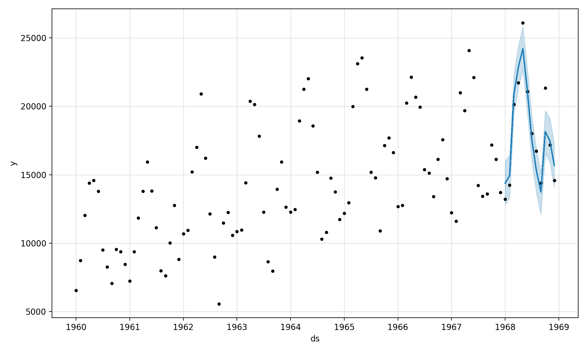
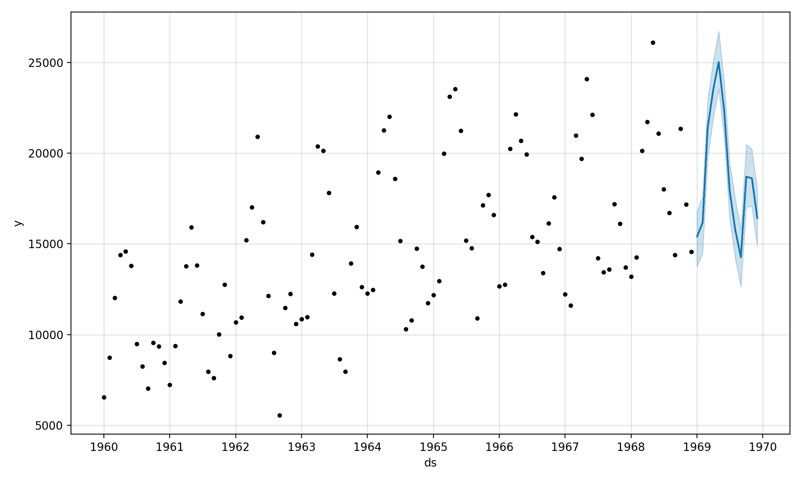
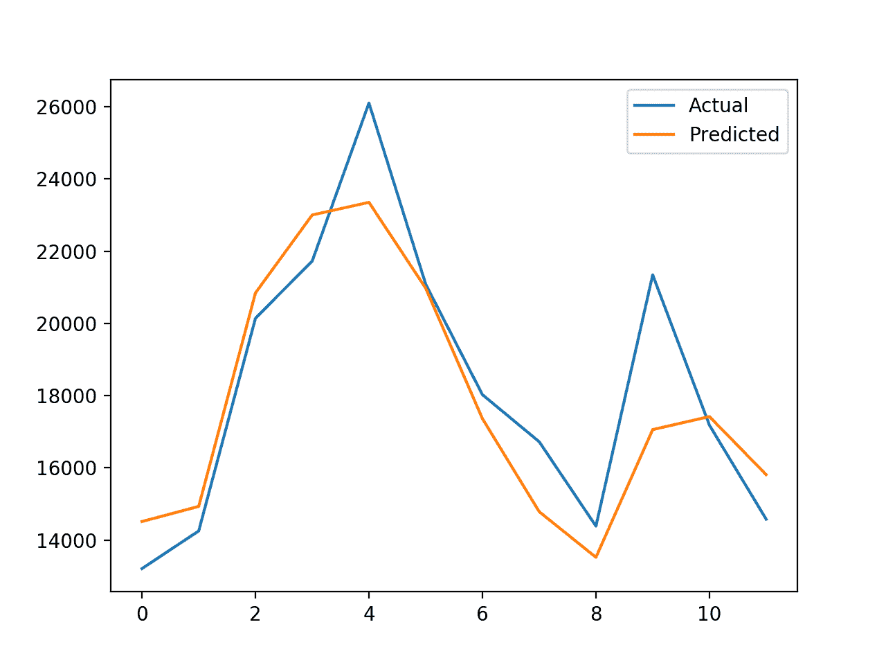

# Python 中使用 Prophet 的时间序列预测

> 原文：<https://machinelearningmastery.com/time-series-forecasting-with-prophet-in-python/>

时间序列预测可能具有挑战性，因为有许多不同的方法可以使用，而且每种方法都有许多不同的超参数。

Prophet 库是一个开源库，设计用于对单变量时间序列数据集进行预测。它易于使用，旨在自动为模型找到一组好的超参数，以便对默认情况下具有趋势和季节结构的数据进行熟练的预测。

在本教程中，您将发现如何使用脸书 Prophet 库进行时间序列预测。

完成本教程后，您将知道:

*   Prophet 是一个由脸书开发的开源库，设计用于单变量时间序列数据的自动预测。
*   如何拟合预言家模型并使用它们进行样本内和样本外预测。
*   如何在搁置数据集上评估 Prophet 模型。

我们开始吧。


时间序列预测与 Python 中的 Prophet
图片由[里纳尔多·伍尔格利茨](https://flickr.com/photos/wurglitsch/9466317145/)提供，保留部分权利。

## 教程概述

本教程分为三个部分；它们是:

1.  Prophet 预测图书馆
2.  汽车销售数据集
    1.  加载和汇总数据集
    2.  加载和绘制数据集
3.  Prophet 预测汽车销量
    1.  适合 Prophet 模型
    2.  进行抽样预测
    3.  进行样本外预测
    4.  手动评估预测模型

## Prophet 预测图书馆

[预言家](https://github.com/facebook/prophet)，或“*脸书预言家*”，是脸书开发的单变量(单变量)时间序列预测的开源库。

预言家实现了他们所称的[加性时间序列预测模型](https://en.wikipedia.org/wiki/Additive_model)，该实现支持趋势、季节性和节假日。

> 实施基于加法模型预测时间序列数据的程序，其中非线性趋势与年度、每周和每日季节性以及假日影响相匹配

——[包裹‘Prophet’](https://cran.r-project.org/web/packages/prophet/prophet.pdf)，2019 年。

它被设计成简单和完全自动的，例如，以时间序列为点，得到一个预测。因此，它旨在供公司内部使用，如预测销售、产能等。

有关预言家及其能力的概述，请参阅帖子:

*   [预言家:规模预测](https://research.fb.com/blog/2017/02/prophet-forecasting-at-scale/)，2017 年。

该库提供了两个接口，包括 R 和 Python。在本教程中，我们将重点关注 Python 接口。

第一步是使用 Pip 安装 Prophet 库，如下所示:

```py
sudo pip install fbprophet
```

接下来，我们可以确认库安装正确。

为此，我们可以导入库，并用 Python 打印版本号。下面列出了完整的示例。

```py
# check prophet version
import fbprophet
# print version number
print('Prophet %s' % fbprophet.__version__)
```

运行该示例会打印 Prophet 的安装版本。

你应该有相同或更高的版本。

```py
Prophet 0.5
```

现在我们已经安装了 Prophet，让我们选择一个数据集，我们可以使用该库来探索。

## 汽车销售数据集

我们将使用每月汽车销量数据集。

这是一个包含趋势和季节性的标准单变量时间序列数据集。该数据集有 108 个月的数据，天真的持久性预测可以实现大约 3，235 次销售的平均绝对误差，提供了较低的误差限制。

不需要下载数据集，因为我们将在每个示例中自动下载它。

*   [月度汽车销量数据集(csv)](https://raw.githubusercontent.com/jbrownlee/Datasets/master/monthly-car-sales.csv)
*   [月度汽车销量数据集描述](https://raw.githubusercontent.com/jbrownlee/Datasets/master/monthly-car-sales.names)

### 加载和汇总数据集

首先，让我们加载并总结数据集。

预言家要求数据在熊猫数据框中。因此，我们将使用熊猫加载和汇总数据。

我们可以通过调用 [read_csv() Pandas 函数](https://pandas.pydata.org/pandas-docs/stable/reference/api/pandas.read_csv.html)直接从 URL 加载数据，然后汇总数据的形状(行数和列数)并查看前几行数据。

下面列出了完整的示例。

```py
# load the car sales dataset
from pandas import read_csv
# load data
path = 'https://raw.githubusercontent.com/jbrownlee/Datasets/master/monthly-car-sales.csv'
df = read_csv(path, header=0)
# summarize shape
print(df.shape)
# show first few rows
print(df.head())
```

运行该示例首先报告行数和列数，然后列出前五行数据。

我们可以看到，正如我们所料，有价值 108 个月的数据和两列。第一列是日期，第二列是销售数量。

请注意，输出中的第一列是行索引，不是数据集的一部分，只是 Pandas 用来排序行的一个有用工具。

```py
(108, 2)
     Month  Sales
0  1960-01   6550
1  1960-02   8728
2  1960-03  12026
3  1960-04  14395
4  1960-05  14587
```

### 加载和绘制数据集

时间序列数据集在我们绘制之前对我们没有意义。

绘制时间序列有助于我们实际查看是否存在趋势、季节性周期、异常值等等。它让我们对数据有了感觉。

我们可以通过调用数据框上的*绘图()*函数，在熊猫中轻松绘制数据。

下面列出了完整的示例。

```py
# load and plot the car sales dataset
from pandas import read_csv
from matplotlib import pyplot
# load data
path = 'https://raw.githubusercontent.com/jbrownlee/Datasets/master/monthly-car-sales.csv'
df = read_csv(path, header=0)
# plot the time series
df.plot()
pyplot.show()
```

运行该示例会创建一个时间序列图。

我们可以清楚地看到一段时间内的销售趋势和每月的销售季节性模式。这些是我们期望预测模型考虑到的模式。


汽车销售数据集的线图

现在我们已经熟悉了数据集，让我们探索如何使用 Prophet 库进行预测。

## Prophet 预测汽车销量

在本节中，我们将探索使用预言家来预测汽车销售数据集。

让我们从在数据集上拟合模型开始

### 适合 Prophet 模型

要使用 Prophet 进行预测，首先定义并配置一个 *Prophet()* 对象，然后通过调用 *fit()* 函数并传递数据来拟合数据集。

*Prophet()* 对象接受参数来配置您想要的模型类型，例如增长类型、季节性类型等等。默认情况下，模型会努力自动计算出几乎所有的事情。

*fit()* 函数获取时间序列数据的*数据帧*。*数据框*必须有特定的格式。第一列必须有名称“ *ds* ，并包含日期时间。第二列必须有名称“ *y* ，并包含观察值。

这意味着我们要更改数据集中的列名。它还要求将第一列转换为日期时间对象，如果它们还没有的话(例如，这可以作为加载数据集的一部分，将正确的参数设置为 *read_csv* )。

例如，我们可以修改加载的汽车销售数据集，使其具有如下预期结构:

```py
...
# prepare expected column names
df.columns = ['ds', 'y']
df['ds']= to_datetime(df['ds'])
```

下面列出了在汽车销售数据集中拟合 Prophet 模型的完整示例。

```py
# fit prophet model on the car sales dataset
from pandas import read_csv
from pandas import to_datetime
from fbprophet import Prophet
# load data
path = 'https://raw.githubusercontent.com/jbrownlee/Datasets/master/monthly-car-sales.csv'
df = read_csv(path, header=0)
# prepare expected column names
df.columns = ['ds', 'y']
df['ds']= to_datetime(df['ds'])
# define the model
model = Prophet()
# fit the model
model.fit(df)
```

运行该示例将加载数据集，以预期的格式准备数据帧，并适合 Prophet 模型。

默认情况下，在拟合过程中，库会提供大量详细的输出。我认为这是一个坏主意，因为它训练开发人员忽略输出。

然而，输出总结了模型拟合过程中发生的事情，特别是运行的优化过程。

```py
INFO:fbprophet:Disabling weekly seasonality. Run prophet with weekly_seasonality=True to override this.
INFO:fbprophet:Disabling daily seasonality. Run prophet with daily_seasonality=True to override this.
Initial log joint probability = -4.39613
    Iter      log prob        ||dx||      ||grad||       alpha      alpha0  # evals  Notes
      99       270.121    0.00413718       75.7289           1           1      120
    Iter      log prob        ||dx||      ||grad||       alpha      alpha0  # evals  Notes
     179       270.265    0.00019681       84.1622   2.169e-06       0.001      273  LS failed, Hessian reset
     199       270.283   1.38947e-05       87.8642      0.3402           1      299
    Iter      log prob        ||dx||      ||grad||       alpha      alpha0  # evals  Notes
     240       270.296    1.6343e-05       89.9117   1.953e-07       0.001      381  LS failed, Hessian reset
     299         270.3   4.73573e-08       74.9719      0.3914           1      455
    Iter      log prob        ||dx||      ||grad||       alpha      alpha0  # evals  Notes
     300         270.3   8.25604e-09       74.4478      0.3522      0.3522      456
Optimization terminated normally:
  Convergence detected: absolute parameter change was below tolerance
```

当我们适合这个模型时，我不会在后面的章节中重复这个输出。

接下来，让我们做一个预测。

### 进行抽样预测

对历史数据进行预测可能是有用的。

也就是说，我们可以对用作训练模型输入的数据进行预测。理想情况下，该模型之前已经看到了数据，并将做出完美的预测。

然而，情况并非如此，因为模型试图对数据中的所有情况进行归纳。

这被称为进行样本内(在训练集样本中)预测，检查结果可以洞察模型有多好。也就是它对训练数据的学习程度。

通过调用 *predict()* 函数并传递一个*数据帧*来进行预测，该数据帧包含一个名为“ *ds* 的列和带有所有要预测的时间间隔的日期时间的行。

有很多方法可以创建这个“*预测*”*数据框*。在这种情况下，我们将循环一年的日期，例如数据集中的最后 12 个月，并为每个月创建一个字符串。然后，我们将把日期列表转换成一个*数据帧*，并将字符串值转换成日期时间对象。

```py
...
# define the period for which we want a prediction
future = list()
for i in range(1, 13):
	date = '1968-%02d' % i
	future.append([date])
future = DataFrame(future)
future.columns = ['ds']
future['ds']= to_datetime(future['ds'])
```

该*数据帧*然后可以被提供给*预测()*功能以计算预测。

predict()函数的结果是一个包含许多列的*数据帧*。最重要的列可能是预测日期时间(' T2 ' ds)、预测值(' T4 ' yhat)以及预测值的下限和上限(' T6 ' yhat _ lower'和'(T8)yhat _ upper')，它们提供了预测的不确定性。

例如，我们可以将前几个预测打印如下:

```py
...
# summarize the forecast
print(forecast[['ds', 'yhat', 'yhat_lower', 'yhat_upper']].head())
```

Prophet 还提供了一个内置工具，用于在训练数据集的上下文中可视化预测。

这可以通过在模型上调用 *plot()* 函数并向其传递结果数据帧来实现。它将创建训练数据集的图，并用预测日期的上限和下限覆盖预测。

```py
...
print(forecast[['ds', 'yhat', 'yhat_lower', 'yhat_upper']].head())
# plot forecast
model.plot(forecast)
pyplot.show()
```

将所有这些结合起来，下面列出了一个完整的样本内预测示例。

```py
# make an in-sample forecast
from pandas import read_csv
from pandas import to_datetime
from pandas import DataFrame
from fbprophet import Prophet
from matplotlib import pyplot
# load data
path = 'https://raw.githubusercontent.com/jbrownlee/Datasets/master/monthly-car-sales.csv'
df = read_csv(path, header=0)
# prepare expected column names
df.columns = ['ds', 'y']
df['ds']= to_datetime(df['ds'])
# define the model
model = Prophet()
# fit the model
model.fit(df)
# define the period for which we want a prediction
future = list()
for i in range(1, 13):
	date = '1968-%02d' % i
	future.append([date])
future = DataFrame(future)
future.columns = ['ds']
future['ds']= to_datetime(future['ds'])
# use the model to make a forecast
forecast = model.predict(future)
# summarize the forecast
print(forecast[['ds', 'yhat', 'yhat_lower', 'yhat_upper']].head())
# plot forecast
model.plot(forecast)
pyplot.show()
```

运行该示例可以预测数据集的最后 12 个月。

报告了预测的前五个月，我们可以看到这些值与数据集中的实际销售值没有太大差异。

```py
          ds          yhat    yhat_lower    yhat_upper
0 1968-01-01  14364.866157  12816.266184  15956.555409
1 1968-02-01  14940.687225  13299.473640  16463.811658
2 1968-03-01  20858.282598  19439.403787  22345.747821
3 1968-04-01  22893.610396  21417.399440  24454.642588
4 1968-05-01  24212.079727  22667.146433  25816.191457
```

接下来，创建一个图。我们可以看到训练数据被表示为黑点，预测是一条蓝色线，在蓝色阴影区域有上下限。

我们可以看到，预测的 12 个月与实际观测值非常吻合，尤其是考虑到界限的时候。



时间序列图和带预测器的样本内预测

### 进行样本外预测

在实践中，我们确实希望预测模型能够在训练数据之外做出预测。

这被称为样本外预测。

我们可以通过与样本内预测相同的方式实现这一点，只需指定不同的预测期。

在这种情况下，是从 1969-01 年开始的训练数据集结束后的一段时间。

```py
...
# define the period for which we want a prediction
future = list()
for i in range(1, 13):
	date = '1969-%02d' % i
	future.append([date])
future = DataFrame(future)
future.columns = ['ds']
future['ds']= to_datetime(future['ds'])
```

将这些联系在一起，完整的示例如下所示。

```py
# make an out-of-sample forecast
from pandas import read_csv
from pandas import to_datetime
from pandas import DataFrame
from fbprophet import Prophet
from matplotlib import pyplot
# load data
path = 'https://raw.githubusercontent.com/jbrownlee/Datasets/master/monthly-car-sales.csv'
df = read_csv(path, header=0)
# prepare expected column names
df.columns = ['ds', 'y']
df['ds']= to_datetime(df['ds'])
# define the model
model = Prophet()
# fit the model
model.fit(df)
# define the period for which we want a prediction
future = list()
for i in range(1, 13):
	date = '1969-%02d' % i
	future.append([date])
future = DataFrame(future)
future.columns = ['ds']
future['ds']= to_datetime(future['ds'])
# use the model to make a forecast
forecast = model.predict(future)
# summarize the forecast
print(forecast[['ds', 'yhat', 'yhat_lower', 'yhat_upper']].head())
# plot forecast
model.plot(forecast)
pyplot.show()
```

运行该示例可以对汽车销售数据进行样本外预测。

预测的前五行被打印出来，尽管很难知道它们是否明智。

```py
          ds          yhat    yhat_lower    yhat_upper
0 1969-01-01  15406.401318  13751.534121  16789.969780
1 1969-02-01  16165.737458  14486.887740  17634.953132
2 1969-03-01  21384.120631  19738.950363  22926.857539
3 1969-04-01  23512.464086  21939.204670  25105.341478
4 1969-05-01  25026.039276  23544.081762  26718.820580
```

创建一个图来帮助我们在训练数据的上下文中评估预测。

新的一年预测看起来确实是合理的，至少从表面上看是如此。



时间序列图和带预测器的样本外预测

### 手动评估预测模型

对预测模型的表现进行客观评估至关重要。

这可以通过保留模型中的一些数据来实现，例如最近 12 个月的数据。然后，将模型拟合到数据的第一部分，使用它来对保持包部分进行预测，并计算误差度量，例如预测的平均绝对误差。例如模拟的样本外预测。

该分数给出了在进行样本外预测时，我们对模型平均表现的预期。

我们可以通过创建一个新的*数据框架*来处理样本数据，并删除过去 12 个月的数据。

```py
...
# create test dataset, remove last 12 months
train = df.drop(df.index[-12:])
print(train.tail())
```

然后可以对过去 12 个月的日期时间进行预测。

然后，我们可以从原始数据集中检索预测值和期望值，并使用 Sklearn 库计算平均绝对误差度量。

```py
...
# calculate MAE between expected and predicted values for december
y_true = df['y'][-12:].values
y_pred = forecast['yhat'].values
mae = mean_absolute_error(y_true, y_pred)
print('MAE: %.3f' % mae)
```

绘制预期值与预测值的关系图也有助于了解样本外预测与已知值的匹配程度。

```py
...
# plot expected vs actual
pyplot.plot(y_true, label='Actual')
pyplot.plot(y_pred, label='Predicted')
pyplot.legend()
pyplot.show()
```

将这些联系在一起，下面的例子演示了如何在一个搁置的数据集上评估一个预言家模型。

```py
# evaluate prophet time series forecasting model on hold out dataset
from pandas import read_csv
from pandas import to_datetime
from pandas import DataFrame
from fbprophet import Prophet
from sklearn.metrics import mean_absolute_error
from matplotlib import pyplot
# load data
path = 'https://raw.githubusercontent.com/jbrownlee/Datasets/master/monthly-car-sales.csv'
df = read_csv(path, header=0)
# prepare expected column names
df.columns = ['ds', 'y']
df['ds']= to_datetime(df['ds'])
# create test dataset, remove last 12 months
train = df.drop(df.index[-12:])
print(train.tail())
# define the model
model = Prophet()
# fit the model
model.fit(train)
# define the period for which we want a prediction
future = list()
for i in range(1, 13):
	date = '1968-%02d' % i
	future.append([date])
future = DataFrame(future)
future.columns = ['ds']
future['ds'] = to_datetime(future['ds'])
# use the model to make a forecast
forecast = model.predict(future)
# calculate MAE between expected and predicted values for december
y_true = df['y'][-12:].values
y_pred = forecast['yhat'].values
mae = mean_absolute_error(y_true, y_pred)
print('MAE: %.3f' % mae)
# plot expected vs actual
pyplot.plot(y_true, label='Actual')
pyplot.plot(y_pred, label='Predicted')
pyplot.legend()
pyplot.show()
```

运行该示例首先报告训练数据集的最后几行。

它确认训练在 1967 年的最后一个月结束，1968 年将被用作暂停数据集。

```py
           ds      y
91 1967-08-01  13434
92 1967-09-01  13598
93 1967-10-01  17187
94 1967-11-01  16119
95 1967-12-01  13713
```

接下来，计算预测期间的平均绝对误差。

在这种情况下，我们可以看到误差约为 1，336 次销售，这比同期实现 3，235 次销售误差的简单持久性模型低得多(更好)。

```py
MAE: 1336.814
```

最后，绘制实际值与预测值的对比图。在这种情况下，我们可以看到预测非常吻合。这个模型有技巧和预测，看起来很合理。



过去 12 个月汽车销量的实际值与预测值图

Prophet 库还提供了自动评估模型和绘制结果的工具，尽管这些工具对于分辨率超过一天的数据似乎不能很好地工作。

## 进一步阅读

如果您想更深入地了解这个主题，本节将提供更多资源。

*   [Prophet 主页](https://facebook.github.io/prophet/)。
*   [Prophet GitHub 项目](https://github.com/facebook/prophet)。
*   [预言家 API 文档](https://facebook.github.io/prophet/docs/)。
*   [预言家:规模预测](https://research.fb.com/blog/2017/02/prophet-forecasting-at-scale/)，2017 年。
*   [规模预测](https://peerj.com/preprints/3190/)，2017 年。
*   [汽车销量数据集](https://raw.githubusercontent.com/jbrownlee/Datasets/master/monthly-car-sales.csv)。
*   [包装‘Prophet’，R 文件](https://cran.r-project.org/web/packages/prophet/prophet.pdf)。

## 摘要

在本教程中，您发现了如何使用脸书 Prophet 库进行时间序列预测。

具体来说，您了解到:

*   Prophet 是一个由脸书开发的开源库，设计用于单变量时间序列数据的自动预测。
*   如何拟合预言家模型并使用它们进行样本内和样本外预测。
*   如何在搁置数据集上评估 Prophet 模型。

**你有什么问题吗？**
在下面的评论中提问，我会尽力回答。